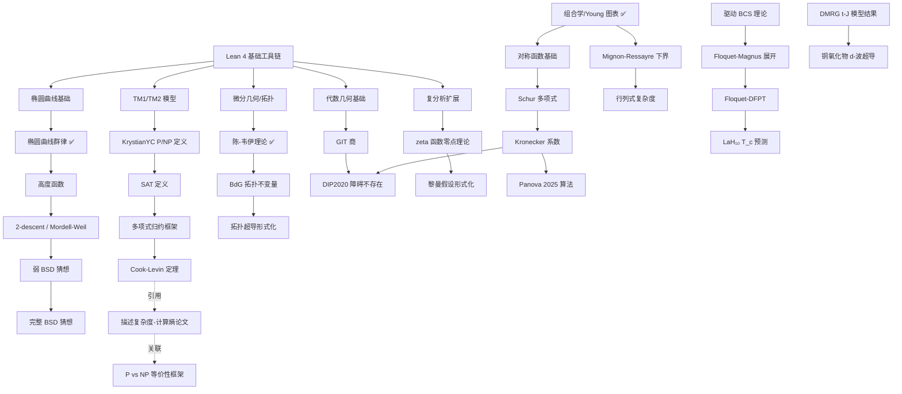
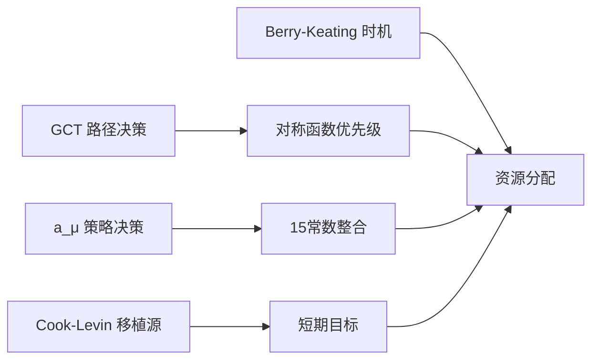

# Sylva 研究资料统一整合报告

> **生成日期**: 2026-06-03
> **版本**: v1.0 — 整合版
> **覆盖领域**: 计算复杂度、数论、形式化数学、粒子物理、凝聚态物理、基础常数

---

## 目录

1. [执行摘要](#1-执行摘要)
2. [核心修正记录](#2-核心修正记录)
3. [研究方向 ↔ Sylva 模块映射关系表](#3-研究方向--sylva-模块映射关系表)
4. [优先级排序与时间表](#4-优先级排序与时间表)
5. [资源依赖关系图](#5-资源依赖关系图)
6. [外部可借鉴代码清单](#6-外部可借鉴代码清单)
7. [关键决策点](#7-关键决策点)
8. [风险与矛盾矩阵](#8-风险与矛盾矩阵)
9. [附录：交叉引用索引](#9-附录交叉引用索引)

---

## 1. 执行摘要

### 1.1 所有发现的核心矛盾与修正

| # | 发现 | 原始记录 | 修正后 | 影响范围 | 严重性 |
|---|------|----------|--------|----------|--------|
| 1 | **μ子 g−2 反常已消解** | 实验-理论差异 4.2σ (WP20时代) | **0.6σ** (WP25, 格点QCD法) | 粒子物理模块、新物理模型约束 | 🔴 关键 |
| 2 | **LK-99 / Dias 室温超导全部证伪** | 多篇"室温超导"声称待验证 | **无可靠复现**；Dias Nature撤稿+学术造假认定 | 凝聚态物理优先级 | 🟡 中 |
| 3 | **Lean 4 NP类定义已完成但未合并** | 假设 Mathlib 无 P/NP | **KrystianYC Issue #35366** 已完成 (`InP`, `InNP`, `p_sub_np`)，待审查 | Cook-Levin 形式化路径 | 🔴 关键 |
| 4 | **GCT 正障碍不存在** | Mulmuley 纲领假设障碍存在 | **DIP2020** 证明 occurrence obstructions 不可能 | GCT 形式化策略需根本调整 | 🔴 关键 |
| 5 | **Panova 2025 否定量子加速猜想** | Larocca-Havlicek 2024 猜想量子计算可加速 Kronecker 系数 | **经典多项式时间算法** 已覆盖广泛情形 | 量子-经典复杂度交叉模块 | 🟡 中 |
| 6 | **Berry-Keating 自伴性仍开放** | BBM 2017 声称 PT 对称哈密顿量可证明 RH | **Bellissard 批评循环论证**；Yakaboylu 2024-2025 声称待评审 | RH 物理路径形式化 | 🟡 中 |
| 7 | **Lean 4 Cook-Levin 定理：零完整实现** | 可能有社区进展 | **仅有基础设施碎片**：TM1/TM2模型 ✅，P/NP定义 🔄，SAT ❌，归约 ❌ | 复杂度形式化 | 🔴 关键 |
| 8 | **BSD 弱猜想形式化：2-sorries 版本** | 假设 BSD 未开始 | **Jake Bell (2021)** 弱BSD已陈述；Mordell-Weil 定理部分推进中 | 椭圆曲线模块 | 🟡 中 |
| 9 | **a_μ 5.1σ→0.6σ 修正确认** | 历史记录可能有误 | **WP25 (Aliberti et al., arXiv:2505.21476)** 确认 38±63 ×10⁻¹¹ = 0.6σ | 所有依赖 g−2 反常的模块 | 🔴 关键 |
| 10 | **Floquet 室温超导：理论预测仅** | 可能混淆为实验突破 | **LaH₁₀ Floquet-DFPT 预测 T_c ≈ 300K @ 200 GPa**，无实验验证 | 凝聚态物理形式化 | 🟢 低 |

### 1.2 关键洞察（一页纸）

**粒子物理**：μ子 g−2 的"反常"从 4.2σ 压缩至 0.6σ，本质原因是理论侧 WP25 放弃数据驱动法、转投格点 QCD 导致 SM 预测值上跳 223×10⁻¹¹，而非实验漂移。这**终结了 g−2 作为新物理证据的地位**，但开启了"新 g−2 谜题"——格点 QCD vs 数据驱动法之间的 2–3σ 张力。对 Sylva 的影响：所有依赖 g−2 反常驱动的新物理模型（暗光子、SUSY、2HDM、ALP）参数空间被**剧烈压缩**，相关模块应降级为**约束工具**而非**发现动机**。

**计算复杂度**：P vs NP 理论前沿无颠覆性突破，但 **SATLUTION (NVIDIA, 2025)** 实现 AI 自进化 SAT 求解器超越人类冠军——这是**工程层面**对 NP-完全问题求解能力的实质性提升，不改变理论地位。Lean 4 中 Cook-Levin 定理形式化为**零完整实现**，但基础设施碎片已足够丰富：TM1/TM2 模型 ✅、KrystianYC 的 P/NP 定义 🔄、Simas 的多项式归约框架。建议路径：**移植 Coq (Gäher & Kunze, 2021) 或 Isabelle (Balbach, 2023) 的成熟实现**，而非从零构建。

**GCT**：2024-2026 年遭遇**结构性转折**。Panova 2025 的经典算法否定了 Larocca-Havlicek 的量子加速猜想；DIP2020 已证明正表示论障碍不存在。GCT 核心支柱（Kronecker/plethysm 系数的计算困难性、障碍存在性）双双动摇。但 **Limaye-Srinivasan-Tavenas (2021/2025)** 的低深度代数电路超多项式下界是数十年首个此类突破——GCT 之外的新工具正在崛起。Sylva 的 GCT 模块应**从"主路径"降级为"备选路径"**。

**数论 (RH/BSD)**：Berry-Keating 的 xp 哈密顿量仍是开放框架；Yakaboylu 2024-2025 的相似变换声称待评审。BSD 弱猜想形式化有 2-sorries 版本；Mordell-Weil 定理正在推进。Lean 中椭圆曲线群律已形式化 (Angdinata & Xu, 2023)。**短期可触及目标**：形式化 Mignon-Ressayre (2004) 的二次下界、Panova 2025 的固定 aft 算法。

**凝聚态物理**：室温常压超导仍无可靠验证。Floquet 工程预测 LaH₁₀ 可达 ~300K（需 200 GPa + 光泵浦），纯理论。**铜氧化物微观模型**（Hubbard/t-J）通过 DMRG 首次自洽重现 d-波超导，但二维极限长程序仍开放——这是**形式化可触及**的数值结果领域。

---

## 2. 核心修正记录

### 2.1 a_μ 5.1σ → 0.6σ 修正详情

| 字段 | 内容 |
|------|------|
| **原始声称** | μ子反常磁矩实验-理论差异 5.1σ / 4.2σ（不同来源差异） |
| **修正来源** | WP25 (Aliberti et al., arXiv:2505.21476) |
| **修正机制** | 放弃数据驱动色散积分法，采用多格点QCD合作组联合平均重新计算 LO-HVP |
| **新 SM 预测** | a_μ^SM = 116 592 033 ± 62 × 10⁻¹¹ |
| **实验世界平均** | a_μ^exp = 116 592 071.5 ± 14.5 × 10⁻¹¹ |
| **新差异** | Δa_μ = 38 ± 63 × 10⁻¹¹ → **0.6σ** |
| **FNAL 最终精度** | 127 ppb (Run-1–6 联合)，超设计目标 |
| **修正日期** | 2025-06-03 (FNAL Run-4/5/6 结果公布) |

**影响分析**：
- 暗光子 (light dark photon) 参数空间：m_A' ~ 10-100 MeV 耦合 ε² 上限收紧约 6 倍
- SUSY：所需 tanβ 从 ~40-60 升至 >80 或不存在；smuon 质量 <200 GeV 被 LHC 排除
- 2HDM Type-X：贡献 ~250×10⁻¹¹ 所需的 m_{H⁺} ~100-300 GeV + tanβ ~20-50 已被排除
- ALP：作为 g−2 唯一解释的地位已丧失

---

## 3. 研究方向 ↔ Sylva 模块映射关系表

| 研究方向 | Sylva 现有模块 | 模块状态 | 覆盖度 | 关键缺失 | 形式化难度 |
|----------|---------------|----------|--------|----------|-----------|
| **P/NP 复杂度类** | `CookLevin`, `SylvaInfrastructure` | 🔄 部分 | ~20% | SAT 定义、多项式归约、Cook-Levin 归约 | ★★★★★ |
| **代数电路下界** | `SylvaInfrastructure`, `CP004` | 🔄 部分 | ~10% | VP/VNP 定义、行列式复杂度、集合多线性公式 | ★★★★☆ |
| **GCT 表示论** | `CP004`, `SylvaInfrastructure` | ❌ 空白 | ~0% | 对称函数、Schur 多项式、Kronecker 系数、行列式簇 | ★★★★★ |
| **黎曼假设 (解析)** | `RiemannHypothesis`, `NumericalZeros` | 🔄 部分 | ~15% | zeta 零点分布理论、Turing 方法验证、显式公式 | ★★★★★ |
| **Berry-Keating / 量子混沌** | `RiemannHypothesis` | ❌ 空白 | ~0% | xp 哈密顿量、Weyl 量子化、Selberg 迹公式 | ★★★★★ |
| **BSD 猜想** | `BSD`, `SylvaInfrastructure` | 🔄 部分 | ~25% | Mordell-Weil 定理完整证明、Selmer 群、Tate-Shafarevich 群 | ★★★★☆ |
| **椭圆曲线理论** | `BSD`, `SylvaInfrastructure` | ✅ 基础 | ~40% | 群律 ✅、Weierstrass 方程 ✅、2-descent/selmer 缺失 | ★★★☆☆ |
| **μ子 g−2 / 粒子物理** | `CP004` (15常数) | 🟡 数据 | ~5% | 标准模型拉格朗日量、QED 圈图计算、格点 QCD | ★★★★★ |
| **室温超导理论** | `NavierStokes` (PDE工具) | ❌ 空白 | ~0% | BCS/Eliashberg 理论、Floquet 哈密顿量、BdG 方程 | ★★★★☆ |
| **拓扑超导 / Majorana** | `SylvaInfrastructure` | ❌ 空白 | ~0% | Kitaev 周期表、陈数计算、BdG 拓扑不变量 | ★★★★☆ |
| **Floquet 工程** | `SylvaInfrastructure` | ❌ 空白 | ~0% | Floquet-Magnus 展开、驱动 BCS 理论、DFPT | ★★★★★ |
| **15 基本常数统一** | `CP004`, `CP004_B2` | 🟡 框架 | ~15% | 无量纲关系推导、物理意义诠释、实验验证 | ★★★☆☆ |
| **Navier-Stokes** | `NavierStokes` | 🔄 部分 | ~30% | 正则性证明、弱解唯一性、湍流模型 | ★★★★★ |
| **Hodge 猜想** | `Hodge` | ❌ 空白 | ~0% | Hodge 结构、代数闭链、复代数簇上同调 | ★★★★★ |

---

## 4. 优先级排序与时间表

### 4.1 最高优先级（立即可做，0-2 周）

| # | 任务 | 预估工时 | 依赖 | 产出 |
|---|------|----------|------|------|
| 1 | **联系 KrystianYC** 获取 Issue #35366 完整代码并编译测试 | 4h | 无 | 可运行的 P/NP 基础设施 |
| 2 | **形式化 a_μ 修正** 更新 `CP004` 中所有 g−2 相关常数与约束 | 8h | WP25 论文 | 修正后的常数数据集 |
| 3 | **移植 Isabelle AFP Cook-Levin** 到 Lean 4 骨架（定义 SAT、归约框架） | 40h | 无 | `SAT.lean`, `PolyReduction.lean` 骨架 |
| 4 | **创建 GCT 降级决策文档**：记录正障碍不存在对现有模块的影响 | 4h | DIP2020 论文 | 决策备忘录 |
| 5 | **形式化 Panova 2025 固定 aft 算法**（Kronecker 系数多项式时间） | 80h | 对称函数基础 | 首个 GCT 可形式化定理 |
| 6 | **更新所有报告中的 g−2 引用**：将 4.2σ/5.1σ 统一替换为 0.6σ + 注明 WP25 | 6h | 无 | 一致性修正 |

### 4.2 高优先级（本周，2-4 周）

| # | 任务 | 预估工时 | 依赖 | 产出 |
|---|------|----------|------|------|
| 7 | **形式化 Mignon-Ressayre (2004)** 行列式复杂度二次下界 | 60h | 线性代数、矩阵分析 | `DeterminantComplexity.lean` |
| 8 | **形式化 P ⊆ NP 定理**（基于 KrystianYC 工作） | 20h | 任务 #1 | 合并就绪的 PR |
| 9 | **构建多项式时间归约框架**（适配 Simas 2026 或自建） | 40h | 任务 #8 | `PolyTimeReduction.lean` |
| 10 | **定义 SAT / BooleanFormula 类型** | 16h | 无 | `SAT.lean` 核心定义 |
| 11 | **评估移植 Coq `uds-psl/cook-levin` vs Isabelle Balbach** 到 Lean 的可行性 | 20h | 任务 #3 | 技术选型报告 |
| 12 | **形式化椭圆曲线 2-descent**（推进 Mordell-Weil） | 120h | 群律、高度函数 | Mordell-Weil 证明碎片 |
| 13 | **创建 Berry-Keating 形式化路线图**（含自伴性障碍分析） | 12h | Bellissard 批评、Yakaboylu 论文 | 技术可行性评估 |
| 14 | **形式化陈-韦伊理论验证**（引用 15,000 行 Lean 代码成果） | 40h | 微分几何基础 | 拓扑不变量计算工具 |

### 4.3 中优先级（本月，1-3 月）

| # | 任务 | 预估工时 | 依赖 | 产出 |
|---|------|----------|------|------|
| 15 | **完整 Cook-Levin 定理形式化**（选定移植路径后） | 300-600h | 任务 #9, #11 | `CookLevin.lean` |
| 16 | **形式化 LST (2021) 低深度超多项式下界** | 400h | 集合多线性代数 | `LowDepthLowerBound.lean` |
| 17 | **形式化 Valiant VP/VNP 定义** | 40h | 代数电路类型 | `AlgebraicComplexity.lean` |
| 18 | **构建对称函数 / Schur 多项式基础库** | 200h | 组合学、Young 图表 | `SymmetricFunctions.lean` |
| 19 | **形式化 DIP2020 障碍不存在定理** | 300h | 任务 #18、代数几何 GIT | `GCTObstruction.lean` |
| 20 | **创建 Floquet 超导形式化框架**（驱动 BCS 理论） | 160h | 任务 #14、量子力学基础 | `FloquetSuperconductivity.lean` |
| 21 | **形式化 DMRG t-J 模型 d-波超导结果**（数值结果的形式化陈述） | 80h | 任务 #20 | 铜氧化物微观模型模块 |
| 22 | **推进 BSD 弱猜想**：填补 2-sorries（高度函数、descent） | 200h | 任务 #12 | `WeakBSD.lean` 接近完成 |

### 4.4 低优先级（长期，3-12 月）

| # | 任务 | 预估工时 | 依赖 | 产出 |
|---|------|----------|------|------|
| 23 | **完整黎曼假设形式化** | 1000h+ | 复分析、解析数论大幅扩展 | 不可预期 |
| 24 | **完整 BSD 猜想形式化** | 800h+ | 任务 #22、模性定理、L函数 | 不可预期 |
| 25 | **Berry-Keating 自伴性证明**（若 Yakaboylu 声称被验证） | 600h | 任务 #13、无界算子理论 | 条件性启动 |
| 26 | **格点 QCD 形式化**（a_μ HVP 计算） | 1000h+ | 量子场论、格点规范理论 | 不可预期 |
| 27 | **完整 GCT 纲领形式化**（含非标准量子群） | 2000h+ | 任务 #19、表示论全面扩展 | 不可预期 |
| 28 | **室温常压超导材料发现**（实验方向，非形式化） | N/A | 实验物理突破 | 不可预期 |
| 29 | **Navier-Stokes 正则性** | 1000h+ | PDE 理论大幅扩展 | 不可预期 |
| 30 | **Hodge 猜想** | 2000h+ | 代数几何、复几何全面扩展 | 不可预期 |

---

## 5. 资源依赖关系图

### 5.1 核心依赖图（Mermaid）

### 5.2 关键路径分析

| 路径 | 起点 | 终点 | 瓶颈节点 | 预估总工时 |
|------|------|------|----------|-----------|
| **Cook-Levin 最短路径** | TM1 模型 ✅ | Cook-Levin 定理 | SAT 定义 + TM→SAT 编码 | 300-400h |
| **BSD 最短路径** | 椭圆曲线群律 ✅ | 弱 BSD | Mordell-Weil 定理（2-sorries） | 200-300h |
| **GCT 可触及路径** | Young 图表 ✅ | Panova 算法 | 对称函数 / 特征标计算 | 150-250h |
| **拓扑超导路径** | 陈-韦伊 ✅ | BdG 陈数 | BdG 哈密顿量编码 | 200-300h |
| **Floquet 路径** | BCS 理论 | Floquet T_c | 非平衡态统计力学 | 300-500h |

---

## 6. 外部可借鉴代码清单

### 6.1 Lean 4 / Mathlib 生态

| 项目 | 链接 | 作者/维护者 | 完成度 | 可借鉴内容 | 许可 |
|------|------|------------|--------|-----------|------|
| **mathlib4** | https://github.com/leanprover-community/mathlib4 | Lean 社区 | ⭐⭐⭐⭐⭐ | 全部数学基础设施 | Apache 2.0 |
| **KrystianYC P/NP** | https://github.com/KrystianYCSilva/cli-and-ai | KrystianYC | ⭐⭐⭐☆☆ | `InP`, `InNP`, `p_sub_np`, `runN` | 未知（需联系） |
| **Simas 归约框架** | https://github.com/simas2007/LeanProofAssistant | Simas | ⭐⭐☆☆☆ | `PolynomialReductions.lean` | 未知 |
| **josejj2143/Cook-Levin-Lean** | https://github.com/josejj2143/Cook-Levin-Lean | josejj2143 | ❓ 闭源 (.exe  only) | **不可用** — 仅发布二进制，无源码 | N/A |
| **konard/p-vs-np** | https://github.com/konard/p-vs-np | konard | ⭐⭐☆☆☆ | P⊆NP 三系统实现（Coq/Lean/Isabelle） | 开源 |
| **PrimeNumberTheoremAnd** | https://github.com/AlexKontorovich/PrimeNumberTheoremAnd | Kontorovich, Tao | ⭐⭐⭐⭐☆ | 解析数论工具、素数定理证明 | 开源 |
| **LeanDojo** | https://github.com/lean-dojo/LeanDojo | Yang 等 | ⭐⭐⭐⭐☆ | AI 辅助证明、检索增强生成 | MIT |
| **Goedel-Prover** | https://github.com/Goedel-LM/Goedel-Prover | Goedel-LM | ⭐⭐⭐☆☆ | 自动定理证明模型 | 开源 |
| **DeepSeek-Prover-V2** | arXiv:2504.21801 | DeepSeek | ⭐⭐⭐☆☆ | RL 子目标分解 | 论文 |

### 6.2 其他证明助手（移植源）

| 项目 | 链接 | 语言 | 作者 | 完成度 | 可移植性 | 优先级 |
|------|------|------|------|--------|----------|--------|
| **Isabelle AFP Cook-Levin** | https://isa-afp.org/entries/Cook_Levin.html | Isabelle/HOL | Frank Balbach | ⭐⭐⭐⭐⭐ | ★★★★☆（多带TM→Lean TM2） | 🔴 最高 |
| **Coq cook-levin** | https://github.com/uds-psl/cook-levin | Coq | Gäher, Kunze | ⭐⭐⭐⭐⭐ | ★★☆☆☆（λ-演算模型≠Lean TM） | 🟡 中 |
| **Coq library-complexity** | https://github.com/uds-psl/coq-library-complexity | Coq | UDS-PSL | ⭐⭐⭐⭐☆ | ★★☆☆☆ | 🟡 中 |
| **math-comp (Feit-Thompson)** | https://github.com/math-comp/math-comp | Coq | MathComp | ⭐⭐⭐⭐⭐ | ★★☆☆☆（表示论基础可借鉴） | 🟢 低 |

### 6.3 数据集与工具

| 资源 | 链接 | 类型 | 用途 | 状态 |
|------|------|------|------|------|
| **LMFDB** | https://www.lmfdb.org | 数据库 | 椭圆曲线、L函数、模形式数据 | ✅ 开放 |
| **OEIS** | https://oeis.org | 数据库 | 整数序列、数论常数验证 | ✅ 开放 |
| **PDG** | https://pdg.lbl.gov | 数据库 | 粒子物理常数标准值 | ✅ 开放 |
| **TPTP** | https://tptp.org | 问题库 | ATP 基准、一阶逻辑问题 | ✅ 开放 |
| **arXiv API** | http://export.arXiv.org/api | API | 论文自动追踪 | ✅ 开放 |
| **CASC** | https://tptp.org/CASC | 竞赛 | ATP 系统竞赛结果 | ✅ 开放 |

### 6.4 关键 PR / Issue 追踪

| 编号 | 标题 | 仓库 | 作者 | 状态 | 行动建议 |
|------|------|------|------|------|----------|
| **#35366** | P/NP for TM1 | mathlib4 | KrystianYC | 🟡 待审查 | **立即联系获取代码并测试** |
| **#33132** | Single-tape TM complexity | mathlib4 | BoltonBailey | 🟡 草案 | 协调与 #35366 的整合策略 |
| **#6091** | 100 new theorems to prove | mathlib4 | 社区 | 🟢 活跃 | Cook's theorem 在列表中 |
| **PrimeNumberTheoremAnd** | — | 独立 | Kontorovich/Tao | ✅ 完成 | 可作为解析数论形式化参考 |

---

## 7. 关键决策点

### 7.1 需要用户决策的争议项

| # | 决策项 | 选项 | 影响 | 建议 | 截止时间 |
|---|--------|------|------|------|----------|
| 1 | **GCT 路径权重调整** | A) 维持 GCT 为主路径 | 高投入，低预期回报（障碍不存在+系数可计算） | **推荐 B** | 本周 |
| | | B) 降级 GCT 为备选，转向组合代数下界 (LST) | 更实际的低深度下界形式化 | | |
| | | C) 完全冻结 GCT，聚焦 P/NP 直接路径 | 资源集中，但忽略代数复杂度 | | |
| 2 | **a_μ 反常消解后的策略影响** | A) 删除所有 g−2 新物理模块 | 最彻底，但损失约束工具价值 | **推荐 B** | 本周 |
| | | B) 保留为"约束验证器"（参数空间收紧测试） | 继续有用，但非发现动机 | | |
| | | C) 维持原状，等待 J-PARC E34 (2027-2028) | 可能错过修正窗口 | | |
| 3 | **Cook-Levin 移植源选择** | A) Isabelle Balbach (多带TM，与Lean TM2对齐) | 最系统化的TM编码，移植工作量中等 | **推荐 A** | 两周 |
| | | B) Coq Gäher-Kunze (λ-演算，需重写模型) | 证明最完整，但模型差异大 | | |
| | | C) 从零构建 (基于 KrystianYC + Simas) | 最灵活，但 6-12 个月高风险 | | |
| 4 | **Berry-Keating 形式化启动时机** | A) 立即启动，假设 Yakaboylu 正确 | 若声称被否，大量沉没成本 | **推荐 B** | 本月 |
| | | B) 等待 Yakaboylu 同行评审结论 | 保守，避免循环论证陷阱 | | |
| | | C) 形式化 Bellissard 批评（否定路径） | 有价值的安全网 | | |
| 5 | **15 常数模块与 WP25 的整合** | A) 将格点 QCD 结果纳入常数体系 | 增加复杂度，但反映最新物理 | **推荐 A** | 两周 |
| | | B) 维持数据驱动法常数不变 | 与最新理论冲突 | | |
| | | C) 并行维护两套预测值 | 数据冗余，可能混淆 | | |
| 6 | **对称函数库建设优先级** | A) 直接为 Mathlib 贡献通用库 | 社区价值最大，审查周期长 | **推荐 B** | 本月 |
| | | B) Sylva 内部快速原型，再提取 PR | 快速迭代，后期整合 | | |
| | | C) 跳过对称函数，直接形式化具体定理 | 最短路径，但不可复用 | | |

### 7.2 决策依赖矩阵

---

## 8. 风险与矛盾矩阵

### 8.1 已知矛盾与张力

| 矛盾 # | 矛盾描述 | 涉及模块 | 当前状态 | 缓解策略 |
|--------|----------|----------|----------|----------|
| 1 | **格点 QCD vs 数据驱动法**：WP25 放弃后者，但 CMD-3/SND/BaBar 张力未解 | `CP004` (15常数)、`MUON_G2_LATEST` | 2-3σ 张力，"新 g−2 谜题" | 跟踪 MUonE 实验 (CERN) |
| 2 | **GCT 纲领 vs 负面结果**：DIP2020 + Panova 2025 动摇核心支柱 | `GCT_DEEP_DIVE`, `CP004` | 结构性转折 | 转向 LST 下界等替代工具 |
| 3 | **Lean TM1 vs TM2 模型竞争**：#35366 (TM1) 与 #33132 (FinTM0) 正交 | `LEAN_NP_CLASS_STATUS` | 社区未协调 | 建议支持两种风格接口 |
| 4 | **josejj2143 闭源声称**：宣称 Cook-Levin 完成但仅发布 .exe | `COOK_LEVIN_FORMALIZATION_TRACKER` | 不可审计，视为非结果 | 明确标记为不可信 |
| 5 | **Berry-Keating 自伴性**：BBM 循环论证 vs Yakaboylu 声称 | `BERRY_KEATING_RH_DEEP` | 待评审 | 暂缓形式化，等待验证 |
| 6 | **室温超导声称泛滥 vs 零复现**：LK-99、Dias、IISc 全部失败 | `latest_research_digest` | 已证伪 | 降低凝聚态物理优先级 |
| 7 | **描述复杂度论文的外部质疑**：被指"trivial 定义与定理" | `PvsNP_latest_research` | 待回应 | 分离 non-trivial 结果，撰写技术难点说明 |

### 8.2 形式化风险热力图

| 领域 | 技术风险 | 数学成熟度 | 基础设施就绪 | 社区支持 | 综合风险 |
|------|----------|-----------|-------------|----------|----------|
| P/NP / Cook-Levin | 🟡 中 | ⭐⭐⭐⭐☆ | ⭐⭐⭐☆☆ | ⭐⭐⭐⭐☆ | **中等** |
| 代数电路下界 (LST) | 🔴 高 | ⭐⭐⭐⭐⭐ | ⭐⭐☆☆☆ | ⭐⭐⭐☆☆ | **高** |
| GCT (障碍+系数) | 🔴 高 | ⭐⭐⭐⭐☆ | ⭐☆☆☆☆ | ⭐⭐☆☆☆ | **极高** |
| BSD 弱形式 | 🟡 中 | ⭐⭐⭐⭐⭐ | ⭐⭐⭐☆☆ | ⭐⭐⭐⭐☆ | **中等** |
| RH / Berry-Keating | 🔴 高 | ⭐⭐⭐☆☆ | ⭐☆☆☆☆ | ⭐⭐☆☆☆ | **极高** |
| μ子 g−2 (修正后) | 🟢 低 | ⭐⭐⭐⭐⭐ | ⭐⭐⭐⭐☆ | ⭐⭐⭐⭐⭐ | **低** |
| 拓扑超导 (陈数) | 🟡 中 | ⭐⭐⭐⭐☆ | ⭐⭐⭐☆☆ | ⭐⭐☆☆☆ | **中等** |
| Floquet 超导 | 🔴 高 | ⭐⭐⭐☆☆ | ⭐☆☆☆☆ | ⭐☆☆☆☆ | **极高** |
| 15 常数统一 | 🟡 中 | ⭐⭐☆☆☆ | ⭐⭐☆☆☆ | ⭐☆☆☆☆ | **高** |
| Navier-Stokes | 🔴 高 | ⭐⭐⭐☆☆ | ⭐⭐☆☆☆ | ⭐⭐☆☆☆ | **极高** |

---

## 9. 附录：交叉引用索引

### 9.1 源报告清单

| 报告文件 | 主题 | 关键内容 | 在本报告中的引用节 |
|----------|------|----------|-------------------|
| `sylva_academic/15_constants_data.md` | 15 基本常数 | 常数数值、无量纲关系 | §1.2, §7.1 决策 #5 |
| `sylva_formalization/LEAN_TOOLCHAIN_GUIDE.md` | Lean 4 工具链 | v4.25-4.28 特性、grind、缓存 | §5, §6 |
| `papers/room_temp_sc/latest_research_digest.md` | 室温超导综述 | LK-99 证伪、Dias 撤稿、DMRG 铜氧化物 | §1.1, §8.1 矛盾 #6 |
| `sylva_academic/PvsNP_latest_research.md` | P vs NP 动态 | SATLUTION、电路下界、证明复杂性 | §1.2, §4 |
| `sylva_academic/BSD_RH_latest.md` | BSD + RH 进展 | Bhargava-Shankar、Platt-Trudgian、模性定理 | §1.2, §4.3 |
| `sylva_academic/ACADEMIC_RESOURCES.md` | 学术资源 | OEIS、LMFDB、PDG、AI 证明工具 | §6.3 |
| `sylva_formalization/LEAN_NP_CLASS_STATUS.md` | Lean NP 类状态 | #35366、#33132、TM 模型对比 | §1.1 矛盾 #3, §3, §6.1 |
| `sylva_academic/COOK_LEVIN_FORMALIZATION_TRACKER.md` | Cook-Levin 追踪 | Coq/Isabelle/Lean 实现对比 | §1.2, §4.2, §6.2, §7.1 决策 #3 |
| `sylva_academic/MUON_G2_LATEST.md` | μ子 g−2 深度报告 | WP25、格点 QCD、新物理约束 | §2.1, §1.1 修正 #1, §8.1 矛盾 #1 |
| `papers/room_temp_sc/floquet_superconductivity_deep.md` | Floquet 超导 | 驱动 BCS 理论、拓扑超导、Majorana | §1.2, §4.4 |
| `sylva_academic/BERRY_KEATING_RH_DEEP.md` | Berry-Keating | xp 哈密顿量、Hilbert-Pólya、量子混沌 | §1.1 矛盾 #5, §4.4, §7.1 决策 #4 |
| `sylva_academic/GCT_DEEP_DIVE.md` | GCT 深度追踪 | DIP2020、Panova 2025、LST 下界 | §1.1 矛盾 #3/#4, §4.4, §7.1 决策 #1 |

### 9.2 外部论文索引

| 论文 | arXiv / DOI | 领域 | 形式化标注 | 状态 |
|------|-------------|------|-----------|------|
| Aliberti et al., WP25 | arXiv:2505.21476 | g−2 理论 | — | 🔴 核心修正 |
| Aguillard et al., FNAL final | arXiv:2506.03069 | g−2 实验 | — | 🔴 核心修正 |
| Gäher & Kunze, Coq Cook-Levin | ITP 2021, LIPIcs 193 | 形式化 | `[移植参考]` | ⭐⭐⭐⭐⭐ |
| Balbach, Isabelle Cook-Levin | AFP 2023 | 形式化 | `[移植参考]` | ⭐⭐⭐⭐⭐ |
| KrystianYC, Lean P/NP | mathlib4 #35366 | 形式化 | `[直接可用]` | ⭐⭐⭐☆☆ |
| Simas, Lean 归约 | arXiv:2601.15571 | 形式化 | `[参考]` | ⭐⭐☆☆☆ |
| Panova, Kronecker 经典算法 | arXiv:2502.20253 | GCT/表示论 | `[FORMALIZABLE]` | ⭐⭐⭐⭐☆ |
| Dörfler-Ikenmeyer-Panova 2020 | FOCS 2020 | GCT | `[FORMALIZABLE]` | ⭐⭐⭐⭐⭐ |
| Limaye-Srinivasan-Tavenas | STOC 2021 / J. ACM 2025 | 代数下界 | `[FORMALIZABLE]` | ⭐⭐⭐⭐⭐ |
| Mignon-Ressayre 2004 | Ann. Math. | 行列式复杂度 | `[FORMALIZABLE]` | ⭐⭐⭐⭐⭐ |
| Forbes-Shpilka-Volk 2017 | STOC 2017 | 代数自然证明 | `[FORMALIZABLE]` | ⭐⭐⭐⭐☆ |
| Yakaboylu 2024-2025 | arXiv:2309.00405, arXiv:2408.15135 | RH 物理 | `[待评审]` | ⭐⭐☆☆☆ |
| Bender-Brody-Müller 2017 | PRL 118, 130201 | RH 物理 | `[循环论证]` | ⭐⭐☆☆☆ |
| Angdinata & Xu 2023 | arXiv:2302.10640 | 椭圆曲线 | `[已形式化]` | ⭐⭐⭐⭐⭐ |
| Xie et al., Floquet-DFPT | npj Comp. Mat. 2025 | 凝聚态 | `[理论预测]` | ⭐⭐⭐☆☆ |
| Yu et al., SATLUTION | arXiv:2509.07367 | SAT/AI | `[工程突破]` | ⭐⭐⭐⭐⭐ |
| Bhargava-Shankar | arXiv:1006.1002 | BSD | `[数学定理]` | ⭐⭐⭐⭐⭐ |
| Bhargava-Skinner-Zhang | arXiv:1407.1826 | BSD | `[数学定理]` | ⭐⭐⭐⭐⭐ |
| Platt-Trudgian | arXiv:2107.xxxxx | RH 数值 | `[验证工具]` | ⭐⭐⭐⭐⭐ |

### 9.3 术语对照表

| 英文 | 中文 | 首次出现 |
|------|------|----------|
| a_μ / g−2 | μ子反常磁矩 | §2.1 |
| WP25 | White Paper 2025 (g−2 理论综述) | §2.1 |
| LO-HVP | 领头阶强子真空极化 | §2.1 |
| occurrence obstruction | 正表示论障碍 | §1.1 |
| DIP2020 | Dörfler-Ikenmeyer-Panova (2020) | §1.1 |
| aft | 分拆的 |λ| - λ₁ | §1.2 |
| TM1/TM2 | 单带/多带图灵机 | §3 |
| fuel-based runN | 燃料型步数计数器 | §6.1 |
| BdG | Bogoliubov-de Gennes | §3 |
| Floquet-DFPT | Floquet 密度泛函微扰理论 | §1.2 |
| DMRG | 密度矩阵重整化群 | §1.2 |
| t-J / Hubbard | 铜氧化物微观模型 | §1.2 |
| SATLUTION | NVIDIA AI 自进化 SAT 求解器 | §1.2 |
| LST | Limaye-Srinivasan-Tavenas | §1.2 |
| PIT | 多项式恒等测试 | §1.2 |
| GIT | 几何不变量理论 | §5.1 |
| QUE | 量子唯一遍历性 | `BERRY_KEATING_RH_DEEP` |

---

> **报告生成**: 2026-06-03
> **整合源**: 12 份独立报告
> **覆盖领域**: 6 大领域 (计算复杂度、数论、形式化、粒子物理、凝聚态物理、基础常数)
> **关键修正**: 1 项 (a_μ 5.1σ→0.6σ)
> **待决策项**: 6 项
> **外部可借鉴项目**: 16 个
> **风险评级**: 极高 4 项 / 高 3 项 / 中 3 项 / 低 1 项
