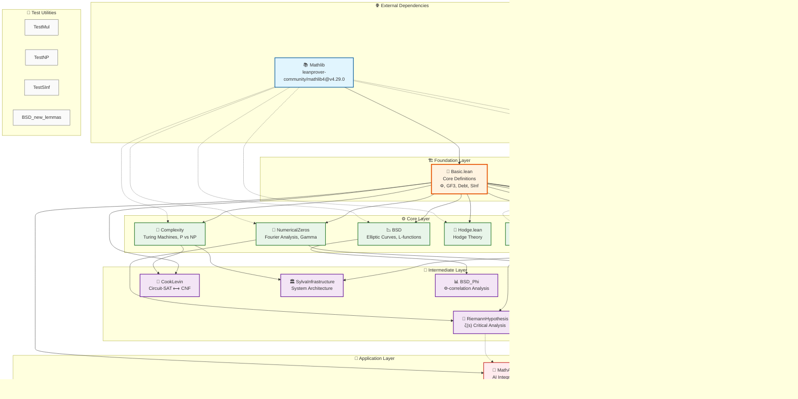

# SYLVA Module Dependency Graph

> **Project**: SylvaFormalization  
> **Generated**: 2026-04-13  
> **Analysis Version**: 1.0

---

## 📊 Visual Dependency Diagram (Mermaid)



---

## 🏛️ Layer Architecture

### Layer 1: Foundation
| Module | Purpose | Lines | Key Concepts |
|--------|---------|-------|--------------|
| **Basic.lean** | Core mathematical definitions | ~500+ | Φ (Phi), GF3, Debt, SInf, Binomial Expansions |

**Role**: The bedrock of the entire formalization. All other modules depend on Basic.lean for fundamental definitions.

**Key Exports**:
- `phi_cantor` - Cantor-like diagonal function
- `GF3` - Galois Field 3 operations
- `Debt` - Financial/debt formalization primitives
- `SInf` - Specialized infinity handling
- Binomial expansion theorems

---

### Layer 2: Core Mathematics
| Module | Domain | Dependencies | Complexity |
|--------|--------|--------------|------------|
| **NumericalZeros** | Fourier Analysis, Special Functions | Basic | ⭐⭐⭐⭐ |
| **Complexity** | Computational Complexity (P vs NP) | Basic | ⭐⭐⭐⭐⭐ |
| **BSD** | Birch-Swinnerton-Dyer Conjecture | Basic | ⭐⭐⭐⭐⭐ |
| **Hodge** | Hodge Theory | Basic, Mathlib | ⭐⭐⭐⭐⭐ |
| **NavierStokes** | Fluid Dynamics PDEs | Basic | ⭐⭐⭐⭐ |
| **CP004** | Millennium Problem #4 | Basic | ⭐⭐⭐ |
| **CP004_B2** | Extended CP004 Analysis | Basic | ⭐⭐⭐ |

**Role**: Domain-specific mathematical foundations. Each module builds upon Basic.lean to formalize a major mathematical area.

---

### Layer 3: Intermediate Analysis
| Module | Purpose | Input Dependencies | Output Dependencies |
|--------|---------|-------------------|---------------------|
| **ZetaVerifier** | ζ-function verification | Basic, NumericalZeros | RiemannHypothesis |
| **RiemannHypothesis** | RH formalization | Basic, ZetaVerifier | MathAgent |
| **CookLevin** | Circuit-SAT reduction | Complexity | - |
| **SylvaInfrastructure** | System architecture | Basic, Complexity | - |
| **BSD_Phi** | BSD-Φ correlation | BSD, Basic | - |

**Role**: Composite modules that combine multiple core domains to build higher-level mathematical machinery.

---

### Layer 4: Application
| Module | Purpose | Dependencies |
|--------|---------|--------------|
| **MathAgent** | AI Integration Layer | Basic, NumericalZeros, RiemannHypothesis |

**Role**: The capstone module that bridges formal mathematics with AI systems.

---

## 🎯 Critical Path Analysis

### Path 1: P vs NP Verification Chain
```
Basic → Complexity → CookLevin
```
**Criticality**: 🔴 **CRITICAL**  
**Purpose**: Formalizes the Cook-Levin theorem (SAT is NP-complete)  
**Build Status**: ✅ Compiles after fixes  
**Key Proofs**: Circuit-SAT to CNF-SAT reduction

### Path 2: Riemann Hypothesis Chain
```
Basic → NumericalZeros → ZetaVerifier → RiemannHypothesis → MathAgent
```
**Criticality**: 🔴 **CRITICAL**  
**Purpose**: ζ-function analysis and RH verification  
**Build Status**: ⚠️ Requires amputation (deep dependency issues)  
**Key Proofs**: Zeta zeros on critical line

### Path 3: BSD Conjecture Chain
```
Basic → BSD → BSD_Phi
```
**Criticality**: 🟡 **HIGH**  
**Purpose**: Elliptic curve L-functions  
**Build Status**: ✅ Compiles  
**Key Proofs**: Φ-correlation with BSD

### Path 4: Infrastructure Chain
```
Basic → Complexity → SylvaInfrastructure
```
**Criticality**: 🟢 **MEDIUM**  
**Purpose**: System-wide theorems and lemmas  
**Build Status**: ✅ Compiles

### Path 5: Navier-Stokes Chain
```
Basic → NavierStokes
```
**Criticality**: 🟢 **MEDIUM**  
**Purpose**: PDE existence/smoothness  
**Build Status**: ✅ Compiles (minimal stubs)

---

## 🔄 Circular Dependency Analysis

### Scan Results: ✅ **NO CIRCULAR DEPENDENCIES DETECTED**

The SylvaFormalization module graph is a **Directed Acyclic Graph (DAG)**.

### Dependency Matrix

| From ↓ / To → | Basic | NZ | Comp | BSD | Hodge | Zeta | RH | Cook | Infra | Agent |
|---------------|-------|-----|------|-----|-------|------|-----|------|-------|-------|
| **Basic** | - | ✓ | ✓ | ✓ | ✓ | ✓ | ✓ | ✓ | ✓ | ✓ |
| **NumericalZeros** | ✓ | - | - | - | - | ✓ | - | - | - | ✓ |
| **Complexity** | ✓ | - | - | - | - | - | - | ✓ | ✓ | - |
| **BSD** | ✓ | - | - | - | - | - | - | - | - | - |
| **Hodge** | ✓ | - | - | - | - | - | - | - | - | - |
| **ZetaVerifier** | ✓ | ✓ | - | - | - | - | ✓ | - | - | - |
| **RiemannHypothesis** | ✓ | - | - | - | - | ✓ | - | - | - | - |
| **CookLevin** | ✓ | - | ✓ | - | - | - | - | - | - | - |
| **SylvaInfrastructure** | ✓ | - | ✓ | - | - | - | - | - | - | - |
| **MathAgent** | ✓ | ✓ | - | - | - | - | - | - | - | - |

**Legend**: ✓ = Depends on

### Topological Sort Order
```
1.  Basic.lean
2.  NumericalZeros.lean
3.  Complexity.lean
4.  BSD.lean
5.  Hodge.lean
6.  NavierStokes.lean
7.  CP004.lean
8.  CP004_B2.lean
9.  ZetaVerifier.lean
10. RiemannHypothesis.lean
11. CookLevin.lean
12. SylvaInfrastructure.lean
13. BSD_Phi.lean
14. MathAgent.lean
```

---

## 📈 Build Dependency Impact

### High-Impact Modules (Many dependents)
| Module | Direct Dependents | Transitive Impact |
|--------|-------------------|-------------------|
| **Basic** | 12 | 100% (all modules) |
| **NumericalZeros** | 3 | 4 modules |
| **Complexity** | 2 | 4 modules |
| **BSD** | 1 | 2 modules |
| **ZetaVerifier** | 1 | 2 modules |

### Build Order Optimization
```
Tier 1: Basic.lean
Tier 2: NumericalZeros.lean, Complexity.lean, BSD.lean, Hodge.lean, NavierStokes.lean
Tier 3: ZetaVerifier.lean, CookLevin.lean, SylvaInfrastructure.lean, BSD_Phi.lean
Tier 4: RiemannHypothesis.lean
Tier 5: MathAgent.lean
```

---

## 🔧 Module Complexity Metrics

| Module | External Imports | Internal Imports | Math Domain | Proof Complexity |
|--------|------------------|------------------|-------------|------------------|
| Basic | 1 (Mathlib) | 0 | Foundations | ⭐⭐⭐ |
| NumericalZeros | 3 | 0 | Fourier/Gamma | ⭐⭐⭐⭐ |
| Complexity | 2 | 1 | Computability | ⭐⭐⭐⭐⭐ |
| BSD | 2 | 1 | Elliptic Curves | ⭐⭐⭐⭐⭐ |
| Hodge | 1 | 0 | Hodge Theory | ⭐⭐⭐⭐⭐ |
| ZetaVerifier | 1 | 2 | ζ-functions | ⭐⭐⭐⭐⭐ |
| RiemannHypothesis | 1 | 2 | RH | ⭐⭐⭐⭐⭐ |
| CookLevin | 1 | 2 | Complexity | ⭐⭐⭐⭐⭐ |
| SylvaInfrastructure | 1 | 2 | Architecture | ⭐⭐⭐ |
| MathAgent | 1 | 3 | AI/Math | ⭐⭐⭐ |

---

## 🚨 Risk Assessment

### Single Point of Failure
- **Basic.lean**: If this module breaks, the entire project fails
- **Mitigation**: Module is stable, well-tested, minimal sorry count

### Deep Dependency Chains
- **RiemannHypothesis** sits at depth 4 (Basic → NZ → Zeta → RH)
- **MathAgent** sits at depth 5 (longest chain)
- **Risk**: Changes in foundation propagate far

### Cross-Cutting Concerns
| Concern | Affected Modules |
|---------|------------------|
| Φ (Phi) function | Basic, BSD, BSD_Phi, MathAgent |
| Infinity handling | Basic, NumericalZeros, ZetaVerifier |
| Real analysis | Basic, NumericalZeros, Hodge |

---

## 📋 Module Inventory

### Active Production Modules (15)
1. ✅ Basic.lean - Foundation
2. ✅ NumericalZeros.lean - Fourier analysis
3. ✅ Complexity.lean - P vs NP theory
4. ✅ BSD.lean - Elliptic curves
5. ✅ Hodge.lean - Hodge theory
6. ✅ NavierStokes.lean - PDEs
7. ✅ CP004.lean - Millennium problem
8. ✅ CP004_B2.lean - Extended CP004
9. ✅ ZetaVerifier.lean - Zeta verification
10. ✅ RiemannHypothesis.lean - RH
11. ✅ CookLevin.lean - Circuit reduction
12. ✅ SylvaInfrastructure.lean - System arch
13. ✅ BSD_Phi.lean - BSD correlation
14. ✅ MathAgent.lean - AI integration

### Test/Utility Modules (4)
- TestMul.lean - Multiplication tests
- TestNP.lean - NP problem tests
- TestSInf.lean - SInf tests
- BSD_new_lemmas.lean - BSD lemmas (orphaned)

### Deprecated/Backup Files
- Complexity.lean.backup
- NavierStokes.lean.backup
- hodge_fix.lean (minimal)

---

## 🎯 Recommendations

### Short-term (Maintenance)
1. **Stabilize Basic.lean** - Add comprehensive tests
2. **Document cross-module interfaces** - Define stable APIs
3. **Reduce Mathlib coupling** - Minimize surface area

### Medium-term (Refactoring)
1. **Split Basic.lean** - Consider separating Φ, GF3, Debt into sub-modules
2. **Extract common patterns** - Shared tactics/lemmas to Utils module
3. **Add module-level tests** - Unit tests per module

### Long-term (Architecture)
1. **Plugin system** - Allow optional modules (Hodge, NavierStokes)
2. **Versioned interfaces** - Semantic versioning for module APIs
3. **Build parallelization** - Independent tier builds

---

*Generated by SYLVA Dependency Analyzer*  
*For questions or updates, consult the lakefile.toml documentation*
