# SylvaCheck 辐射压力分析报告

生成时间: 2026-04-15 14:04:19

项目路径: `/root/.openclaw/workspace/sylva_formalization`

## 📊 项目总览

| 指标 | 数值 |
|------|------|
| 模块总数 | 18 |
| 代码总行数 | 3450 |
| 注释+空行 | 3121 |
| 总 sorry 数 | 47 |
| 平均每模块 sorry | 2.61 |

## ☢️ 辐射压力排名（关键节点）

辐射压力反映模块被其他模块依赖的程度。高辐射压力 = 关键基础设施

| 排名 | 模块 | 压力指数 | 直接依赖 | 传递依赖 | PageRank |
|------|------|----------|----------|----------|----------|
| 1 | **Basic** | 0.987 | 13 | 13 | 0.933 |
| 2 | **NumericalZeros** | 0.170 | 2 | 2 | 0.235 |
| 3 | **BSD** | 0.100 | 1 | 1 | 0.193 |
| 4 | **BSD_Phi** | 0.030 | 0 | 0 | 0.150 |
| 5 | **BSD_new_lemmas** | 0.030 | 0 | 0 | 0.150 |
| 6 | **CP004** | 0.030 | 0 | 0 | 0.150 |
| 7 | **CP004_B2** | 0.030 | 0 | 0 | 0.150 |
| 8 | **Complexity** | 0.030 | 0 | 0 | 0.150 |
| 9 | **CookLevin** | 0.030 | 0 | 0 | 0.150 |
| 10 | **CookLevin_fixed** | 0.030 | 0 | 0 | 0.150 |

## 📋 模块详情

| 模块 | 代码行 | 注释行 | Sorry数 | 直接依赖 | 被依赖数 | 压力指数 |
|------|--------|--------|---------|----------|----------|----------|
| BSD | 279 | 433 | 0 | 3 | 1 | 0.100 |
| BSD_Phi | 136 | 101 | 0 | 3 | 0 | 0.030 |
| BSD_new_lemmas | 89 | 35 | 0 | 0 | 0 | 0.030 |
| Basic | 429 | 90 | 0 | 1 | 13 | 0.987 |
| CP004 | 29 | 43 | 0 | 2 | 0 | 0.030 |
| CP004_B2 | 213 | 74 | ⚠️ 1 | 6 | 0 | 0.030 |
| Complexity | 63 | 49 | 0 | 3 | 0 | 0.030 |
| CookLevin | 332 | 116 | ⚠️ 1 | 2 | 0 | 0.030 |
| CookLevin_fixed | 316 | 114 | ⚠️ 2 | 2 | 0 | 0.030 |
| CookLevin_sat_fixed | 314 | 112 | ⚠️ 2 | 2 | 0 | 0.030 |
| Hodge | 23 | 40 | 0 | 1 | 0 | 0.030 |
| LocalGlobal | 161 | 297 | ⚠️ 1 | 2 | 0 | 0.030 |
| MathAgent | 22 | 10 | 0 | 2 | 0 | 0.030 |
| NavierStokes | 222 | 169 | ⚠️ 29 | 4 | 0 | 0.030 |
| NumericalZeros | 160 | 102 | 0 | 3 | 2 | 0.170 |
| RiemannHypothesis | 384 | 139 | ⚠️ 11 | 4 | 0 | 0.030 |
| SylvaInfrastructure | 44 | 31 | 0 | 2 | 0 | 0.030 |
| ZetaVerifier | 234 | 56 | 0 | 4 | 0 | 0.030 |

## ⚠️ 发展不均衡领域

### 高 Sorry 模块（需优先填补）

| 模块 | Sorry数 | 代码行 | 密度 |
|------|---------|--------|------|
| NavierStokes | 29 | 222 | 13.1% |
| RiemannHypothesis | 11 | 384 | 2.9% |
| CookLevin_fixed | 2 | 316 | 0.6% |
| CookLevin_sat_fixed | 2 | 314 | 0.6% |
| CP004_B2 | 1 | 213 | 0.5% |
| CookLevin | 1 | 332 | 0.3% |
| LocalGlobal | 1 | 161 | 0.6% |

### 高负载模块（依赖过多，需关注稳定性）

| 模块 | 被依赖数 | 风险等级 |
|------|----------|----------|
| Basic | 13 | 🔴 高 |

### 孤立模块（需要更多整合）

这些模块几乎没有与其他模块产生依赖关系：
- BSD_new_lemmas
- Hodge

## 🔗 依赖图可视化

### Top 15 模块依赖关系（Mermaid 图）

> 红色 = 高辐射压力 | 黄色 = 中等辐射 | 绿色 = 低辐射

```mermaid
graph TD;
    Basic["Basic"]
    style Basic fill:#ff6b6b,stroke:#c92a2a,stroke-width:3px
    NumericalZeros["NumericalZeros"]
    style NumericalZeros fill:#69db7c,stroke:#2b8a3e,stroke-width:1px
    BSD["BSD"]
    style BSD fill:#69db7c,stroke:#2b8a3e,stroke-width:1px
    BSD_Phi["BSD_Phi"]
    style BSD_Phi fill:#69db7c,stroke:#2b8a3e,stroke-width:1px
    BSD_new_lemmas["BSD_new_lemmas"]
    style BSD_new_lemmas fill:#69db7c,stroke:#2b8a3e,stroke-width:1px
    CP004["CP004"]
    style CP004 fill:#69db7c,stroke:#2b8a3e,stroke-width:1px
    CP004_B2["CP004_B2 ⚠️1"]
    style CP004_B2 fill:#69db7c,stroke:#2b8a3e,stroke-width:1px
    Complexity["Complexity"]
    style Complexity fill:#69db7c,stroke:#2b8a3e,stroke-width:1px
    CookLevin["CookLevin ⚠️1"]
    style CookLevin fill:#69db7c,stroke:#2b8a3e,stroke-width:1px
    CookLevin_fixed["CookLevin_fixed ⚠️2"]
    style CookLevin_fixed fill:#69db7c,stroke:#2b8a3e,stroke-width:1px
    CookLevin_sat_fixed["CookLevin_sat_fixed ⚠️2"]
    style CookLevin_sat_fixed fill:#69db7c,stroke:#2b8a3e,stroke-width:1px
    Hodge["Hodge"]
    style Hodge fill:#69db7c,stroke:#2b8a3e,stroke-width:1px
    LocalGlobal["LocalGlobal ⚠️1"]
    style LocalGlobal fill:#69db7c,stroke:#2b8a3e,stroke-width:1px
    MathAgent["MathAgent"]
    style MathAgent fill:#69db7c,stroke:#2b8a3e,stroke-width:1px
    NavierStokes["NavierStokes ⚠️29"]
    style NavierStokes fill:#69db7c,stroke:#2b8a3e,stroke-width:1px
    BSD --> Basic
    BSD_Phi --> Basic
    BSD_Phi --> BSD
    CP004 --> Basic
    CP004_B2 --> Basic
    Complexity --> Basic
    CookLevin --> Basic
    CookLevin_fixed --> Basic
    CookLevin_sat_fixed --> Basic
    MathAgent --> Basic
    NavierStokes --> Basic
```

## 💡 优化建议

1. **稳定核心模块**: `Basic` 具有最高的辐射压力，建议优先确保其稳定性
2. **填补证明缺口**: 共有 47 个 sorry，建议分批填补，优先处理高辐射模块中的 sorry

## 📦 数据导出

完整分析数据已保存到 `sylva_check_data.json`