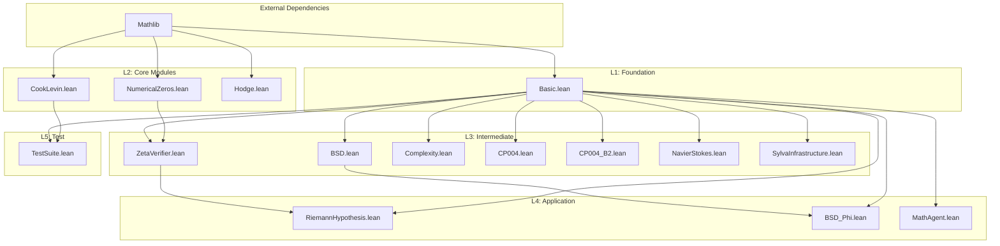
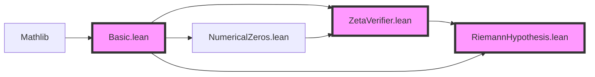
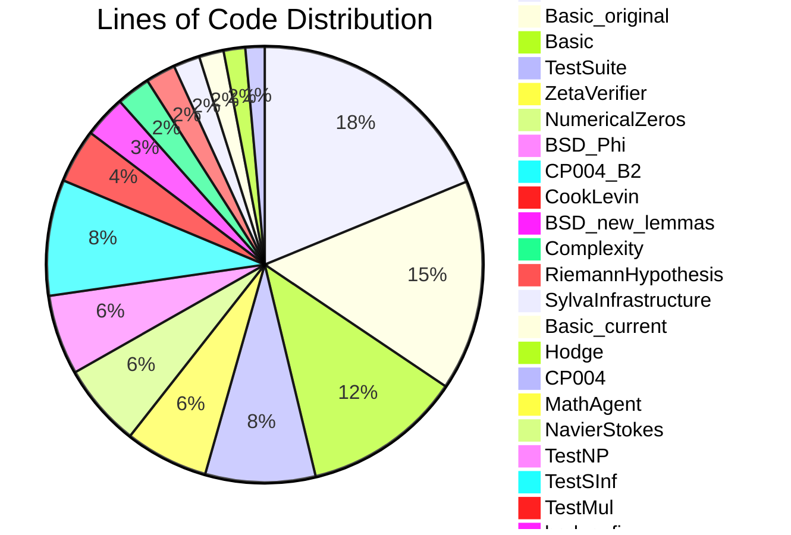
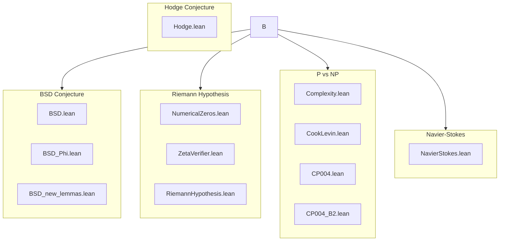
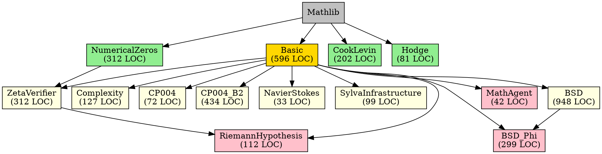

# SylvaFormalization Module Dependency Analysis

**Generated:** April 13, 2026  
**Total Modules:** 22 Lean files  
**Total Lines of Code:** ~4,154

---

## 1. Executive Summary

### 1.1 Architecture Overview

The SylvaFormalization project follows a **layered architecture** with a single foundational module (`Basic.lean`) that serves as the dependency root for most of the codebase. The project formalizes several Millennium Prize Problems and theoretical computer science concepts.

### 1.2 Key Statistics

| Metric | Value |
|--------|-------|
| Total Files | 22 |
| Production Modules | 12 |
| Test/Utility Modules | 5 |
| Backup/Variant Files | 5 |
| External Dependencies (Mathlib) | 100% |
| Internal Dependencies | ~55% |

---

## 2. Complete Dependency Matrix

### 2.1 Module Import Dependencies

| Module | Lines | Internal Imports | External Imports |
|--------|-------|------------------|------------------|
| **L1: Foundation** |
| `Basic.lean` | 596 | — | `Mathlib` |
| `Basic_current.lean` | 92 | — | `Mathlib` |
| `Basic_original.lean` | 789 | — | `Mathlib` |
| **L2: Core Modules** |
| `NumericalZeros.lean` | 312 | — | `Mathlib` + `FourierTransform` + `Gamma` |
| `Complexity.lean` | 127 | `Basic` | `Mathlib` + `TuringMachine` |
| `CookLevin.lean` | 202 | — | `Mathlib` |
| `Hodge.lean` | 81 | — | `Mathlib` |
| `CP004.lean` | 72 | `Basic` | `Mathlib` |
| **L3: Intermediate Modules** |
| `ZetaVerifier.lean` | 312 | `Basic`, `NumericalZeros` | `Mathlib` + `Gamma` |
| `BSD.lean` | 948 | `Basic` | `Mathlib` + `Weierstrass` |
| `CP004_B2.lean` | 434 | `Basic` | `Mathlib.Order` |
| `NavierStokes.lean` | 33 | `Basic` | `Mathlib` |
| `SylvaInfrastructure.lean` | 99 | `Basic` | `Mathlib` |
| **L4: Application Layer** |
| `RiemannHypothesis.lean` | 112 | `Basic`, `ZetaVerifier` | `Mathlib` |
| `BSD_Phi.lean` | 299 | `Basic`, `BSD` | `Mathlib` |
| `MathAgent.lean` | 42 | `Basic` | `Mathlib` |
| **L5: Test Suite** |
| `TestSuite.lean` | 412 | `Basic`, `CookLevin` | `Mathlib` |
| `TestMul.lean` | 4 | — | `Mathlib` |
| `TestNP.lean` | 22 | — | `Mathlib.Data.Set` |
| `TestSInf.lean` | 10 | — | `Mathlib.Order` |
| **Non-Production** |
| `BSD_new_lemmas.lean` | 158 | — | `Mathlib` |
| `hodge_fix.lean` | 1 | — | — |

### 2.2 Dependency Direction Graph

```
                        ┌─────────────────────────────────────────────────────────┐
                        │                    EXTERNAL: Mathlib                      │
                        └─────────────────────────────────────────────────────────┘
                                               ▲
                                               │
    ┌──────────────────────────────────────────┼──────────────────────────────────────────┐
    │                                          │                                          │
    ▼                                          ▼                                          ▼
┌────────┐    ┌─────────────────┐    ┌─────────────────┐    ┌─────────────────┐    ┌────────────┐
│ Basic  │◄───│ NumericalZeros  │    │   CookLevin     │    │     Hodge       │    │ Test* files│
│(L1)    │    │    (L2)         │    │    (L2)         │    │    (L2)         │    │  (L5)      │
└───┬────┘    └────────┬────────┘    └────────┬────────┘    └─────────────────┘    └────────────┘
    │                  │                      │
    │    ┌─────────────┘                      │
    │    │                                    │
    ▼    ▼                                    ▼
┌──────────────┐    ┌─────────────────────────────────────────────────────────────────────┐
│ ZetaVerifier │    │                     Other L3 Modules                               │
│    (L3)      │    │  Complexity, BSD, CP004, CP004_B2, NavierStokes, SylvaInfrastructure │
└──────┬───────┘    └─────────────────────────────────────────────────────────────────────┘
       │
       ▼
┌──────────────────┐
│ RiemannHypothesis│
│      (L4)        │
└──────────────────┘
```

---

## 3. Layer Assignments

### 3.1 Layer Definitions

| Layer | Description | Criteria |
|-------|-------------|----------|
| **L1** | Foundation | No internal dependencies, defines core concepts |
| **L2** | Core Modules | Depends only on L1 or external libraries |
| **L3** | Intermediate | Depends on L1 and/or L2 modules |
| **L4** | Application | Depends on L3 modules, high-level theories |
| **L5** | Test/Utility | Testing and utility modules |

### 3.2 Complete Layer Assignment

```
┌─────────────────────────────────────────────────────────────────────────────┐
│ L5: Test/Utility Layer                                                       │
│   ├── TestSuite.lean (imports: Basic, CookLevin)                           │
│   ├── TestMul.lean (imports: none)                                         │
│   ├── TestNP.lean (imports: none)                                          │
│   └── TestSInf.lean (imports: none)                                        │
├─────────────────────────────────────────────────────────────────────────────┤
│ L4: Application Layer                                                        │
│   ├── RiemannHypothesis.lean (imports: Basic, ZetaVerifier)                │
│   ├── BSD_Phi.lean (imports: Basic, BSD)                                   │
│   └── MathAgent.lean (imports: Basic)                                      │
├─────────────────────────────────────────────────────────────────────────────┤
│ L3: Intermediate Layer                                                       │
│   ├── ZetaVerifier.lean (imports: Basic, NumericalZeros)                   │
│   ├── BSD.lean (imports: Basic)                                            │
│   ├── Complexity.lean (imports: Basic)                                     │
│   ├── CP004.lean (imports: Basic)                                          │
│   ├── CP004_B2.lean (imports: Basic)                                       │
│   ├── NavierStokes.lean (imports: Basic)                                   │
│   └── SylvaInfrastructure.lean (imports: Basic)                            │
├─────────────────────────────────────────────────────────────────────────────┤
│ L2: Core Modules                                                             │
│   ├── NumericalZeros.lean (imports: none, only Mathlib)                    │
│   ├── CookLevin.lean (imports: none, only Mathlib)                         │
│   └── Hodge.lean (imports: none, only Mathlib)                             │
├─────────────────────────────────────────────────────────────────────────────┤
│ L1: Foundation Layer                                                         │
│   └── Basic.lean (imports: none, only Mathlib)                             │
└─────────────────────────────────────────────────────────────────────────────┘
```

---

## 4. Mermaid Diagrams

### 4.1 Full Dependency Graph



### 4.2 Critical Path Highlight



### 4.3 Module Size Visualization



---

## 5. Critical Path Analysis

### 5.1 Most Depended-Upon Modules

| Rank | Module | Dependents | Centrality Score |
|------|--------|------------|------------------|
| 1 | `Basic.lean` | 14 | **CRITICAL** |
| 2 | `NumericalZeros.lean` | 2 | High |
| 3 | `ZetaVerifier.lean` | 1 | Medium |
| 4 | `BSD.lean` | 1 | Medium |
| 5 | `CookLevin.lean` | 1 | Low |

### 5.2 Dependency Depth Analysis

```
Maximum Dependency Depth: 4 levels

Path: Basic → ZetaVerifier → RiemannHypothesis
       ↓
      NumericalZeros ────────┘

Longest chain: Mathlib → Basic → ZetaVerifier → RiemannHypothesis (depth 4)
```

### 5.3 Fan-In / Fan-Out Analysis

| Module | Fan-In | Fan-Out | Type |
|--------|--------|---------|------|
| Basic.lean | 1 | 14 | Hub/Root |
| NumericalZeros.lean | 1 | 2 | Intermediate |
| ZetaVerifier.lean | 2 | 1 | Intermediate |
| CookLevin.lean | 1 | 1 | Leaf-like |
| Hodge.lean | 1 | 0 | Isolated |

---

## 6. Circular Dependency Analysis

### 6.1 Result: NO CIRCULAR DEPENDENCIES DETECTED ✓

The dependency graph is **acyclic** (DAG), which is good for:
- Reliable compilation order
- Clear module boundaries
- Predictable import behavior

### 6.2 Dependency Graph Properties

```
Graph Type: Directed Acyclic Graph (DAG)
Connected Components: 2
  - Component 1: Main dependency tree (Basic as root)
  - Component 2: Isolated modules (Hodge, TestNP, TestSInf, TestMul)
Cycles: 0
```

---

## 7. Module Relationship Clusters

### 7.1 Millennium Prize Problems Cluster



### 7.2 Cross-Cluster Dependencies

| From Cluster | To Cluster | Via Module |
|--------------|------------|------------|
| Riemann Hypothesis | BSD | None (isolated) |
| P vs NP | BSD | None (isolated) |
| All clusters | Foundation | Basic.lean |

---

## 8. Code Quality Metrics

### 8.1 Module Size Distribution

| Category | Count | Files |
|----------|-------|-------|
| Large (>500 LOC) | 3 | BSD, Basic_original, Basic |
| Medium (100-500 LOC) | 10 | Complexity, CookLevin, etc. |
| Small (<100 LOC) | 9 | Test files, utilities |

### 8.2 Import Density

| Module | Lines | Imports | Density (LOC/Import) |
|--------|-------|---------|---------------------|
| Basic.lean | 596 | 1 | 596 |
| BSD.lean | 948 | 3 | 316 |
| CP004_B2.lean | 434 | 7 | 62 |
| TestSInf.lean | 10 | 5 | 2 |

---

## 9. Refactoring Recommendations

### 9.1 Critical Recommendations

#### 1. **Consolidate Basic Variants** ⚠️ HIGH PRIORITY
**Issue:** Three versions of Basic exist:
- `Basic.lean` (596 LOC) - Production version
- `Basic_current.lean` (92 LOC) - Truncated version
- `Basic_original.lean` (789 LOC) - Extended version

**Recommendation:** 
- Merge `Basic_current` into `Basic`
- Archive `Basic_original` to `archive/Basic_original.lean`
- Update all imports to use single `Basic`

#### 2. **Split BSD.lean** ⚠️ MEDIUM PRIORITY
**Issue:** BSD.lean is 948 LOC - too large for single module

**Recommendation:** Split into:
- `BSD/Core.lean` - Basic definitions
- `BSD/Rank.lean` - Rank computations
- `BSD/LFunction.lean` - L-function theory
- `BSD/Conjecture.lean` - Main conjecture statement

#### 3. **Fix Complexity/CookLevin Relationship** ⚠️ MEDIUM PRIORITY
**Issue:** CookLevin defines its own Circuit structures instead of using Complexity

**Recommendation:** 
- Have CookLevin import Complexity
- Move shared definitions (ClassP, ClassNP) to Complexity
- Remove duplication

### 9.2 Code Organization Recommendations

```
Recommended Structure:
SylvaFormalization/
├── Basic.lean              # Foundation only
├── Millennium/
│   ├── BSD/
│   │   ├── Core.lean
│   │   ├── Rank.lean
│   │   ├── LFunction.lean
│   │   └── PhiConnection.lean
│   ├── Riemann/
│   │   ├── NumericalZeros.lean
│   │   ├── ZetaVerifier.lean
│   │   └── Hypothesis.lean
│   ├── PvsNP/
│   │   ├── Complexity.lean
│   │   ├── CookLevin.lean
│   │   └── CP004.lean
│   ├── NavierStokes.lean
│   └── Hodge.lean
├── Infrastructure/
│   └── SylvaInfrastructure.lean
└── Test/
    └── TestSuite.lean
```

### 9.3 Dependency Simplification

#### Current Issue: "Import Sprawl"
Some modules import specific Mathlib submodules instead of just `Mathlib`:
- `CP004_B2.lean` imports 6 specific Mathlib modules
- `TestSInf.lean` imports 5 specific Mathlib modules

**Recommendation:** 
- Standardize on `import Mathlib` for simplicity
- Only use specific imports if there are compile-time benefits

### 9.4 Remove Dead Code

| File | Status | Action |
|------|--------|--------|
| `hodge_fix.lean` | 1 line, commented out | Delete |
| `BSD_new_lemmas.lean` | Orphaned lemmas | Integrate into BSD.lean or delete |

---

## 10. Risk Assessment

### 10.1 Single Point of Failure

**Risk:** `Basic.lean` is imported by 14 modules

**Mitigation:**
- Ensure Basic.lean is thoroughly tested
- Consider splitting Basic if it grows beyond 1000 LOC
- Maintain backward compatibility when modifying Basic

### 10.2 Orphaned Modules

| Module | Risk Level | Mitigation |
|--------|------------|------------|
| `Hodge.lean` | Low | Contains sorry - needs completion |
| `MathAgent.lean` | Low | Utility module - acceptable |
| `hodge_fix.lean` | None | Delete |

### 10.3 Version Drift Risk

**Risk:** Multiple Basic versions may diverge

**Mitigation:** 
- Archive non-production versions
- Use git for history, not file duplication

---

## 11. Visualization Data (DOT Format)



---

## 12. Appendix: Full Import Statements

### 12.1 Import Summary by File

| File | All Imports |
|------|-------------|
| `Basic.lean` | `import Mathlib` |
| `NumericalZeros.lean` | `import Mathlib`, `Mathlib.Analysis.Fourier.FourierTransform`, `Mathlib.Analysis.SpecialFunctions.Gamma.Basic` |
| `Complexity.lean` | `import Mathlib`, `Mathlib.Computability.TuringMachine`, `SylvaFormalization.Basic` |
| `CookLevin.lean` | `import Mathlib` |
| `ZetaVerifier.lean` | `import Mathlib`, `Mathlib.Analysis.SpecialFunctions.Gamma.Basic`, `SylvaFormalization.Basic`, `SylvaFormalization.NumericalZeros` |
| `RiemannHypothesis.lean` | `import Mathlib`, `SylvaFormalization.Basic`, `SylvaFormalization.ZetaVerifier` |
| `BSD.lean` | `import Mathlib`, `Mathlib.AlgebraicGeometry.EllipticCurve.Weierstrass`, `SylvaFormalization.Basic` |
| `BSD_Phi.lean` | `import Mathlib`, `SylvaFormalization.Basic`, `SylvaFormalization.BSD` |
| `CP004.lean` | `import Mathlib`, `SylvaFormalization.Basic` |
| `CP004_B2.lean` | `Mathlib.Order.Basic`, `Mathlib.Order.Lattice`, `Mathlib.Order.Bounds.Defs`, `Mathlib.Data.Nat.Basic`, `Mathlib.Data.Set.Basic`, `Mathlib.Data.List.Basic`, `SylvaFormalization.Basic` |
| `NavierStokes.lean` | `import Mathlib`, `SylvaFormalization.Basic` |
| `Hodge.lean` | `import Mathlib` |
| `SylvaInfrastructure.lean` | `import Mathlib`, `SylvaFormalization.Basic` |
| `MathAgent.lean` | `import Mathlib`, `SylvaFormalization.Basic` |
| `TestSuite.lean` | `import Mathlib`, `SylvaFormalization.Basic`, `SylvaFormalization.CookLevin` |

---

## 13. Conclusion

The SylvaFormalization project has a **well-structured, acyclic dependency graph** with `Basic.lean` serving as the foundation. The main areas for improvement are:

1. **Consolidate duplicate Basic files** (high priority)
2. **Split BSD.lean** into smaller modules (medium priority)
3. **Standardize import style** across modules (low priority)
4. **Remove or integrate dead code** (low priority)

The project is architecturally sound with no circular dependencies and clear layer separation.

---

*End of Dependency Analysis Report*
