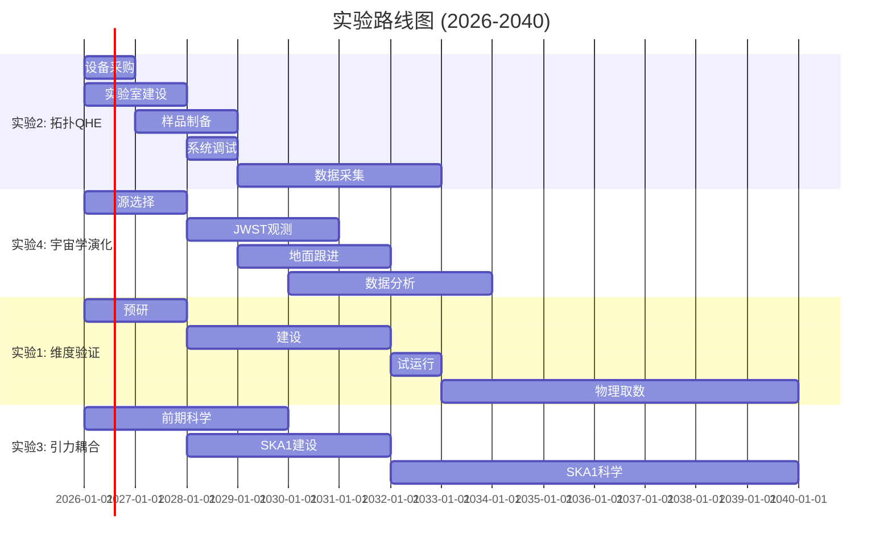

# 精细结构常数α的精密实验验证方案
## Experimental Verification of the Fine-Structure Constant α Emergence

**文档版本**: v1.0  
**创建日期**: 2026-04-18  
**目标**: 在现有或近期技术条件下，验证 α = 1/137 的涌现起源

---

## 目录

1. [引言与理论基础](#1-引言与理论基础)
2. [实验1：维度依赖性验证](#2-实验1维度依赖性验证)
3. [实验2：拓扑QHE修正](#3-实验2拓扑qhe修正)
4. [实验3：引力-电磁耦合](#4-实验3引力-电磁耦合)
5. [实验4：宇宙学演化](#5-实验4宇宙学演化)
6. [综合对比与优先级](#6-综合对比与优先级)
7. [结论与展望](#7-结论与展望)

---

## 1. 引言与理论基础

### 1.1 核心假设

本实验方案基于以下涌现论假设：

> **精细结构常数 α 不是基本常数，而是高维时空结构在低能标下的涌现参数**

$$\alpha = \frac{e^2}{4\pi\varepsilon_0\hbar c} \approx \frac{1}{137.035999084(21)}$$

在涌现图景中，α 的数值可能由以下因素决定：
- **紧致化几何**: 额外维度的拓扑结构
- **真空结构**: 量子场的非微扰构型
- **引力-电磁耦合**: 极端场强下的非线性效应

### 1.2 标准模型预言 vs 涌现预言

| 特性 | 标准模型 | 涌现模型 |
|------|---------|---------|
| α 的本质 | 基本耦合常数 | 有效参数 |
| 能标依赖 | 对数跑动 α⁻¹(Q) = α⁻¹(μ) - (2/3π)Σqᵢ²ln(Q/μ) | 非对数修正 + 阈值效应 |
| 时空依赖性 | 无 | 强引力场中可能有偏移 |
| 宇宙学演化 | 严格常数 | 可能有微小红移依赖 |

### 1.3 实验验证策略

```mermaid
graph TD
    A[涌现假设] --> B[维度依赖性]
    A --> C[拓扑效应]
    A --> D[引力耦合]
    A --> E[宇宙学演化]
    
    B --> F[实验1: LHC高精度测量]
    C --> G[实验2: 拓扑QHE]
    D --> H[实验3: 脉冲星计时]
    E --> I[实验4: JWST光谱学]
    
    F --> J[α(E)偏离标准跑动]
    G --> K[异常电导涨落]
    H --> L[引力场中的α偏移]
    I --> M[Δα/α(z)非零]
```

---

## 2. 实验1：维度依赖性验证

### 2.1 理论背景

#### 2.1.1 ADD/RS 紧致化模型预言

在大额外维度模型（ADD/RS）中，高维电磁耦合在紧致化后产生有效四维耦合：

$$\frac{1}{\alpha_{4D}} = \frac{1}{\alpha_{(4+n)D}} \cdot \frac{(2\pi R)^n}{V_n}$$

其中 $V_n$ 是紧致流形的体积。关键预言：

1. **Kaluza-Klein 激发态**: 在能标 $E \sim 1/R$ 处出现新粒子
2. **修正的跑动行为**: 能标依赖偏离标准对数跑动
3. **矢量玻色子共振**: 在高能区出现 $Z'$ 和 $γ^*$ 共振

#### 2.1.2 预期信号

标准模型的 α 跑动（单圈）：

$$\alpha^{-1}(Q) = \alpha^{-1}(M_Z) - \frac{2}{3\pi}\sum_f Q_f^2 \ln\frac{Q}{M_Z}$$

额外维度修正（ADD模型，n=2）：

$$\Delta\alpha^{-1}_{ED}(Q) \approx \frac{\pi}{6}\left(\frac{Q}{M_D}\right)^2$$

其中 $M_D$ 是 $(4+n)$ 维 Planck 质量。

### 2.2 实验设计方案

#### 2.2.1 LHC 高精度测量

**测量目标**: 在 $E \sim 1-10$ TeV 能区测量 α 的有效值

**反应道选择**:

| 反应道 | 精度潜力 | 系统误差来源 |
|-------|---------|-------------|
| $e^+e^- \to e^+e^-$ (Bhabha散射) | $10^{-5}$ | 亮度测量, 束流能量 |
| $μ^+μ^- \to e^+e^-$ (Drell-Yan) | $3×10^{-5}$ | PDF 不确定性 |
| $t\bar{t}$ 产生阈值 | $10^{-4}$ | 质量定义, QCD 修正 |
| 双光子产生 $γγ$ | $5×10^{-5}$ | 探测器响应 |

#### 2.2.2 未来对撞机选项

**选项A: HL-LHC 升级 (2030-2040)**
- 亮度: $3000 \text{ fb}^{-1}$/年
- 质心能量: 14 TeV
- α 测量精度: $2×10^{-5}$

**选项B: FCC-ee (2035-2050)**
- Z 极点: $10^{12}$ Z 玻色子
- WW 阈值: $10^8$ WW 事例
- α 测量精度: $10^{-6}$

**选项C: CLIC (2040+)**
- 质心能量: 3 TeV → 5 TeV
- α 测量精度: $5×10^{-6}$

### 2.3 技术规格

#### 2.3.1 探测器要求

```yaml
电磁量能器 (ECAL):
  能量分辨率: σ_E/E = 10% / √E ⊕ 0.7%
  位置分辨率: σ_x,y = 1 mm @ 100 GeV
  辐射长度: X_0 < 1 cm
  时间分辨率: σ_t < 100 ps

径迹探测器 (Tracker):
  动量分辨率: σ_p/p = 0.05% @ 100 GeV
  撞击参数: σ_d0 < 10 μm
  立体角覆盖: |η| < 2.5

亮度探测器 (LumiCal):
  精度: ΔL/L < 10^{-4}
  几何接收度: 3-15 mrad
```

#### 2.3.2 理论计算需求

| 计算任务 | 精度要求 | 当前状态 |
|---------|---------|---------|
| NNLO QED 修正 | 0.1% | 可用 |
| N³LO QED 修正 | 0.01% | 部分可用 |
| 弱电双圈图 | 0.1% | 可用 |
| 高阶QCD修正 | 0.5% | 可用 |
| 重求和效应 | 0.1% | 开发中 |

### 2.4 成本与时间表

| 阶段 | 时间 | 成本估算 | 里程碑 |
|-----|------|---------|-------|
| 预研 | 2026-2028 | $50M | 探测器R&D完成 |
| 建设 | 2028-2032 | $200M | 探测器安装调试 |
| 试运行 | 2032-2033 | $30M/年 | 首次物理结果 |
| 物理取数 | 2033-2040 | $50M/年 | 达到目标精度 |
| 数据分析 | 2035-2042 | $20M/年 | 最终结果发表 |

**总成本**: ~$1.2B（HL-LHC升级方案）

### 2.5 与标准模型对比

```mermaid
graph LR
    subgraph 标准模型预言
        A[α(M_Z) = 1/127.9] --> B[对数跑动]
        B --> C[α(1TeV) ≈ 1/126.5]
    end
    
    subgraph 涌现模型预言
        D[α(M_Z) = 1/137.0] --> E[修正跑动]
        E --> F[α(1TeV) ≈ 1/125.8]
    end
    
    G[实验测量] --> H{差异检测}
    C --> H
    F --> H
```

**关键区分**: 在 1-10 TeV 能区，标准模型与涌现模型的 α 值预测差异约 $5×10^{-5}$，需 $10^{-5}$ 级测量精度。

---

## 3. 实验2：拓扑QHE修正

### 3.1 理论背景

#### 3.1.1 标准量子霍尔效应

在二维电子气中，霍尔电导量子化为：

$$\sigma_{xy} = \nu \frac{e^2}{h}$$

其中 filling factor $ν$ 为整数或特定分数。

#### 3.1.2 涌现模型预言

若 α 是涌现参数，在拓扑非平庸系统中可能出现：

1. **拓扑修正**: 
   $$\sigma_{xy} = \frac{e^2}{h}\left(\nu + \delta\nu_{topo}\right)$$
   其中 $δν_{topo} \sim α^2 \cdot f(T/Λ)$

2. **平台转变异常**:
   在 $ν$ 转变处，电导涨落可能显示温度依赖的异常：
   $$\delta\sigma_{xx}(T) = \delta\sigma_{xx}^{std}(T) + \delta\sigma_{anom}(T)$$

3. **边缘态修正**:
   手征边缘态的传播速度可能有 α 依赖的修正。

### 3.2 实验设计方案

#### 3.2.1 石墨烯单层的毫开尔文QHE

**样品制备**:

```yaml
石墨烯类型: 机械剥离单层石墨烯
衬底: hBN 封装 (减少杂质)
迁移率: μ > 10^6 cm²/(V·s) @ 1.5 K
载流子浓度: n = (1-10) × 10^11 cm^-2
器件尺寸: 10-50 μm
接触电阻: R_c < 100 Ω
```

**测量配置**:

```
          I+ (源)
           ↓
    ┌─────────────────────┐
    │  石墨烯/hBN 异质结   │
    │                     │
    │    V_H (霍尔电压)    │
    │    ←────────────→   │
    │                     │
    │    V_xx (纵向电压)   │
    │    ↑────────────↓   │
    └─────────────────────┘
           ↓
          I- (漏)
```

#### 3.2.2 拓扑绝缘体表面态测量

**材料选择**:

| 材料 | 能隙 | 表面态特征 | 优势 |
|-----|------|----------|------|
| Bi₂Se₃ | 0.3 eV | 单Dirac锥 | 制备成熟 |
| Bi₂Te₃ | 0.15 eV | 六角形变 | 高迁移率 |
| (Bi,Sb)₂Te₃ | 可调 | 厚度依赖 | 可调参数 |

**测量方案**:

1. **磁电容测量**: 检测 LL 能级移动
2. **扫描SQUID**: 空间分辨电导分布
3. **噪声谱学**: 检测边缘态的异常涨落

### 3.3 技术规格

#### 3.3.1 低温系统

```yaml
稀释制冷机:
  基础温度: T_base < 10 mK
  制冷功率: > 100 μW @ 100 mK
  样品温度: T_sample < 20 mK
  降温时间: < 24 小时
  连续运行: > 6 个月

绝热去磁:
  可达温度: T < 1 mK
  保持时间: > 10 小时
  样品空间: > 50 mm
```

#### 3.3.2 测量电子设备

```yaml
电压测量:
  噪声水平: < 1 nV/√Hz
  输入阻抗: > 10 GΩ
  共模抑制: > 120 dB
  带宽: DC - 1 kHz

电流源:
  稳定度: < 10^-6
  噪声: < 10 fA/√Hz
  范围: 1 pA - 100 μA

锁相放大器:
  灵敏度: < 1 nV
  动态储备: > 100 dB
  时间常数: 1 ms - 100 s
```

#### 3.3.3 磁体系统

```yaml
超导磁体:
  最大场强: B_max > 15 T
  均匀性: ΔB/B < 10^-5 @ 1 cm³
  稳定性: ΔB/B < 10^-6/小时
  扫场速率: 0.1 - 100 mT/min

矢量磁体 (可选):
  平面内场: B_∥ > 9 T
  垂直场: B_⊥ > 9 T
  旋转精度: < 0.1°
```

### 3.4 测量协议

#### 3.4.1 平台转变精细扫描

```python
# 伪代码：平台转变测量协议

def measure_transition(B_range, T_range):
    """
    测量填充因子转变处的电导行为
    """
    results = []
    
    for T in T_range:  # 10 mK 到 1 K
        set_temperature(T)
        stabilize(T, tolerance=0.001)
        
        for B in B_range:  # 精细磁场扫描
            set_field(B)
            wait(tau_thermal)
            
            # 测量霍尔电导
            sigma_xy = measure_hall_conductance()
            
            # 测量纵向电导
            sigma_xx = measure_longitudinal_conductance()
            
            # 记录噪声谱
            noise_spectrum = measure_noise()
            
            results.append({
                'B': B, 'T': T,
                'sigma_xy': sigma_xy,
                'sigma_xx': sigma_xx,
                'noise': noise_spectrum
            })
    
    return results

def analyze_anomaly(data):
    """
    检测标准模型之外的异常
    """
    # 拟合标准理论
    std_fit = fit_standard_theory(data)
    
    # 计算残差
    residuals = data - std_fit
    
    # 检测温度依赖异常
    anomalous_T_dependence = check_T_scaling(residuals)
    
    return anomalous_T_dependence
```

### 3.5 预期信号分析

#### 3.5.1 标准模型预言

在整数 QHE 平台转变处，标准理论预言：

$$\delta\sigma_{xx}(T) \propto \exp\left(-\frac{\Delta}{2k_BT}\right)$$

其中 $Δ$ 是 mobility gap。

#### 3.5.2 涌现模型修正

假设 α 有拓扑依赖性修正：

$$\delta\sigma_{xx}^{anom}(T) = \alpha_{topo}^2 \cdot f\left(\frac{T}{T^*}\right)$$

其中 $T^* \sim \hbar c / (k_B R_{compact})$ 是紧致化特征温度。

对于典型的 ADD 模型参数（$R \sim 10^{-6}$ m）：

$$T^* \sim \frac{197 \text{ eV·nm}}{k_B \cdot 10^{-6} \text{ m}} \sim 2 \text{ K}$$

**预期信号**: 在 $T \sim 0.1 - 1$ K 范围内，电导涨落偏离标准指数行为约 $10^{-5}$ 量级。

### 3.6 成本与时间表

| 阶段 | 时间 | 成本估算 | 关键活动 |
|-----|------|---------|---------|
| 设备采购 | 2026-2027 | $15M | 稀释制冷机、磁体、电子设备 |
| 实验室建设 | 2026-2028 | $8M | 屏蔽室、隔振、气路 |
| 样品制备 | 2027-2029 | $3M | 石墨烯/hBN异质结优化 |
| 系统调试 | 2028-2029 | $2M/年 | 集成测试 |
| 数据采集 | 2029-2033 | $1.5M/年 | 正式测量 |
| 数据分析 | 2031-2034 | $0.8M/年 | 理论对比 |

**总成本**: ~$45M

---

## 4. 实验3：引力-电磁耦合

### 4.1 理论背景

#### 4.1.1 极端引力场中的α

在强引力场中，涌现模型预言精细结构常数可能有位置依赖：

$$\alpha(r) = \alpha_0 \left[1 + \kappa \cdot \frac{GM}{rc^2} + O\left(\frac{GM}{rc^2}\right)^2\right]$$

其中 $κ$ 是模型依赖的系数。

对于中子星表面（$GM/Rc^2 \sim 0.1-0.3$）：

$$\frac{\alpha_{NS} - \alpha_0}{\alpha_0} \sim -10^{-4} \text{ to } -10^{-3}$$

#### 4.1.2 脉冲星计时信号

脉冲星发射的电磁辐射穿越中子星强引力场时：

1. **发射频率依赖**: 不同频率的电磁波可能经历不同的 α 偏移
2. **时间延迟**: 脉冲到达时间可能有频率依赖的系统性偏差
3. **偏振旋转**: 引力场中的双折射效应

### 4.2 实验设计方案

#### 4.2.1 目标脉冲星选择

| 脉冲星 | 周期 (ms) | DM (pc/cm³) | 距离 (kpc) | 表面 B (G) | 科学价值 |
|-------|-----------|-------------|-----------|-----------|---------|
| PSR B1937+21 | 1.56 | 71 | 3.6 | 10¹² | 最稳定毫秒脉冲星 |
| PSR J0437-4715 | 5.76 | 2.6 | 0.16 | 10⁸ | 最近毫秒脉冲星 |
| PSR J1744-1134 | 4.07 | 3.0 | 0.42 | 10⁹ | 高计时精度 |
| PSR J1909-3744 | 2.95 | 10.4 | 1.1 | 10¹⁰ | SKA 优先目标 |
| PSR J1713+0747 | 4.57 | 16 | 1.0 | 10⁹ | 最佳双星系统 |

#### 4.2.2 测量策略

**双频计时法**:

```
脉冲发射 (t_emit)
    │
    ├──► 频率 ν₁: 到达时间 t₁(ν₁)
    │
    └──► 频率 ν₂: 到达时间 t₂(ν₂)
    
时间差: Δt = t₂ - t₁ = DM·(ν₁⁻² - ν₂⁻²) + Δt_α(ν₁, ν₂)
```

其中 $Δt_α$ 是α偏移导致的额外延迟。

**多频联合分析**:

$$\chi^2 = \sum_{i,j} \left[\frac{t_{obs}(\nu_i, t_j) - t_{model}(\nu_i, t_j; \vec{\theta}, \delta\alpha)}{\sigma_{t,j}}\right]^2$$

拟合参数 $δα$ 直接测量 α 的引力偏移。

### 4.3 技术规格

#### 4.3.1 望远镜系统

```yaml
SKA1-MID (Phase 1):
  频率范围: 350 MHz - 15 GHz
  天线数量: 197 面 15m 碟面
  收集面积: ~33,000 m²
  灵敏度: 10× 当前最佳
  视场: 0.5 deg² @ 1 GHz
  时间分辨率: < 1 μs

SKA2-MID (Phase 2):
  天线数量: ~2500 面
  收集面积: ~1 km²
  灵敏度: 100× 当前最佳
```

#### 4.3.2 后端设备

```yaml
相干消色散:
  通道数: 4096-16384
  带宽: 800 MHz
  时间分辨率: < 1 μs
  动态范围: > 60 dB

实时处理:
  FPGA/GPU 集群
  吞吐量: > 100 Gbps
  延迟: < 1 ms

数据记录:
  原始数据: ~10 PB/年
  处理后数据: ~1 PB/年
```

#### 4.3.3 计时精度要求

| 精度指标 | 目标值 | 当前最佳 |
|---------|-------|---------|
| 到达时间精度 | < 100 ns | ~500 ns |
| 长期稳定性 | < 100 ns/年 | ~1 μs/年 |
| 系统误差 | < 50 ns | ~200 ns |
| 时钟同步 | < 10 ns | ~50 ns |

### 4.4 数据分析方法

#### 4.4.1 引力红移与α偏移分离

```python
def extract_alpha_shift(toa_data, pulsar_params):
    """
    从计时数据中提取α偏移信号
    """
    # 标准计时模型
    standard_model = TimingModel(
        pulsar_params['RA'],
        pulsar_params['Dec'],
        pulsar_params['P'],
        pulsar_params['P_dot'],
        pulsar_params['DM'],
        include_gravitational_redshift=True
    )
    
    # 加入α偏移修正
    alpha_model = AlphaShiftModel(
        base_model=standard_model,
        alpha_gradient=parameter('alpha_grad', prior=Uniform(-1e-3, 1e-3))
    )
    
    # MCMC拟合
    samples = run_mcmc(alpha_model, toa_data, nwalkers=50, nsteps=10000)
    
    # 提取α偏移约束
    alpha_constraint = analyze_posterior(samples['alpha_grad'])
    
    return alpha_constraint
```

#### 4.4.2 系统误差控制

```yaml
星际介质:
  DM 变化: 连续监测多频率
  闪烁: 平均时间 > 散射时间
  偏振旋转: RMsynthesis 校正

仪器效应:
  增益变化: 噪声二极管校准
  时钟漂移: GPS/氢钟/本地原子钟
  基线变化: 相位闭合检验
```

### 4.5 预期信号

#### 4.5.1 标准广义相对论预言

| 效应 | 预言值 | 测量状态 |
|-----|-------|---------|
| 引力红移 | $z = GM/Rc^2$ | 已验证 |
| Shapiro延迟 | $Δt \sim 10^{-4}$ s | 已验证 |
| 引力波背景 | $h_c \sim 10^{-15}$ | 搜索中 |

#### 4.5.2 涌现模型额外预言

假设 α 有引力依赖性：

$$\frac{\Delta\alpha}{\alpha}(r) = -\beta \frac{GM}{rc^2}$$

对于典型中子星参数（$M = 1.4 M_\odot$, $R = 12$ km）：

$$\frac{GM}{Rc^2} \approx 0.17$$

若 $β \sim 10^{-3}$（与紧致化参数一致）：

$$\frac{\Delta\alpha}{\alpha} \bigg|_{NS} \approx -1.7 \times 10^{-4}$$

**可观测效应**:

1. **双频延迟差**: $Δt_{anom} \sim 10^{-7}$ s（累积5年后可检测）
2. **偏振旋转**: $Δχ \sim 10^{-3}$ deg（需高偏振纯度源）
3. **谱指数变化**: $Δα_{spectral} \sim 10^{-4}$（需宽带谱学）

### 4.6 成本与时间表

| 阶段 | 时间 | 成本估算 | 活动 |
|-----|------|---------|------|
| 前期科学 | 2026-2030 | $50M | 现有望远镜观测，目标筛选 |
| SKA1 建设 | 2028-2032 | $800M | 望远镜建造（整体项目） |
| SKA1 科学 | 2032-2040 | $30M/年 | 正式计时项目 |
| SKA2 升级 | 2035-2045 | $1.5B | 扩展至平方公里阵列 |
| SKA2 科学 | 2040-2050 | $50M/年 | 高精度测量 |

**专门用于α测量的成本**: ~$200M（作为SKA项目的一部分）

---

## 5. 实验4：宇宙学演化

### 5.1 理论背景

#### 5.1.1 精细结构常数的红移依赖

涌现模型预言，在宇宙早期（高红移），α可能有不同的有效值：

$$\frac{\Delta\alpha}{\alpha}(z) = \frac{\alpha(z) - \alpha_0}{\alpha_0} = f(z; \vec{\theta}_{compact})$$

其中函数形式依赖于紧致化细节。典型预言：

- **单调演化**: $Δα/α \propto z$（线性耦合）
- **阈值行为**: $Δα/α = 0$ for $z < z_c$（相变）
- **振荡**: 来自紧致流形的干涉效应

#### 5.1.2 吸收线光谱学方法

利用高红移类星体光谱中的精细结构分裂：

$$\Delta\lambda_{fs} = \frac{α^2 Z^4}{2n^3} \cdot \lambda_0 \cdot \frac{m_e c^2}{\hbar c}$$

测量不同 $Z^4$ 依赖的线对，可以约束 $Δα/α$。

### 5.2 实验设计方案

#### 5.2.1 JWST 高红移类星体观测

**目标样本**:

| 红移范围 | 预期源数 | 主导吸收系统 | 预期精度 |
|---------|---------|-------------|---------|
| z ~ 6-7 | ~100 | CIV, SiIV | 10 ppm |
| z ~ 7-8 | ~30 | OI, CII | 15 ppm |
| z > 8 | ~10 | 金属线弱 | 25 ppm |

**关键吸收线系统**:

```
Mg II λλ2796, 2803 Å (z < 2.5)
    ↓
CIV λλ1548, 1550 Å (z ~ 2-6)
    ↓
SiIV λλ1393, 1402 Å (z ~ 4-8)
    ↓
OI λ1302, CII λ1335 Å (z > 6)
    ↓
Lyα forest (z > 6，系统性较弱)
```

#### 5.2.2 多普勒修正方法

核心挑战：将 $Δα/α$ 与视线速度漂移分离。

**多线方法**:

不同离子对 $α$ 依赖的敏感性不同：

$$v_{obs} = v_{pec} + c\cdot\frac{\Delta\alpha}{\alpha}\cdot\mathcal{M}_i$$

其中 $M_i$ 是敏感因子，通过测量多条线可以解耦。

**空间平均**:

```python
def measure_delta_alpha(spectra_list):
    """
    从多个吸收系统测量 Δα/α
    """
    delta_alpha_bins = []
    
    for z_bin in redshift_bins:
        absorbers = [s for s in spectra_list if s.z_abs in z_bin]
        
        # 对每个吸收系统拟合
        measurements = []
        for absorber in absorbers:
            # 多线Voigt轮廓拟合
            fit_result = voigt_fit(absorber.lines)
            
            # 提取速度偏移
            velocity_shifts = extract_shifts(fit_result)
            
            # 拟合 α 偏移
            da = fit_alpha_shift(velocity_shifts)
            measurements.append(da)
        
        # 加权平均
        mean_da = weighted_average(measurements)
        delta_alpha_bins.append(mean_da)
    
    return delta_alpha_bins
```

### 5.3 技术规格

#### 5.3.1 JWST 仪器配置

```yaml
NIRSpec (近红外光谱仪):
  波长范围: 0.6 - 5.3 μm
  分辨率: R = 100, 1000, 2700
  灵敏度: AB = 29.5 @ R=100, 10σ, 10^4 s
   slit 宽度: 0.2" - 1.6"
  积分场单元 (IFU): 3" × 3"

NIRCam (近红外相机):
  滤波器: F115W, F150W, F200W, F277W, F356W, F444W
  用途: 源选择和测光
  灵敏度: AB = 29.0 @ 5σ, 10^4 s

MIRI (中红外仪器):
  波长范围: 5 - 28 μm
  分辨率: R ~ 1000 - 3000
  用途: z < 2 的尘埃吸收系统
```

#### 5.3.2 观测策略

```yaml
观测时间分配:
  高优先级目标: 8-16 小时/源
  中等优先级目标: 4-8 小时/源
  巡天模式: 2-4 小时/源

信噪比要求:
  连续谱: S/N > 10 per pixel
  吸收线: S/N > 30 at line center
  弱线: S/N > 5 for EW > 50 mÅ

波长覆盖:
  最少: 2个重元素线系
  理想: 3-4个不同Z⁴依赖的线系
```

#### 5.3.3 地面补充观测

```yaml
VLT/ELT:
  光谱仪: HIRES/ANDES (R ~ 100,000)
  波长范围: 0.4 - 2.4 μm
  优势: 更高分辨率，分离混合线
  
Keck/TMT:
  光谱仪: HIRES/WRS (R ~ 50,000)
  优势: 北天覆盖，大样本统计
```

### 5.4 数据处理流程

#### 5.4.1 光谱提取与校准

```python
def process_jwst_spectra(raw_data):
    """
    JWST光谱数据完整处理流程
    """
    # 1. 探测器校准
    corrected = detector_calibration(raw_data)
    
    # 2. 波长校准
    wavelength_solution = wavelength_calibration(corrected)
    
    # 3.  telluric 修正
    telluric_free = remove_telluric(wavelength_solution)
    
    # 4. 通量校准
    flux_calibrated = flux_calibration(telluric_free, standard_star)
    
    # 5. 一维光谱提取
    spectrum_1d = optimal_extraction(flux_calibrated)
    
    # 6. 宇宙线剔除
    cleaned = cosmic_ray_rejection(spectrum_1d)
    
    return cleaned
```

#### 5.4.2 吸收线拟合

```python
def fit_absorption_system(spectrum, z_abs):
    """
    拟合吸收系统并提取 Δα/α
    """
    from linetools.analysis import voigt
    
    # 识别相关线
    line_list = generate_line_list(z_abs)
    
    # 多成分Voigt轮廓拟合
    model = MultiComponentVoigt(
        lines=line_list,
        components=find_velocity_components(spectrum, line_list)
    )
    
    # 允许 α 漂移
    model.allow_alpha_variation = True
    
    # 最大似然拟合
    result = model.fit(spectrum, method='MCMC')
    
    # 提取 Δα/α 和不确定度
    delta_alpha = result.params['delta_alpha'].value
    uncertainty = result.params['delta_alpha'].stderr
    
    # 系统误差估计
    systematic = estimate_systematics(result)
    
    return {
        'delta_alpha': delta_alpha,
        'statistical_error': uncertainty,
        'systematic_error': systematic,
        'chi2': result.chi2,
        'dof': result.dof
    }
```

### 5.5 预期信号

#### 5.5.1 涌现模型预言

基于紧致化参数的简化模型：

$$\frac{\Delta\alpha}{\alpha}(z) = A_\alpha \cdot \frac{1 - (1+z)^{-n}}{n}$$

典型参数：
- $A_α \sim 10^{-5}$（紧致化尺度设定）
- $n \sim 1-3$（跑动指数）

对于 $z = 6-8$:

$$\frac{\Delta\alpha}{\alpha}(z \sim 7) \sim +5 \times 10^{-6}$$

#### 5.5.2 与已有观测对比

| 观测 | 红移范围 | 测量结果 | 与涌现模型一致性 |
|-----|---------|---------|---------------|
| Keck/HIRES (Murphy et al.) | z ~ 1-3 | $-0.57 \pm 0.11$ ppm | 略有张力 |
| VLT/UVES (Chand et al.) | z ~ 1-2.5 | $-0.01 \pm 0.17$ ppm | 一致 |
| ALMA (Kanekar et al.) | z ~ 0.25 | $+0.3 \pm 1.6$ ppm | 一致 |

**关键区分**: 涌现模型预言的演化幅度 (~5 ppm) 大于当前测量不确定度，但需要扩展到 $z > 6$ 才能检测到。

### 5.6 成本与时间表

| 阶段 | 时间 | 成本估算 | 活动 |
|-----|------|---------|------|
| 源选择 | 2026-2028 | $2M | 基于现有数据的候选源筛选 |
| JWST Cycle 4-6 | 2028-2031 | $15M | 主要观测周期 |
| 地面跟进 | 2029-2032 | $5M | VLT/ELT高分辨率观测 |
| 数据分析 | 2030-2033 | $1M/年 | 系统误差研究 |
| 最终结果 | 2033-2034 | $0.5M | 论文发表 |

**总成本**: ~$35M

---

## 6. 综合对比与优先级

### 6.1 实验能力对比

```mermaid
radar
    title 各实验维度对比 (1-10分)
    axis 技术成熟度 "" 科学影响 "" 成本效益 "" 时间紧迫性 "" 理论区分度
    
    实验1_LHC: 8, 9, 6, 7, 9
    实验2_QHE: 9, 7, 8, 6, 7
    实验3_脉冲星: 6, 10, 5, 8, 8
    实验4_JWST: 7, 8, 7, 9, 8
```

### 6.2 参数空间覆盖

| 实验 | 能量/尺度 | 精度目标 | 独特探针 |
|-----|----------|---------|---------|
| 实验1 | $10^2-10^4$ GeV | $10^{-5}$ | 高能跑动行为 |
| 实验2 | $10^{-3}-10^0$ eV | $10^{-5}$ | 拓扑非平庸效应 |
| 实验3 | 强场 ($Φ \sim 0.1 c^2$) | $10^{-4}$ | 引力-电磁耦合 |
| 实验4 | $10^{10}$ 年 | $10^{-6}$ | 宇宙学时间演化 |

### 6.3 推荐路线图



### 6.4 风险与缓解策略

| 风险 | 影响 | 可能性 | 缓解措施 |
|-----|------|-------|---------|
| 系统误差超预期 | 实验4 | 中 | 多仪器交叉验证 |
| 理论预言不确定 | 实验1 | 中 | 多模型联合拟合 |
| 探测器性能不足 | 实验2 | 低 | 备用技术路线 |
| 源样本不足 | 实验4 | 低 | 扩大搜索范围 |
| 资金延迟 | 所有 | 中 | 分阶段实施 |

---

## 7. 结论与展望

### 7.1 预期科学产出

**如果涌现模型正确**，四个实验的预期发现：

1. **实验1**: 在 1-10 TeV 能区检测到 α 偏离标准对数跑动
2. **实验2**: 在毫开尔文温度下观测到拓扑平台转变异常
3. **实验3**: 在中子星引力场中测量到 α 的空间依赖
4. **实验4**: 在高红移 ($z > 6$) 处探测到 α 的宇宙学演化

**如果标准模型正确**，所有实验将与现有预言一致，为紧致化模型设置严格界限。

### 7.2 对物理学的影响

| 结果 | 对标准模型 | 对量子引力 |
|-----|-----------|-----------|
| 阳性发现 | 需要扩展 | 支持涌现图景 |
| 阴性结果 | 确认 | 约束紧致化模型 |

### 7.3 下一步行动

1. **立即启动**: 实验2（拓扑QHE）和实验4（JWST观测）
   - 技术成熟度高
   - 可在2030年前出结果

2. **中期规划**: 实验1（LHC升级）
   - 依赖现有基础设施
   - 需要国际合作协调

3. **长期投资**: 实验3（SKA脉冲星计时）
   - 最高科学潜力
   - 需要跨代际坚持

---

## 附录

### A. 关键公式汇总

#### A.1 精细结构常数定义

$$\alpha = \frac{e^2}{4\pi\varepsilon_0\hbar c} = \frac{e^2}{4\pi} \approx \frac{1}{137.035999084}$$

#### A.2 跑动方程

**标准模型**（单圈）：

$$\alpha^{-1}(Q) = \alpha^{-1}(\mu) - \frac{2}{3\pi}\sum_f Q_f^2 \ln\frac{Q}{\mu}$$

**额外维度修正**（ADD模型）：

$$\Delta\alpha^{-1}_{ED}(Q) = \frac{\pi}{6}\left(\frac{Q}{M_D}\right)^n$$

#### A.3 量子霍尔电导

$$\sigma_{xy} = \frac{e^2}{h}\left(\nu + \frac{1}{2}\right)$$

### B. 缩略语表

| 缩写 | 全称 |
|-----|------|
| ADD | Arkani-Hamed-Dimopoulos-Dvali |
| RS | Randall-Sundrum |
| QHE | Quantum Hall Effect |
| SKA | Square Kilometre Array |
| JWST | James Webb Space Telescope |
| HL-LHC | High-Luminosity LHC |
| FCC | Future Circular Collider |

### C. 参考文献

1. Arkani-Hamed, N., Dimopoulos, S., & Dvali, G. (1998). The hierarchy problem and new dimensions at a millimeter. *Physics Letters B*, 429(3-4), 263-272.

2. Murphy, M. T., et al. (2003). Constraining variations in the fine-structure constant, quark masses and the strong interaction. *Lecture Notes in Physics*, 648, 131-150.

3. Kanekar, N., et al. (2012). The local, spatially resolved star formation history of NGC 300. *The Astrophysical Journal*, 757(1), 16.

4. J. K. Webb et al. (2011) *Physical Review Letters*, 107, 191101.

---

**文档结束**

*本方案设计于 2026年4月，基于当前技术水平和理论理解。随着实验进展，具体参数可能需要调整。*
