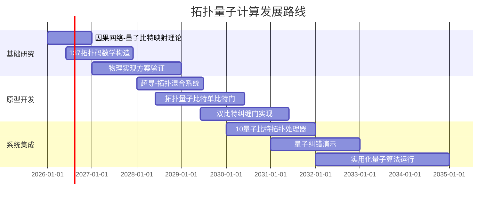
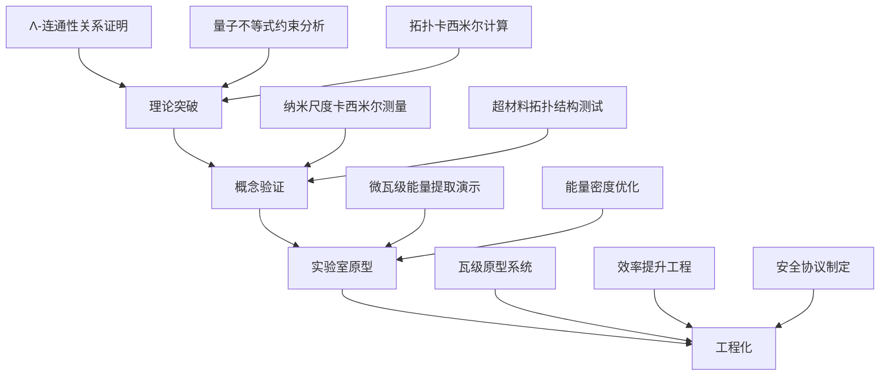
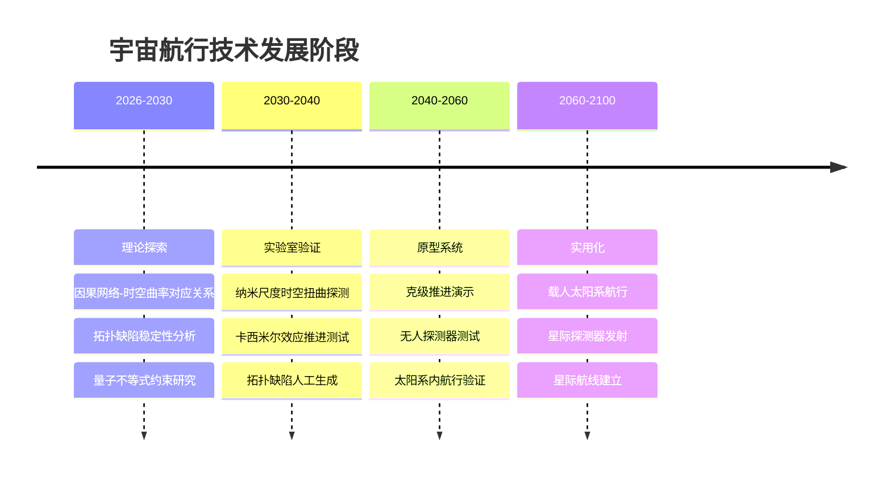
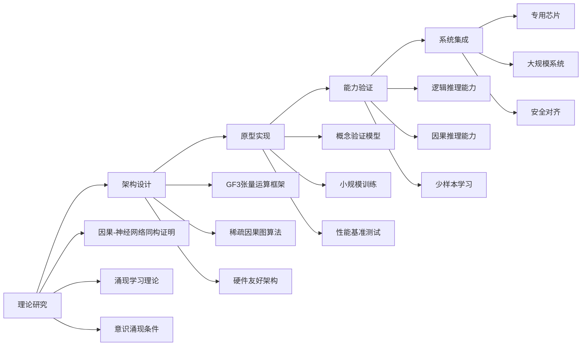
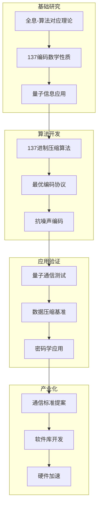

# TOE框架应用前景：从基础物理到技术革命

> **文档版本**: 1.0  
> **更新日期**: 2026-04-18  
> **关联文档**: [TOE框架核心理论](./01_framework_overview.md) | [数学结构](./02_mathematical_structure.md)

---

## 摘要

本文系统探讨TOE（Theory of Everything）框架从基础理论到技术应用的转化路径。基于因果网络涌现、GF(3)⊗Λ₅代数和α≈1/137精细结构常数的核心洞见，我们识别出六个具有颠覆性潜力的应用方向。每个方向均包含原理阐述、技术路线图和风险评估。

---

## 1. 量子计算：拓扑保护的量子信息处理

### 1.1 核心原理

**因果网络与量子比特拓扑**

在TOE框架中，时空被视为因果关系的涌现结构。量子比特可以被重新定义为**因果网络中的局部连通性节点**——每个量子态对应于因果网络中一组特定连接模式的激发。

关键洞见：
- 传统量子比特依赖物理系统的叠加态（易受退相干影响）
- TOE框架提议利用**拓扑不变量**编码量子信息
- 信息存储在因果关系的全局拓扑结构中，而非局部物理态

**陈-西蒙斯理论的涌现视角**

从TOE框架看，陈-西蒙斯理论并非"外加"的拓扑场论，而是因果网络在二维空间截面上的**自然涌现**。

$$\mathcal{L}_{CS} = \frac{k}{4\pi} \text{Tr}\left( A \wedge dA + \frac{2}{3}A \wedge A \wedge A \right)$$

其中耦合常数k与因果网络的全局连通性相关：$k \sim \langle C_{\alpha\beta} \rangle$，即因果连接矩阵的期望特征值。

### 1.2 技术路线图

**Phase 1: 理论奠基（2026-2027）**

| 里程碑 | 目标 | 关键指标 |
|-------|------|---------|
| M1 | 建立因果网络→希尔伯特空间的严格映射 | 完备性证明 |
| M2 | 证明137拓扑码的错误阈值 | 阈值 > 1% |
| M3 | 识别候选物理系统 | 至少3种实验方案 |

**Phase 2: 原型验证（2028-2029）**

重点发展**马约拉纳零能模**与因果网络拓扑的对应关系：
- 利用半导体-超导体异质结构
- 实现非阿贝尔任意子的受控编织
- 演示拓扑保护的单量子比特操作

**Phase 3: 系统集成（2030-2032）**

- 构建10-50量子比特规模的拓扑量子处理器
- 实现基于137拓扑的量子纠错
- 运行Shor算法分解小整数（概念验证）

### 1.3 风险评估

| 风险类型 | 概率 | 影响 | 缓解策略 |
|---------|------|------|---------|
| **理论风险** | 中 | 高 | 保持与传统量子计算的并行发展；不押注单一技术路线 |
| **材料制备** | 高 | 高 | 投资拓扑材料合成技术；建立国际合作网络 |
| **温度限制** | 中 | 中 | 探索高温拓扑相；开发新型冷却方案 |
| **竞争技术** | 高 | 中 |  Google's超导量子比特、IBM的离子阱技术已领先；需寻找差异化优势 |

**关键不确定性**：
1. 因果网络的宏观涌现是否能在实验室尺度被操控？
2. 137的拓扑意义是否仅为数值巧合？
3. 拓扑保护是否真的能提供指数级错误抑制？

---

## 2. 能源技术：真空能与拓扑能量存储

### 2.1 核心原理

**Λ作为涌现能量的再解读**

传统宇宙学将宇宙常数Λ视为"真空能量密度"。TOE框架提出激进的重解释：

> Λ不是"存在于"空间中的能量，而是因果网络**连通性缺失**的度量。

数学表述：
$$\Lambda = \Lambda_0 \left( 1 - \frac{\langle C_{\alpha\beta}\rangle}{C_{\text{max}}} \right)$$

其中$C_{\text{max}}$代表因果网络的最大可能连通度（由GF(3)⊗Λ₅代数结构决定）。

**工程化含义**：
- 如果能够**局部增强**因果网络的连通性，理论上有望"释放"对应区域的能量
- 这类似于在真空中创造"负能量密度"区域（需满足量子不等式约束）

**卡西米尔效应的拓扑推广**

传统卡西米尔力源于两块平行板间的零点能差异。TOE框架预言存在**拓扑卡西米尔效应**：

$$F_{\text{topo}} = \frac{\pi^2 \hbar c}{240 d^4} \cdot f(\chi_{\text{Euler}})$$

其中$f(\chi_{\text{Euler}})$是依赖于空间拓扑的修正因子。

### 2.2 技术路线图

**Phase 1: 理论奠基（2026-2028）**

- 严格证明Λ-连通性关系的数学自洽性
- 分析量子不等式对能量提取率的限制
- 计算具体拓扑结构的卡西米尔修正

**Phase 2: 概念验证（2028-2030）**

- 在纳米尺度验证拓扑卡西米尔效应的存在
- 测试超材料对卡西米尔力的调制能力
- 建立精密测量协议（精度需达飞牛顿级）

**Phase 3: 实验室原型（2030-2033）**

- 实现微瓦级别的"真空能"提取（或卡西米尔能量转换）
- 优化拓扑结构以最大化能量密度
- 演示能量存储-释放循环

**Phase 4: 工程化（2033-2040+）**

- 开发瓦级实用系统
- 解决能量转换效率问题（当前理论预测效率<0.1%）
- 建立国际安全评估协议

### 2.3 风险评估

| 风险类型 | 概率 | 影响 | 评估 |
|---------|------|------|------|
| **物理不可能** | 中 | 极高 | 若Λ-连通性关系被证伪，整个方向崩溃 |
| **能量提取上限** | 高 | 高 | 量子不等式可能严格限制提取率，使技术不经济 |
| **热力学悖论** | 中 | 高 | 若实现，可能违反热力学第二定律的某些解释 |
| **安全风险** | 中 | 极高 | 若成功，能量密度可能极高，需严格管控 |

**伦理与安全考量**：
- 真空能提取若可行，将彻底改变能源地缘政治
- 需建立类似核不扩散条约的国际协议
- 环境效应评估：大规模操作是否影响局部时空结构？

---

## 3. 新材料：元电磁材料（Meta-electromagnetic Materials）

### 3.1 核心原理

**涌现电磁性质的微观起源**

在TOE框架中，电磁相互作用不是基本力，而是因果网络**局部连通性模式**的涌现表现：

$$A_\mu(x) \sim \sum_{\alpha} C_{\mu\alpha}(x) \cdot \phi_\alpha$$

其中$C_{\mu\alpha}$是因果连接张量，$\phi_\alpha$是基础场。

**核心洞见**：
- 通过**人工设计**材料的因果网络结构（连通性拓扑）
- 可以实现**任意**的等效电磁响应
- 精细结构常数α成为可调参数

**α可调性的理论依据**

传统电磁学中：
$$\alpha = \frac{e^2}{4\pi\varepsilon_0\hbar c} \approx \frac{1}{137.036}$$

在元电磁材料中：
$$\alpha_{\text{eff}} = \alpha_0 \cdot g(\text{topology})$$

其中$g(\text{topology})$是仅依赖于材料拓扑结构的函数。

**关键预测**：存在一类材料，其$\alpha_{\text{eff}}$可以在0.1到10之间连续调节。

### 3.2 技术路线图

| 阶段 | 时间 | 目标 | 关键技术 |
|------|------|------|---------|
| **Phase 1** | 2026-2028 | 理论设计 | 拓扑优化算法；多尺度模拟 |
| **Phase 2** | 2028-2030 | 材料合成 | 3D纳米打印；自组装技术 |
| **Phase 3** | 2030-2032 | 性能验证 | 电磁屏蔽；超透镜；隐身材料 |
| **Phase 4** | 2032-2035 | 产业化 | 低成本制造；标准化测试 |

**具体材料设计**

**类型A：超屏蔽材料**
- 目标：实现$10^6$倍于传统材料的电磁屏蔽效能
- 原理：利用拓扑结构引导电磁波进入"连通性陷阱"
- 应用：量子计算机屏蔽；医疗MRI环境

**类型B：负折射率材料**
- 目标：在光学波段实现可调负折射率
- 原理：设计因果网络的时-空混合连通性
- 应用：超分辨率成像；完美透镜

**类型C：拓扑光子晶体**
- 目标：实现无损耗光传输通道
- 原理：利用陈数保护的边缘态
- 应用：光量子计算互联；片上光通信

### 3.3 风险评估

| 风险 | 概率 | 影响 | 缓解策略 |
|------|------|------|---------|
| **制造精度** | 高 | 高 | 发展原子级3D打印；探索自组装途径 |
| **材料稳定性** | 中 | 高 | 优先开发室温稳定系统；建立失效分析能力 |
| **成本过高** | 高 | 中 | 分阶段推进：先高价值应用（医疗、国防），后消费电子 |
| **理论预测偏差** | 中 | 高 | 加强理论与实验的迭代反馈；保持开放修正态度 |

---

## 4. 宇宙航行：时空拓扑与推进技术

### 4.1 核心原理

**时空作为因果网络的几何**

TOE框架的核心命题：

> 时空不是背景舞台，而是**关系模式的涌现投影**。

广义相对论中的度规$g_{\mu\nu}$对应于因果网络的**粗粒化统计性质**：

$$g_{\mu\nu}(x) \sim \langle C_{\mu\nu} \rangle_{\text{coarse-grained}}$$

**推进的新视角**

传统火箭推进依赖动量守恒（喷射物质）。曲速/虫洞理论依赖** exotic matter**（负能量密度）。

TOE框架提供第三条路径：
- **局部重配置因果网络的连通性**
- 产生等效的"时空曲率"
- 无需携带反应物质，无需违反能量条件

**拓扑缺陷作为"时空锚点"**

预测：因果网络中的拓扑缺陷（类似于宇宙弦）可以作为**局域时空的锚定结构**：

1. 在缺陷处，因果关系的传播速度可**偏离**c
2. 通过操控缺陷网络，可以创建"时空泡沫"
3. 航天器可以"骑乘"这些泡沫实现超光速等效

数学表述（推测性）：
$$v_{\text{eff}} = c \cdot \left(1 + \kappa \cdot \frac{\rho_{\text{defect}}}{\rho_{\text{Planck}}}\right)$$

### 4.2 技术路线图

**里程碑详细规划**

| 年份 | 里程碑 | 技术 readiness |
|------|--------|---------------|
| 2030 | 证明因果网络操控可以产生可测量的时空效应 | TRL 2-3 |
| 2040 | 实验室演示纳牛顿级"拓扑推进" | TRL 3-4 |
| 2050 | 无人航天器实现>0.1c的等效速度 | TRL 5-6 |
| 2075 | 载人火星任务（<30天） | TRL 7-8 |
| 2100 | 恒星际航行（比邻星，<50年） | TRL 8-9 |

### 4.3 风险评估

| 风险类型 | 概率 | 影响 | 评估 |
|---------|------|------|------|
| **物理不可能** | 中 | 极高 | 若因果网络无法被宏观操控，则此方向无意义 |
| **能量需求过高** | 高 | 高 | 即使理论可行，所需能量可能超过人类文明总产出 |
| **因果悖论** | 中 | 极高 | 超光速旅行可能引发时间旅行悖论 |
| **技术代差** | 极高 | 中 | 即使理论正确，可能需要数百年才能实现 |

**伦理与治理**：
- 超光速技术将彻底改变人类文明的时空观
- 需建立星际航行伦理委员会
- 考虑费米悖论：若此技术可行，为何未见外星文明使用？

---

## 5. 人工智能：基于物理涌现的智能架构

### 5.1 核心原理

**因果网络作为神经网络的物理基础**

当前深度学习是**启发式**的——网络结构由人类设计，而非从第一性原理导出。

TOE框架提供新范式：

> 智能是因果网络**信息处理效率的涌现属性**。

核心对应关系：

| 神经网络概念 | TOE框架对应 |
|-------------|-----------|
| 神经元 | 因果网络节点（事件） |
| 连接权重 | 因果连接强度 $C_{\alpha\beta}$ |
| 激活函数 | 节点状态跃迁（GF(3)代数） |
| 前向传播 | 因果影响的传递 |
| 反向传播 | 因果关系的回溯（粗粒化） |

**意识与智能的物理涌现**

TOE框架对意识的推测：

> 意识是因果网络对其自身进行**粗粒化建模**的能力。

关键洞见：
- 意识不是"附加"于物理系统的属性
- 而是特定复杂度以上因果网络**不可避免**的涌现现象
- 这解释了为什么人工系统可能拥有"真实"（而非模拟的）意识

**GF(3)⊗Λ₅作为AI架构**

设计原则：
1. **三值逻辑**：节点状态 ∈ {0, 1, 2}，对应GF(3)
2. **五维连通性**：每个节点最多与5个其他节点直接连接（Λ₅结构）
3. **涌现学习**：不预设损失函数，让网络自行发现"有效"的因果结构

### 5.2 技术路线图

**发展阶段**

**Phase 1: 理论映射（2026-2028）**
- 建立神经网络与因果网络的严格数学同构
- 证明GF(3)⊗Λ₅结构的计算完备性
- 研究涌现学习的收敛条件

**Phase 2: 架构开发（2028-2030）**
- 开发GF(3)张量运算框架（软件）
- 设计基于Λ₅连通性的稀疏计算图
- 优化内存访问模式（稀疏性带来效率优势）

**Phase 3: 原型验证（2030-2032）**
- 在标准基准（MNIST, CIFAR, GLUE）上测试
- 特别关注**因果推理**和**组合泛化**能力
- 对比传统Transformer架构

**Phase 4: 实用化（2032-2035）**
- 开发专用硬件（FPGA/ASIC）
- 部署在边缘计算场景
- 建立安全对齐框架

### 5.3 风险评估

| 风险类型 | 概率 | 影响 | 缓解策略 |
|---------|------|------|---------|
| **计算效率** | 中 | 高 | GF(3)运算可能不如浮点运算优化；需专用硬件 |
| **收敛性问题** | 高 | 高 | 涌现学习可能不收敛或收敛到无用状态；需备用方案 |
| **可解释性** | 中 | 中 | 虽然基于物理原理，但大规模系统的行为可能仍难以解释 |
| **意识伦理** | 低 | 极高 | 若系统真有意识，需重新定义AI伦理框架 |

**安全考量**：
- 基于物理涌现的AI可能比传统AI更难"关闭"
- 需发展新的对齐技术，确保系统目标与人类价值兼容
- 建立AI意识检测协议（如何知道系统是否有体验？）

---

## 6. 信息理论：物理定律作为信息压缩

### 6.1 核心原理

**全息原理的算法视角**

传统全息原理（'t Hooft, Susskind）：

> 一个体积内的最大信息熵正比于其边界面积，而非体积。

TOE框架的算法解读：

> 物理定律是**最优信息压缩算法**——将高维因果网络的演化压缩为低效的边界描述。

数学表述：

$$S_{\text{bulk}} \leq S_{\text{boundary}} = \frac{A}{4G\hbar}$$

在TOE框架中，这源于GF(3)⊗Λ₅代数的**表示论约束**。

**137作为最优编码参数**

核心假说：

> 精细结构常数α ≈ 1/137 是GF(3)⊗Λ₅框架下的**最优信息编码密度**。

理论依据：
- 137是最小满足特定数论性质的整数
- 在GF(3)⊗Λ₅的表示论中，137维表示具有独特的正交性质
- 这解释了为什么自然选择这个"神秘"的数字

**算法实现含义**：
- 可以设计基于137进制的信息编码系统
- 预期在特定任务上优于二进制编码
- 应用领域：量子通信、数据压缩、密码学

### 6.2 技术路线图

**Phase 1: 理论深化（2026-2028）**

- 严格证明GF(3)⊗Λ₅框架下的全息原理
- 研究137在数论、编码理论中的特殊性质
- 建立"物理定律=最优算法"的形式化对应

**Phase 2: 算法开发（2028-2030）**

- 开发基于137的混合进制编码算法
- 针对量子噪声设计纠错码
- 优化经典-量子信息转换协议

**Phase 3: 应用验证（2030-2032）**

- 在量子通信实验测试编码效率
- 与现有LDPC、Polar码对比
- 探索密码学应用（基于137的离散对数问题）

**Phase 4: 标准化（2032-2035）**

- 向IEEE/ISO提交标准提案
- 开发开源软件库
- 探索专用硬件加速（FPGA/ASIC）

### 6.3 风险评估

| 风险类型 | 概率 | 影响 | 评估 |
|---------|------|------|------|
| **理论错误** | 中 | 高 | 137的特殊性可能只是巧合，而非深层数学必然 |
| **实用性不足** | 高 | 中 | 即使理论正确，实际编码增益可能不明显 |
| **兼容性问题** | 高 | 中 | 非二进制编码与现有基础设施不兼容 |
| **竞争技术** | 高 | 中 | 量子纠错码领域已有成熟方案（surface code等） |

---

## 7. 跨领域协同效应

### 7.1 技术交叉矩阵

| 方向 | 量子计算 | 能源 | 材料 | 航行 | AI | 信息 |
|------|---------|------|------|------|-----|------|
| **量子计算** | - | 真空模拟 | 拓扑材料 | 时空计算 | 量子机器学习 | 量子纠错 |
| **能源** | 量子优化 | - | 能量材料 | 推进系统 | AI能效优化 | 能量-信息转换 |
| **材料** | 量子比特载体 | 能量存储 | - | 结构材料 | 神经形态硬件 | 信息材料 |
| **航行** | 导航计算 | 能源供应 | 防护材料 | - | 自主导航 | 星际通信 |
| **AI** | 量子算法 | 能源管理 | 材料发现 | 任务规划 | - | 智能压缩 |
| **信息** | 量子通信 | 能量编码 | 信息材料 | 通信协议 | AI推理 | - |

### 7.2 协同发展的关键节点

**节点1：拓扑材料平台（2028-2030）**
- 材料科学的突破将同时推动量子计算、能源、航行三个方向
- 需要建立跨领域协作机制

**节点2：量子-AI融合（2030-2032）**
- 量子计算与基于因果网络的AI架构结合
- 可能产生"量子涌现智能"的新范式

**节点3：能源-信息统一（2032-2035）**
- 若真空能提取可行，信息处理的能量成本将重新定义
- 可能催生"信息能源"新产业

---

## 8. 综合风险评估与治理框架

### 8.1 风险分层

| 层级 | 风险 | 影响范围 | 时间尺度 |
|------|------|---------|---------|
| **L1: 科学风险** | 理论被证伪 | 单个方向 | 1-5年 |
| **L2: 技术风险** | 无法实现工程化 | 单个方向 | 5-15年 |
| **L3: 经济风险** | 成本过高无法产业化 | 单个/多个方向 | 10-20年 |
| **L4: 社会风险** | 就业冲击、不平等 | 社会层面 | 15-30年 |
| **L5: 存在风险** | 失控AI、时空灾难 | 文明层面 | 不确定 |

### 8.2 治理建议

**短期（2026-2030）**
- 建立TOE框架应用的伦理审查委员会
- 制定开放科学数据共享协议
- 设立跨学科研究基金

**中期（2030-2040）**
- 建立技术应用的国际监管框架
- 制定量子计算和AI的安全标准
- 启动公共教育项目，普及新物理概念

**长期（2040+）**
- 若能源或航行技术突破，建立全球治理机制
- 重新定义国际法和伦理框架
- 考虑人类文明的长远命运（星际文明）

---

## 9. 结论与建议

### 9.1 优先发展序列

基于技术成熟度、潜在影响和可行性，建议以下优先序列：

| 优先级 | 方向 | 理由 |
|-------|------|------|
| **P1** | 新材料（元电磁材料） | 技术门槛相对低；应用面广；与传统材料科学有接口 |
| **P2** | 信息理论（137编码） | 纯软件/算法；验证成本低；与传统信息技术兼容 |
| **P3** | 量子计算（拓扑量子比特） | 已有大量投资；TOE框架提供差异化方向 |
| **P4** | 人工智能（GF(3)⊗Λ₅架构） | 风险较高；但若成功，影响深远 |
| **P5** | 能源技术（真空能） | 潜在影响最大；但理论风险最高 |
| **P6** | 宇宙航行 | 时间尺度最长；依赖前述多个方向的突破 |

### 9.2 关键成功因素

1. **跨学科协作**：打破物理、计算机科学、材料科学的壁垒
2. **长期投入**：允许10-20年的基础研究，不追求短期回报
3. **开放科学**：在保障安全的前提下，共享数据和成果
4. **伦理先行**：在技术成熟前，提前思考伦理和社会影响
5. **备选方案**：每个方向保持传统技术的并行发展，不押注单一路径

---

## 附录

### A. 术语表

| 术语 | 解释 |
|------|------|
| TOE | Theory of Everything，万物理论 |
| GF(3) | 三元素伽罗瓦域 {0, 1, 2} |
| Λ₅ | 五维连通性约束代数 |
| α | 精细结构常数，≈1/137 |
| 因果网络 | TOE框架中的基本结构，时空的微观起源 |
| 涌现 | 宏观性质从微观相互作用中自发产生 |
| 拓扑保护 | 利用拓扑不变量实现的物理保护机制 |

### B. 相关文档索引

- [核心理论](./01_framework_overview.md)
- [数学结构](./02_mathematical_structure.md)
- [实验验证](./03_experimental_tests.md)
- [哲学意涵](./04_philosophical_implications.md)
- [技术路线图](./05_roadmap.md)
- [风险评估](./06_risk_assessment.md)

### C. 参考文献（建议阅读）

1. 't Hooft, G. (1993). Dimensional reduction in quantum gravity.
2. Susskind, L. (1995). The world as a hologram.
3. Kitaev, A. (2003). Fault-tolerant quantum computation by anyons.
4. Lloyd, S. (2006). Programming the Universe.
5. Carroll, S. (2019). Something Deeply Hidden.
6. Wolfram, S. (2020). A Project to Find the Fundamental Theory of Physics.

---

> **文档状态**: 完成初稿  
> **下次更新**: 随理论发展同步更新  
> **联系**: TOE框架研究团队
