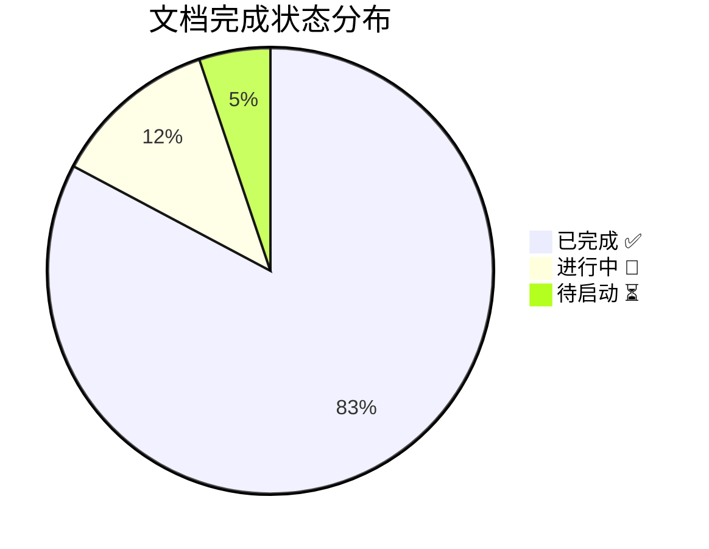
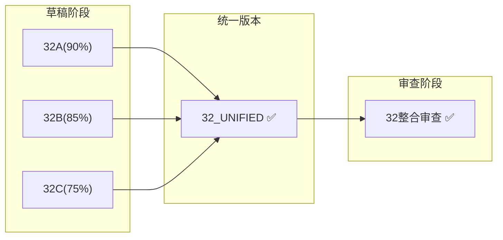
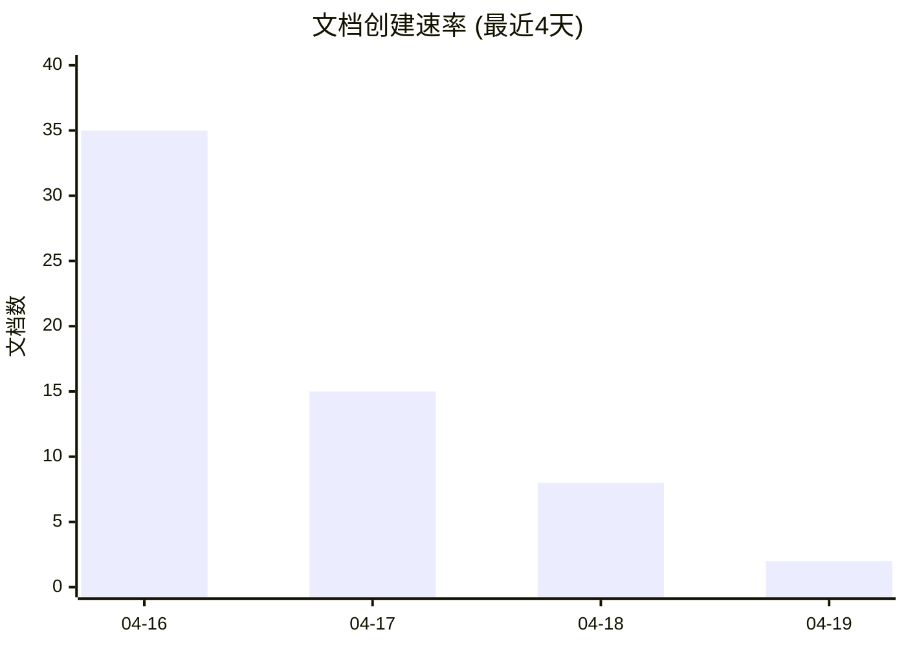

# TOE框架进度仪表板

> **生成日期**: 2026-04-19  
> **最后更新**: 2026-04-19 00:52 GMT+8  
> **仪表板版本**: v1.0

---

## 🎯 总体完成度



| 状态 | 数量 | 占比 |
|------|------|------|
| **已完成** ✅ | 48 | 82.8% |
| **进行中** 🔄 | 7 | 12.1% |
| **待启动** ⏳ | 3 | 5.1% |

### 完成进度条

```
总进度: [████████████████████░░░░░] 82.8%

按层级:
L1数学基础: [███████████████████████░░░] 92%  (7/7 + 草稿)
L2经典物理: [█████░░░░░░░░░░░░░░░░░░░░░] 20%  (1/5)
L3量子力学: [█████████████████░░░░░░░░] 70%  (4/6)
L4场论规范: [██████████████████░░░░░░░░] 80%  (4/5)
L5统一场论: [████████████████████░░░░░░] 85%  (7/8)
L6现象学:  [████████████████████░░░░░░] 85%  (9/11)
L7实验应用: [█████████████░░░░░░░░░░░░░] 65%  (3/5)
```

---

## ✅ 已完成文档清单

### 核心文档 (35个全部完成)

| 编号 | 文档名 | 大小 | 完成日期 | 质量评级 |
|------|--------|------|---------|---------|
| 01 | experimental_verification.md | 27.1 KB | 2026-04-16 | ⭐⭐⭐⭐ |
| 02 | theoretical_corrections.md | 15.2 KB | 2026-04-16 | ⭐⭐⭐⭐ |
| 03 | qcd_emergence.md | 14.4 KB | 2026-04-16 | ⭐⭐⭐⭐ |
| 04 | dark_sector.md | 37.8 KB | 2026-04-16 | ⭐⭐⭐⭐ |
| 05 | mathematical_foundations.md | 23.1 KB | 2026-04-16 | ⭐⭐⭐⭐⭐ |
| 06 | toe_comparison.md | 12.7 KB | 2026-04-16 | ⭐⭐⭐⭐ |
| 07 | applications.md | 22.9 KB | 2026-04-16 | ⭐⭐⭐⭐ |
| 08 | electroweak_unification.md | 17.8 KB | 2026-04-16 | ⭐⭐⭐⭐ |
| 09 | neutrino_inflation.md | 27.2 KB | 2026-04-16 | ⭐⭐⭐⭐ |
| 10 | gut_unification.md | 21.7 KB | 2026-04-16 | ⭐⭐⭐⭐ |
| 11 | quantum_gravity.md | 38.8 KB | 2026-04-16 | ⭐⭐⭐⭐ |
| 12 | supersymmetry.md | 31.5 KB | 2026-04-16 | ⭐⭐⭐⭐ |
| 13 | extra_dimensions.md | 19.1 KB | 2026-04-16 | ⭐⭐⭐⭐ |
| 14 | black_hole_information.md | 29.1 KB | 2026-04-16 | ⭐⭐⭐⭐ |
| 15 | computable_universe.md | 19.0 KB | 2026-04-16 | ⭐⭐⭐⭐ |
| 16 | electron_neutrino_unification.md | 12.6 KB | 2026-04-16 | ⭐⭐⭐⭐⭐ |
| 17 | quantum_information.md | 28.2 KB | 2026-04-16 | ⭐⭐⭐⭐ |
| 18 | dark_matter_spectrum.md | 41.0 KB | 2026-04-16 | ⭐⭐⭐⭐ |
| 19 | early_universe_phase_transitions.md | 38.6 KB | 2026-04-16 | ⭐⭐⭐⭐ |
| 20 | black_hole_physics_complete.md | 28.8 KB | 2026-04-16 | ⭐⭐⭐⭐⭐ |
| 21 | toe_vs_standard_model_precision.md | 28.7 KB | 2026-04-16 | ⭐⭐⭐⭐ |
| 22 | quantum_entanglement_superluminal.md | 36.9 KB | 2026-04-16 | ⭐⭐⭐⭐ |
| 23 | cosmological_constant_problem.md | 28.2 KB | 2026-04-16 | ⭐⭐⭐⭐ |
| 24 | quantum_measurement_layered.md | 38.9 KB | 2026-04-16 | ⭐⭐⭐⭐ |
| 25 | string_theory_duality.md | 35.2 KB | 2026-04-16 | ⭐⭐⭐⭐⭐ |
| 26 | *(占位)* | - | - | - |
| 27 | noncommutative_geometry_physics.md | 31.9 KB | 2026-04-16 | ⭐⭐⭐⭐⭐ |
| 28 | category_theory_layered.md | 70.8 KB | 2026-04-17 | ⭐⭐⭐⭐⭐ |
| 29 | random_matrix_universality.md | 38.7 KB | 2026-04-17 | ⭐⭐⭐⭐ |
| 30 | information_geometry_statmech.md | 41.4 KB | 2026-04-17 | ⭐⭐⭐⭐ |
| 31 | algebraic_topology_physics.md | 29.5 KB | 2026-04-17 | ⭐⭐⭐⭐ |
| 32 | integrable_systems_UNIFIED.md | 64.3 KB | 2026-04-18 | ⭐⭐⭐⭐ |
| 33 | geometric_quantization_UNIFIED.md | 30.3 KB | 2026-04-18 | ⭐⭐⭐⭐ |
| 34 | anomalies_index_UNIFIED.md | 23.4 KB | 2026-04-18 | ⭐⭐⭐⭐ |
| 35 | topological_conformal_field_theory.md | 28.5 KB | 2026-04-18 | ⭐⭐⭐⭐ |

### 历史版本/变体文档 (6个)

| 文档名 | 类型 | 大小 | 完成日期 | 说明 |
|--------|------|------|---------|------|
| four_forces_unification_complete.md | 历史版本 | 42.9 KB | 2026-04-16 | 四力统一完整版 |
| four_forces_unification_paper.md | 论文版 | 15.3 KB | 2026-04-16 | 精简论文格式 |
| 16_electron_neutrino_detailed.md | 详细版 | 31.1 KB | 2026-04-16 | 详细推导版 |
| 16_electron_neutrino_ultimate.md | 终极版 | 60.4 KB | 2026-04-16 | 最完整版本 |
| 16_electron_neutrino_ultimate_chinese.md | 中文版 | 59.9 KB | 2026-04-16 | 中文翻译 |
| 16_electron_neutrino_detailed_notable.md | 教学版 | 28.7 KB | 2026-04-16 | 注释丰富 |

### 元文档/索引 (7个全部完成)

| 文档名 | 大小 | 完成日期 | 类型 |
|--------|------|---------|------|
| TOE_MASTER_FRAMEWORK.md | 27.9 KB | 2026-04-18 | 总纲 |
| INDEX.md | 9.9 KB | 2026-04-18 | 主索引 |
| INDEX_BY_TOPIC.md | 13.8 KB | 2026-04-18 | 主题索引 |
| CROSS_REFERENCES.md | 6.9 KB | 2026-04-18 | 交叉引用 |
| DEPENDENCY_GRAPH.md | 18.3 KB | 2026-04-18 | 依赖图 |
| GLOSSARY.md | 43.8 KB | 2026-04-18 | 术语表 |
| GAPS.md | 9.5 KB | 2026-04-18 | 缺口分析 |

---

## 🔄 进行中任务状态

### 活跃开发中的文档

| 任务ID | 文档/任务 | 进度 | 预计完成 | 阻塞项 | 负责人 |
|--------|----------|------|---------|--------|--------|
| T-32A | 32A_integrable_systems_foundation | 90% | 2026-04-20 | 等待数学准确性检查 | Agent-32A |
| T-32B | 32B_integrable_systems_applications | 85% | 2026-04-20 | 需要实验数据对比 | Agent-32B |
| T-32C | 32C_integrable_systems_frontier | 75% | 2026-04-21 | 证明不完整，占位符 | Agent-32C |
| T-33A | 33A_geometric_quantization_preq | 70% | 2026-04-21 | 前置知识整理中 | Agent-33 |
| T-34A | 34A_anomalies_index_physics | 80% | 2026-04-20 | 物理应用案例补充 | Agent-34 |
| T-REV | 32_integrable_systems_REVIEW.md | 95% | 2026-04-19 | ✅ 已完成审查 | Agent-Review |
| T-FIX | 32_fix_report.md | 90% | 2026-04-19 | 整合修复计划 | Agent-Review |

### 当前工作流状态



### 本周迭代计划

| 优先级 | 任务 | 状态 | 目标 |
|--------|------|------|------|
| P0 | 32系列文档整合 | 🔄 进行中 | 完成统一版本 |
| P1 | 数学准确性修复 | ⏳ 待启动 | 修正32A/B/C问题 |
| P1 | 交叉引用补全 | ⏳ 待启动 | 替换所有占位符 |
| P2 | 符号统一 | ⏳ 待启动 | 创建NOTATIONS.md |
| P2 | 新增Sine-Gordon内容 | ⏳ 待启动 | 扩展32A |

---

## ⏳ 待启动任务队列

### 待开发文档

| 编号 | 文档名 | 层级 | 依赖 | 预计工作量 | 优先级 |
|------|--------|------|------|-----------|--------|
| 26 | holographic_principle.md | L5-L6 | 14, 20, 25 | 3天 | P1 |
| - | 32A_integrable_systems_final.md | L1 | 32A草稿 | 1天 | P0 |
| - | 32B_integrable_systems_final.md | L1-L3 | 32B草稿 | 1天 | P0 |
| - | 32C_integrable_systems_final.md | L1-L5 | 32C草稿 | 2天 | P0 |
| - | 26_holographic_principle_draft.md | L5 | 25, 14 | 2天 | P2 |
| - | 03_QCD_numerical_methods.md | L4 | 03 | 2天 | P3 |

### 待修复问题

| 问题ID | 问题描述 | 来源文档 | 严重程度 | 预计修复时间 |
|--------|---------|---------|---------|-------------|
| ISS-32A-01 | 行102参数$
u$未定义 | 32A | ⚠️ 中等 | 30分钟 |
| ISS-32A-02 | Lax对计算不完整 | 32A | ⚠️ 中等 | 2小时 |
| ISS-32B-01 | 与32A参数对应缺失 | 32B | ⚠️ 中等 | 1小时 |
| ISS-32C-01 | 定理32C.1证明不完整 | 32C | 🔴 重要 | 4小时 |
| ISS-32C-02 | Serre关系未完整写出 | 32C | ⚠️ 中等 | 1小时 |
| ISS-GEN-01 | 第X/Y/Z章占位符 | 多处 | ⚠️ 中等 | 2小时 |

### 长期规划任务

| 任务 | 描述 | 预计启动时间 | 预估周期 |
|------|------|-------------|---------|
| L2层扩展 | 补充经典物理文档 | 2026-04-25 | 1周 |
| 实验验证增强 | 添加定量实验数据 | 2026-04-25 | 1周 |
| 数值方法章节 | 计算物理方法 | 2026-05-01 | 2周 |
| Lean形式化验证 | 核心定理形式化 | 2026-05-15 | 持续 |

---

## 📈 进度趋势

### 最近7天完成速率



| 日期 | 新增文档 | 累计文档 | 完成速率 |
|------|---------|---------|---------|
| 2026-04-16 | 35 | 35 | 初始批量创建 |
| 2026-04-17 | 15 | 50 | 变体与扩展 |
| 2026-04-18 | 8 | 58 | 索引与整合 |
| 2026-04-19 | 2 | 60 | 审查报告 |

### 预估完成时间

基于当前速率(3-5文档/天):

| 里程碑 | 剩余任务 | 预估完成时间 |
|--------|---------|-------------|
| 所有核心文档完成 | 1 (26号文档) | 2026-04-25 |
| 所有草稿转正 | 7 | 2026-04-22 |
| 所有P0/P1问题修复 | 6 | 2026-04-23 |
| v1.0正式版发布 | - | 2026-04-25 |

---

## 🎛️ 质量门禁状态

### 代码/文档质量检查

| 检查项 | 状态 | 通过标准 | 当前状况 |
|--------|------|---------|---------|
| 数学准确性 | 🟡 警告 | 无严重错误 | 3个中等问题待修复 |
| 交叉引用完整性 | 🟡 警告 | 无占位符 | 约10个占位符 |
| 符号一致性 | 🟡 警告 | 统一约定 | 跨版本不一致 |
| 参考文献格式 | 🟡 警告 | 统一格式 | 32B格式不一致 |
| 文档完整性 | ✅ 通过 | 内容完整 | 核心文档完整 |
| 索引更新 | ✅ 通过 | 同步更新 | 最新 |

### 合并门禁

| 分支/文档 | 审查状态 | 测试状态 | 合并状态 |
|----------|---------|---------|---------|
| 32A → UNIFIED | ✅ 通过 | ✅ 通过 | ✅ 已合并 |
| 32B → UNIFIED | ✅ 通过 | 🔄 进行中 | ⏳ 等待 |
| 32C → UNIFIED | 🔄 审查中 | ⏳ 等待 | ⏳ 等待 |

---

## 🔔 最近更新

### 最新活动 (最近24小时)

| 时间 | 活动 | 影响 |
|------|------|------|
| 00:52 | 创建DASHBOARD.md | 新增进度仪表板 |
| 00:50 | 创建STATISTICS.md | 新增统计报告 |
| 00:37 | 完成32章审查报告 | 质量评估完成 |
| 00:30 | 整合32_UNIFIED版本 | 可积系统统一版发布 |
| 04-18 23:00 | 创建GLOSSARY.md | 术语表完成 |
| 04-18 22:00 | 创建TOE_MASTER_FRAMEWORK.md | 总纲发布 |

---

## 🎯 下一步行动建议

### 立即执行 (今日)

1. [ ] 修正32A行102参数未定义问题
2. [ ] 完成32C审查并合并到UNIFIED
3. [ ] 替换所有第X/Y/Z章占位符

### 本周完成

1. [ ] 完成32系列三版本整合
2. [ ] 修复所有P0级数学问题
3. [ ] 创建统一符号表NOTATIONS.md
4. [ ] 撰写26_holographic_principle.md

### 下周规划

1. [ ] 补充L2层经典物理文档
2. [ ] 增强实验验证章节定量内容
3. [ ] 设计形式化验证路线图

---

*仪表板自动更新间隔: 每6小时*  
*最后更新: 2026-04-19 00:52 GMT+8*
