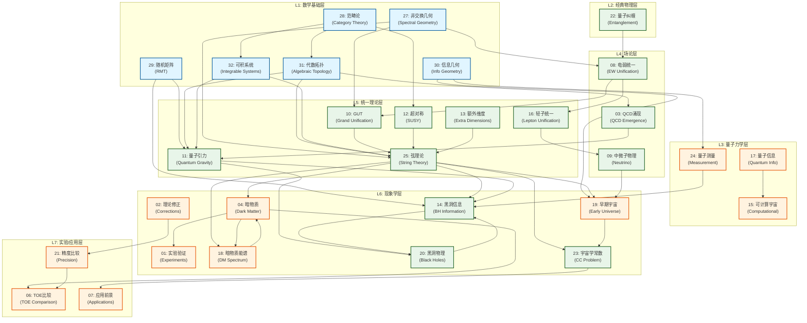
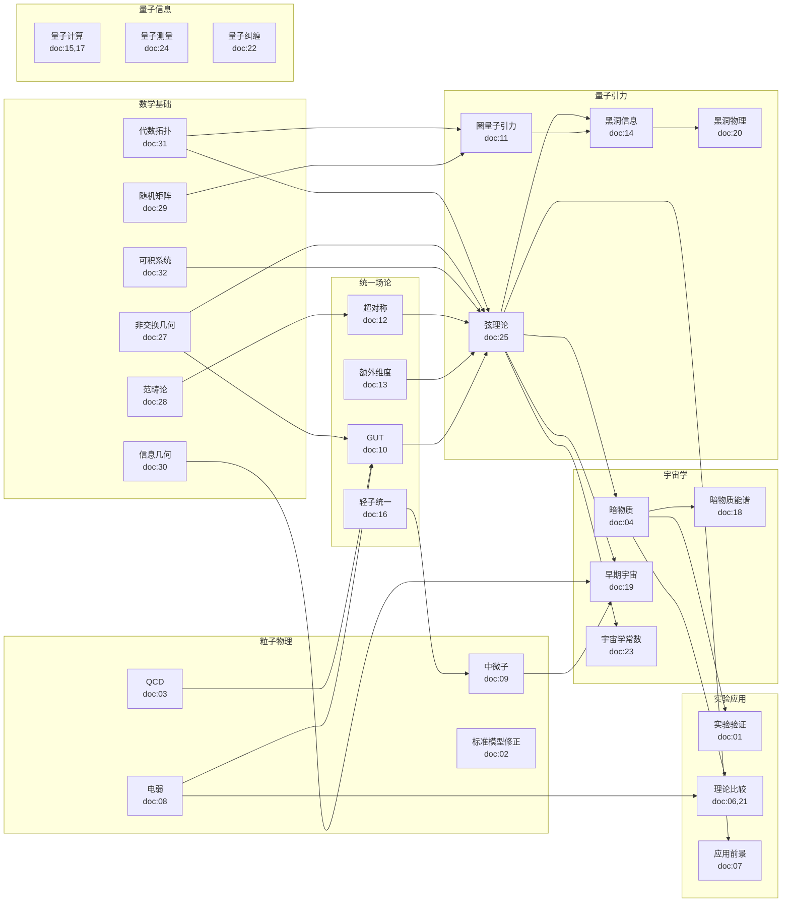
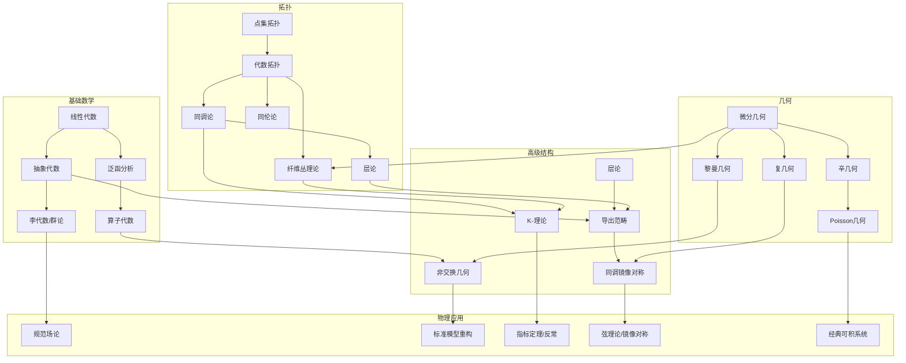
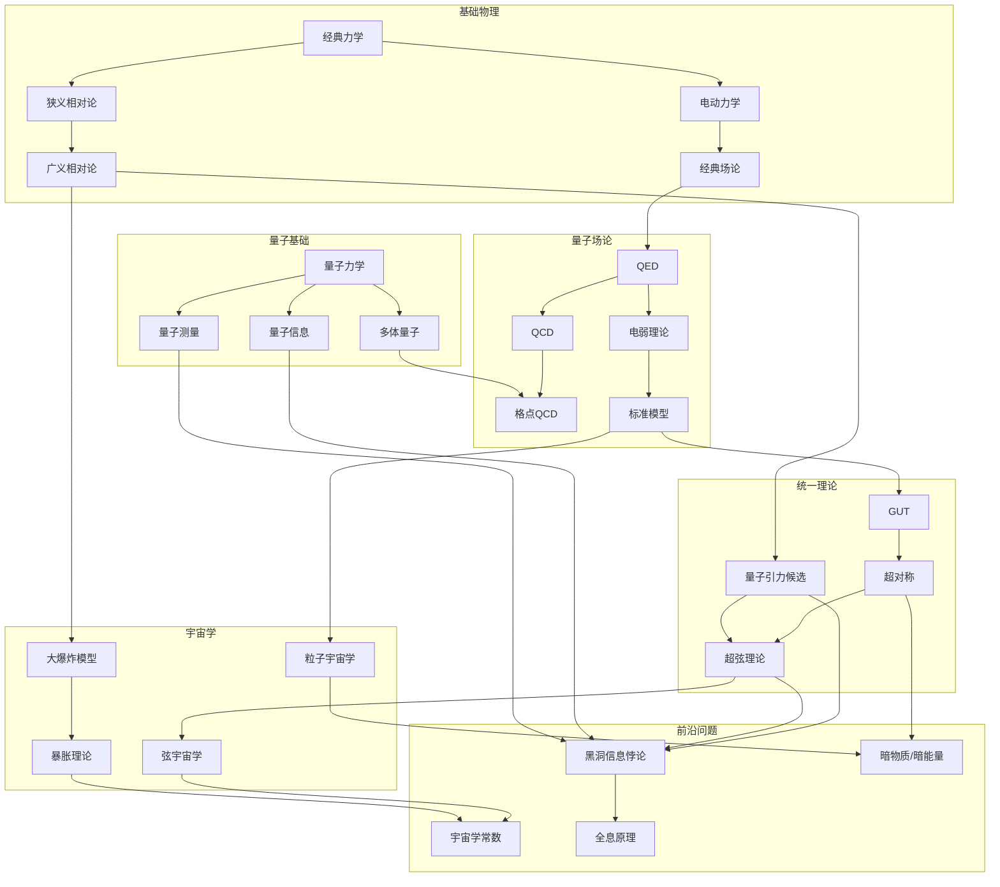
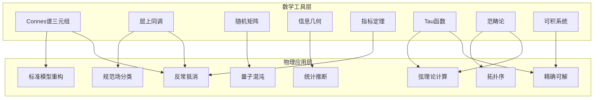
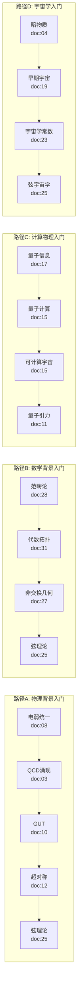
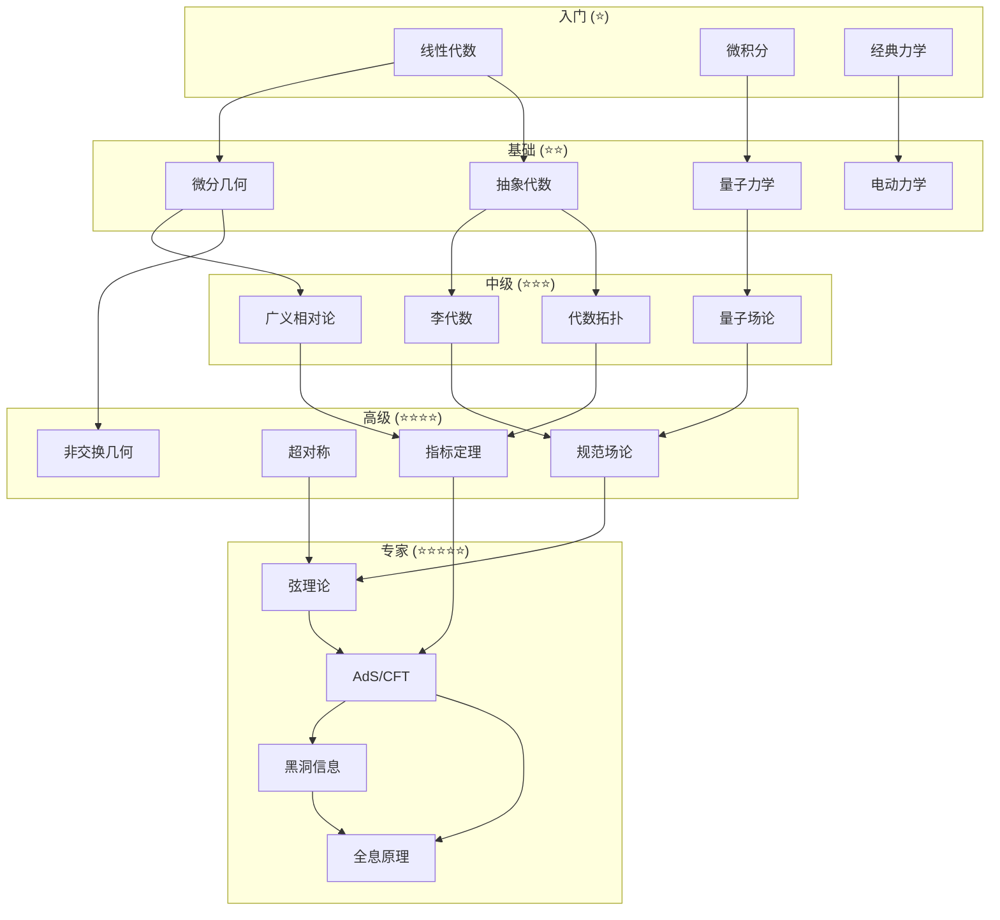

# TOE框架知识依赖图
# Knowledge Dependency Graph for TOE Framework

## 版本信息
- **版本**: v1.0
- **创建日期**: 2026年4月19日
- **涵盖文档**: 32+核心文档

---

## 目录

1. [文档依赖关系图](#1-文档依赖关系图)
2. [主题依赖关系图](#2-主题依赖关系图)
3. [数学工具→物理应用映射](#3-数学工具物理应用映射)
4. [学习路径图](#4-学习路径图)
5. [依赖矩阵](#5-依赖矩阵)

---

## 1. 文档依赖关系图

### 1.1 完整依赖图（Mermaid语法）

### 1.2 按主题的文档聚类

---

## 2. 主题依赖关系图

### 2.1 数学主题依赖

### 2.2 物理主题依赖

---

## 3. 数学工具→物理应用映射

### 3.1 详细映射表

| 数学工具 | 来源文档 | 核心概念 | 物理应用 | 目标文档 | 应用方式 |
|---------|---------|---------|---------|---------|---------|
| **Connes谱三元组** | doc:27 | $(\mathcal{A}, \mathcal{H}, \mathcal{D})$ | 标准模型重构 | doc:08, doc:10 | 从纯几何导出粒子物理拉氏量 |
| | | 谱作用 $S_\Lambda = \text{Tr}(f(\mathcal{D}^2/\Lambda^2))$ | 希格斯质量预测 | doc:27 | 非微扰质量公式 |
| | | 非交换时空 | 普朗克尺度物理 | doc:11 | 时空量子化 |
| **层上同调** | doc:28, doc:31 | $H^n(X, \mathcal{F})$ | 规范场分类 | doc:03, doc:25 | 瞬子分类、障碍类 |
| | | Čech上同调 | 规范变换相容性 | doc:31 | 拓扑荷量化 |
| | | 导出函子 | 反常抵消 | doc:31 | 指标定理应用 |
| **随机矩阵** | doc:29 | Wigner半圆律 | 量子混沌诊断 | doc:11, doc:14 | 能级统计、谱刚性 |
| | | Tracy-Widom分布 | 界面涨落 | doc:29 | KPZ普适类 |
| | | 行列式点过程 | 量子点谱 | doc:29 | 介观物理 |
| **信息几何** | doc:30 | Fisher度规 $g_{ij}$ | 统计推断优化 | doc:19, doc:24 | Cramér-Rao界、自然梯度 |
| | | KL散度 | 变分推断 | doc:30 | 后验近似 |
| | | 量子Fisher信息 | 量子计量 | doc:30 | 参数估计极限 |
| **指标定理** | doc:31 | Atiyah-Singer | 反常抵消 | doc:03, doc:12 | 手征反常、引力反常 |
| | | 热核证明 | 局域指标 | doc:31 | 有效作用计算 |
| | | 特征类 | 拓扑量子数 | doc:31 | 陈数、Pontryagin数 |
| **Tau函数** | doc:32 | KP层次 | 弦理论配分函数 | doc:25 | 矩阵模型-弦对偶 |
| | | Sato理论 | Virasoro约束 | doc:25 | 弦景观计算 |
| | | Plücker坐标 | 可解模型 | doc:32 | 精确散射振幅 |
| **范畴论** | doc:28 | 张量范畴 | 拓扑序 | doc:28 | 任意子统计 |
| | | 编织范畴 | 量子群 | doc:28 | 纽结不变量 |
| | | 导出范畴 | 镜像对称 | doc:25 | D-膜分类 |
| **可积系统** | doc:32 | Lax对 | 精确可解模型 | doc:11 | 二维引力 |
| | | 逆散射 | 非微扰解 | doc:32 | 孤子解 |
| | | Riemann-Hilbert | 关联函数 | doc:32 | 形式因子 |

### 3.2 工具-应用网络图

---

## 4. 学习路径图

### 4.1 入门路径

### 4.2 进阶路径

### 4.3 专家专题路径

---

## 5. 依赖矩阵

### 5.1 文档依赖矩阵（部分）

| 文档 | 依赖文档 | 被依赖文档 | 核心依赖类型 |
|-----|---------|-----------|------------|
| **doc:27 (非交换几何)** | - | 08, 10, 25 | 被物理应用依赖 |
| **doc:28 (范畴论)** | - | 12, 25, 31, 32 | 被TQFT/弦理论依赖 |
| **doc:29 (随机矩阵)** | - | 11, 14 | 被量子混沌依赖 |
| **doc:30 (信息几何)** | - | 19, 24 | 被统计方法依赖 |
| **doc:31 (代数拓扑)** | 28 | 03, 11, 25 | 被指标定理/反常依赖 |
| **doc:32 (可积系统)** | 28 | 11, 25 | 被弦理论计算依赖 |
| **doc:03 (QCD)** | 31 | - | 依赖指标定理/反常 |
| **doc:08 (电弱)** | 27 | 10, 16 | 依赖非交换几何 |
| **doc:10 (GUT)** | 08, 27 | 25 | 依赖电弱+非交换几何 |
| **doc:11 (量子引力)** | 29, 31, 32 | 14, 20 | 依赖随机矩阵+拓扑+可积系统 |
| **doc:12 (SUSY)** | 28 | 25 | 依赖范畴论 |
| **doc:14 (黑洞信息)** | 11, 25, 29 | 20 | 依赖量子引力+弦理论+随机矩阵 |
| **doc:25 (弦理论)** | 10, 12, 13, 27, 28, 31, 32 | 14, 23, 04, 18, 19 | 依赖GUT+SUSY+维度+数学工具 |
| **doc:19 (早期宇宙)** | 30 | 23 | 依赖信息几何 |
| **doc:23 (宇宙学常数)** | 19, 25 | 07 | 依赖早期宇宙+弦理论 |

### 5.2 主题依赖矩阵

| 主题 | 前置主题 | 后继主题 | 难度等级 |
|-----|---------|---------|---------|
| **线性代数** | - | 抽象代数、微分几何 | ⭐ |
| **微分几何** | 线性代数 | 黎曼几何、广义相对论 | ⭐⭐ |
| **抽象代数** | 线性代数 | 李代数、范畴论 | ⭐⭐ |
| **泛函分析** | 分析学 | 算子代数、量子力学 | ⭐⭐ |
| **李代数/群论** | 抽象代数 | 规范场论、GUT | ⭐⭐⭐ |
| **代数拓扑** | 点集拓扑 | 指标定理、弦理论 | ⭐⭐⭐ |
| **范畴论** | 抽象代数 | 导出范畴、TQFT | ⭐⭐⭐ |
| **非交换几何** | 泛函分析、微分几何 | 标准模型重构 | ⭐⭐⭐⭐ |
| **指标定理** | 代数拓扑、分析学 | 反常理论 | ⭐⭐⭐⭐ |
| **弦理论** | 量子场论、微分几何 | 全息原理 | ⭐⭐⭐⭐⭐ |
| **AdS/CFT** | 弦理论、CFT | 黑洞信息 | ⭐⭐⭐⭐⭐ |

### 5.3 学习难度依赖图

---

## 附录：依赖图使用指南

### A.1 如何阅读依赖图

1. **箭头方向**: 从依赖指向被依赖（即：要理解目标，需要先理解源）
2. **颜色编码**:
   - 蓝色系: 数学基础文档
   - 绿色系: 核心理论文档
   - 橙色系: 现象学/实验文档
3. **层级结构**: L1 → L2 → L3 → L4 → L5 → L6 → L7

### A.2 如何选择学习路径

1. **确定目标**: 明确你想深入研究的专题
2. **追踪依赖**: 从目标文档反向追踪所有依赖
3. **并行学习**: 同层级文档可以并行学习
4. **验证理解**: 通过交叉引用验证理解深度

### A.3 依赖强度说明

| 强度 | 符号 | 含义 |
|-----|-----|-----|
| 强依赖 | → | 必须理解前置内容 |
| 弱依赖 | ⇢ | 有帮助但非必需 |
| 双向 | ↔ | 相互依赖、可以互证 |

---

*本文档为TOE框架的知识依赖图，用于导航32+核心文档之间的学习和依赖关系。*

*版本: v1.0 | 最后更新: 2026-04-19*
