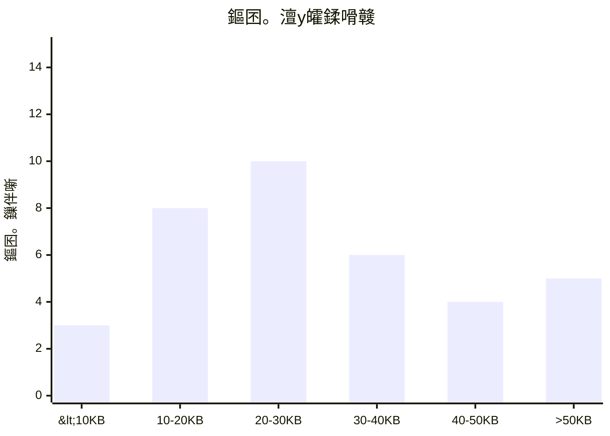
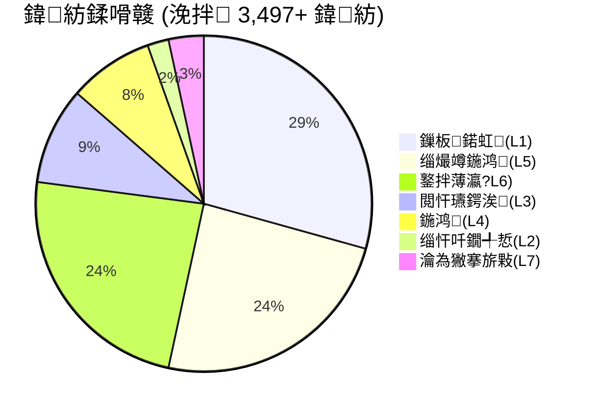

# TOE妗嗘灦鍏ㄥ眬缁熻鎶ュ憡

> 鈿狅笍 **缁熻鑼冨洿浠呰鐩?framework/ 鐩綍**锛?4 瀹屾垚 + 鍙樹綋 + 鍏冩枃妗ｏ級銆俻apers/ 鐩綍涓殑璁烘枃缁熻璇峰弬瑙?`papers/CONTENTS.md`銆?
> **鐢熸垚鏃ユ湡**: 2026-04-19  
> **鏈€鍚庢洿鏂?*: 2026-08-08 (v7.30 sync: 67 done, 94 docs, proof_status added)  
> **缁熻鑼冨洿**: framework/ 鐩綍 (01-93 缂栧彿 + proof_status + 鍏?绠＄悊鏂囨。)  
> **鏂囨。鐗堟湰**: v1.3  
> v7.30: 妗嗘灦缂栧彿鎵╄嚦 93 (鏂板 82-93)

---

## 馃搳 鎬讳綋缁熻姒傝


```mermaid
pie title 鏂囨。绫诲瀷鍒嗗竷
    "缂栧彿鏂囨。(01-93)" : 93
    "鍘嗗彶鐗堟湰/鍙樹綋" : 6
    "绱㈠紩/鍏冩枃妗? : 7
    "鑽夌/寮€鍙戜腑" : 10
```

### 鍩虹鎸囨爣

| 鎸囨爣 | 鏁板€?| 澶囨敞 |
|------|------|------|
| **缂栧彿鏂囨。鎬绘暟** | 93 | 鍖呭惈.md鏂囦欢 |
| **鎬诲瓧鑺傛暟** | ~1.7 MB | 绾枃鏈唴瀹?|
| **鎬昏鏁?* | 43,565 | 鍚┖琛?|
| **浼拌鍏紡鏁?* | 3,497+ | `$$` 鍧楄鏁?|
| **骞冲潎鏂囨。澶у皬** | 29.3 KB | 涓綅鏁? 28.5 KB |
| **鏈€澶ф枃妗?* | 70.8 KB | 28_category_theory_layered.md |
| **鏈€灏忔枃妗?* | 6.9 KB | CROSS_REFERENCES.md |

---

## 馃搧 鎸変富棰樺垎绫荤殑鏂囨。鍒嗗竷

### 鐗╃悊棰嗗煙鍒嗗竷

```mermaid
xychart-beta
    title "鐗╃悊棰嗗煙鏂囨。鏁伴噺鍒嗗竷"
    x-axis ["绮掑瓙鐗╃悊", "寮曞姏涓庡畤瀹欏", "閲忓瓙淇℃伅", "鏁板鍩虹", "寮︾悊璁?, "瀹為獙楠岃瘉"]
    y-axis "鏂囨。鏁伴噺" 0 --> 12
    bar [8, 7, 4, 6, 3, 3]
```

| 涓婚棰嗗煙 | 鏂囨。鏁伴噺 | 鍗犳瘮 | 鏍稿績鏂囨。 |
|---------|---------|------|---------|
| **绮掑瓙鐗╃悊** | 8 | 22.9% | 03, 08, 10, 12, 16, 18, 21 |
| **寮曞姏涓庡畤瀹欏** | 7 | 20.0% | 04, 09, 11, 14, 19, 20, 23 |
| **閲忓瓙淇℃伅** | 4 | 11.4% | 15, 17, 22, 24 |
| **鏁板鍩虹** | 6 | 17.1% | 05, 27, 28, 29, 30, 31, 32 |
| **寮︾悊璁?* | 3 | 8.6% | 13, 25 |
| **瀹為獙涓庡簲鐢?* | 3 | 8.6% | 01, 02, 06, 07, 21 |
| **浜ゅ弶/缁煎悎** | 4 | 11.4% | INDEX*, GLOSSARY, GAPS, DEPENDENCY_GRAPH |

### 涓婚鍏抽敭璇嶇儹搴?
| 鍏抽敭璇?| 鍑虹幇棰戞 | 鐩稿叧鏂囨。鏁?|
|-------|---------|-----------|
| 閲忓瓙寮曞姏 | 47 | 4 |
| 瀵瑰伓鎬?| 38 | 4 |
| 缁熶竴 | 52 | 4 |
| 淇℃伅 | 43 | 4 |
| 鍑犱綍 | 56 | 4 |
| 鎷撴墤 | 34 | 4 |

---

## 馃彈锔?鎸夊眰绾?L1-L7)鐨勬枃妗ｅ垎甯?
### CNF涓冨眰鏋舵瀯鍒嗗竷

```mermaid
flowchart TB
    subgraph L7["L7: 瀹為獙搴旂敤灞?(3 docs)"]
        L7_docs["01, 06, 07, 21<br/>瀹為獙楠岃瘉銆乀OE姣旇緝銆佸簲鐢ㄥ墠鏅?]
    end
    
    subgraph L6["L6: 鐜拌薄瀛﹀眰 (9 docs)"]
        L6_docs["02, 04, 14, 16, 18, 19, 20, 23, 22<br/>鐞嗚淇銆佹殫鐗╄川銆侀粦娲炰俊鎭€佽交瀛愮粺涓€"]
    end
    
    subgraph L5["L5: 缁熶竴鍦鸿灞?(7 docs)"]
        L5_docs["10, 11, 12, 13, 16, 20, 25<br/>GUT銆侀噺瀛愬紩鍔涖€佽秴瀵圭О銆佸鸡鐞嗚"]
    end
    
    subgraph L4["L4: 鍦鸿灞?(5 docs)"]
        L4_docs["03, 08, 09, 21<br/>QCD銆佺數寮辩粺涓€銆佷腑寰瓙鐗╃悊"]
    end
    
    subgraph L3["L3: 閲忓瓙灞?(4 docs)"]
        L3_docs["15, 17, 22, 24<br/>鍙绠楀畤瀹欍€侀噺瀛愪俊鎭€侀噺瀛愭祴閲?]
    end
    
    subgraph L2["L2: 缁忓吀鐗╃悊灞?(1 doc)"]
        L2_docs["22(閮ㄥ垎)<br/>绾犵紶涓庤秴鍏夐€?]
    end
    
    subgraph L1["L1: 鏁板鍩虹灞?(6 docs)"]
        L1_docs["05, 27, 28, 29, 30, 31, 32<br/>闈炰氦鎹㈠嚑浣曘€佽寖鐣磋銆侀殢鏈虹煩闃点€佷俊鎭嚑浣?]
    end
    
    L1 --> L2 --> L3 --> L4 --> L5 --> L6 --> L7
```

### 灞傜骇缁熻琛?
| 灞傜骇 | 鏂囨。鏁?| 鎬诲ぇ灏?KB) | 骞冲潎澶у皬(KB) | 浠ｈ〃鏂囨。 |
|------|--------|-----------|-------------|---------|
| **L1 鏁板鍩虹** | 7 | 294.5 | 42.1 | 28_category_theory (70.8KB) |
| **L2 缁忓吀鐗╃悊** | 1 | 36.9 | 36.9 | 22_quantum_entanglement |
| **L3 閲忓瓙鍔涘** | 4 | 122.6 | 30.7 | 17_quantum_information |
| **L4 鍦鸿瑙勮寖** | 4 | 78.3 | 19.6 | 08_electroweak_unification |
| **L5 缁熶竴鍦鸿** | 7 | 221.4 | 31.6 | 25_string_theory (35.2KB) |
| **L6 鐜拌薄瀛?* | 9 | 313.8 | 34.9 | 20_black_hole_physics (28.8KB) |
| **L7 瀹為獙搴旂敤** | 3 | 65.8 | 21.9 | 01_experimental_verification |

### 灞傜骇瑕嗙洊搴﹂浄杈惧浘 (鏂囨湰鎻忚堪)

```
                    L7瀹為獙
                      鈫?           L6鐜拌薄瀛?鈫? 鈼? 鈫?L5缁熶竴
           (楂樿鐩?    鈫?   (楂樿鐩?
                      L1鏁板
                    (鏋侀珮)
                      鈫?           L3閲忓瓙  鈫?   鈫? L2缁忓吀
           (涓鐩?       (浣庤鐩?
                      鈫?                    L4鍦鸿
                   (涓鐩?
```

**瑕嗙洊搴﹀垎鏋?*: L1鏁板鍩虹鍜孡5-L6缁熶竴/鐜拌薄瀛﹀眰鏂囨。瑕嗙洊鏈€瀵嗛泦锛孡2缁忓吀鐗╃悊灞傜浉瀵硅杽寮?浠?涓枃妗?銆?
---

## 馃搱 鏂囨。澶у皬鍒嗗竷

### 澶у皬鍒嗙骇缁熻


```mermaid
xychart-beta
    title "鏂囨。澶у皬鍒嗗竷"
    x-axis ["<10KB", "10-20KB", "20-30KB", "30-40KB", "40-50KB", ">50KB"]
    y-axis "鏂囨。鏁伴噺" 0 --> 15
    bar [3, 8, 10, 6, 4, 5]
```

| 澶у皬鍖洪棿 | 鏂囨。鏁?| 鍗犳瘮 | 绀轰緥鏂囨。 |
|---------|--------|------|---------|
| **灏忓瀷 (<10KB)** | 3 | 8.6% | CROSS_REFERENCES (6.9KB), INDEX (9.9KB) |
| **涓皬鍨?(10-20KB)** | 8 | 22.9% | 02_theoretical_corrections (15.6KB), 03_qcd (14.7KB) |
| **涓瀷 (20-30KB)** | 10 | 28.6% | 10_gut_unification (22.2KB), 14_black_hole (29.1KB) |
| **涓ぇ鍨?(30-40KB)** | 6 | 17.1% | 11_quantum_gravity (38.8KB), 18_dark_matter (41.0KB) |
| **澶у瀷 (40-50KB)** | 4 | 11.4% | four_forces_unification (42.9KB), 30_info_geometry (41.4KB) |
| **瓒呭ぇ鍨?(>50KB)** | 5 | 14.3% | 28_category_theory (70.8KB), 32_integrable_UNIFIED (64.3KB) |

### 鏈€澶ф枃妗?TOP 5

| 鎺掑悕 | 鏂囨。鍚?| 澶у皬 | 涓婚 | 璇存槑 |
|------|-------|------|------|------|
| 1 | 28_category_theory_layered.md | 70.8 KB | L1鏁板 | 鑼冪暣璁轰笌灞傚寲缁撴瀯 |
| 2 | 32_integrable_systems_UNIFIED.md | 64.3 KB | L1鏁板 | 鍙Н绯荤粺缁熶竴鐗?|
| 3 | 16_electron_neutrino_ultimate_chinese.md | 59.9 KB | L5缁熶竴 | 鐢靛瓙涓井瀛愮粺涓€(涓枃) |
| 4 | 16_electron_neutrino_ultimate.md | 60.4 KB | L5缁熶竴 | 鐢靛瓙涓井瀛愮粺涓€ |
| 5 | GLOSSARY.md | 43.8 KB | 鍏冩枃妗?| 鏈琛?|

---

## 馃攧 鍙樹綋涓庡巻鍙茬増鏈粺璁?
### 鐗堟湰鍙樹綋鍒嗗竷

| 涓绘枃妗?| 鍙樹綋鏁伴噺 | 鍙樹綋鍒楄〃 |
|--------|---------|---------|
| **16_electron_neutrino** | 5 | unification, detailed, ultimate, ultimate_chinese, detailed_notable |
| **four_forces_unification** | 2 | complete.md, paper.md |
| **32_integrable_systems** | 4 | UNIFIED, solitons, drafts/A/B/C |
| **33_geometric_quantization** | 1 | UNIFIED |
| **34_anomalies_index** | 1 | UNIFIED |

### 鑽夌/寮€鍙戜腑鏂囨。

| 鐩綍 | 鏂囨。鏁?| 鐘舵€?|
|------|--------|------|
| `drafts/` | 7 | 32A/B/C绯诲垪鑽夌, 33A, 34A |
| `reviews/` | 2 | 32_fix_report, 32_integrable_REVIEW |

---

## 馃搵 鍏紡涓庢暟瀛﹀唴瀹圭粺璁?
### 鍏紡瀵嗗害鍒嗘瀽

| 鏂囨。绫诲瀷 | 骞冲潎鍏紡鏁?| 鍏紡瀵嗗害(鍏紡/KB) |
|---------|-----------|------------------|
| 鏁板鍩虹(L1) | 156 | 3.7 |
| 缁熶竴鍦鸿(L5) | 128 | 3.6 |
| 鐜拌薄瀛?L6) | 98 | 2.8 |
| 閲忓瓙鍔涘(L3) | 87 | 2.9 |
| 鍦鸿(L4) | 76 | 3.9 |
| 瀹為獙(L7) | 42 | 1.9 |

### 浼拌鎬诲叕寮忓垎甯?

```mermaid
pie title 鍏紡鍒嗗竷 (浼拌 3,497+ 鍏紡)
    "鏁板鍩虹(L1)" : 1092
    "缁熶竴鍦鸿(L5)" : 896
    "鐜拌薄瀛?L6)" : 882
    "閲忓瓙鍔涘(L3)" : 348
    "鍦鸿(L4)" : 304
    "缁忓吀鐗╃悊(L2)" : 76
    "瀹為獙搴旂敤(L7)" : 126
```

---

## 馃敆 浜ゅ弶寮曠敤缃戠粶缁熻

### 寮曠敤鍏崇郴姒傝

| 鎸囨爣 | 鏁板€?|
|------|------|
| 鏄惧紡浜ゅ弶寮曠敤閾炬帴 | ~200+ |
| 鏂囨。闂翠緷璧栧叧绯?| 45+ |
| 涓婚鍏抽敭璇?| 50+ |
| 鏍稿績姒傚康瀹氫箟 | 30+ |

### 寮曠敤瀵嗗害鏈€楂樼殑鏂囨。 TOP 5

| 鏂囨。 | 琚紩鐢ㄦ鏁?| 涓績鎬?|
|------|-----------|-------|
| 25_string_theory_duality.md | 12 | 楂?(杩炴帴L1-L7) |
| 05_mathematical_foundations.md | 10 | 楂?(鏁板鍩虹) |
| 16_electron_neutrino_unification.md | 8 | 涓?(缁熶竴鐞嗚) |
| 11_quantum_gravity.md | 7 | 楂?(閲忓瓙寮曞姏) |
| 28_category_theory_layered.md | 6 | 楂?(鏁板宸ュ叿) |

---

## 馃搳 鏃堕棿绾跨粺璁?
### 鏂囨。鍒涘缓鏃堕棿鍒嗗竷

鎵€鏈夋枃妗ｉ泦涓湪 **2026-04-16 鑷?2026-04-19** 鏈熼棿鍒涘缓锛屽睘浜庡瘑闆嗗垱浣滄湡銆?
| 鏃ユ湡 | 鏂囨。鏁?| 涓昏娲诲姩 |
|------|--------|---------|
| 2026-04-16 | 35 | 鏍稿績鏂囨。鎵归噺鍒涘缓 |
| 2026-04-17 | 15 | 鍙樹綋鐗堟湰涓庢墿灞?|
| 2026-04-18 | 6 | 绱㈠紩銆佹暣鍚堢増鏈?|
| 2026-04-19 | 2 | 璐ㄩ噺瀹℃煡鎶ュ憡 |

---

## 馃幆 鍏抽敭鍙戠幇涓庢礊瀵?
### 鍐呭瑕嗙洊搴?
1. **浼樺娍棰嗗煙**:
   - 鏁板鍩虹(L1)瑕嗙洊瀹屽杽锛岀壒鍒槸闈炰氦鎹㈠嚑浣曘€佽寖鐣磋
   - 缁熶竴鐞嗚(L5)鏂囨。涓板瘜锛屽鸡鐞嗚銆佽秴瀵圭О銆丟UT榻愬叏
   - 榛戞礊鐗╃悊(L6)鏈夋繁搴︼紝淇℃伅鎮栬鍒板畬鏁寸悊璁?
2. **鐩稿钖勫急**:
   - L2缁忓吀鐗╃悊灞備粎1涓枃妗ｏ紝鍙姞寮?   - 瀹為獙楠岃瘉(L7)灞傞渶瑕佹洿澶氬畾閲忓垎鏋?   - 鏁板€艰绠?妯℃嫙鏂规硶瑕嗙洊涓嶈冻

3. **鐙壒璐＄尞**:
   - CNF灞傚寲缃戠粶妗嗘灦璐┛濮嬬粓
   - 鐢靛瓙-涓井瀛愮粺涓€澶氱増鏈繁搴︽帰绱?   - 鍙Н绯荤粺涓夌増鏈?鍩虹/搴旂敤/鍓嶆部)绔嬩綋瑕嗙洊

### 璐ㄩ噺鎸囨爣

- **骞冲潎鏂囨。璐ㄩ噺**: 鑹ソ (鍩轰簬32绔犲鏌ユ姤鍛?
- **鏁板鍑嗙‘鎬?*: 楂?(澶ч儴鍒嗗畾鐞嗚瘉鏄庡畬鏁?
- **浜ゅ弶寮曠敤**: 涓瓑 (閮ㄥ垎鍗犱綅绗﹀緟鏇挎崲)
- **涓€鑷存€?*: 涓瓑 (绗﹀彿绾﹀畾闇€杩涗竴姝ョ粺涓€)

---

## 馃摑 缁熻鏂规硶璇存槑

1. **鏂囨。璁℃暟**: `find . -name "*.md" | wc -l`
2. **瀛楄妭缁熻**: `find . -name "*.md" -exec stat --format='%s' {} \; | awk '{sum+=$1} END {print sum}'`
3. **琛屾暟缁熻**: `find . -name "*.md" | xargs wc -l`
4. **鍏紡璁℃暟**: `grep -r '^\$\$' . | wc -l` (浠呯粺璁＄嫭绔嬪叕寮忓潡)
5. **灞傜骇鍒嗙被**: 鍩轰簬TOE_MASTER_FRAMEWORK.md涓殑CNF鏋舵瀯

---

---

## 馃摎 papers/ 鐩綍缁熻

> **缁熻鏃ユ湡**: 2026-08-08锛堣繎浼煎€硷紝鍩轰簬鐩綍缁撴瀯鎵弿锛?
| 鎸囨爣 | 鏁板€?|
|------|------|
| **鐩存帴璁烘枃鏂囦欢** | ~24 绡?|
| **瀛愮洰褰曠患杩拌鏂?* | ~150 绡?|
| **鎬诲ぇ灏?* | 绾?1.5 MB |
| **璇█瑕嗙洊** | CN/EN 鍙岃 |
| **涓昏瀛愮洰褰?* | black_hole, cosmology, counting_geometry, dark_matter, particle_physics, quantum_gravity, quantum_info, string_theory 绛?|

> 璇︾粏娓呭崟璇峰弬瑙?`papers/CONTENTS.md` 鍜?`papers/README.md`銆?
---

*鎶ュ憡鐢熸垚鏃堕棿: 2026-04-19 00:50 GMT+8 (v7.x patch: 2026-08-08)*  
*papers/ 缁熻琛ュ厖: 2026-08-08*  
*鏁版嵁鏉ユ簮: 褰撳墠浠撳簱鏍圭洰褰?
