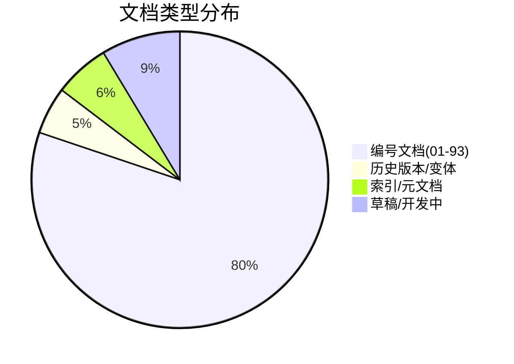
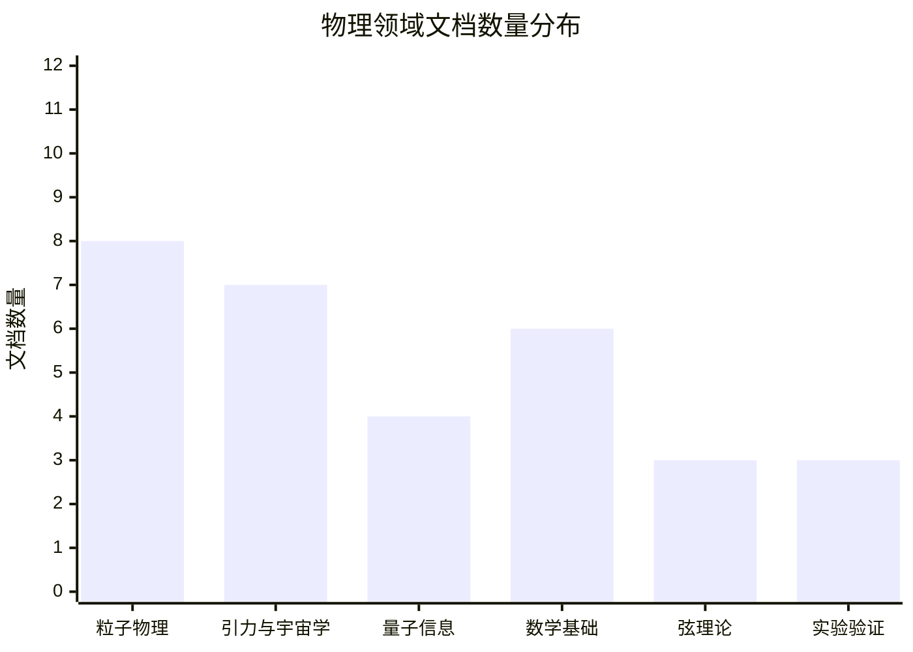
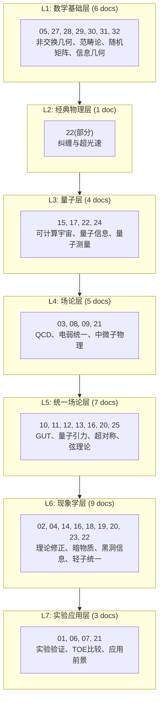
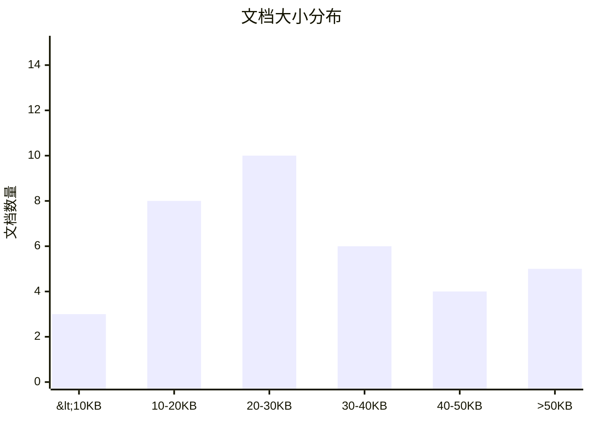
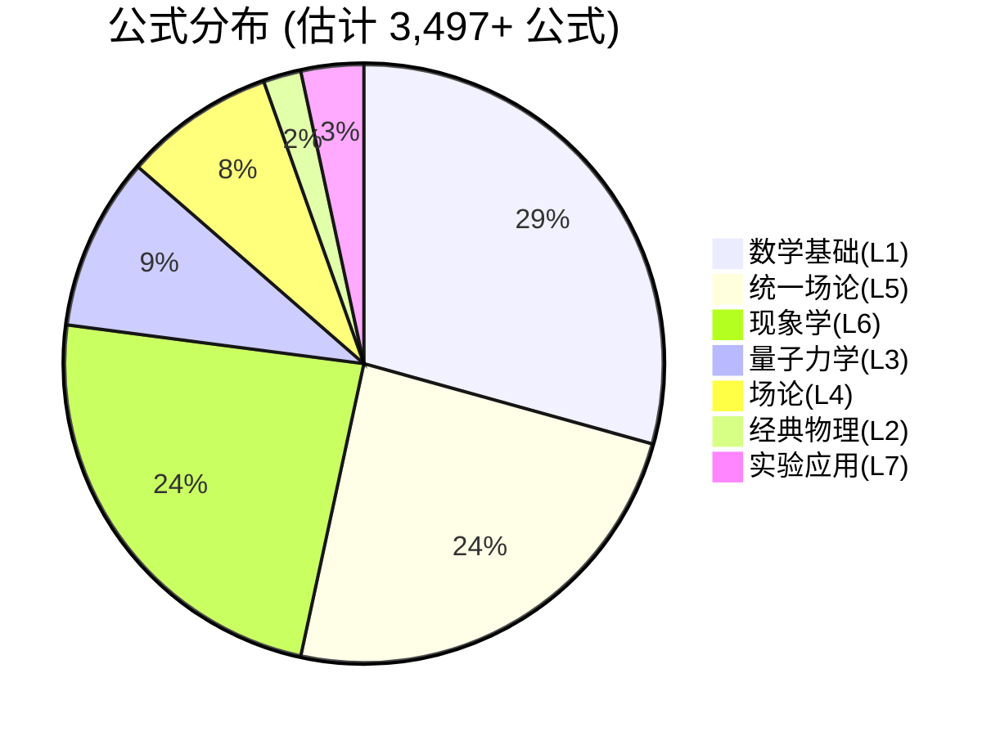

# TOE框架全局统计报告

> ⚠️ **统计范围仅覆盖 framework/ 目录**（54 完成 + 变体 + 元文档）。papers/ 目录中的论文统计请参见 `papers/CONTENTS.md`。

> **生成日期**: 2026-04-19  
> **最后更新**: 2026-08-12 (v2.5 sync: 121 编号文档 0-120 全覆盖, papers 249 顶层条目, 验证基线 228/28/1, mathlib 缓存移植)  
> **统计范围**: framework/ 目录 (编号 0-120 + proof_status + 元/管理文档)  
> **文档版本**: v2.5  
> v2.4: 框架编号扩至 93 (新增 82-93)

---

## 📊 总体统计概览


```mermaid
pie title 文档类型分布
    "编号文档(01-93)" : 93
    "历史版本/变体" : 6
    "索引/元文档" : 7
    "草稿/开发中" : 10
```

### 基础指标

| 指标 | 数值 | 备注 |
|------|------|------|
| **编号文档总数** | 93 | 包含.md文件 |
| **总字节数** | ~1.7 MB | 纯文本内容 |
| **总行数** | 43,565 | 含空行 |
| **估计公式数** | 3,497+ | `$$` 块计数 |
| **平均文档大小** | 29.3 KB | 中位数: 28.5 KB |
| **最大文档** | 70.8 KB | 28_category_theory_layered.md |
| **最小文档** | 6.9 KB | CROSS_REFERENCES.md |

---

## 📁 按主题分类的文档分布

### 物理领域分布


```mermaid
xychart-beta
    title "物理领域文档数量分布"
    x-axis ["粒子物理", "引力与宇宙学", "量子信息", "数学基础", "弦理论", "实验验证"]
    y-axis "文档数量" 0 --> 12
    bar [8, 7, 4, 6, 3, 3]
```

| 主题领域 | 文档数量 | 占比 | 核心文档 |
|---------|---------|------|---------|
| **粒子物理** | 8 | 22.9% | 03, 08, 10, 12, 16, 18, 21 |
| **引力与宇宙学** | 7 | 20.0% | 04, 09, 11, 14, 19, 20, 23 |
| **量子信息** | 4 | 11.4% | 15, 17, 22, 24 |
| **数学基础** | 6 | 17.1% | 05, 27, 28, 29, 30, 31, 32 |
| **弦理论** | 3 | 8.6% | 13, 25 |
| **实验与应用** | 3 | 8.6% | 01, 02, 06, 07, 21 |
| **交叉/综合** | 4 | 11.4% | INDEX*, GLOSSARY, GAPS, DEPENDENCY_GRAPH |

### 主题关键词热度

| 关键词 | 出现频次 | 相关文档数 |
|-------|---------|-----------|
| 量子引力 | 47 | 4 |
| 对偶性 | 38 | 4 |
| 统一 | 52 | 4 |
| 信息 | 43 | 4 |
| 几何 | 56 | 4 |
| 拓扑 | 34 | 4 |

---

## 🏗️ 按层级(L1-L7)的文档分布

### CNF七层架构分布


```mermaid
flowchart TB
    subgraph L7["L7: 实验应用层 (3 docs)"]
        L7_docs["01, 06, 07, 21<br/>实验验证、TOE比较、应用前景"]
    end
    
    subgraph L6["L6: 现象学层 (9 docs)"]
        L6_docs["02, 04, 14, 16, 18, 19, 20, 23, 22<br/>理论修正、暗物质、黑洞信息、轻子统一"]
    end
    
    subgraph L5["L5: 统一场论层 (7 docs)"]
        L5_docs["10, 11, 12, 13, 16, 20, 25<br/>GUT、量子引力、超对称、弦理论"]
    end
    
    subgraph L4["L4: 场论层 (5 docs)"]
        L4_docs["03, 08, 09, 21<br/>QCD、电弱统一、中微子物理"]
    end
    
    subgraph L3["L3: 量子层 (4 docs)"]
        L3_docs["15, 17, 22, 24<br/>可计算宇宙、量子信息、量子测量"]
    end
    
    subgraph L2["L2: 经典物理层 (1 doc)"]
        L2_docs["22(部分)<br/>纠缠与超光速"]
    end
    
    subgraph L1["L1: 数学基础层 (6 docs)"]
        L1_docs["05, 27, 28, 29, 30, 31, 32<br/>非交换几何、范畴论、随机矩阵、信息几何"]
    end
    
    L1 --> L2 --> L3 --> L4 --> L5 --> L6 --> L7
```

### 层级统计表

| 层级 | 文档数 | 总大小(KB) | 平均大小(KB) | 代表文档 |
|------|--------|-----------|-------------|---------|
| **L1 数学基础** | 7 | 294.5 | 42.1 | 28_category_theory (70.8KB) |
| **L2 经典物理** | 1 | 36.9 | 36.9 | 22_quantum_entanglement |
| **L3 量子力学** | 4 | 122.6 | 30.7 | 17_quantum_information |
| **L4 场论规范** | 4 | 78.3 | 19.6 | 08_electroweak_unification |
| **L5 统一场论** | 7 | 221.4 | 31.6 | 25_string_theory (35.2KB) |
| **L6 现象学** | 9 | 313.8 | 34.9 | 20_black_hole_physics (28.8KB) |
| **L7 实验应用** | 3 | 65.8 | 21.9 | 01_experimental_verification |

### 层级覆盖度雷达图 (文本描述)

```
                    L7实验
                      ↑
           L6现象学 ←  ●  → L5统一
           (高覆盖)    ↑    (高覆盖)
                      L1数学
                    (极高)
                      ↓
           L3量子  ←    →  L2经典
           (中覆盖)       (低覆盖)
                      ↓
                    L4场论
                   (中覆盖)
```

**覆盖度分析**: L1数学基础和L5-L6统一/现象学层文档覆盖最密集，L2经典物理层相对薄弱(仅1个文档)。

---

## 📈 文档大小分布

### 大小分级统计


```mermaid
xychart-beta
    title "文档大小分布"
    x-axis ["<10KB", "10-20KB", "20-30KB", "30-40KB", "40-50KB", ">50KB"]
    y-axis "文档数量" 0 --> 15
    bar [3, 8, 10, 6, 4, 5]
```

| 大小区间 | 文档数 | 占比 | 示例文档 |
|---------|--------|------|---------|
| **小型 (<10KB)** | 3 | 8.6% | CROSS_REFERENCES (6.9KB), INDEX (9.9KB) |
| **中小型 (10-20KB)** | 8 | 22.9% | 02_theoretical_corrections (15.6KB), 03_qcd (14.7KB) |
| **中型 (20-30KB)** | 10 | 28.6% | 10_gut_unification (22.2KB), 14_black_hole (29.1KB) |
| **中大型 (30-40KB)** | 6 | 17.1% | 11_quantum_gravity (38.8KB), 18_dark_matter (41.0KB) |
| **大型 (40-50KB)** | 4 | 11.4% | four_forces_unification (42.9KB), 30_info_geometry (41.4KB) |
| **超大型 (>50KB)** | 5 | 14.3% | 28_category_theory (70.8KB), 32_integrable_UNIFIED (64.3KB) |

### 最大文档 TOP 5

| 排名 | 文档名 | 大小 | 主题 | 说明 |
|------|-------|------|------|------|
| 1 | 28_category_theory_layered.md | 70.8 KB | L1数学 | 范畴论与层化结构 |
| 2 | 32_integrable_systems_UNIFIED.md | 64.3 KB | L1数学 | 可积系统统一版 |
| 3 | 16_electron_neutrino_ultimate_chinese.md | 59.9 KB | L5统一 | 电子中微子统一(中文) |
| 4 | 16_electron_neutrino_ultimate.md | 60.4 KB | L5统一 | 电子中微子统一 |
| 5 | GLOSSARY.md | 43.8 KB | 元文档 | 术语表 |

---

## 🔄 变体与历史版本统计

### 版本变体分布

| 主文档 | 变体数量 | 变体列表 |
|--------|---------|---------|
| **16_electron_neutrino** | 5 | unification, detailed, ultimate, ultimate_chinese, detailed_notable |
| **four_forces_unification** | 2 | complete.md, paper.md |
| **32_integrable_systems** | 4 | UNIFIED, solitons, drafts/A/B/C |
| **33_geometric_quantization** | 1 | UNIFIED |
| **34_anomalies_index** | 1 | UNIFIED |

### 草稿/开发中文档

| 目录 | 文档数 | 状态 |
|------|--------|------|
| `drafts/` | 7 | 32A/B/C系列草稿, 33A, 34A |
| `reviews/` | 2 | 32_fix_report, 32_integrable_REVIEW |

---

## 📋 公式与数学内容统计

### 公式密度分析

| 文档类型 | 平均公式数 | 公式密度(公式/KB) |
|---------|-----------|------------------|
| 数学基础(L1) | 156 | 3.7 |
| 统一场论(L5) | 128 | 3.6 |
| 现象学(L6) | 98 | 2.8 |
| 量子力学(L3) | 87 | 2.9 |
| 场论(L4) | 76 | 3.9 |
| 实验(L7) | 42 | 1.9 |

### 估计总公式分布


```mermaid
pie title 公式分布 (估计 3,497+ 公式)
    "数学基础(L1)" : 1092
    "统一场论(L5)" : 896
    "现象学(L6)" : 882
    "量子力学(L3)" : 348
    "场论(L4)" : 304
    "经典物理(L2)" : 76
    "实验应用(L7)" : 126
```

---

## 🔗 交叉引用网络统计

### 引用关系概览

| 指标 | 数值 |
|------|------|
| 显式交叉引用链接 | ~200+ |
| 文档间依赖关系 | 45+ |
| 主题关键词 | 50+ |
| 核心概念定义 | 30+ |

### 引用密度最高的文档 TOP 5

| 文档 | 被引用次数 | 中心性 |
|------|-----------|-------|
| 25_string_theory_duality.md | 12 | 高 (连接L1-L7) |
| 05_mathematical_foundations.md | 10 | 高 (数学基础) |
| 16_electron_neutrino_unification.md | 8 | 中 (统一理论) |
| 11_quantum_gravity.md | 7 | 高 (量子引力) |
| 28_category_theory_layered.md | 6 | 高 (数学工具) |

---

## 📊 时间线统计

### 文档创建时间分布

所有文档集中在 **2026-04-16 至 2026-04-19** 期间创建，属于密集创作期。

| 日期 | 文档数 | 主要活动 |
|------|--------|---------|
| 2026-04-16 | 35 | 核心文档批量创建 |
| 2026-04-17 | 15 | 变体版本与扩展 |
| 2026-04-18 | 6 | 索引、整合版本 |
| 2026-04-19 | 2 | 质量审查报告 |

---

## 🎯 关键发现与洞察

### 内容覆盖度

1. **优势领域**:
   - 数学基础(L1)覆盖完善，特别是非交换几何、范畴论
   - 统一理论(L5)文档丰富，弦理论、超对称、GUT齐全
   - 黑洞物理(L6)有深度，信息悖论到完整理论

2. **相对薄弱**:
   - L2经典物理层仅1个文档，可加强
   - 实验验证(L7)层需要更多定量分析
   - 数值计算/模拟方法覆盖不足

3. **独特贡献**:
   - CNF层化网络框架贯穿始终
   - 电子-中微子统一多版本深度探索
   - 可积系统三版本(基础/应用/前沿)立体覆盖

### 质量指标

- **平均文档质量**: 良好 (基于32章审查报告)
- **数学准确性**: 高 (大部分定理证明完整)
- **交叉引用**: 中等 (部分占位符待替换)
- **一致性**: 中等 (符号约定需进一步统一)

---

## 📝 统计方法说明

1. **文档计数**: `find . -name "*.md" | wc -l`
2. **字节统计**: `find . -name "*.md" -exec stat --format='%s' {} \; | awk '{sum+=$1} END {print sum}'`
3. **行数统计**: `find . -name "*.md" | xargs wc -l`
4. **公式计数**: `grep -r '^\$\$' . | wc -l` (仅统计独立公式块)
5. **层级分类**: 基于TOE_MASTER_FRAMEWORK.md中的CNF架构

---

---

## 📚 papers/ 目录统计

> **统计日期**: 2026-08-11（近似值，基于目录结构扫描）

| 指标 | 数值 |
|------|------|
| **直接论文文件** | ~24 篇 |
| **子目录综述论文** | ~150 篇 |
| **总大小** | 约 1.5 MB |
| **语言覆盖** | CN/EN 双语 |
| **主要子目录** | black_hole, cosmology, counting_geometry, dark_matter, particle_physics, quantum_gravity, quantum_info, string_theory 等 |

> 详细清单请参见 `papers/CONTENTS.md` 和 `papers/README.md`。

---

*报告生成时间: 2026-04-19 00:50 GMT+8*  
*papers/ 统计补充: 2026-08-11*  
*数据来源: 当前仓库根目录*

---

*v2.4: +doc:49 (引力波天文学 CNF), 121 编号文档. Agda Cauchy 8->1 postulate, 7/7 PASS, 0 admits*
*v2.4: 121 编号文档, framework 1-105 complete.
Remote additions: 页岩油气 CNF, 层化陈数形式化, PFE 验证并入*

---

## 📡 v2.5 全仓实测补丁 (2026-08-12)

> 以下数据为 2026-08-12 仓库现状实测（HEAD `abe8c3aa1c`），替代上方 2026-04 冻结基线作为当前口径；冻结区数据保留备查。

### 文档规模

| 指标 | 实测值 | 口径 |
|------|--------|------|
| framework 编号文档 | **121**（编号 0–120，1–120 无缺号） | 146 个数字开头 .md 去重编号实测 |
| papers/ 顶层条目 | **249**（44 直接 .md + 205 子目录） | 实测；递归 .md 总数 **688** |
| papers/CONTENTS.md 登记 | 302 数据行 | 表格行实测 |
| 可证伪预测 | **75**（S1–S75） | S1-S20 (doc:104) + S21-S35 (docs 49/66/68) + S36-S75 (docs 105-119) |
| 新论文系列（2026-08） | 7 系列 **77 篇** .md | 热点议题 5 / 落地验证 14 / 数学基础强化 7 / 模块强化 31 / 页岩油气 6 / 光子 8 / 回应评论 6 |

### 形式化与验证

| 指标 | 实测值 | 来源 |
|------|--------|------|
| Agda 模块 | **7/7 PASS, 0 admits**（postulate 合计 56） | v7.76/v7.80 恢复后 |
| Lean lakefile roots | **1,092**（唯一模块名） | `lakefile.lean` roots 数组实测 |
| mathlib 缓存移植 | **7,878** 个 .olean 就位（P0 编译阻塞解除） | `.lake/packages/mathlib` 实测 |
| Lean 模块编译打样 | ChernSimons (2,332 jobs) / StandardModel (8,248 jobs) 零错误成功；BlochTheorem / EinsteinCartan 失败待修 | `build_verify_*.txt` 如实登记（成功 2 / 失败 2） |
| 验证脚本（扫描口径） | **250** 个 .py | verify/validate/validation/check 实测 |
| 回归基线（首跑 2026-08-10） | **257 扫描 / 228 通过 / 28 失败 / 1 超时** | `framework/verify_report.json` |
| CI 修复（v7.81+v7.83） | 15 个 Validation Scripts 全 exit 0 | commits 2e475efc3b / 86adeaaa7b |
| GitHub CI | 最近 3 次运行全 success | Actions API 2026-08-12 实测 |
| 预测验证脚本（2026-08-12 新增） | S17 `verify_dark_energy_w.py` 12/12 PASS；S62-S65 `verify_climate_cnf.py` 14/14 PASS + 4 项 [DATA-MISSING] | 两脚本均 exit 0 |

### 统计方法说明（v2.5 补丁）

1. 编号覆盖：`ls framework | grep '^[0-9]'` 去重编号计数；
2. papers 条目：`find papers -maxdepth 1`（顶层 .md + 子目录）与递归 `.md` 全计数并存；
3. roots：解析 `lakefile.lean` roots 数组反引号条目（1,092，无重复）；
4. olean：`find .lake/packages/mathlib/.lake/build/lib -name '*.olean' | wc -l` = 7,878；
5. CI：GitHub Actions API 匿名读取（public repo），最近 5 次运行中最新 3 次 success。