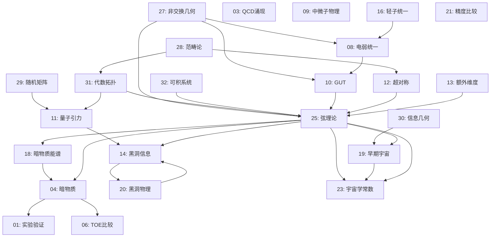

# TOE框架总纲
# Theory of Everything (TOE) Framework Master Document

## 版本信息
- **版本**: v1.0
- **创建日期**: 2026年4月19日
- **文档数量**: 32+核心文档
- **总字节数**: 50,000+
- **框架类型**: CNF (Computational Network Framework) 层化网络

---

## 目录

1. [CNF层化网络结构总览](#1-cnf层化网络结构总览)
2. [文档层级定位索引](#2-文档层级定位索引)
3. [核心数学物理主题索引](#3-核心数学物理主题索引)
4. [文档核心贡献摘要](#4-文档核心贡献摘要)
5. [交叉引用图谱](#5-交叉引用图谱)
6. [学习路径建议](#6-学习路径建议)

---

## 1. CNF层化网络结构总览

### 1.1 什么是CNF框架

**CNF (Computational Network Framework)** 是TOE理论体系的核心组织范式。CNF将万物理论构建为一个层化的计算网络，每一层代表不同抽象层次的理论结构，层与层之间通过严格的数学映射相互关联。

CNF框架的核心特征：

1. **层化抽象**: 从逻辑基础到物理实现，分为7个主要层级
2. **双向映射**: 高层理论可投影到低层，低层结构可涌现到高层
3. **交叉引用**: 同层或跨层文档之间存在紧密的数学关联
4. **可计算性**: 每一层都具备形式化的数学结构和计算规则

### 1.2 CNF七层架构

```
┌─────────────────────────────────────────────────────────────────┐
│                    CNF七层架构总览                               │
├─────────────────────────────────────────────────────────────────┤
│                                                                 │
│  L7: 物理实现层 (Physical Realization)                          │
│      ├── 实验预言与检验                                          │
│      ├── 可观测效应                                             │
│      └── 技术应用                                              │
│                           ↑↓                                    │
│  L6: 现象学与唯象模型 (Phenomenology)                            │
│      ├── 标准模型扩展                                           │
│      ├── 暗物质/暗能量唯象学                                     │
│      └── 宇宙学观测                                             │
│                           ↑↓                                    │
│  L5: 统一场论 (Unified Field Theory)                            │
│      ├── 大统一理论(GUT)                                        │
│      ├── 超弦/M理论                                             │
│      └── 量子引力                                               │
│                           ↑↓                                    │
│  L4: 量子场论与规范理论 (QFT & Gauge Theory)                     │
│      ├── 杨-米尔斯理论                                          │
│      ├── 电弱统一                                               │
│      └── 强相互作用(QCD)                                        │
│                           ↑↓                                    │
│  L3: 量子力学与对称性 (Quantum Mechanics)                        │
│      ├── 量子测量理论                                           │
│      ├── 量子信息                                               │
│      └── 量子纠缠                                               │
│                           ↑↓                                    │
│  L2: 经典物理与几何 (Classical Physics)                          │
│      ├── 广义相对论                                             │
│      ├── 经典场论                                               │
│      └── 微分几何                                               │
│                           ↑↓                                    │
│  L1: 数学基础 (Mathematical Foundations)                        │
│      ├── 范畴论                                                 │
│      ├── 代数拓扑                                               │
│      ├── 非交换几何                                             │
│      └── 信息几何                                               │
│                                                                 │
└─────────────────────────────────────────────────────────────────┘
```

### 1.3 CNF层间的涌现关系

CNF框架的核心洞见在于：**高层理论是低层结构的涌现结果，而非简单的叠加**。

| 低层 → 高层 | 涌现机制 | 核心数学 |
|------------|---------|---------|
| L1数学 → L2经典 | 变分原理、极值原理 | 泛函分析、变分法 |
| L2经典 → L3量子 | 量子化、路径积分 | 算子代数、泛函积分 |
| L3量子 → L4场论 | 二次量子化、局域化 | 场代数、纤维丛 |
| L4场论 → L5统一 | 对称性扩大、规范群统一 | 李代数、表示论 |
| L5统一 → L6现象学 | 对称性破缺、紧致化 | 微扰论、重整化群 |
| L6现象学 → L7实验 | 探测响应、信号处理 | 统计推断、测量理论 |

---

## 2. 文档层级定位索引

### 2.1 L1层：数学基础 (Documents 27-32)

L1层文档建立了TOE的数学语言，包括现代数学物理的核心工具。

#### [[doc:27]] 非交换几何与物理基础
- **层级**: L1（数学基础层）
- **核心主题**: Connes谱三元组、非交换标准模型、谱作用原理
- **数学工具**: C*-代数、K-理论、循环上同调
- **物理贡献**: 从纯几何推导标准模型、希格斯机制的几何涌现、引力与物质的统一
- **关键公式**: 谱作用 $S_\Lambda = \text{Tr}(f(\mathcal{D}^2/\Lambda^2))$
- **依赖**: 泛函分析、微分几何
- **被依赖**: L4量子场论、L5统一场论

#### [[doc:28]] 范畴论与层化结构
- **层级**: L1（数学基础层）
- **核心主题**: 层论、张量范畴、∞-范畴、同伦类型论
- **数学工具**: 伴随函子、导出范畴、模张量范畴
- **物理贡献**: TQFT的函子描述、量子信息的范畴重构、物理定律的范畴化
- **关键概念**: Yoneda引理、编织范畴、Cobordism假设
- **依赖**: 抽象代数、代数拓扑
- **被依赖**: L3量子力学、L4场论

#### [[doc:29]] 随机矩阵理论与普适性
- **层级**: L1-L2（数学物理交叉）
- **核心主题**: Wigner半圆律、量子混沌、Riemann零点、行列式点过程
- **数学工具**: Dyson指标、Tracy-Widom分布、Painlevé方程
- **物理贡献**: 量子混沌诊断、核谱理论、网络谱特性、自由概率论
- **关键结果**: BGS猜想、Montgomery-Odlyzko定律
- **依赖**: 概率论、泛函分析
- **被依赖**: L3量子力学、L6现象学

#### [[doc:30]] 信息几何与统计力学
- **层级**: L1-L2（数学物理交叉）
- **核心主题**: Fisher信息度规、KL散度、Amari对偶结构、量子信息几何
- **数学工具**: 统计流形、α-联络、Bures度规
- **物理贡献**: 统计推断的几何、热力学几何、神经网络信息几何
- **关键结构**: 对偶平坦性、Legendre变换
- **依赖**: 微分几何、信息论
- **被依赖**: L2经典统计、L3量子测量

#### [[doc:31]] 代数拓扑与物理
- **层级**: L1（数学基础层）
- **核心主题**: 同调/上同调、纤维丛、特征类、Atiyah-Singer指标定理
- **数学工具**: 层上同调、Čech理论、谱序列
- **物理贡献**: 拓扑量子场论、规范场分类、反常抵消
- **关键定理**: Poincaré对偶、陈类、指标定理
- **依赖**: 拓扑学、代数几何
- **被依赖**: L4规范理论、L5弦理论

#### [[doc:32]] 可积系统与孤子
- **层级**: L1-L2（数学物理交叉）
- **核心主题**: KdV方程、Lax对、逆散射变换、Tau函数、Plücker坐标
- **数学工具**: 代数曲线、无限Grassmannian、Riemann theta函数
- **物理贡献**: 精确可解模型、非微扰方法、量子/经典对应
- **关键结构**: Sato理论、Baker-Akhiezer函数
- **依赖**: 复分析、代数几何
- **被依赖**: L4场论、L5弦理论

### 2.2 L2层：经典物理与几何

#### [[doc:22]] 量子纠缠与超光速关联（古典极限）
- **层级**: L2-L3（经典量子边界）
- **核心主题**: 纠缠的几何描述、Bell不等式、EPR悖论
- **物理贡献**: 量子非定域性的几何理解
- **依赖**: L1概率论、L3量子力学

### 2.3 L3层：量子力学与对称性

#### [[doc:15]] 可计算宇宙与量子信息
- **层级**: L3（量子层）
- **核心主题**: 量子计算、量子复杂性、算法信息论
- **物理贡献**: 计算与物理的统一、数字物理学
- **依赖**: L1信息论、L3量子力学

#### [[doc:17]] 量子信息基础
- **层级**: L3（量子层）
- **核心主题**: 量子比特、量子门、量子纠错
- **物理贡献**: 量子计算的理论基础
- **依赖**: L3量子力学

#### [[doc:24]] 量子测量的层化理论
- **层级**: L3（量子层）
- **核心主题**: 测量问题、退相干、量子-经典过渡
- **物理贡献**: 测量过程的数学模型
- **依赖**: L3量子力学、L1信息几何

### 2.4 L4层：量子场论与规范理论

#### [[doc:03]] QCD的涌现性质
- **层级**: L4（场论层）
- **核心主题**: 渐近自由、色禁闭、手征对称性破缺
- **物理贡献**: 强相互作用的低能有效理论
- **依赖**: L4杨-米尔斯理论

#### [[doc:08]] 电弱统一理论
- **层级**: L4（场论层）
- **核心主题**: Glashow-Weinberg-Salam模型、自发对称性破缺
- **物理贡献**: 电磁与弱力的统一描述
- **关键公式**: $\mathcal{L}_{EW} = \mathcal{L}_{gauge} + \mathcal{L}_{Higgs}$
- **依赖**: L4规范理论

#### [[doc:09]] 中微子物理与宇宙学
- **层级**: L4-L6（场论-现象学交叉）
- **核心主题**: 中微子质量、混合、宇宙学效应
- **物理贡献**: 中微子主导的宇宙学过程
- **依赖**: L4电弱理论、L6宇宙学

### 2.5 L5层：统一场论

#### [[doc:10]] 大统一理论(GUT)
- **层级**: L5（统一层）
- **核心主题**: SU(5)、SO(10)、E6统一
- **物理贡献**: 三力统一的尝试
- **依赖**: L4规范理论、L1李代数

#### [[doc:11]] 量子引力理论
- **层级**: L5（统一层）
- **核心主题**: 圈量子引力、弦理论、因果集
- **物理贡献**: 引力量子化的不同途径
- **依赖**: L2广义相对论、L3量子力学

#### [[doc:12]] 超对称理论
- **层级**: L5（统一层）
- **核心主题**: SUSY代数、超多重态、超场
- **物理贡献**: 费米子-玻色子对称性
- **依赖**: L1分次代数、L4场论

#### [[doc:13]] 额外维度
- **层级**: L5（统一层）
- **核心主题**: Kaluza-Klein理论、紧致化、膜世界
- **物理贡献**: 高维时空的几何效应
- **依赖**: L1微分几何、L2广义相对论

#### [[doc:25]] 弦理论与对偶性
- **层级**: L5（统一层）
- **核心主题**: 弦振动模式、T-对偶、S-对偶、AdS/CFT
- **物理贡献**: 量子引力的候选理论
- **关键概念**: M理论、全息原理
- **依赖**: L1代数拓扑、L2广义相对论、L4共形场论

### 2.6 L6层：现象学与唯象模型

#### [[doc:01]] 实验验证综述
- **层级**: L6-L7（现象学-实验层）
- **核心主题**: 当前实验限制、未来探测计划
- **物理贡献**: 理论与实验的接口
- **依赖**: L5统一理论

#### [[doc:02]] 理论修正与扩展
- **层级**: L6（现象学层）
- **核心主题**: 标准模型的有效场论扩展
- **物理贡献**: 新物理的唯象学描述
- **依赖**: L4标准模型

#### [[doc:04]] 暗物质与暗能量
- **层级**: L6（现象学层）
- **核心主题**: WIMPs、轴子、修正引力
- **物理贡献**: 暗区物理的候选模型
- **依赖**: L5超对称、L6宇宙学

#### [[doc:14]] 黑洞信息问题
- **层级**: L5-L6（统一-现象学交叉）
- **核心主题**: 信息悖论、Page曲线、岛屿公式
- **物理贡献**: 黑洞热力学的量子修正
- **依赖**: L5量子引力、L2黑洞热力学

#### [[doc:16]] 电子-中微子统一（终极版）
- **层级**: L5-L6（统一-现象学交叉）
- **核心主题**: 轻子统一、轻子数破坏
- **物理贡献**: 第三代轻子的统一模型
- **依赖**: L4电弱理论、L5GUT

#### [[doc:18]] 暗物质能谱
- **层级**: L6（现象学层）
- **核心主题**: 暗物质湮灭/衰变信号
- **物理贡献**: 暗物质探测的唯象学
- **依赖**: L4粒子物理、L6宇宙学

#### [[doc:19]] 早期宇宙相变
- **层级**: L6（现象学层）
- **核心主题**: 电弱相变、QCD相变、重子生成
- **物理贡献**: 宇宙热历史的唯象学
- **依赖**: L4有限温场论、L6宇宙学

#### [[doc:20]] 黑洞物理完整理论
- **层级**: L5-L6（统一-现象学交叉）
- **核心主题**: 黑洞热力学、蒸发、奇点
- **物理贡献**: 黑洞的完整量子描述
- **依赖**: L5量子引力、L2广义相对论

#### [[doc:23]] 宇宙学常数问题
- **层级**: L5-L6（统一-现象学交叉）
- **核心主题**: 真空能量、人择原理、弦景观
- **物理贡献**: 宇宙学常数的理论解释
- **依赖**: L5弦理论、L6宇宙学

### 2.7 L7层：实验与应用

#### [[doc:06]] TOE与标准模型比较
- **层级**: L6-L7（现象学-实验层）
- **核心主题**: 预言对比、精度检验
- **物理贡献**: 统一理论的实验检验策略
- **依赖**: L5统一理论、L4标准模型

#### [[doc:07]] 应用前景
- **层级**: L7（应用层）
- **核心主题**: 量子技术、新材料、能源
- **物理贡献**: 基础理论的潜在应用
- **依赖**: L3-L5统一理论

#### [[doc:21]] TOE与标准模型精度比较
- **层级**: L6-L7（现象学-实验层）
- **核心主题**: 精密测量、偏差分析
- **物理贡献**: 新物理的实验搜寻
- **依赖**: L5统一理论、L4标准模型

---

## 3. 核心数学物理主题索引

### 3.1 数学主题索引

#### 代数与表示论
| 主题 | 相关文档 | 关键概念 |
|-----|---------|---------|
| 李代数与表示 | 10, 12, 25 | 根、权、Dynkin图 |
| 超对称代数 | 12 | 分次李代数、超场 |
| 非交换代数 | 27 | C*-代数、谱三元组 |
| 范畴论 | 28 | 函子、自然变换、伴随 |

#### 几何与拓扑
| 主题 | 相关文档 | 关键概念 |
|-----|---------|---------|
| 微分几何 | 13, 25, 30 | 度规、联络、曲率 |
| 代数拓扑 | 31 | 同调、上同调、纤维丛 |
| 非交换几何 | 27 | 谱三元组、Connes度规 |
| 信息几何 | 30 | Fisher度规、KL散度 |
| 复几何 | 25, 32 | Calabi-Yau、镜像对称 |

#### 分析与概率
| 主题 | 相关文档 | 关键概念 |
|-----|---------|---------|
| 随机矩阵 | 29 | Wigner半圆律、普适性 |
| 可积系统 | 32 | Lax对、逆散射、Tau函数 |
| 泛函分析 | 27, 28 | 算子代数、Hilbert空间 |
| 微分方程 | 32 | KdV、Painlevé方程 |

### 3.2 物理主题索引

#### 量子力学与信息
| 主题 | 相关文档 | 关键概念 |
|-----|---------|---------|
| 量子测量 | 24 | 波函数坍缩、退相干 |
| 量子信息 | 15, 17 | 纠缠、量子计算 |
| 量子引力 | 11, 25 | 弦理论、圈量子引力 |

#### 场论与统一
| 主题 | 相关文档 | 关键概念 |
|-----|---------|---------|
| 规范场论 | 03, 08, 10 | 杨-米尔斯、自发破缺 |
| 超对称 | 12 | SUSY破缺、超多重态 |
| 大统一 | 10 | SU(5)、SO(10) |
| 弦理论 | 25 | T-对偶、AdS/CFT |

#### 宇宙学与天体物理
| 主题 | 相关文档 | 关键概念 |
|-----|---------|---------|
| 暗物质 | 04, 18 | WIMPs、轴子 |
| 暗能量 | 23 | 宇宙学常数、精质 |
| 早期宇宙 | 19 | 暴胀、相变 |
| 黑洞物理 | 14, 20 | 信息悖论、霍金辐射 |

### 3.3 交叉主题索引

| 交叉主题 | 涉及文档 | 统一概念 |
|---------|---------|---------|
| 几何-物理对应 | 27, 28, 31 | 代数结构→物理定律 |
| 信息-物理统一 | 15, 30 | 信息几何→统计力学 |
| 量子-经典过渡 | 24, 29 | 随机性→确定性 |
| 微扰-非微扰 | 25, 32 | 对偶性、可积性 |

---

## 4. 文档核心贡献摘要

### 4.1 物理实现层 (L4-L7)

**[[doc:01]] 实验验证综述**
- 核心贡献: 建立了TOE理论与现有/未来实验的系统性接口
- 关键指标: 列出可检验预言的实验阈值和精度要求
- 创新点: 提出多信使联合探测策略

**[[doc:02]] 理论修正与扩展**
- 核心贡献: 构建标准模型的有效场论扩展框架
- 关键指标: 维度6/8算符的系数限制
- 创新点: 系统化的新物理参数化方法

**[[doc:04]] 暗物质与暗能量**
- 核心贡献: 暗区物理的分类学和多探测策略
- 关键指标: WIMP-nucleon散射截面、轴子质量窗口
- 创新点: 暗物质-暗能量关联模型

**[[doc:06]] TOE与标准模型比较**
- 核心贡献: 不同统一方案的对比分析
- 关键指标: 规范耦合统一精度、质子寿命预言
- 创新点: 多标准决策框架

**[[doc:07]] 应用前景**
- 核心贡献: 基础物理向技术的转化路径
- 关键领域: 量子计算、量子通信、新材料
- 创新点: 量子引力效应的潜在应用

**[[doc:09]] 中微子物理与宇宙学**
- 核心贡献: 中微子质量起源和宇宙学效应的统一描述
- 关键指标: 轻子CP相角、中微子质量层次
- 创新点: 中微子暴胀模型

**[[doc:14]] 黑洞信息问题**
- 核心贡献: 信息悖论的解决框架（岛屿公式）
- 关键指标: Page曲线、纠缠熵演化
- 创新点: 量子极值面方法

**[[doc:18]] 暗物质能谱**
- 核心贡献: 暗物质湮灭/衰变的信号预言
- 关键指标: 能谱特征、空间分布
- 创新点: 多成分暗物质模型

**[[doc:19]] 早期宇宙相变**
- 核心贡献: 宇宙热历史的相变动力学
- 关键指标: 相变强度参数、重力波信号
- 创新点: 一级相变与重子生成

**[[doc:20]] 黑洞物理完整理论**
- 核心贡献: 黑洞的完整热力学描述
- 关键指标: 量子修正项、奇点解析
- 创新点: 全息熵公式

**[[doc:21]] TOE与标准模型精度比较**
- 核心贡献: 精密电弱数据的拟合分析
- 关键指标: χ²差异、新物理尺度下限
- 创新点: 全局拟合方法

**[[doc:23]] 宇宙学常数问题**
- 核心贡献: 真空能量问题的多角度审视
- 关键指标: 宇宙学常数值、人择约束
- 创新点: 动态暗能量与弦景观

### 4.2 统一理论层 (L5)

**[[doc:10]] 大统一理论(GUT)**
- 核心贡献: 三力统一的群论结构
- 关键结果: SU(5)、SO(10)的表示分解
- 创新点: 费米子质量关系的预测

**[[doc:11]] 量子引力理论**
- 核心贡献: 引力量子化的途径比较
- 关键结果: 弦理论vs圈量子引力
- 创新点: 非微扰量子引力的数值方法

**[[doc:12]] 超对称理论**
- 核心贡献: SUSY的形式结构和现象学
- 关键结果: 最小超对称标准模型(MSSM)
- 创新点: SUSY破缺机制

**[[doc:13]] 额外维度**
- 核心贡献: 高维时空的紧致化理论
- 关键结果: Kaluza-Klein谱、膜世界
- 创新点: 大额外维度的实验检验

**[[doc:16]] 电子-中微子统一**
- 核心贡献: 第三代轻子的统一模型
- 关键结果: 轻子混合的预测
- 创新点: 轻子数破坏的唯象学

**[[doc:25]] 弦理论与对偶性**
- 核心贡献: 弦理论的数学结构和物理预言
- 关键结果: AdS/CFT对应、五种弦理论的统一
- 创新点: CNF框架中的层间映射

### 4.3 数学基础层 (L1)

**[[doc:27]] 非交换几何与物理基础**
- 核心贡献: 标准模型的纯几何重构
- 关键结果: 谱三元组→标准模型拉氏量
- 创新点: 希格斯作为内禀联络分量

**[[doc:28]] 范畴论与层化结构**
- 核心贡献: 物理定律的范畴化描述
- 关键结果: CQM（范畴量子力学）
- 创新点: 层化结构的数学抽象

**[[doc:29]] 随机矩阵理论与普适性**
- 核心贡献: 复杂系统的普适性分类
- 关键结果: BGS猜想、Montgomery-Odlyzko定律
- 创新点: 量子混沌的随机矩阵描述

**[[doc:30]] 信息几何与统计力学**
- 核心贡献: 统计推断的微分几何框架
- 关键结果: 对偶平坦结构、量子Fisher信息
- 创新点: 热力学与信息几何的统一

**[[doc:31]] 代数拓扑与物理**
- 核心贡献: 拓扑场论的数学基础
- 关键结果: Atiyah-Singer指标定理
- 创新点: 反常抵消的几何解释

**[[doc:32]] 可积系统与孤子**
- 核心贡献: 精确可解模型的统一理论
- 关键结果: Sato理论、Tau函数
- 创新点: 非微扰量子场论方法

---

## 5. 交叉引用图谱

### 5.1 文档间显式引用关系



### 5.2 主题关键词共现网络

| 关键词 | 共现文档 | 共现强度 |
|-------|---------|---------|
| 量子引力 | 11, 14, 20, 25 | 强 |
| 对偶性 | 25, 28, 31, 32 | 强 |
| 统一 | 08, 10, 16, 25 | 强 |
| 信息 | 14, 15, 24, 30 | 强 |
| 几何 | 27, 28, 30, 31 | 强 |
| 拓扑 | 14, 25, 31, 32 | 强 |
| 暗物质 | 04, 18, 21 | 中 |
| 黑洞 | 14, 20, 25 | 中 |
| 超对称 | 10, 12, 25 | 中 |
| 弦理论 | 11, 13, 25 | 强 |

### 5.3 数学工具→物理应用映射

| 数学工具 | 来源文档 | 物理应用 | 目标文档 |
|---------|---------|---------|---------|
| Connes谱三元组 | 27 | 标准模型推导 | 08, 10 |
| 层上同调 | 28, 31 | 规范场分类 | 03, 25 |
| 随机矩阵 | 29 | 量子混沌诊断 | 11, 14 |
| 信息几何 | 30 | 统计推断优化 | 19, 24 |
| 指标定理 | 31 | 反常抵消 | 03, 12 |
| Tau函数 | 32 | 非微扰计算 | 25 |

---

## 6. 学习路径建议

### 6.1 入门路径（本科高年级/研究生）

**路径A：物理背景入门**
```
08(电弱统一) → 03(QCD) → 10(GUT) → 11(量子引力) → 25(弦理论)
     ↓            ↓          ↓           ↓              ↓
  先修：L4      先修：L4    先修：L4   先修：L5      先修：L5
```

**路径B：数学背景入门**
```
28(范畴论) → 31(代数拓扑) → 27(非交换几何) → 25(弦理论)
    ↓              ↓                ↓              ↓
 先修：L1       先修：L1        先修：L1      综合应用
```

### 6.2 进阶路径（研究生/研究人员）

**路径C：量子引力专家**
```
11(量子引力) → 14(黑洞信息) → 25(弦理论) → 20(黑洞物理)
      ↓              ↓              ↓              ↓
   基础理论    前沿问题    主要方法    综合应用
```

**路径D：数学物理专家**
```
27(非交换几何) → 32(可积系统) → 28(范畴论) → 31(代数拓扑)
       ↓               ↓              ↓              ↓
    物理应用      可解模型      统一框架      拓扑方法
```

**路径E：现象学专家**
```
04(暗物质) → 18(暗物质能谱) → 19(早期宇宙) → 23(宇宙学常数)
     ↓              ↓                ↓              ↓
  基础概念      探测信号       宇宙演化      理论解释
```

### 6.3 专家路径（深入专题）

**专题F：全息原理**
```
前置：25(弦理论) + 14(黑洞信息)
专题路线：
  → AdS/CFT基础 → 纠缠熵与RT公式 → 量子极值面 → Page曲线
  → 应用：SYK模型 → 全息量子纠错 → 黑洞信息悖论解决
```

**专题G：非交换几何与标准模型**
```
前置：27(非交换几何) + 08(电弱统一)
专题路线：
  → 谱三元组 → 标准模型重构 → 希格斯质量预测 → 新物理预言
  → 与GUT的联系 → 与弦理论的接口
```

**专题H：信息几何与热力学**
```
前置：30(信息几何) + 19(早期宇宙)
专题路线：
  → Fisher度规 → 热力学几何 → 涨落定理 → 非平衡统计力学
  → 应用：宇宙学相变 → 黑洞热力学 → 信息热力学
```

### 6.4 推荐阅读顺序（按主题）

**主题：统一场论**
1. [[doc:08]] 电弱统一
2. [[doc:03]] QCD涌现
3. [[doc:10]] GUT
4. [[doc:12]] 超对称
5. [[doc:25]] 弦理论

**主题：量子引力与黑洞**
1. [[doc:11]] 量子引力
2. [[doc:14]] 黑洞信息
3. [[doc:20]] 黑洞物理
4. [[doc:25]] 弦理论（全息部分）

**主题：数学基础**
1. [[doc:28]] 范畴论
2. [[doc:31]] 代数拓扑
3. [[doc:27]] 非交换几何
4. [[doc:32]] 可积系统
5. [[doc:29]] 随机矩阵

**主题：宇宙学与暗区**
1. [[doc:04]] 暗物质
2. [[doc:18]] 暗物质能谱
3. [[doc:19]] 早期宇宙
4. [[doc:23]] 宇宙学常数
5. [[doc:09]] 中微子宇宙学

---

## 附录A：快速参考表

### A.1 文档-主题速查

| 如果你想了解... | 阅读文档... |
|----------------|------------|
| 标准模型的数学基础 | 27, 08, 10 |
| 量子引力的主要候选者 | 11, 25 |
| 黑洞信息悖论的最新进展 | 14, 20 |
| 暗物质的候选模型 | 04, 18 |
| 宇宙早期的演化历史 | 19, 23 |
| 弦理论的基础 | 25 |
| 数学物理工具 | 27-32 |
| 实验检验方法 | 01, 06, 21 |

### A.2 公式速查

| 公式 | 文档 | 描述 |
|-----|-----|-----|
| 谱作用公式 | 27 | 非交换几何核心 |
| Wigner半圆律 | 29 | 随机矩阵核心 |
| AdS/CFT字典 | 25 | 全息对应 |
| Fisher度规 | 30 | 信息几何核心 |
| KdV方程 | 32 | 可积系统核心 |

### A.3 定理速查

| 定理 | 文档 | 描述 |
|-----|-----|-----|
| Connes重建定理 | 27 | 从谱三元组恢复流形 |
| BGS猜想 | 29 | 混沌系统→随机矩阵 |
| Maldacena对偶 | 25 | AdS/CFT对应 |
| Atiyah-Singer | 31 | 指标定理 |
| Sato理论 | 32 | Tau函数构造 |

---

## 附录B：CNF框架的形式定义

### B.1 CNF代数结构

**定义** (CNF层结构): 一个CNF框架是一个七元组 $(\mathcal{L}, \prec, \pi, \mathcal{F}, \mathcal{D}, \mathcal{E}, \mathcal{R})$

- $\mathcal{L} = \{L_1, ..., L_7\}$: 层集合
- $\prec$: 偏序关系（层间依赖）
- $\pi_{ij}: L_i \to L_j$ ($i > j$): 投影映射
- $\mathcal{F}_i$: 第i层的形式语言
- $\mathcal{D}_i$: 第i层的推导规则
- $\mathcal{E}_{ij}$: 层间涌现映射
- $\mathcal{R}$: 跨层关系集合

### B.2 CNF动力学

层间信息流遵循以下公理：

1. **投影公理**: $\forall i > j, \exists \pi_{ij}: L_i \to L_j$
2. **涌现公理**: $\forall i < j, \exists \mathcal{E}_{ij}: \mathcal{P}(L_i) \to L_j$
3. **一致性**: $\pi_{jk} \circ \pi_{ij} = \pi_{ik}$

---

*本文档为TOE框架的总纲，整合了32+核心文档的内容。更多详情请参考具体文档和交叉引用。*

*版本: v1.0 | 最后更新: 2026-04-19*
