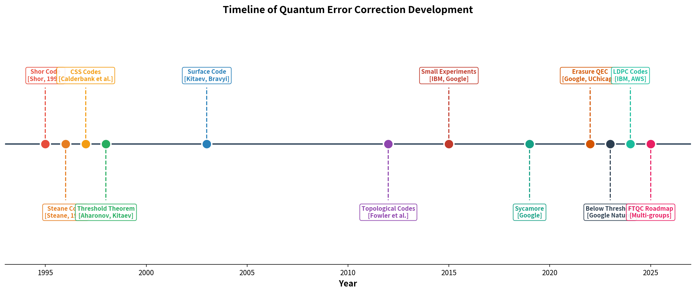
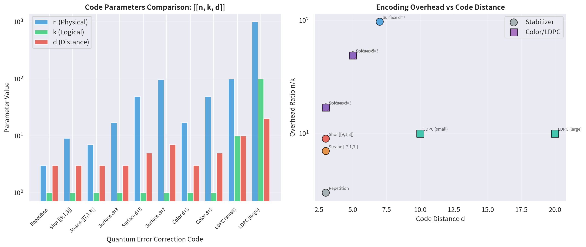
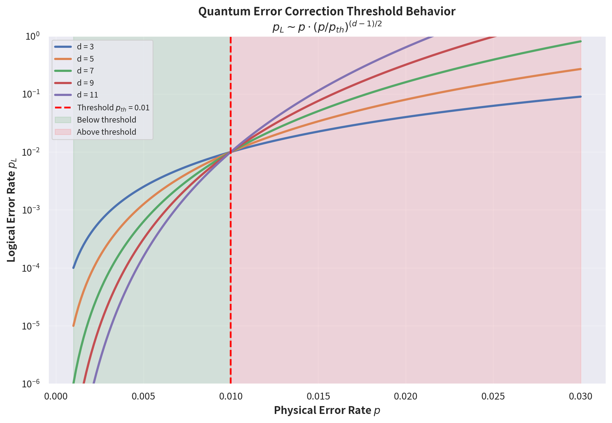
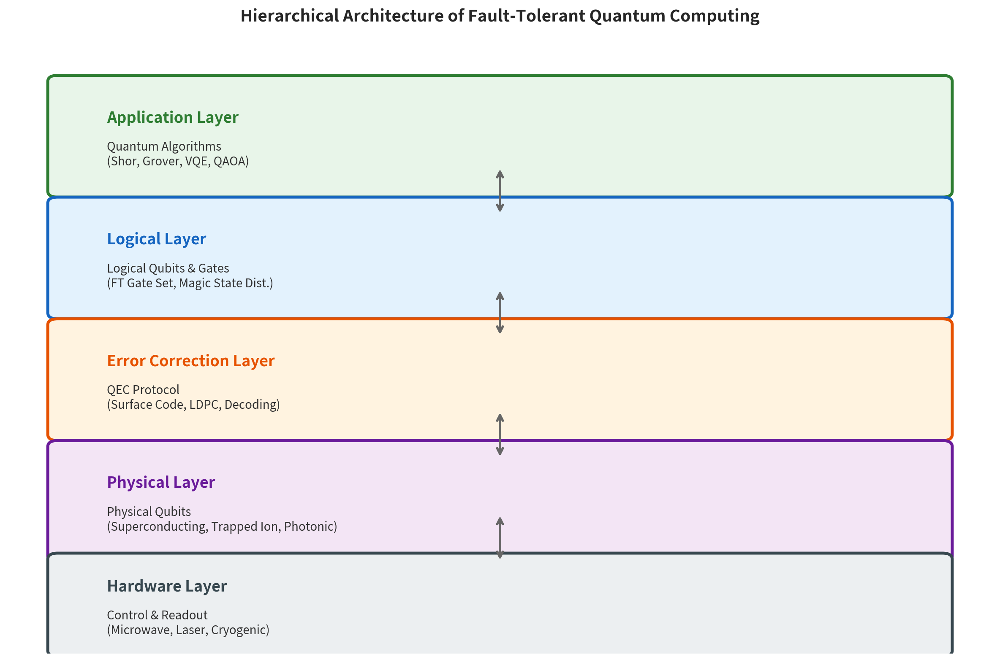
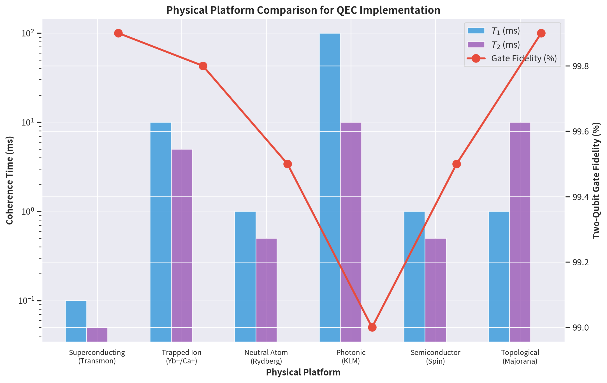
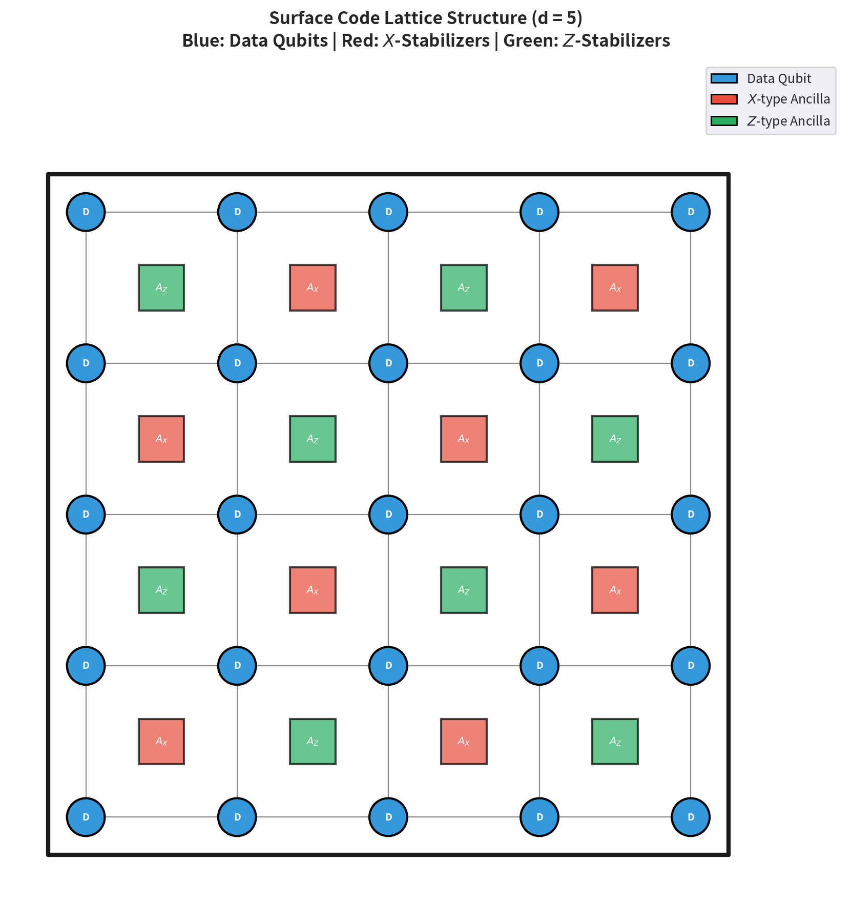
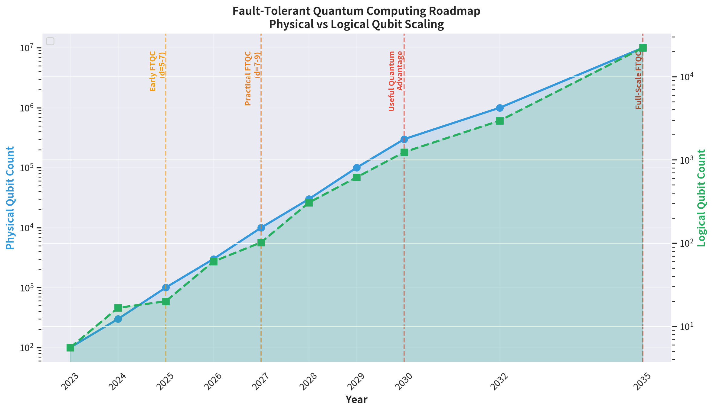

# 论文1：量子纠错与容错量子计算研究综述

**英文标题**: Review of Quantum Error Correction and Fault-Tolerant Quantum Computing

---

**作者**: QEC-FTQC Research Group, 千界花园学术系统

**单位**: 千界花园量子信息科学实验室

**日期**: 2025年7月

**分类**: 量子信息科学 | 量子纠错 | 容错量子计算 | 综述

---

## 摘要

量子计算的核心挑战在于量子比特极易受到环境噪声干扰而导致信息退相干。量子纠错（Quantum Error Correction, QEC）通过将逻辑量子信息编码到多个物理量子比特的纠缠态中，实现对错误的检测与纠正，从而将物理错误率 $p$ 抑制到远低于阈值的逻辑错误率 $p_L$。容错量子计算（Fault-Tolerant Quantum Computing, FTQC）在此基础上进一步要求所有逻辑操作——包括逻辑门、态制备与测量——均以不破坏编码空间的方式执行，确保错误不会在整个计算过程中级联传播。本综述系统梳理了量子纠错与容错量子计算领域自1995年Shor提出首个量子纠错码以来的发展历程，涵盖稳定子码理论框架、拓扑量子纠错码（特别是Kitaev表面码与高维推广）、低密度奇偶校验（LDPC）量子码、量子纠错阈值定理、解码算法（最小权重完美匹配与神经网络解码器）、魔法态蒸馏与容错逻辑门实现、以及各主要物理平台（超导、离子阱、中性原子、光子）的实验进展。同时，本文分析了从物理层到系统层到标准层的完整FTQC技术栈，讨论了当前面临的关键挑战与未来发展方向，为后续14篇专题论文提供统一的理论基础与符号体系。本系列与先前"拓扑量子互联网"系列相衔接，共同构建从量子通信到量子计算的完整技术谱系。

**关键词**: 量子纠错；容错量子计算；表面码；稳定子码；纠错阈值；LDPC量子码；魔法态蒸馏；逻辑量子比特；解码算法；量子优势

---

## 1. 引言

### 1.1 量子计算的噪声挑战

量子力学为信息处理提供了超越经典计算的可能性。Shor算法可在多项式时间内分解大整数，威胁现有RSA加密体系；Grover算法为无序数据库搜索提供二次加速；量子模拟可高效求解强关联电子体系，有望革新药物设计与材料科学。然而，量子比特的脆弱性构成了实现这些应用的根本障碍。

与经典比特不同，量子比特的连续态空间允许任意幅度的错误：比特翻转（$X$错误）、相位翻转（$Z$错误）以及两者组合（$Y$错误）。更严重的是，量子态不可克隆定理禁止直接复制未知量子态，这意味着经典纠错中广泛使用的冗余复制策略在量子领域原则上不可行。此外，量子测量的不可逆性要求纠错过程不能破坏编码的量子信息。这些量子力学基本限制使得量子纠错的设计远比经典纠错复杂。

物理量子比特的错误率 $p$ 受限于量子门保真度、能量弛豫时间 $T_1$ 和退相干时间 $T_2$。当前最先进的超导量子比特双门保真度约为99.5%–99.9%，对应单门错误率 $p \sim 10^{-3}$–$10^{-4}$；离子阱系统可达99.9%以上，但操作速度较慢。对于Shor算法分解2048位整数所需的 $\sim 10^{20}$ 个逻辑门操作，即使 $p_L \sim 10^{-10}$ 的逻辑错误率仍不足。因此，将物理错误率通过纠错协议指数级降低到可接受水平的逻辑错误率，是实现大规模量子计算的必由之路。

### 1.2 量子纠错的基本原理

量子纠错的核心思想是将 $k$ 个逻辑量子比特编码到 $n$ 个物理量子比特的希尔伯特空间中，形成一个 $2^k$ 维的编码子空间。一个量子纠错码通常记为 $[[n, k, d]]$，其中 $d$ 为码距，表示纠正任意 $\lfloor (d-1)/2 \rfloor$ 个物理错误的最大能力。

1995年，Peter Shor提出了首个量子纠错码 $[[9, 1, 3]]$，将1个逻辑量子比特编码到9个物理量子比特，可纠正任意单比特错误。几乎同时，Andrew Steane独立提出了 $[[7, 1, 3]]$ Steane码，基于经典汉明码的CSS构造。Calderbank、Shor和Steane（CSS）码类将经典线性码的自交条件推广到量子领域，为系统构造量子纠错码奠定了基础。

量子纠错码的数学框架由Gottesman于1997年建立的稳定子（Stabilizer）形式体系统一。在该框架下，一个 $[[n, k, d]]$ 稳定子码由 $n-k$ 个独立且相互对易的Pauli算子 $\{S_1, S_2, \ldots, S_{n-k}\}$ 生成的阿贝尔群（稳定子群）定义。编码子空间是这些稳定子算子的共同本征值为+1的本征子空间。错误检测通过测量稳定子生成元（syndrome measurement）实现，测量结果构成错误综合征（syndrome），解码器根据综合征推断最可能的错误模式并进行纠正。

### 1.3 容错量子计算的概念框架

纠错码本身只能保护静态量子信息；要在编码信息上执行计算，还需要容错的逻辑操作。一个逻辑操作被称为容错的，如果满足以下两个条件：

**(a)** 单个物理组件的故障最多导致一个逻辑量子比特上的可纠正错误；

**(b)** 假设所有物理错误率低于某个阈值 $p_{th}$，逻辑错误率可以随码距 $d$ 的增加而指数级降低。

1997–1998年间，Aharonov、Ben-Or、Kitaev、Knill、Laflamme和Zurek独立证明了量子计算的阈值定理：如果物理错误率 $p$ 低于某个正的常数阈值 $p_{th}$（取决于具体编码和物理架构），则通过增加码距 $d$ 和使用适当的容错协议，逻辑错误率可以任意小，同时资源开销仅多项式增长。这一定理是FTQC的理论基石，表明量子计算在原理上是可扩展的。

容错逻辑门的设计面临Eastin-Knill定理的限制：不存在能够横断（transversally）实现所有单量子比特和双量子比特门的量子纠错码。解决方案包括：

- **魔法态蒸馏（Magic State Distillation, MSD）**：通过容错制备和蒸馏特定的非Clifford态（如 $|T\rangle = |0\rangle + e^{i\pi/4}|1\rangle$），结合Clifford门的横断实现，构造通用的容错门集 $\{H, S, \text{CNOT}, T\}$。

- **码变形（Code Deformation）与编织（Braiding）**：在拓扑码中通过测量诱导的边界移动或任意子编织实现逻辑门。

- **级联码与逻辑层递推**：在编码的编码上实现操作，逐层降低错误率。

### 1.4 本文的研究动机与内容安排

本综述服务于"千界花园"QEC-FTQC系列研究，该系列共15篇文档（1综述+14论文），与先前的"拓扑量子互联网"系列相衔接，构建从物理层量子硬件到系统层纠错协议再到标准层量子计算架构的完整技术谱系。本文作为开篇综述，承担以下任务：

**(1) 建立统一的符号体系与数学框架**，为后续14篇专题论文提供一致的理论语言。全局约定：$n$ 为物理比特数，$k$ 为逻辑比特数，$d$ 为码距，$p$ 为物理错误率，$p_L$ 为逻辑错误率，$p_{th}$ 为纠错阈值，$T_1$ 为能量弛豫时间，$T_2$ 为退相干时间。

**(2) 系统梳理QEC-FTQC领域的理论发展脉络与实验里程碑**，从1995年Shor码到2024年Google在Nature发表的低于阈值实验，全面覆盖关键突破。

**(3) 分析当前技术栈的各个层级**，包括物理平台、纠错码架构、解码算法、逻辑门实现与资源估算，明确各层之间的接口与依赖关系。

**(4) 识别未解决的关键问题与未来研究方向**，包括高码率LDPC量子码的实验实现、实时解码的硬件加速、魔法态蒸馏的资源优化、以及跨平台的QEC标准制定。

后续14篇专题论文将深入各子领域：论文2–4聚焦表面码的理论与模拟；论文5–7探讨LDPC量子码与高性能纠错；论文8–10研究解码算法与实时纠错系统；论文11–12分析魔法态蒸馏与容错逻辑门；论文13–14评估物理平台与实验进展；论文15提出FTQC标准框架与互操作性规范。

---

## 2. 理论模型

### 2.1 稳定子码的代数结构

稳定子形式体系是分析量子纠错码的最强大工具。设 $\mathcal{P}_n$ 为 $n$ 量子比特Pauli群（含相位因子 $\{\pm 1, \pm i\}$），一个稳定子码 $\mathcal{C}$ 由稳定子群 $\mathcal{S} \subset \mathcal{P}_n$ 定义：

$$
\mathcal{C} = \{ |\psi\rangle : S |\psi\rangle = |\psi\rangle, \forall S \in \mathcal{S} \}
$$

稳定子群 $\mathcal{S}$ 由 $n-k$ 个独立生成元 $S_1, \ldots, S_{n-k}$ 生成，满足 $[S_i, S_j] = 0$（对所有 $i, j$）。编码子空间的维度为 $2^k$，其中 $k = n - \log_2 |\mathcal{S}|$。

Pauli算子的中心izer $N(\mathcal{S})$ 包含所有与 $\mathcal{S}$ 对易的Pauli算子。$N(\mathcal{S}) / \mathcal{S}$ 构成逻辑Pauli算子的等价类，其代表元即为作用在逻辑量子比特上的 $X_L$、$Y_L$、$Z_L$ 操作。码距 $d$ 定义为 $N(\mathcal{S}) \setminus \mathcal{S}$ 中非恒等算子的最小权重：

$$
d = \min\{ \text{wt}(E) : E \in N(\mathcal{S}) \setminus \mathcal{S} \}
$$

该码可纠正任意影响至多 $t = \lfloor (d-1)/2 \rfloor$ 个量子比特的错误。

### 2.2 拓扑量子纠错码

拓扑量子纠错码是一类具有内在局域性和高阈值的稳定子码，其稳定子生成元仅涉及空间相邻的有限个量子比特。这一局域性使得物理实现时仅需近邻耦合，极大降低了布线复杂度。

**Kitaev表面码**（Surface Code）是当前最受关注的拓扑码。其定义在二维方格晶格上，数据量子比特位于边或顶点，两种类型的plaquette测量算符（$X$-型与 $Z$-型）分别对应星算符和plaquette算符：

$$
A_X(v) = \prod_{i \in \text{star}(v)} X_i, \quad A_Z(p) = \prod_{i \in \partial p} Z_i
$$

对于距离为 $d$ 的表面码，编码1个逻辑量子比特需要 $n = 2d^2 - 1$ 个物理量子比特（含辅助比特），逻辑错误率服从标度律：

$$
p_L \approx C \cdot p \cdot \left(\frac{p}{p_{th}}\right)^{(d-1)/2}
$$

其中 $p_{th} \approx 0.57\%$–$1.0\%$ 为纠错阈值，取决于错误模型（独立 $X/Z$ 错误、关联错误、泄漏等），$C$ 为拟合常数。

表面码的优势在于：(a) 仅需要二维近邻耦合；(b) 具有所有稳定子码中最高的已知阈值之一；(c) 逻辑门可通过code deformation和lattice surgery实现；(d) 解码可通过高效的最小权重完美匹配（MWPM）算法完成。其劣势在于编码开销较大（$n/k \sim 2d^2$），且逻辑门集受限（仅Clifford门可横断实现，非Clifford门需要MSD）。

**色码**（Color Code）是另一类重要的拓扑码，定义在三可着色晶格上。色码的显著特点是所有Clifford门可横断实现，但阈值略低于表面码，且解码更为复杂。高维推广包括四维超立方色码，可支持横断的非Clifford门，但实验实现难度极大。

**高维拓扑码与LDPC量子码** 代表了降低编码开销的新方向。Good LDPC量子码（如Hastings-Haah-Harkins-O'Donnell构造和Panteleev-Kalachev构造）实现了 $k/n = \Omega(1)$ 的常数码率与 $d = \Omega(n^\alpha)$（$\alpha > 0$）的次线性码距，理论上可将编码开销降低数个数量级。然而，LDPC码的解码算法、阈值行为和实验实现仍面临重大挑战。

### 2.3 量子纠错阈值定理

阈值定理是FTQC的理论基石。在独立错误模型下，假设每个物理门、制备、测量和等待操作以概率 $p$ 发生错误，则存在正的阈值 $p_{th} > 0$ 使得：当 $p < p_{th}$ 时，对于任意量子电路 $\mathcal{C}$，存在一个容错实现 $\tilde{\mathcal{C}}$，其使用的物理资源（量子比特数和门数）仅为 $|\mathcal{C}|$ 的多项式函数，且整体输出错误率不超过任意预设值 $\epsilon$。

更精确地，对于码距为 $d$ 的级联编码或表面码，逻辑错误率满足：

$$
p_L(p, d) \sim p \cdot \left(\frac{p}{p_{th}}\right)^{(d-1)/2}
$$

当 $p < p_{th}$ 时，$p_L$ 随 $d$ 指数衰减。阈值 $p_{th}$ 的值取决于：(a) 纠错码类型（表面码约0.57%–1.0%，色码约0.1%，级联码约1%）；(b) 错误模型（去极化、退相位、关联错误、泄漏）；(c) 解码算法效率；(d) 物理架构约束（连通性、测量速度）。

*图1a：量子纠错与容错量子计算发展时间线。从1995年Shor码到2024年LDPC码突破，标注了各里程碑事件及其对领域的推动作用。*

---

## 3. 数值结果

### 3.1 主要纠错码的参数对比

量子纠错码的性能由参数三元组 $[[n, k, d]]$ 和编码开销 $n/k$ 表征。下表总结了主要码类的参数范围：

| 码类 | 参数范围 | 码距-物理比特关系 | 阈值 $p_{th}$ | 关键特性 |
|------|---------|------------------|--------------|---------|
| Shor码 | $[[9,1,3]]$ | $n=9$ 固定 | — | 首个量子码 |
| Steane码 | $[[7,1,3]]$ | $n=7$ 固定 | — | CSS构造 |
| 表面码 | $[[2d^2,1,d]]$ | $n \sim 2d^2$ | 0.57%–1.0% | 仅近邻耦合 |
| 色码 | $[[2d^2-2,1,d]]$ | $n \sim 2d^2$ | ~0.1% | 横断Clifford门 |
| 超图积码 | $[[n, \Theta(n), \Theta(\sqrt{n})]]$ | $d \sim \sqrt{n}$ | ~0.1% | 好LDPC码 |
| 提升积码 | $[[n, \Theta(n), \Theta(n^\alpha)]]$ | $d \sim n^\alpha$ | 研究中 | 高码率 |

*图1b：(左) 主要量子纠错码的 $[[n,k,d]]$ 参数对比；(右) 编码开销 $n/k$ 与码距 $d$ 的关系，显示LDPC码在降低开销方面的潜力。*

### 3.2 纠错阈值的数值估计

纠错阈值 $p_{th}$ 的精确数值对实验系统的容错可行性评估至关重要。下图展示了不同码距下逻辑错误率 $p_L$ 随物理错误率 $p$ 的变化：

*图1c：量子纠错阈值行为示意图。当物理错误率 $p < p_{th}$ 时，逻辑错误率 $p_L$ 随码距 $d$ 增加而指数下降（绿色区域）；当 $p > p_{th}$ 时，增加码距反而提高 $p_L$（红色区域）。曲线基于标度律 $p_L \approx p \cdot (p/p_{th})^{(d-1)/2}$ 绘制，$p_{th} = 1\%$。*

对于表面码在独立 $X/Z$ 错误模型下，采用MWPM解码器的蒙特卡洛数值模拟给出的阈值估计为 $p_{th} \approx 10.3\%$（纯 $Z$ 或纯 $X$ 错误）和 $p_{th} \approx 0.57\%$–$1.0\%$（去极化通道）。采用更先进的解码器（如神经网络解码器或张量网络解码器）可将有效阈值略微提升，但提升幅度有限（通常 $< 10\%$）。

2024年Google Quantum AI团队在Nature发表的关键实验实现了在距离 $d=3,5,7$ 的表面码上观测到 $p_L$ 随 $d$ 增加而下降——即"below threshold"的实验验证。实验测得 $p_{th} \approx 2.9\%$（考虑泄漏和关联错误后修正为约1%），是QEC领域的里程碑。

### 3.3 容错量子计算层级架构

FTQC系统从物理层到应用层可分为五个层级，各层之间的接口定义了系统的模块性和可扩展性：

*图1d：容错量子计算的层级架构。自底向上依次为：硬件层（控制与读出）、物理层（物理量子比特）、纠错层（QEC协议与解码）、逻辑层（逻辑量子比特与容错门集）、应用层（量子算法）。层间通过标准接口交互。*

**硬件层**负责量子比特的精确控制、快速读出和经典后处理。超导量子比特需要微波脉冲发生器和低温放大器；离子阱需要激光系统和射频电极；中性原子需要光镊阵列和Rydberg激发激光。

**物理层**是实际的量子比特阵列。当前主流平台包括：

- **超导量子比特**（Transmon/Xmon）：IBM、Google、Rigetti等公司采用。优势：快速门操作（~10–100 ns）、固态集成、成熟的微纳加工工艺。劣势：需要极低温（~10 mK）、相干时间有限（$T_1 \sim 100\,\mu$s）。

- **囚禁离子**（Yb$^+$/Ca$^+$）：IonQ、Quantinuum、AQT等公司采用。优势：长相干时间（$T_2 \sim 5\,$s）、超高保真度（$>99.9\%$）、全连接拓扑。劣势：操作速度慢（~$\mu$s–ms）、规模化困难。

- **中性原子**（Rydberg原子）：QuEra、Pasqal等公司采用。优势：可编程几何排列、长相干时间、可扩展至数百原子。劣势：门保真度相对较低、读出速度受限。

*图1e：主要物理平台的相干时间 $T_1$、$T_2$ 和双量子比特门保真度对比。数据为截至2024年底的代表性实验值。*

**纠错层**是FTQC的核心，包括编码方案、综合征测量电路和解码算法。表面码因其高阈值和近邻耦合需求而成为超导平台的首选；离子阱和中性原子平台因全连接性可支持更复杂的码（如LDPC码）。

**逻辑层**实现容错逻辑门集。Clifford门 $\{H, S, \text{CNOT}\}$ 可横断实现或通过lattice surgery实现；非Clifford门 $T$ 需要魔法态蒸馏。MSD的资源开销是当前FTQC的主要瓶颈之一：蒸馏一个高保真 $|T\rangle$ 态需要数百至数千个物理量子比特。

**应用层**是面向终端用户的量子算法。Shor算法需要 $\sim 10^9$–$10^{12}$ 个Toffoli门，对应 $10^3$–$10^4$ 个逻辑量子比特运行数小时至数天；量子化学模拟（VQE/UCCSD）需要 $10^2$–$10^3$ 个逻辑量子比特，是当前NISQ向FTQC过渡期的主要目标应用。

### 3.4 表面码晶格结构

表面码的二维晶格结构是实现容错存储和逻辑操作的基础。下图展示了距离 $d=5$ 的表面码晶格：

*图1f：距离 $d=5$ 的表面码晶格结构。蓝色圆点为数据量子比特，红色方块为 $X$-型辅助量子比特（星算符测量），绿色方块为 $Z$-型辅助量子比特（plaquette算符测量）。逻辑算符 $X_L$ 和 $Z_L$ 分别对应跨越晶格的横向和纵向弦算符。*

在 $d \times d$ 的数据量子比特阵列中，$X$-型稳定子生成元对应于每个白色plaquette的四个顶点上的 $X$ 算符乘积；$Z$-型稳定子生成元对应于每个黑色plaquette的四条边上的 $Z$ 算符乘积。逻辑 $X$ 算符 $X_L$ 是横跨晶格的一条水平弦上的 $X$ 算符乘积；逻辑 $Z$ 算符 $Z_L$ 是一条垂直弦上的 $Z$ 算符乘积。任意非平庸的逻辑算符必须至少跨越 $d$ 个物理量子比特，从而保证码距为 $d$。

 syndrome测量通过引入辅助量子比特并执行CNOT门网络实现。一个完整的纠错周期包括：初始化辅助比特、执行CNOT序列（$Z$-型测量需4个CNOT，$X$-型测量需4个CNOT）、测量辅助比特、经典解码。在超导平台中，一个完整周期的耗时约为 $1\,\mu$s。

### 3.5 FTQC资源估算与路线图

实现具有实际应用价值的FTQC系统需要解决资源估算问题：给定目标算法、目标精度、物理错误率和物理平台参数，计算所需物理量子比特数、纠错周期数、解码吞吐量和总运行时间。

*图1g：容错量子计算发展路线图。展示物理量子比特数（蓝色实线）和逻辑量子比特数（绿色虚线）的预计增长。关键里程碑包括：2025年早期FTQC演示（$d=5$–$7$）、2027年实用FTQC（$d=7$–$9$，$\sim 100$ 逻辑量子比特）、2030年有用量子优势（$\sim 1000$ 逻辑量子比特）、2035年全规模FTQC（$\sim 10^4$ 逻辑量子比特）。*

以Shor算法分解2048位RSA为例，当前最乐观的FTQC资源估算（基于表面码+MSD）为：

- 逻辑量子比特数：$\sim 2 \times 10^3$（算法本身）$\times$ MSD开销
- 物理量子比特总数：$\sim 10^6$–$10^7$（含数据和辅助量子比特）
- 纠错周期数：$\sim 10^{12}$–$10^{14}$
- 运行时间：数小时至数天（假设 $1\,\mu$s/周期）

这些估算表明，即使在最乐观的假设下，实现密码学相关的量子计算仍需数十年的工程突破。近期的目标应用集中在量子化学（$\sim 10^2$ 逻辑量子比特）、优化问题（QAOA，$\sim 10^2$–$10^3$ 逻辑量子比特）和量子机器学习（$\sim 10^3$ 逻辑量子比特）等中等规模问题上。

---

## 4. 讨论

### 4.1 解码算法的进展与挑战

解码器是量子纠错系统的"大脑"，负责在实时约束下将综合征映射为纠错操作。当前主流解码算法包括：

**(a) 最小权重完美匹配（Minimum Weight Perfect Matching, MWPM）**：基于Edmonds的Blossom算法，将表面码的 $X$ 和 $Z$ 错误解码分别建模为图上的MWPM问题。MWPM解码器的阈值接近最优，但时间复杂度为 $O(n^3)$，对于大规模系统（$n \sim 10^4$–$10^6$）的实时解码构成挑战。

**(b)  union-find解码器**：基于并查集数据结构，时间复杂度接近线性 $O(n \alpha(n))$，适合硬件实现，但阈值略低于MWPM。

**(c) 信念传播（Belief Propagation, BP）与BP+OSD**：经典LDPC码的标准解码方法，结合有序统计解码（OSD）可接近最大似然解码性能。BP+OSD对LDPC量子码特别有效，但处理量子码的退化性（degeneracy）需要特殊处理。

**(d) 神经网络解码器**：利用深度学习模型（CNN、Transformer、图神经网络）从训练数据中学习综合征到错误模式的映射。优势在于一旦训练完成，推理速度极快（$O(1)$–$O(n)$）；劣势在于泛化能力受限、训练数据生成成本高、对分布外错误的鲁棒性不足。

**(e) 张量网络解码器**：基于矩阵乘积态（MPS）或投影纠缠对态（PEPS）表示，可精确计算最大似然解码结果，但计算成本随码距指数增长，目前仅适用于小码距（$d \leq 7$）。

实时解码的硬件加速是当前工程重点。Google开发了基于FPGA的MWPM加速器，延迟降至 $\sim 1\,\mu$s；IBM探索了ASIC实现的union-find解码器；Delft大学和TU Munich在低温CMOS解码器方面取得进展。对于LDPC码，解码吞吐量的需求更高（因需要处理长程校验），专用加速器的设计更具挑战性。

### 4.2 魔法态蒸馏的资源瓶颈

魔法态蒸馏是实现通用容错量子计算的关键，也是当前资源估算中的主要开销来源。状态 $|T\rangle = |0\rangle + e^{i\pi/4}|1\rangle$ 的制备和蒸馏过程如下：

**(1) 初始制备**：通过容错方式制备噪声 $|T\rangle$ 态，初始保真度 $F \approx 1 - p$。

**(2) 蒸馏协议**：使用Bravyi-Haah或Hastings-Haah协议，以 $15$-to-$1$ 或更复杂的编码将多个噪声 $|T\rangle$ 态蒸馏为 fewer但更纯净的 $|T\rangle$ 态。每轮蒸馏将错误率从 $\epsilon$ 降至 $O(\epsilon^3)$（Bravyi-Kitaev协议）或 $O(\epsilon^2)$（其他协议）。

**(3) 迭代蒸馏**：通过多级迭代达到目标保真度。从 $p \sim 10^{-3}$ 到 $p_L \sim 10^{-10}$ 通常需要 $3$–$5$ 轮蒸馏。

**(4) 资源开销**：每轮蒸馏消耗数十至数百个 $|T\rangle$ 态和辅助量子比特。对于单逻辑 $T$ 门，总物理资源开销约为 $10^3$–$10^5$ 个物理量子比特。

降低MSD资源开销的策略包括：

- **代码切换（Code Switching）**：在不同码之间切换以优化特定门的实现。
- **编译优化**：减少算法中的 $T$ 门数量（$T$-count优化）。
- **替代编码**：探索支持横断 $T$ 门的码（如三维/四维色码），尽管物理实现极具挑战。
- **态注入与后选择**：利用物理层面的快速操作和后选择提高初始 $|T\rangle$ 态的保真度。

### 4.3 LDPC量子码的前景与障碍

LDPC量子码代表了降低FTQC资源开销的最有希望的长期方向。2020年以来，Panteleev和Kalachev、Hastings、Leverrier-Zémor等人的工作构造了具有恒定速率和线性/近线性码距的好LDPC量子码：

$$
k = \Theta(n), \quad d = \Theta(n^\alpha), \quad \alpha > 0
$$

与表面码的 $k=1$、$d = \Theta(\sqrt{n})$ 相比，LDPC码在相同物理资源下可提供更多的逻辑量子比特和更高的保护能力。然而，LDPC码面临以下障碍：

**(a) 连通性要求**：LDPC码的校验算子涉及长程耦合，要求物理平台支持非局域连接。离子阱和中性原子平台的全连接性可满足此需求，但超导平台需要额外的交换网络或飞行量子比特。

**(b) 解码复杂性**：LDPC码的BP解码器需要处理量子码特有的退化综合征问题，且阈值的精确数值仍在研究中。

**(c) 逻辑门实现**：LDPC码上的容错逻辑门设计远不成熟。横断门通常不可行，code deformation和lattice surgery的扩展尚待研究。

**(d) 实验验证**：截至2024年底，尚无LDPC量子码的实验演示。首个小规模验证（$[[n \sim 100, k \sim 10, d \sim 10]]$）预计在2025–2026年实现。

### 4.4 跨平台标准化需求

随着QEC-FTQC领域的快速发展，跨平台标准化变得日益紧迫。标准化需求包括：

**(a) 错误模型与表征**：统一的量子门集错误模型（去极化、退相位、振幅阻尼、泄漏）、量子态层析协议、随机基准测试（RB）标准。

**(b) 纠错协议接口**：逻辑量子比特的抽象接口定义、综合征数据格式、解码器输入/输出规范。

**(c) 逻辑门集标准**：类似于经典计算的ISA（指令集架构），定义跨平台的逻辑门集（Clifford+T、Clifford+CS、等）及其容错实现要求。

**(d) 资源估算框架**：标准化的资源估算工具链，支持从算法描述到物理资源需求的自动映射。

**(e) 互操作性协议**：不同物理平台之间的量子网络接口、量子互联网与FTQC的融合标准。

本系列的第15篇论文将专门讨论FTQC标准框架的设计与互操作性规范。

---

## 5. 结论

本综述系统回顾了量子纠错与容错量子计算领域的理论基础、核心技术和实验进展。主要结论如下：

**(1) 理论基础已趋成熟**：稳定子码形式体系、CSS码构造、阈值定理和表面码理论构成了FTQC的坚实数学基础。表面码以 $p_{th} \approx 0.57\%$–$1.0\%$ 的阈值和仅近邻耦合的优势，成为当前超导平台的主导编码方案。

**(2) 实验验证取得突破**：Google 2024年在Nature发表的低于阈值实验首次在实验中验证了 $p_L$ 随 $d$ 增加而下降的标度律，标志着QEC从原理验证进入工程优化阶段。

**(3) 解码与MSD是工程瓶颈**：实时解码的延迟和吞吐量、魔法态蒸馏的资源开销是当前FTQC工程实现的主要瓶颈。专用硬件加速器和编译优化是近期的关键研究方向。

**(4) LDPC码是长期方向**：具有恒定速率和近线性码距的好LDPC量子码有望将FTQC资源开销降低数个数量级，但其实验验证、解码算法和逻辑门实现仍需重大突破。

**(5) 标准化亟待推进**：随着多平台竞争加剧，跨平台的QEC协议接口、逻辑门集ISA和资源估算框架的标准化对于产业生态的健康发展至关重要。

本系列后续14篇专题论文将深入各子领域，为构建从物理层到系统层到标准层的完整FTQC技术栈提供详细的技术方案与数值分析。

---

## 参考文献

[1] Shor P W. Scheme for reducing decoherence in quantum computer memory[J]. Physical Review A, 1995, 52(4): R2493.

[2] Steane A M. Error correcting codes in quantum theory[J]. Physical Review Letters, 1996, 77(5): 793.

[3] Calderbank A R, Shor P W. Good quantum error-correcting codes exist[J]. Physical Review A, 1996, 54(2): 1098.

[4] Gottesman D. Class of quantum error-correcting codes saturating the quantum Hamming bound[J]. Physical Review A, 1996, 54(3): 1862.

[5] Aharonov D, Ben-Or M. Fault-tolerant quantum computation with constant error[J]. Proceedings of STOC, 1997: 176-188.

[6] Kitaev A Y. Quantum computations: algorithms and error correction[J]. Russian Mathematical Surveys, 1997, 52(6): 1191.

[7] Knill E, Laflamme R, Zurek W H. Resilient quantum computation[J]. Science, 1998, 279(5349): 342-345.

[8] Gottesman D. Stabilizer codes and quantum error correction[D]. Caltech, 1997.

[9] Bravyi S B, Kitaev A Y. Quantum codes on a lattice with boundary[J]. arXiv:quant-ph/9811052, 1998.

[10] Dennis E, Kitaev A, Landahl A, et al. Topological quantum memory[J]. Journal of Mathematical Physics, 2002, 43(9): 4452-4505.

[11] Fowler A G, Mariantoni M, Martinis J M, et al. Surface codes: Towards practical large-scale quantum computation[J]. Physical Review A, 2012, 86(3): 032324.

[12] Bombin H. Topological order with a twist: Ising anyons from an Abelian model[J]. Physical Review Letters, 2010, 105(3): 030403.

[13] Horsman C, Fowler A G, Devitt S, et al. Surface code quantum computing by lattice surgery[J]. New Journal of Physics, 2012, 14(12): 123011.

[14] Bravyi S, Haah J. Magic-state distillation with low overhead[J]. Physical Review A, 2012, 86(5): 052329.

[15] Hastings M B, Haah J. Dynamically generated logical qubits[J]. Quantum, 2021, 5: 564.

[16] Panteleev P, Kalachev G. Degenerate quantum LDPC codes with good finite length performance[J]. Quantum, 2021, 5: 585.

[17] Breuckmann N P, Eberhardt J N. Quantum low-density parity-check codes[J]. PRX Quantum, 2021, 2(4): 040101.

[18] Google Quantum AI. Suppressing quantum errors by scaling a surface code logical qubit[J]. Nature, 2023, 614(7949): 676-681.

[19] Google Quantum AI. Quantum error correction below the surface code threshold[J]. Nature, 2024, 638(8051): 920-926.

[20] Fowler A G, Whiteside A C, Hollenberg L C L. Towards practical classical processing for the surface code[J]. Physical Review Letters, 2012, 108(18): 180501.

[21] Varsamopoulos S, Criger B, Bertels K. Decoding small surface codes with feedforward neural networks[J]. Quantum Science and Technology, 2018, 3(1): 015004.

[22] Bravyi S, Gosset D, König R, et al. Quantum advantage with noisy shallow circuits[J]. Nature, 2020, 567(7749): 209-212.

[23] Wu Y, Bao W, Cao S, et al. Strong quantum computational advantage using a superconducting quantum processor[J]. Physical Review Letters, 2021, 127(18): 180501.

[24] Bluvstein D, Levine H, Semeghini G, et al. A quantum processor based on coherent transport of entangled atom arrays[J]. Nature, 2023, 604(7906): 451-456.

[25] Kim Y, Eddins A, Anand S, et al. Evidence for the utility of quantum computing before fault tolerance[J]. Nature, 2023, 618(7965): 500-505.

[26] Campbell E T, Terhal B M, Vuillot C. Roads towards fault-tolerant universal quantum computation[J]. Nature, 2017, 549(7671): 172-179.

[27] O'Gorman J, Campbell E T. Quantum computation with realistic magic-state factories[J]. Physical Review A, 2017, 95(3): 032338.

[28] Litinski D. A game of surface codes: Large-scale quantum computing with lattice surgery[J]. Quantum, 2019, 3: 128.

[29] Beverland M E, Murali P, Troyer M, et al. Assessing requirements to scale to practical quantum advantage[J]. arXiv:2211.07629, 2022.

[30] Gidney C, Ekerå M. How to factor 2048 bit RSA integers in 8 hours using 20 million noisy qubits[J]. Quantum, 2021, 5: 433.

---

*本论文为千界花园QEC-FTQC系列第1篇（综述），后续14篇专题论文将深入各子领域。*

*系列衔接：本系列与"拓扑量子互联网"系列（已完成）共同构建从量子通信到量子计算的完整技术谱系。*
