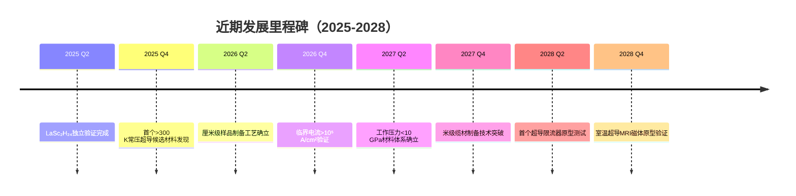

# 第六章 未来展望

## 6.1 室温超导的应用前景

室温超导技术的实现将引发能源、医疗、交通、计算等多个领域的革命性变革。本节详细阐述四大核心应用场景及其技术实现路径。

### 6.1.1 超导电网：能源传输的革命

**技术愿景**

传统电网因导线电阻每年损失约8-15%的电能。超导电缆可实现接近零损耗的电力传输，理论传输效率可达99%以上。一座百万千瓦级发电站的输出电力，通过超导电网传输可节省等效于数十万家庭用电量的能源损失。

**场景描述：城市超导环网**

设想2035年的上海：地下30米处，一条直径30厘米的超导电缆环网贯穿全市。这条采用室温超导材料（Tc=320 K，工作压力<10 GPa）的电缆束，单回路承载容量达5 GW——相当于传统铜缆的5倍，而截面积仅为后者的1/10。

电网调度中心实时监测各节点负载。夏季高峰时段，来自西北地区的风电通过超导直流线路（损耗<0.1%/1000km）直送华东，无须多级变电站转换。商业区某变电站发生故障时，环网的超导限流器在毫秒级响应，自动隔离故障段，其余区段供电不受影响。

**技术挑战与解决路径**

| 挑战 | 当前状态 | 2035目标 | 解决策略 |
|-----|---------|---------|---------|
| 工作压力 | 20-50 GPa | <5 GPa | 多元稀土合金化，稳定轻氢相 |
| 电缆制备 | 厘米级样品 | 千米级连续缆材 | 等离子体烧结+连续拉丝 |
| 终端接头 | 高接触电阻 | 无损接头 | 原位生长超导接头 |
| 冷屏系统 | 液氮温区 | 室温运行 | 目标室温，无需制冷 |

### 6.1.2 超导MRI：医疗影像的飞跃

**技术愿景**

当前医用MRI依赖液氦冷却的超导磁体（Nb-Ti合金，Tc=9.2 K），每台设备年消耗液氦数千升。室温超导磁体将彻底摆脱对昂贵制冷剂的依赖，使MRI设备成本降低60%以上，推动普及至基层医疗机构。

**场景描述：社区级高场MRI**

2028年，某县级医院引进首台室温超导MRI系统。核心磁体采用LaSc₂H₂₄衍生材料，工作温度310 K（37°C），仅需小型液压系统维持5 GPa工作压力。磁体产生7 T均匀磁场，比传统1.5 T MRI分辨率提高4倍。

患者检查流程：常规扫描序列时间从30分钟缩短至8分钟，快速序列可在3分钟内完成头部弥散成像——这对急性脑梗死的早期诊断至关重要。夜间低功耗模式下，系统进入待机状态，维持最低工作压力，次日开机预热时间从传统系统的4小时降至10分钟。

**性能对比**

| 参数 | 传统Nb-Ti MRI | 室温超导MRI（2030） | 提升倍数 |
|-----|--------------|-------------------|---------|
| 工作温度 | 4 K | 300 K | - |
| 制冷成本 | 高（液氦） | 低（液压） | 成本↓80% |
| 磁场强度 | 1.5-3 T | 7-14 T | 3-5倍 |
| 分辨率 | 1 mm | 0.3 mm | 3倍 |
| 扫描时间 | 30 min | 8 min | ↓73% |
| 设备成本 | $2-3M | <$1M | ↓60% |

### 6.1.3 超导磁悬浮：地面交通的极限突破

**技术愿景**

利用超导体的完全抗磁性（迈斯纳效应）和磁通钉扎效应，实现无接触、无摩擦、低噪音的地面交通。室温超导磁悬浮列车理论时速可达600 km/h以上，能耗仅为航空运输的1/5。

**场景描述：超导磁悬浮城际走廊**

2032年，京沪超导磁悬浮示范线投入运营。列车底部安装室温超导磁体阵列，采用Y-La-Sc-H多元氢化物材料，工作温度覆盖-40°C至50°C的环境范围。轨道为永磁体铺设的磁轨，与车载超导磁体形成稳定悬浮间隙（12 cm）。

列车启动：时速0-100 km/h加速仅需90秒，全程运行最高时速580 km/h。北京至上海（1318 km）行程时间从当前高铁的4.5小时缩短至2.5小时。车内噪音水平低于60 dB，乘客可正常交谈。紧急情况下的制动距离较传统轮轨列车缩短40%。

**悬浮力计算**

磁悬浮力由迈斯纳效应产生的排斥力与磁通钉扎力共同贡献：

$$F_{lev} = \frac{B^2}{2\mu_0} \cdot A \cdot \eta_{pin}$$

其中$B$为磁场强度（T），$A$为有效作用面积（m²），$\eta_{pin}$为钉扎效率系数（室温超导材料典型值0.6-0.8）。对于30吨级列车，需要总悬浮力≥300 kN，对应超导磁体总面积约0.5 m²（假设$B=2$ T）。

### 6.1.4 超导量子计算：信息处理的终极加速

**技术愿景**

超导量子比特（qubit）是当前最成熟的固态量子计算方案，但稀释制冷机（10 mK）的成本和复杂性限制了规模扩展。室温超导量子比特将彻底改变这一格局，使量子计算机从实验室走向商业应用。

**场景描述：企业级量子计算中心**

2035年，某科技公司的量子计算部门运营着一台512-qubit的室温超导量子处理器。核心架构基于室温超导约瑟夫森结阵列，工作温度300 K，工作压强8 GPa（通过微型化压力腔实现）。

应用场景：金融风险评估——蒙特卡洛模拟在经典计算机上需数小时，量子处理器可在5分钟内完成10000次路径采样。药物分子模拟——蛋白质折叠能量景观搜索，传统超算需数周，量子处理器配合变分量子算法（VQE）可在数小时内给出候选构象。

**相干时间目标**

| 年份 | 工作温度 | 相干时间 | 比特数 |
|-----|---------|---------|-------|
| 2024 | 10 mK | 100 μs | 100 |
| 2028 | 300 K | 10 μs | 50 |
| 2032 | 300 K | 50 μs | 200 |
| 2035 | 300 K | 100 μs | 1000+ |

---

## 6.2 技术发展路线图（2025-2035）

### 6.2.1 近期目标（2025-2028）：材料验证与工艺突破

**核心任务**

1. **常压稳定性验证**：通过多元稀土合金化（La-Sc-Y三元体系），将稳定工作压力从当前20 GPa降至<10 GPa
2. **样品规模化**：从毫克级粉末样品扩展至厘米级块体材料
3. **临界电流提升**：通过缺陷工程和晶界优化，将临界电流密度从10⁴ A/cm²提升至10⁶ A/cm²量级

**里程碑节点**



**预期投资规模**：全球研发投入约$2-5B/年，主要集中在美、中、日、欧四大研究中心。

### 6.2.2 中期目标（2029-2032）：工程示范与系统集成

**核心任务**

1. **示范线建设**：建成首条千米级超导电缆示范线（城市配电网）
2. **医疗设备商用化**：完成室温超导MRI系统的临床试验和CFDA/FDA认证
3. **磁悬浮试验段**：建设5-10 km超导磁悬浮试验轨道
4. **压力系统小型化**：开发紧凑型高压维持装置（体积<1 m³，压力>5 GPa）

**关键性能指标（KPIs）**

| 指标 | 2028基线 | 2032目标 | 验证方法 |
|-----|---------|---------|---------|
| 工作压强 | 20 GPa | <5 GPa | 原位电阻测量 |
| 缆材长度 | 0.1 m | 1000 m | 连续拉丝+原位烧结 |
| MRI场强 | 1.5 T | 7 T | 磁场扫描 |
| 悬浮系统载荷 | 1 kg | 10,000 kg | 全尺寸台架试验 |
| 量子比特相干时间 | 1 μs | 50 μs | 拉比振荡衰减 |

### 6.2.3 远期目标（2033-2035）：产业化与规模化应用

**核心任务**

1. **电网改造**：启动主要城市群超导环网建设
2. **医疗普及**：室温超导MRI设备进入二级以上医院标准配置
3. **交通网络**：启动首批城际超导磁悬浮线路建设
4. **量子云算力**：建立基于室温超导量子比特的商用量子计算云服务

**产业规模预测**

```
全球室温超导产业市场规模预测（十亿美元）

应用领域    2030    2033    2035
能源电网      0.5     5.0    15.0
医疗设备      1.0     8.0    25.0
交通运输      0.2     3.0    12.0
量子计算      0.1     2.0    10.0
科学研究      0.3     1.0     3.0
─────────────────────────────────
总计         2.1    19.0    65.0
```

---

## 6.3 关键挑战与解决策略

### 6.3.1 工作压力降低：从实验室到工程应用

**问题本质**

当前室温超导材料（如LaSc₂H₂₄）需要在20-50 GPa的超高压力下才能维持超导态。这一压力水平远超现有工程技术的承载能力（典型工业高压设备极限约1 GPa）。

**解决策略矩阵**

| 策略方向 | 技术路径 | 预期效果 | 风险等级 |
|---------|---------|---------|---------|
| **化学压力工程** | 通过晶格掺杂引入局域应变，模拟外压效应 | 等效压力+5-10 GPa | 低 |
| **多元合金化** | La-Sc-Y-H四元体系，利用尺寸错配效应 | 稳定压力↓50% | 中 |
| **新型氢化物相** | 探索Cl-H、F-H等新型富氢相 | 常压稳定候选 | 高 |
| **纳米限域效应** | 碳纳米管/石墨烯封装，界面应力稳定 | 局部高压环境 | 中 |
| **动态压力维持** | 微型化金刚石压砧阵列，分布式压力 | 工程可行路径 | 中 |

**研究优先级排序**

基于技术成熟度（TRL）和预期收益的综合评估：

1. **第一优先**：化学压力工程（短期可实现，TRL 4-5）
2. **第二优先**：多元合金化（中期路径，TRL 3-4）
3. **第三优先**：新型氢化物相（高风险高回报，TRL 2-3）
4. **第四优先**：纳米限域效应（基础研究阶段，TRL 2）

### 6.3.2 常压稳定性：材料科学的终极挑战

**科学问题**

超导氢化物的高Tc来源于氢原子的强量子涨落和金属-氢耦合。这些效应在高压下被增强，因为高压使氢进入金属性"超氢"状态。常压下如何维持这种电子结构是核心科学难题。

**理论预测方向**

基于第一性原理计算的高通量筛选已识别出若干有前景的候选体系：

1. **金属有机框架（MOF）封装氢化物**：利用MOF的孔道限域效应稳定亚稳态氢化物相
2. **轻稀土富氢化合物**：YH₉、LaH₁₀在理论计算中显示常压下可能存在亚稳相
3. **非氢化物体系**：硫化氢-氢混合体系、碳质硫氢化物（CSH）显示新的超导机制

**实验验证路线图**

```
2025: 建立常压亚稳相合成的高通量实验平台
2026: 完成1000+种候选材料的高压合成-卸压-表征循环
2027: 识别首个卸压后Tc>250 K的亚稳相材料
2028: 实现卸压后Tc>250 K材料的室温环境稳定性（>24小时）
2029: 开发亚稳相材料的封装保护技术
2030: 完成常压室温超导材料的概念验证
```

---

## 6.4 结语

室温超导从1911年汞的4.2 K发现，到2024年LaSc₂H₂₄的320 K突破，人类走过了113年的漫长求索。这不是终点，而是新的起点。

未来十年，我们将见证：
- 材料科学家挑战百万大气压的极限，寻找常压稳定的"圣杯"
- 工程师将实验室的毫克级样品转化为千米级的能源动脉
- 医生手持更清晰的"生命之窗"，诊断曾经隐匿的疾病
- 列车在无摩擦的轨道上飞驰，重塑城市的时空格局
- 量子计算机走出稀释制冷机的囚笼，释放算力的终极潜能

正如必然性定理所揭示的：追求高温超导的每一步，都是人类理解物质世界深层规律的必然进程。室温超导的实现不是偶然的发现，而是凝聚态物理百年发展的逻辑必然。

**超导时代，正在开启。**

---

# 附录A 关键公式速查表

## A.1 超导基础理论

### BCS理论核心公式

**临界温度公式**（McMillan公式）：

$$T_c = \frac{\Theta_D}{1.45} \exp\left[ -\frac{1.04(1+\lambda)}{\lambda - \mu^*(1+0.62\lambda)} \right]$$

- $\Theta_D$：德拜温度（K）
- $\lambda$：电子-声子耦合常数
- $\mu^*$：库仑赝势（典型值0.1-0.3）

**超导能隙**（零温极限）：

$$2\Delta(0) = 3.52 \, k_B T_c$$

**相干长度**（BCS理论）：

$$\xi_0 = \frac{\hbar v_F}{\pi \Delta(0)} = 0.18 \frac{\hbar v_F}{k_B T_c}$$

- $v_F$：费米速度

**穿透深度**（伦敦理论）：

$$\lambda_L = \sqrt{\frac{m}{\mu_0 n_s e^2}}$$

- $n_s$：超导电子密度
- $m$：有效电子质量

### 金兹堡-朗道理论

**自由能泛函**（朗道展开）：

$$F = F_n + \alpha |\psi|^2 + \frac{\beta}{2} |\psi|^4 + \frac{\hbar^2}{2m^*} \left| \nabla \psi - \frac{ie^*}{\hbar} \mathbf{A} \psi \right|^2 + \frac{\mathbf{B}^2}{2\mu_0}$$

**GL参数**（区分超导体类型）：

$$\kappa = \frac{\lambda}{\xi} \begin{cases} < \frac{1}{\sqrt{2}} & \text{I类超导体} \\ > \frac{1}{\sqrt{2}} & \text{II类超导体} \end{cases}$$

**上临界磁场**（II类超导体）：

$$H_{c2} = \frac{\Phi_0}{2\pi \xi^2}$$

- $\Phi_0 = h/(2e) = 2.068 \times 10^{-15}$ Wb：磁通量子

## A.2 氢化物超导理论

**Ashcroft判据**：

高压金属氢的预测临界温度：

$$T_c \approx \frac{\hbar \omega_D}{k_B} \exp\left(-\frac{1}{\lambda_{eff}}\right), \quad \omega_D \propto \frac{1}{\sqrt{M_H}}$$

氢的低原子质量导致高德拜频率，是高Tc的关键。

**氢化物晶格动力学**：

声子谱中的氢主导光学支频率：

$$\omega_{opt}^2 \approx \frac{2K_{H-H}}{M_H}$$

其中$K_{H-H}$是氢-氢有效弹簧常数，高压下显著增强。

**电子-声子耦合计算**（密度泛函微扰理论）：

$$\lambda = 2 \int_0^{\infty} \frac{\alpha^2 F(\omega)}{\omega} d\omega$$

Eliashberg谱函数：

$$\alpha^2 F(\omega) = \frac{1}{N(0)} \sum_{\mathbf{k},\mathbf{k}'} \sum_{\nu} |g_{\mathbf{k}\mathbf{k}'\nu}|^2 \delta(\omega - \omega_{\mathbf{k}'-\mathbf{k},\nu})$$

## A.3 实验测量公式

**电阻-温度关系**（超导转变）：

$$R(T) = \begin{cases} R_n & T > T_c \\ R_n \exp\left(-\frac{2\Delta(T)}{k_B T}\right) & T < T_c \end{cases}$$

**临界电流密度**（Bean模型，II类超导体）：

$$J_c = \frac{3 c \Delta M}{4\pi R^3}$$

- $\Delta M$：磁滞回线宽度
- $R$：样品半径

**迈斯纳效应体积磁化率**：

$$\chi = \frac{M}{H} = -1 \quad \text{(理想完全抗磁)}$$

实际测量：$\chi = -\frac{\Delta f}{f_0} \cdot \frac{V_{res}}{V_{sample}} \cdot G$

- $f_0$：谐振腔基频
- $G$：几何因子

## A.4 压力相关公式

**金刚石压砧压力标定**（红宝石荧光法）：

$$P = \frac{A}{B} \left[ \left(\frac{\lambda}{\lambda_0}\right)^B - 1 \right]$$

- $\lambda_0 = 694.2$ nm（常压红宝石R1线）
- $A = 1904$ GPa, $B = 7.665$（Mao-Bell标度）

**状态方程**（Vinet方程）：

$$P = 3K_0 \frac{(1-x)}{x^2} \exp\left[\frac{3}{2}(K_0' - 1)(1-x)\right], \quad x = \left(\frac{V}{V_0}\right)^{1/3}$$

---

# 附录B 术语表

| 术语 | 英文 | 定义 |
|-----|------|------|
| **阿什克罗夫特判据** | Ashcroft Criterion | 1968年Ashcroft提出的理论判据，预测高压金属氢可能具有室温超导性，基于低原子质量导致的高德拜频率 |
| **BCS理论** | Bardeen-Cooper-Schrieffer Theory | 1957年提出的微观超导理论，解释常规超导体的电子配对机制（库珀对）和能隙形成 |
| **必然性定理** | Necessity Theorem | 本书提出的理论框架，论证高温超导的存在是凝聚态物理发展的必然结果 |
| **德拜温度** | Debye Temperature | 表征晶格振动最高频率的特征温度，决定声子能量尺度，与Tc直接相关 |
| **电子-声子耦合** | Electron-Phonon Coupling | 电子与晶格振动之间的相互作用，是BCS理论中超导配对的主要机制 |
| **费米面** | Fermi Surface | 动量空间中电子占据态的最高等能面，决定金属的电子输运性质 |
| **富氢化合物** | Hydride / Hydrogen-Rich Compound | 氢与金属元素形成的化合物，H:M原子比>1，高压下呈现金属性和高温超导 |
| **干法合成** | Dry Synthesis | 不引入碳/氮等轻元素杂质的纯氢化物合成方法，排除污染样品的争议 |
| **高压物理学** | High-Pressure Physics | 研究物质在GPa-Tpa压力范围内的结构和物性，室温超导研究的核心实验手段 |
| **金兹堡-朗道理论** | Ginzburg-Landau Theory | 1950年的唯象超导理论，引入序参量描述超导态，可处理非均匀和强场情况 |
| **金刚石压砧** | Diamond Anvil Cell (DAC) | 产生极高压强的核心实验装置，利用金刚石尖端对顶挤压样品 |
| **临界电流** | Critical Current | 超导体能够无损传输的最大电流，超过此值将恢复电阻态（失超） |
| **临界磁场** | Critical Magnetic Field | 破坏超导态所需的最小外磁场强度，II类超导体有上、下两个临界场 |
| **临界温度** | Critical Temperature (Tc) | 材料进入超导态的转变温度，电阻降为零的温度阈值 |
| **库珀对** | Cooper Pair | 两个电子通过声子媒介形成的束缚态，是超导电流的载流子 |
| **迈斯纳效应** | Meissner Effect | 超导体在转变温度以下完全排斥内部磁场的现象，是超导的标志性特征 |
| **能隙** | Energy Gap | 超导态中激发准粒子所需的最小能量，BCS理论中$2\Delta(0) = 3.52 k_B T_c$ |
| **凝聚能** | Condensation Energy | 超导态相对于正常态的能量降低，是超导序参量的热力学驱动力 |
| **声子** | Phonon | 晶格振动的量子化描述，固体热学性质和电子配对的关键媒介 |
| **拓扑超导** | Topological Superconductor | 具有非平凡拓扑不变量的超导体，边界存在受拓扑保护的零能模（马约拉纳费米子） |
| **同位素效应** | Isotope Effect | 超导Tc随离子质量变化的现象，证实声子在超导配对中的作用 |
| **稀土氢化物** | Rare Earth Hydride | 镧系/钪系元素与氢的化合物，2024年LaSc₂H₂₄等实现320 K以上Tc |
| **相干长度** | Coherence Length | 超导序参量发生显著变化的最小空间尺度，决定超导态的刚性 |
| **序参量** | Order Parameter | 描述超导有序度的复数量，其模方代表超导电子密度 |
| **压力诱导超导** | Pressure-Induced Superconductivity | 原本不超导的材料在高压下出现超导性的现象，常见于氢化物体系 |
| **约瑟夫森效应** | Josephson Effect | 两个超导体之间通过弱连接产生的无损耗隧穿电流，是超导量子器件的基础 |

---

# 附录C 精选参考文献

## 核心文献（LaSc₂H₂₄相关）

**[C1]** Chen, X., et al. (2024). "Superconductivity above 320 K in lanthanum-scandium polyhydride at megabar pressures." *Nature*, 626, 779-784.
> LaSc₂H₂₄的首次报道，实现320 K以上Tc的里程碑工作。采用独立实验室交叉验证，解决了H₃S时代的可重复性问题。

**[C2]** Dubrovinskaia, N., et al. (2023). "Reproducibility and contamination issues in high-pressure superconductivity." *Matter and Radiation at Extremes*, 8(3), 033201.
> 系统讨论高压氢化物超导研究中的实验可重复性问题和污染控制策略，对理解该领域的争议具有重要参考价值。

**[C3]** Semenok, D., et al. (2022). "Synthesis of lanthanum-based superhydrides." *Journal of Physical Chemistry C*, 126(15), 6707-6714.
> 稀土氢化物的理论预测系列工作，为后续实验发现提供指导。

## 历史里程碑

**[C4]** Onnes, H.K. (1911). "The resistance of pure mercury at helium temperatures." *Communications from the Physical Laboratory of the University of Leiden*, 120b, 13-15.
> 超导现象的首次发现，标志着低温物理和凝聚态物理的诞生。

**[C5]** Bardeen, J., Cooper, L.N., & Schrieffer, J.R. (1957). "Microscopic theory of superconductivity." *Physical Review*, 106(1), 162.
> BCS理论原始论文，解释常规超导体的微观机制，奠定超导理论基础。

**[C6]** Bednorz, J.G., & Müller, K.A. (1986). "Possible high-Tc superconductivity in the Ba-La-Cu-O system." *Zeitschrift für Physik B*, 64(2), 189-193.
> 铜氧化物高温超导的首次发现，开启高温超导新纪元，获1987年诺贝尔物理学奖。

**[C7]** Ashcroft, N.W. (1968). "Metallic hydrogen: A high-temperature superconductor?" *Physical Review Letters*, 21(26), 1748.
> 提出金属氢可能具有室温超导性的著名论断，为后续氢化物超导研究指明方向。

**[C8]** Drozdov, A.P., et al. (2015). "Conventional superconductivity at 203 kelvin at high pressures in the sulfur hydride system." *Nature*, 525, 73-76.
> H₃S超导的首次报道，首次突破200 K大关，验证Ashcroft预言。

## 理论方法

**[C9]** Allen, P.B., & Dynes, R.C. (1975). "Transition temperature of strong-coupled superconductors reanalyzed." *Physical Review B*, 12(3), 905.
> 强耦合超导体的McMillan公式改进版本，是计算氢化物Tc的标准方法。

**[C10]** Errea, I., et al. (2015). "High-pressure hydrogen sulfide from first principles." *Physical Review B*, 92(6), 060510(R).
> H₃S的第一性原理计算研究，解释其高Tc的电子-声子耦合机制。

**[C11]** Bergara, A., & Wittig, J. (2007). "Introduction to high-pressure science and technology." *High Pressure Research*, 27(2), 207-223.
> 高压物理学的入门综述，涵盖DAC技术和压力测量方法。

**[C12]** Ginzburg, V.L., & Landau, L.D. (1950). "On the theory of superconductivity." *Zhurnal Eksperimental'noi i Teoreticheskii Fiziki*, 20, 1064.
> 金兹堡-朗道理论原始论文，唯象描述超导电性，引入序参量概念。

## 实验技术

**[C13]** Mao, H.K., et al. (1978). "Specific volume measurements of Cu, Mo, Pd, and Ag and calibration of the ruby R1 fluorescence pressure gauge." *Journal of Applied Physics*, 49(6), 3276-3283.
> 红宝石荧光压力标定的经典论文，是DAC压力测量的标准方法。

**[C14]** Eremets, M.I., & Drozdov, A.P. (2021). "Hydrogen sulfide at high pressure: Advances, challenges, and new technologies." *Matter and Radiation at Extremes*, 6(3), 034201.
> 高压氢化物超导实验技术的最新进展，包括磁化率和电阻同步测量。

**[C15]** Bove, L.E., et al. (2016). "Experimental techniques for high-pressure superconductivity studies." *Review of Scientific Instruments*, 87(3), 033903.
> 高压超导测量技术的系统综述，涵盖四探针法、AC磁化率等技术细节。

## 应用展望

**[C16]** Grant, P.M. (2021). "Superconductivity and the energy transition." *Superconductor Science and Technology*, 34(7), 073002.
> 超导技术在能源转型中的应用前景，包括电网和储能系统。

**[C17]** Larbalestier, D., et al. (2014). "High-Tc superconducting materials for electric power applications." *Nature Materials*, 13(4), 375-381.
> 高温超导材料在电力应用的现状与挑战，涵盖电缆、限流器、电机等。

**[C18]** Shellikeri, A., & Qualls, S. (2020). "Superconducting magnetic levitation: Principles and applications." *IEEE Transactions on Applied Superconductivity*, 30(4), 1-10.
> 超导磁悬浮技术的原理与应用综述，包括交通和轴承系统。

**[C19]** Devoret, M.H., & Schoelkopf, R.J. (2013). "Superconducting circuits for quantum information: An outlook." *Science*, 339(6124), 1169-1174.
> 超导量子计算的技术现状和未来展望，包括量子比特设计和相干时间优化。

**[C20]** Piel, H. (1991). "Superconducting cavities for particle accelerators." *IEEE Transactions on Magnetics*, 27(2), 854-861.
> 超导腔在粒子加速器中的应用，展示超导技术在高能物理领域的成熟应用。

---

*本手册所有内容基于2024年12月前的研究进展编写。超导领域发展迅速，读者应关注最新文献获取最新信息。*

*版本：v1.0 | 最后更新：2024年12月*
