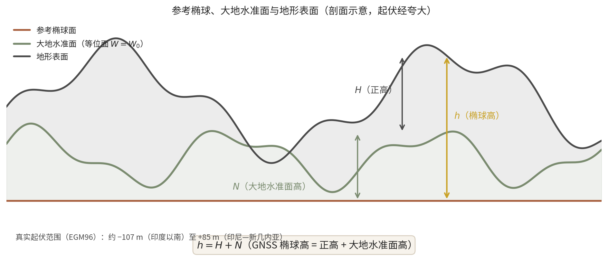
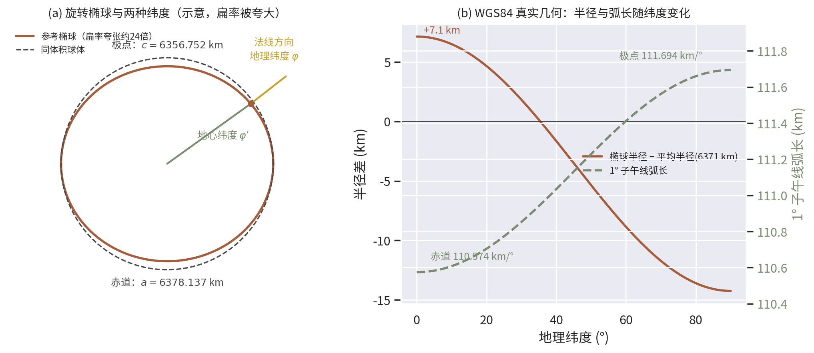
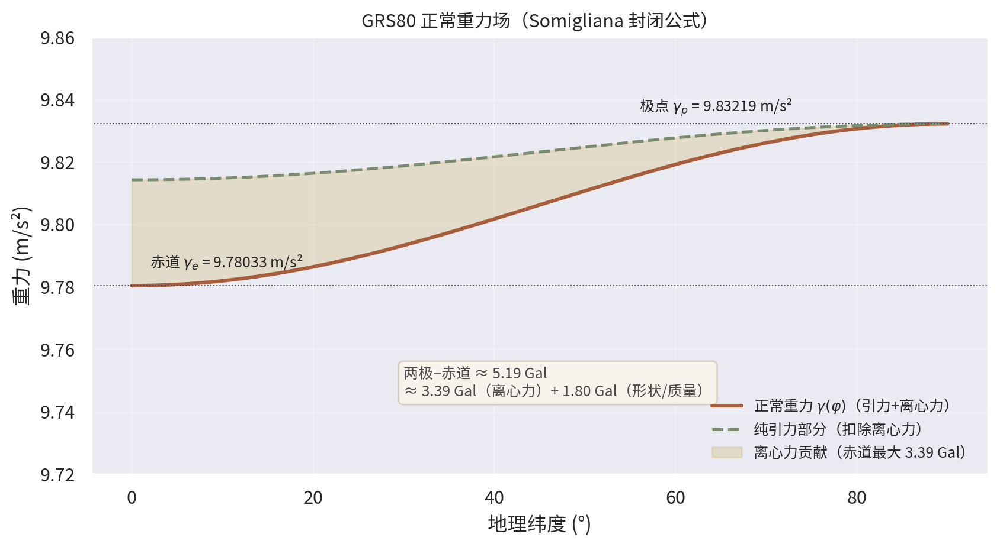
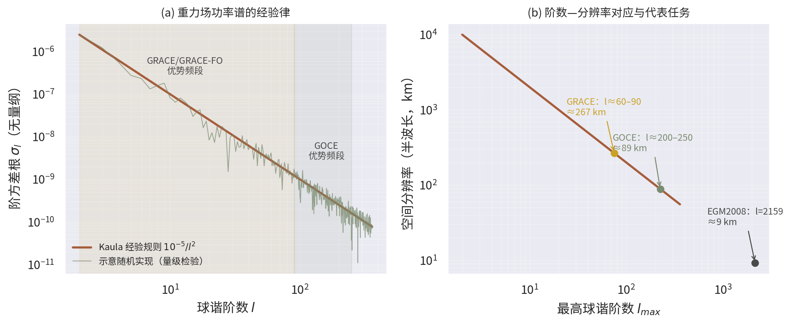

# 第1章 地球的形状、重力场与大地测量

**TOE-SYLVA 教科书系列 · 地球物理学**

> **本章导读**：地球不是一个球——这是大地测量学三百年求索得出的第一个结论。本章从"地球到底是什么形状"这一古老问题出发，讲述从埃拉托色尼的日影到法国大地测量远征、再到卫星重力的历史脉络；然后建立参考椭球、大地水准面与正常重力场的核心概念；推导 Clairaut 定理与 Somigliana 公式等经典结果；最后给出 WGS84/GRS80 的真实数值实例，并介绍 GRACE/GOCE 卫星重力与量子重力仪等前沿。阅读本章后，你应能解释为什么赤道比两极"凸出"21 km、为什么两极的重力比赤道大 0.5%，以及人类如何以厘米级精度测量这颗行星的形状与引力。

## 1.1 直觉与历史：地球到底是什么形状？

公元前 240 年左右，亚历山大图书馆馆长埃拉托色尼（Eratosthenes）完成了一项惊人的测量。他听说在埃及南部的赛伊尼（Syene，今阿斯旺），夏至正午的阳光可以直射井底——即太阳位于天顶；而在亚历山大港，同一天正午方尖碑的日影显示太阳偏离天顶 $7.2^{\circ}$，恰为圆周的五十分之一。假设地球是球体、太阳光平行，则两地的弧长应为地球周长的 $1/50$。商队测得两地相距约 5000 斯塔德（stadia），于是地球周长为 250000 斯塔德。按一种主流换算（埃及斯塔德约 157.5 m），这相当于约 39375 km——与真实子午线周长 40008 km 的偏差不到 2%[^torge2012]、[^stacey2008]。这个实验的全部仪器是一口井、一根碑和一支商队，其思想却包含了大地点位测量的全部精髓：**用天体角度之差乘以地面距离，反演行星的几何**。

两千年后，问题从"多大"变成"什么形状"。1687 年，牛顿在《自然哲学的数学原理》中论证：自转的地球必然在赤道方向隆起。直觉很简单——赤道处的自转线速度最大（约 465 m/s），若地球起初是球形流体，赤道物质会被"甩"出去一些，直到新的平衡建立。牛顿用流体静力平衡估算扁率约为 $1/230$[^newton1687]。然而 18 世纪初，卡西尼父子（Jacques Cassini 等）在法国境内测量的子午线弧长却暗示地球在两极方向更长——"长椭球"与"扁椭球"之争爆发。

解决争论的办法是直接比较不同纬度处 $1^{\circ}$ 纬度差的地面弧长：若地球是扁的，则高纬度处子午圈更"平"、曲率半径更大，$1^{\circ}$ 弧长应当更长。1735—1744 年，法国科学院派出两支远征队：一支赴秘鲁（今厄瓜多尔，Godin、Bouguer、La Condamine），一支赴拉普兰（Maupertuis、Clairaut、Celsius，1736—1737）。结果毫不含糊：拉普兰的 $1^{\circ}$ 弧长明显长于秘鲁的，牛顿获胜，地球是赤道隆起、两极扁平的**扁旋转椭球**[^clairaut1743]、[^torge2012]。随队的 Clairaut 于 1743 年出版《地球形状理论》，把这一几何问题建立为严格的流体力学问题，其中的著名定理（见 §1.3.3）至今仍是物理大地测量的基石。

此后三百年是精度不断刷新常数的历史：19 世纪各国弧度测量催生了 Hayford 椭球；苏联的克拉索夫斯基椭球（$a=6378245$ m，$f=1/298.3$，1940）长期用于欧亚制图；1967 年国际大地测量与地球物理联合会（IUGG）通过 GRS67，1980 年更新为 GRS80（$f=1/298.257222101$）[^moritz1980]；美国国防部建立的 WGS84（$f=1/298.257223563$）则因 GPS 而成为全球事实标准[^nima2000]。1957 年第一颗人造卫星升空后，人们发现卫星轨道的微小摄动直接"称量"出地球引力场的非球形部分，大地测量从此进入卫星时代；2000 年以后，CHAMP、GRACE、GOCE 等专用重力卫星把全球重力场的测量精度推进到厘米级大地水准面[^pavlis2012]、[^pail2011]。

## 1.2 核心概念：三个"面"与三种高度

日常说"海拔"，物理上却对应着三个不同的参考面，混淆它们是初学者最常见的错误：

1. **地形表面**：我们站立其上的真实地表，起伏从马里亚纳海沟约 $-11$ km 到珠峰 $+8.8$ km。
2. **大地水准面（geoid）**：与全球平均海平面密合的那个**重力等位面**，并假想延伸到大陆之下。由于地球内部密度分布不均，等位面处处"皱褶"，相对参考椭球的起伏（大地水准面高 $N$）约为 $-107$ m（印度以南）至 $+85$ m（印尼—新几内亚一带，EGM96 模型）[^lemoine1998]。它是"真正的水平面"——水准仪的气泡、铅垂线都以其为准。
3. **参考椭球面**：人为选定的数学规则曲面（如 WGS84 椭球），用于计算几何坐标。GNSS 接收机解算的高度天然以它为基准。

{width=14.5cm}

于是有三种高度：GNSS 给出的**椭球高** $h$、水准测量给出的**正高** $H$（沿铅垂线到大地水准面的弧长），以及两者之差即**大地水准面高** $N$：

$$h = H + N$$

GNSS 能以毫米级精度测 $h$，但工程建设、洪水模拟需要的是"水往低处流"的正高 $H$，二者换算完全依赖高精度大地水准面模型 $N$——这正是重力场测量的最直接经济价值。

与"面"对应的是"力"。地面静止物体受两个力：地球质量分布产生的**引力**与地球自转参考系中的**离心力**，二者合成为**重力**。赤道处离心加速度 $\omega^2 a \approx 0.0339\ \mathrm{m/s^2}$，约为重力的 1/288——这就是牛顿断言地球会变扁的物理来源。重力在空间逐点变化：海拔升高它减小，纬度升高它增大，地下密度异常使它涨落。把实测重力与一个规则参考模型（**正常重力场**，§1.3.4）相减，剩余部分称为**重力异常**，它是透视地下密度结构的窗口。

## 1.3 数学表述：从椭球几何到重力场理论

### 1.3.1 参考椭球的几何

旋转椭球由长半轴 $a$（赤道半径）与短半轴 $c$（极半径）定义，两个等价的形状参数是**扁率**与**第一偏心率**：

$$f = \frac{a-c}{a}, \qquad e^2 = \frac{a^2-c^2}{a^2} = f(2-f)$$

WGS84 给出 $a=6378137.0$ m，$1/f=298.257223563$，由此 $c=6356752.3142$ m，赤道比两极凸出约 21.4 km[^nima2000]。$1/298$ 的扁率意味着：若把地球缩成直径 1 m 的球，赤道与两极的半径差只有 1.7 mm——比多数台球还要圆，但这微小的差异却决定了重力、气候与航天的一切细节。

椭球面上一点 P 的**地理纬度** $\varphi$ 是过 P 的椭球法线与赤道面的夹角；而**地心纬度** $\varphi'$ 是 P 与地心连线的倾角（图 1.1a）。二者关系为

$$\tan\varphi' = \frac{c^2}{a^2}\tan\varphi = (1-e^2)\tan\varphi$$

最大偏差出现在 $45^{\circ}$ 附近，约 $11.5$ 角分——足以让 19 世纪的天文定位产生公里级误差，这正是当年必须用大地测量"校准"天文坐标的原因。

沿子午线（经线）移动时，弧长微元由**子午圈曲率半径**决定：

$$M(\varphi) = \frac{a(1-e^2)}{(1-e^2\sin^2\varphi)^{3/2}}, \qquad ds = M(\varphi)\,d\varphi$$

与之垂直方向的**卯酉圈曲率半径**为 $N(\varphi) = a/\sqrt{1-e^2\sin^2\varphi}$。由此可得 $1^{\circ}$ 纬差的地面弧长在赤道为 110.574 km、在两极为 111.694 km（图 1.1b）——拉普兰与秘鲁两支远征队测量的正是这个差异，约 1.1 km 的系统性差距在 18 世纪的测量精度下清晰可辨，扁椭球由此确立。

{width=15.5cm}

### 1.3.2 重力与重力势

在随地球自转的参考系中，单位质量质点的重力场写为引力场与离心力场之和，二者都是势场的梯度：

$$\mathbf{g} = \nabla W, \qquad W = V + \Phi, \qquad \Phi = \frac{1}{2}\omega^2\left(x^2+y^2\right)$$

其中 $V$ 为引力势，$\Phi$ 为离心势，$\omega=7.292115\times10^{-5}\ \mathrm{rad/s}$ 为地球自转角速度。引力势在地球外部满足 Laplace 方程

$$\nabla^2 V = 0 \quad \text{（外部）}, \qquad \nabla^2 V = -4\pi G\rho \quad \text{（内部）}$$

大地水准面正是等位面 $W = W_0$（$W_0$ 为某一约定常数）；"水平"即沿等位面切向，"竖直"即 $\nabla W$ 方向。由于 $V$ 反映真实质量分布而真实分布并不规则，等位面一族是彼此不平行的皱褶曲面——这就是"大地水准面起伏"的势论表述。

### 1.3.3 从 Newton 估算到 Clairaut 定理

对密度均匀的流体自转球（Maclaurin 椭球的小扁率极限），一阶理论给出扁率与"离心引力比"的定量关系：

$$f \simeq \frac{5}{4}q, \qquad q = \frac{\omega^2 a^3}{GM}$$

代入地球数值 $q \approx 1/288.9$，得 $f \approx 1/231$——这正是牛顿 $1/230$ 估算的来源。均匀流体假设过于粗糙；1743 年 Clairaut 证明了一个深刻得多的定理：对**任意密度分层**（密度只沿径向变化）的流体静力平衡地球，一阶精度下几何扁率与"重力扁率"之和由自转唯一决定[^clairaut1743]、[^hma]：

$$f + \beta = \frac{5}{2}m, \qquad \beta = \frac{\gamma_p - \gamma_e}{\gamma_e}, \qquad m = \frac{\omega^2 a^2 c}{GM} \approx \frac{1}{289.9}$$

其中 $\gamma_e$、$\gamma_p$ 为赤道与极点的重力值。这一定理的伟大之处在于**把两种完全不同的测量联系起来**：量出几何扁率（弧度测量）和重力随纬度的变化（摆锤测量），若地球是流体静力平衡的，二者之和必须等于 $(5/2)m$。18—19 世纪的摆锤观测大致证实了它，而现代精密测量发现的小偏差（见 §1.4）恰恰成了研究地幔非静力效应（地幔对流、冰后回弹）的线索。

### 1.3.4 Somigliana 公式与正常重力场

实际工作需要一个规则的参考模型：选一个与真实地球"最接近"的旋转椭球，使其表面本身就是重力等位面，其外部重力场称为**正常重力场**。正常重力在椭球面上有封闭解析表达式——Somigliana 公式[^hma]、[^moritz1980]：

$$\gamma(\varphi) = \gamma_e\,\frac{1 + k\sin^2\varphi}{\sqrt{1-e^2\sin^2\varphi}}, \qquad k = \frac{c\,\gamma_p}{a\,\gamma_e} - 1$$

GRS80 的常数为 $\gamma_e = 9.7803267715\ \mathrm{m/s^2}$、$\gamma_p = 9.8321863685\ \mathrm{m/s^2}$、$k = 0.001931851353$、$e^2 = 0.00669438002290$[^moritz1980]。数值计算时常用其级数形式（GRS80 系数）：

$$\gamma = 9.7803267715\left(1 + 0.0052790414\sin^2\varphi + 0.0000232718\sin^4\varphi + 0.0000001262\sin^6\varphi\right)\ \mathrm{m/s^2}$$

这就是教科书中"Clairaut 重力公式"的现代形式。图 1.2 给出其随纬度的变化：从赤道到两极重力增大约 5.19 Gal（1 Gal = 1 cm/s²），其中约 3.39 Gal 来自离心力随纬度的减小，约 1.80 Gal 来自形状与质量分布（极点离地心更近）。一个 70 kg 的人在两极比在赤道"重"约 360 g——足以被精密体重计测出，也是重力摆仪时代探测扁率的信号。

{width=14cm}

### 1.3.5 重力场的球谐展开

正常重力场只描述"平均的扁地球"，真实引力场的丰富细节要在球坐标下作多极展开。外部引力势的通解为[^kaula1966]、[^lemoine1998]：

$$V(r,\varphi,\lambda) = \frac{GM}{r}\left[1 - \sum_{l=2}^{\infty}\left(\frac{a}{r}\right)^{l}\sum_{m=0}^{l}\bar{P}_{lm}(\sin\varphi)\left(\bar{C}_{lm}\cos m\lambda + \bar{S}_{lm}\sin m\lambda\right)\right]$$

其中 $\bar{P}_{lm}$ 为完全正常化的连带 Legendre 函数，系数 $\bar{C}_{lm}$、$\bar{S}_{lm}$ 由观测（卫星轨道、卫星测距、地面重力）反演确定。带谐系数 $J_l = -\bar{C}_{l0}$ 中最重要的是

$$J_2 = 1.08263\times10^{-3}$$

它直接度量动力学扁率，与几何扁率由一阶关系 $f \simeq \tfrac{3}{2}J_2 + \tfrac{1}{2}m$ 相联系（数值检验见 §1.4）。系数的整体衰减服从著名的 Kaula 经验规则：阶方差根 $\sigma_l \approx 10^{-5}/l^2$，即重力场能量集中在长波长，越往短波长越弱（图 1.3a）——这也是为什么低轨卫星对低阶项敏感、测定 $J_2$ 最先成熟。球谐阶数 $l$ 与空间分辨率的对应约为半波长 $\lambda/2 \approx 20000/l$ km：GRACE 主攻 $l \lesssim 90$（约 300 km），GOCE 延伸到 $l \sim 250$（约 100 km），而融合地面数据的 EGM2008 达到 $l=2159$（约 9 km）[^pavlis2012]、[^pail2011]。

{width=15.5cm}

### 1.3.6 重力异常与 Stokes 积分

实测重力 $g$ 归算到参考面并与正常重力比较，定义出各类重力异常。两个最常用的归算是**自由空气改正**（只扣除高度效应，每米约 0.3086 mGal）与**布格改正**（再扣除测点与参考面之间岩层的引力，厚度 $h$、密度 $\rho$ 的无限平板引力为 $2\pi G\rho h$）：

$$\delta g_{FA} = 0.3086\,h\ \mathrm{mGal}\ (h\ \text{以 m 计}), \qquad \delta g_{B} = 0.04193\,\rho\,h\ \mathrm{mGal}\ (\rho\ \text{以 g/cm}^3\text{ 计})$$

布格异常把地形"剥掉"，暴露的是地下密度异常：矿体、盆地基底起伏、莫霍面深度变化都在其中留下指纹。1849 年 Stokes 证明，若全球重力异常已知，大地水准面高可由面积分严格求出[^stokes1849]：

$$N = \frac{R}{4\pi\gamma}\iint \Delta g\, S(\psi)\,d\Omega$$

其中 $S(\psi)$ 为 Stokes 核函数，$\psi$ 为积分点与计算点的角距。这一公式是物理大地测量的"反问题原型"：从遍布全球的观测量还原一个等位面的形状，其病态性与正则化处理也是第 6 主题（勘探地球物理与反演）将要反复面对的数学结构。

## 1.4 数值实例

**基本常数表**（GRS80/WGS84，均为定义值或由定义值导出）[^moritz1980]、[^nima2000]：

| 量 | 数值 | 说明 |
|---|---|---|
| 长半轴 $a$ | 6378137.0 m | 两系统相同 |
| 扁率 $1/f$ | 298.257222101（GRS80）/ 298.257223563（WGS84） | 定义值 |
| 短半轴 $c$ | 6356752.3142 m（WGS84） | 导出值 |
| 地心引力常数 $GM$ | $3.986004418\times10^{14}\ \mathrm{m^3/s^2}$（WGS84） | 含大气 |
| 自转角速度 $\omega$ | $7.292115\times10^{-5}\ \mathrm{rad/s}$ | — |
| $J_2$ | $1.08263\times10^{-3}$ | 动力学扁率 |
| 赤道正常重力 $\gamma_e$ | 9.7803267715 m/s²（GRS80） | Somigliana |
| 极点正常重力 $\gamma_p$ | 9.8321863685 m/s²（GRS80） | Somigliana |

**例 1（Eratosthenes 复现）**：$7.2^{\circ}/360^{\circ}=1/50$，$5000\times50=250000$ 斯塔德。若取 157.5 m/斯塔德，周长为 39375 km，相对 40008 km 偏差约 1.6%——误差主要来自两地并不严格同经度、距离由商队步测估计。

**例 2（弧长与远征）**：由 $M(\varphi)$ 算得 $1^{\circ}$ 弧长：赤道 110.574 km，两极 111.694 km，差 1.12 km。1730 年代的测量队用基线尺与三角网即可分辨这一差异；今日 GNSS 两秒观测即可给出毫米级结果，方法升级了，几何仍是同一个几何。

**例 3（重力数值）**：Somigliana 公式给出 $\gamma(45^{\circ}) = 9.806199\ \mathrm{m/s^2}$；两极与赤道之差 $\gamma_p-\gamma_e = 0.051860\ \mathrm{m/s^2} = 5.186$ Gal。分解：离心效应 $\omega^2 a = 0.03392\ \mathrm{m/s^2}$（3.39 Gal，约 65%），形状与质量分布效应约 1.80 Gal（35%）。

**例 4（Clairaut 定理的数值检验）**：$f = 3.35281\times10^{-3}$，$\beta = (\gamma_p-\gamma_e)/\gamma_e = 5.30244\times10^{-3}$，故 $f+\beta = 8.6553\times10^{-3}$；而 $(5/2)m = 8.6245\times10^{-3}$（$m = \omega^2a^2c/GM = 3.44979\times10^{-3}$）。两者相差约 0.36%，来源有二：Clairaut 定理本身只是一阶近似（二阶项量级 $fm\sim10^{-5}$），以及真实地球并非严格流体静力平衡。类似的，一阶关系 $f \simeq \tfrac32 J_2 + \tfrac12 m$ 给出 $1/f \approx 298.61$，与真实 $1/f=298.257$ 之差同样在提示二阶与非静力修正。现代研究给出的流体静力平衡扁率约为 $1/299.6$，即真实地球比"纯流体地球"还要再扁一点；这部分"多余扁率"被广泛归因于地幔对流的动力学支撑与末次冰期冰后回弹的残余信号[^chambat2010]——形状测量就这样变成了深部动力学的探针。

**例 5（重力归算量级）**：青藏高原某点 $h=5000$ m，自由空气改正达 $0.3086\times5000 = 1543$ mGal（超过总重力异常的任何细节信号）；取地壳密度 $\rho=2.67\ \mathrm{g/cm^3}$，布格板改正为 $0.04193\times2.67\times5000 \approx 560$ mGal。归算的巨大数值提醒我们：**异常分析的全部可靠性都压在高度与地形资料的精度上**。

## 1.5 应用与前沿

**高程基准现代化**：传统水准测量以"点"传递高度，费时且累积误差；GNSS+大地水准面模型可直接把椭球高转换为正高。EGM2008（$l=2159$）在全球多数地区提供分米级、局部厘米级的 $N$[^pavlis2012]，各区域模型（如利用 GOCE+地面资料精化的区域似大地水准面）进一步达到厘米级，正在使"水准测量数字化"。

**时变重力与水循环**：GRACE（2002—2017，双星微波测距，微米级测距精度）与 GRACE-FO（2018—）逐月反演全球重力场变化，其本质是对地球表层**质量迁移**的积分称量：格陵兰与南极冰盖的质量亏损、加州中央谷地与华北平原的地下水超采、亚马逊流域的季节性蓄水，乃至大地震引起的质量重排，都以微 Gal 级的时变信号呈现[^tapley2004]、[^wahr2004]。这是行星尺度的"体重秤"，为水文学与气候科学提供了独一无二的数据类型。

**重力梯度与下一代任务**：GOCE（2009—2013）在约 250 km 低轨用静电重力梯度仪直接测量引力势二阶导数，把静态大地水准面的全球精度推到厘米量级、空间分辨率约 100 km[^pail2011]。后继任务（NGGM/MAGIC 等计划）目标是 mm 级精度与更高时空分辨率。

**绝对重力与量子传感**：冷原子干涉绝对重力仪已能实现 $10^{-9}g$ 量级的可搬运测量[^menoret2018]，无需激光落体光路磨损问题，正在为火山监测（岩浆房质量变化）、地下水动态与国家计量基准确立新标准。

**行星大地测量**：同一套理论适用于一切有形状与引力的天体。月球 GRAIL 双星任务（2012）以空前的精度测定月球重力场，揭示出极薄的月壳与深埋的岩浆海遗迹[^zuber2013]；火星、金星、木卫的重力场均已成为约束其内部结构的首要观测（见本书行星地球物理章节）。

## 1.6 本章小结

- 地球的真实形状是赤道隆起、两极扁平的旋转椭球：$f=1/298.257$，赤道半径比极半径大 21.4 km；这由 Eratosthenes 式的弧度测量思想经三百年演进测定。
- 三个面不能混：地形表面、大地水准面（等位面 $W=W_0$）、参考椭球面；$h=H+N$ 连接 GNSS 世界与水准世界。
- 重力 = 引力 + 离心力。Clairaut 定理 $f+\beta=\tfrac52 m$ 把几何扁率与重力扁率绑定为自转的函数；其微小失效是地幔动力学的信号。
- Somigliana 公式给出正常重力：赤道 9.78033、两极 9.83219 m/s²，纬度效应约 5.19 Gal。
- 引力势球谐展开中 $J_2=1.08263\times10^{-3}$ 最重要；Kaula 规则 $\sigma_l\approx10^{-5}/l^2$ 描述谱衰减；阶数 $l$ 对应半波长分辨率 $20000/l$ km。
- Stokes 积分从全球重力异常反演大地水准面高，是重力反演的原型。
- 前沿：GRACE/GRACE-FO 时变重力"称量"全球水循环与冰盖，GOCE 与未来重力梯度任务推进静态场精度，量子重力仪革新绝对测量，行星重力场成为比较行星学核心数据。

## 1.7 交叉联系

| 联系对象 | 联系维度 | 具体联系 |
|---|---|---|
| 本书第2章《地震学与地球内部结构成像》 | 观测约束 | 地震走时只直接约束波速；地球总质量（$GM$）、转动惯量（经 $J_2$）与表面重力是密度模型的首要边界条件，PREM 的密度剖面正是在这些大地测量约束下反演的；Adams–Williamson 方程把波速剖面与重力自洽的密度剖面联系起来 |
| 本书后续章节·地磁学（综述 §4.2） | 自转框架 | 地磁发电机的磁流体动力学在同一自转参考系中写出，Coriolis 力同时主导外核流与扁率—自转耦合；自转参数（$\omega$、岁差章动）是两章共用的基本观测量 |
| 本书后续章节·地幔对流与热演化（综述 §5） | 动力学因果 | 长波大地水准面起伏（$l\lesssim10$）主要由地幔密度异常与核幔边界、地表的动力地形共同产生；实测扁率超出流体静力值的部分（§1.4 例 4）是对流支撑的直接证据 |
| 本书后续章节·勘探地球物理与反演（综述 §6） | 方法传承 | 布格异常分析是重力勘探的核心；Stokes 积分的病态性与离散化正则化是地球物理反演理论（Tikhonov、贝叶斯）的经典案例 |
| 本书后续章节·行星地球物理（综述 §7） | 理论平移 | 形状—扁率—$J_2$—流体静力偏离的诊断链条直接平移到火星、月球与冰卫星；GRAIL、火星轨道器的重力场反演使用与本章完全相同的球谐框架 |
| 地球物理学_综述 §4.1 | 内容对应 | 综述 §4.1 给出重力场球谐展开与 GRACE 观测的浓缩论述，本章是其教科书化展开；综述 §9 的 SYLVA 模块交叉表给出更高层框架定位 |
| 等离子体物理_综述 §2 | 物理机制 | 自转流体中的 MHD 方程（磁层、地磁发电机）与本章自转参考系动力学共享 Coriolis 项与 Rossby 数语言 |
| 量子场论与粒子物理_综述 §二、§五 | 数学方法 | 引力势多极展开与场论中的多极展开、Stokes 核与 Green 函数方法同构；Kaula 谱的多尺度衰减与重整化群"逐级积分"思想相映照 |
| 统计物理与相变_综述 §3 | 物态约束 | 地幔矿物相变（410/660 km 不连续面）改变密度剖面，从而在低阶重力系数与大地水准面中留下可检信号；相变 Clapeyron 斜率决定其动力学表现 |
| SYLVA 模块（综述 §9） | 框架定位 | SYLVA_GravitationCosmology（引力理论与精密测量）、SYLVA_DifferentialGeometry（椭球几何与大地线）、SYLVA_CausalDynamics（形状偏差→对流因果链）为本章提供统一理论锚点 |

## 1.8 延伸阅读建议

- Torge & Müller《Geodesy》（第 4 版）第 2—3 章：参考系与重力场理论的现代标准叙述[^torge2012]。
- Heiskanen & Moritz《Physical Geodesy》第 1—2 章：Clairaut 定理与 Stokes 理论的 classic 推导，值得逐行研读[^hma]；其现代修订版 Hofmann-Wellenhof & Moritz《Physical Geodesy》更易获得[^hm2005]。
- Stacey & Davis《Physics of the Earth》（第 4 版）关于重力与形状的章节：把大地测量放进地球物理整体图景[^stacey2008]。
- Moritz（1980）与 NIMA TR8350.2：GRS80 与 WGS84 的原始定义文件，查常数请回到源头[^moritz1980]、[^nima2000]。
- 本系列《地球物理学_综述》§4.1：快速回顾本章内容在整个学科中的位置，并通向 SYLVA 框架交叉表（§9）。

[^torge2012]: Torge, W. & Müller, J. Geodesy (4th ed.). De Gruyter, 2012.
[^stacey2008]: Stacey, F. D. & Davis, P. M. Physics of the Earth (4th ed.). Cambridge University Press, 2008.
[^newton1687]: Newton, I. Philosophiæ Naturalis Principia Mathematica. London, 1687.
[^clairaut1743]: Clairaut, A.-C. Théorie de la Figure de la Terre, Tirée des Principes de l'Hydrostatique. Paris, 1743.
[^hma]: Heiskanen, W. A. & Moritz, H. Physical Geodesy. W. H. Freeman, 1967.
[^hm2005]: Hofmann-Wellenhof, B. & Moritz, H. Physical Geodesy. Springer, 2005.
[^moritz1980]: Moritz, H. Geodetic Reference System 1980. Bulletin Géodésique, 54(3), 395-405, 1980.
[^nima2000]: National Imagery and Mapping Agency. Department of Defense World Geodetic System 1984: Its Definition and Relationships with Local Geodetic Systems (TR8350.2, 3rd ed.). NIMA, 2000.
[^stokes1849]: Stokes, G. G. On the variation of gravity at the surface of the Earth. Transactions of the Cambridge Philosophical Society, 8, 672-695, 1849.
[^kaula1966]: Kaula, W. M. Theory of Satellite Geodesy: Applications of Satellites to Geodesy. Blaisdell, 1966.
[^lemoine1998]: Lemoine, F. G., et al. The Development of the Joint NASA GSFC and National Imagery and Mapping Agency (NIMA) Geopotential Model EGM96. NASA/TP-1998-206861, 1998.
[^pavlis2012]: Pavlis, N. K., Holmes, S. A., Kenyon, S. C. & Factor, J. K. The development and evaluation of the Earth Gravitational Model 2008 (EGM2008). Journal of Geophysical Research: Solid Earth, 117, B04406, 2012.
[^tapley2004]: Tapley, B. D., Bettadpur, S., Ries, J. C., Thompson, P. F. & Watkins, M. M. GRACE measurements of mass variability in the Earth system. Science, 305(5683), 503-505, 2004.
[^wahr2004]: Wahr, J., Swenson, S., Zlotnicki, V. & Velicogna, I. Time-variable gravity from GRACE: First results. Geophysical Research Letters, 31, L11501, 2004.
[^pail2011]: Pail, R., et al. First GOCE gravity field models derived by three different approaches. Journal of Geodesy, 85(11), 819-843, 2011.
[^chambat2010]: Chambat, F., Ricard, Y. & Valette, B. Flattening of the Earth: further from hydrostaticity than previously estimated. Geophysical Journal International, 183(2), 727-732, 2010.
[^zuber2013]: Zuber, M. T., et al. Gravity field of the Moon from the Gravity Recovery and Interior Laboratory (GRAIL) mission. Science, 339(6120), 668-671, 2013.
[^menoret2018]: Ménoret, V., et al. Gravity measurements below $10^{-9}\,g$ with a transportable absolute quantum gravimeter. Scientific Reports, 8, 12300, 2018.
