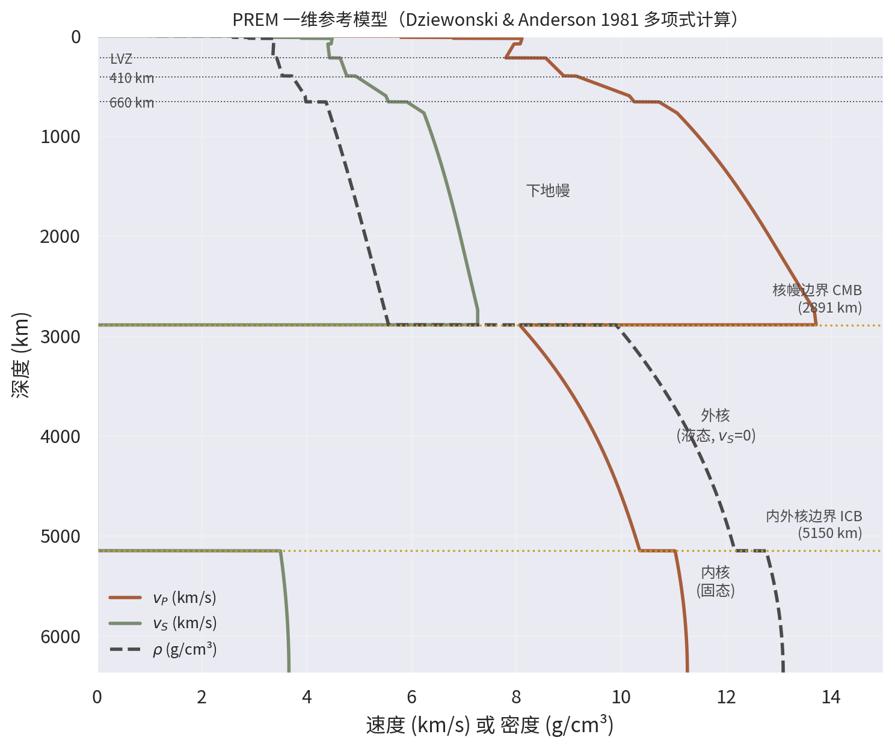
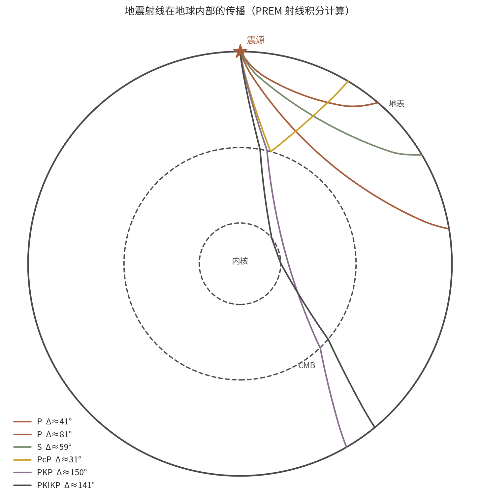
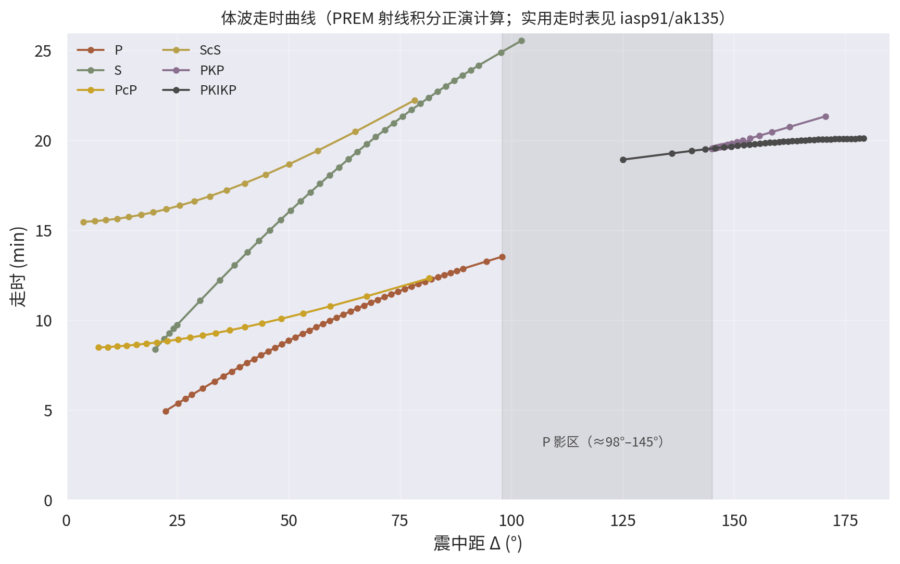
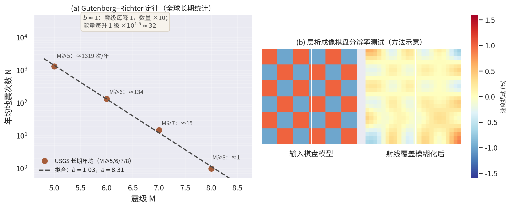

# 第2章 地震学与地球内部结构成像

**TOE-SYLVA 教科书系列 · 地球物理学**

> **本章导读**：地震波是目前唯一能够"穿透"整个地球并带回深部信息的物理信使。本章讲述人类如何从一个世纪前的模拟地震图出发，一步步发现地壳、地幔、液态外核与固态内核的圈层结构；建立射线理论与走时分析的核心数学（球对称 Snell 定律、Benndorf 关系、Herglotz–Wiechert 反演）；用 PREM 模型做一组真实的正演计算（走时表、射线路径、影区）；并介绍从 Gutenberg–Richter 统计、矩震级标度到三维层析成像与全波形反演（FWI）的方法论跃迁。本章的全部走时曲线均由 PREM 多项式直接积分得到，并与国际通行的 iasp91 走时表交叉核对（偏差约 20 秒以内）。

## 2.1 直觉与历史：给地球做"透视"

1889 年，德国波茨坦的地震仪记录到一场发生在日本的地震——人类第一次意识到，地震波可以把数千公里之外的事件"寄送"到记录纸上。19 世纪末 Milne 等人建立起现代地震仪与全球台网的雏形，分散在各地的记录开始可以被汇总比较：同一个地震，在不同距离的台站，波至时间不同。**走时与距离的关系里，隐藏着波所穿过介质的全部秘密**。

反演这些秘密的历史是一连串漂亮的侦探故事。1906 年，Oldham 分析大地震的走时数据时发现：震中距超过约 $130^{\circ}$ 后，P 波显著迟到——仿佛波在途中"绕了远路"。他据此推断地球内部存在一个波速骤降的**地核**[^oldham1906]。1909 年，克罗地亚地震学家 Mohorovičić 分析 1909 年 10 月 Kulpa 山谷地震时，在近距离台站辨认出两组 P 波到时：沿地壳横向传播的"直达波"与在更深界面上折射返回的"首波"。两组到时的交叉点给出地壳厚度约 50 km——这个界面今天以他命名（Moho 面）[^moho1909]。1913 年，Gutenberg 系统利用影区边缘的数据定出核幔边界深度约 2900 km，与现代值 2891 km 惊人地接近[^gutenberg1913]。1936 年，丹麦地震学家 Inge Lehmann 注意到本应是"P 波影区"的 $105^{\circ}\sim142^{\circ}$ 范围内仍出现微弱的纵波信号（她记为 P′ 相），唯一的解释是地球中心还有一个能把波重新折射出来的**固态内核**[^lehmann1936]。

1940 年 Jeffreys 与 Bullen 汇编的《地震学表》（JB 走时表）让全球地震定位有了统一标准[^jb1940]；1960 年代初为监测核试验而建立的世界标准地震台网（WWSSN）把记录质量与全球覆盖推上新高度，直接支撑了板块构造理论的观测确认。1960—1970 年代，Aki 等人把医学 CT 的思想引入地震学：**走时层析成像**由此诞生[^aki1976]；1981 年 Dziewonski 与 Anderson 汇总体波、面波与自由振荡数据，给出至今仍是一维参考模型基准的 PREM[^prem]；1984 年 Tarantola 在勘探领域系统提出波形反演[^tarantola1984]，演化为今天的全波形反演（FWI）；2000 年代以后，伴随法层析成像、背景噪声成像与机器学习震相识别相继成熟，地震学进入了"用全部波形、反演全部结构"的时代[^tromp2005]、[^shapiro2004]、[^ross2018]。

## 2.2 核心概念：波、震相与震级

**两类体波**。弹性介质中的扰动分解为两种独立传播的波：**P 波**（纵波，质点沿传播方向运动，速度快，总是最先到达）与 **S 波**（横波，质点垂直于传播方向运动，速度约为 P 波的 $1/\sqrt{3}\sim1/1.8$）。液体不能承受剪切，故 S 波无法穿过液态外核——这是判断外核为液态的直接证据。除了穿透内部的体波，沿界面传播的**面波**（Rayleigh 波、Love 波）携带浅部结构信息，而整个地球在大地震后还会像钟一样作**自由振荡**（基频振型 $_0S_2$ 周期约 54 分钟，径向振型 $_0S_0$ 约 20.5 分钟）[^dahlen1998]。

**仪器与台网**。地震仪记录的是地面运动本身：现代宽频带仪器以三分量（东西、南北、垂直）输出速度与加速度，动态范围超过 140 dB，既能记录几赫兹的近震信号，也能记录周期上千秒的自由振荡。分析员（或今天的深度网络）在波形上拾取各震相到时，多台联合即完成定位；全球台网（GSN）、区域台网与临时阵列构成从全球到矿区尺度的观测体系。数据流的现代化——连续波形实时汇集、公开共享——是近二十年地震学加速的重要基础。

**走时与震相命名**。台站记录按到时先后分解为一系列"震相"：P、S 为沿地幔路径的直达体波；pP 是震源上方地表反射一次的 P；PP 是两段 P 路径；PcP 是在核幔边界（CMB）反射的 P；穿入外核的 P 记为 K，进入内核的记为 I——于是 PKP（亦记 P′）是穿越外核的 P，PKIKP 是穿越内核的 P。每个震相的走时 $T$ 是震中距 $\Delta$（震源到台站的角距离）的函数，全体 $T(\Delta)$ 构成走时表，是地震定位与结构反演的基本数据。

**震级**。1935 年 Richter 为南加州地震提出地方震级 $M_L$（标准距离上标准仪器最大振幅的对数）[^richter1935]；其后又有体波震级 $m_b$ 与面波震级 $M_S$。这些经验标度在强震端都会"饱和"：$m_b$ 在 6.5 级附近、$M_S$ 在 8 级附近即不再随震源增大而增长。物理上更根本的度量是**地震矩** $M_0$（断层面面积 × 平均位错 × 剪切模量），Kanamori 据此定义的**矩震级** $M_W$ 不饱和，已成为大地震的标准标度[^hk1979]。

## 2.3 数学表述：从弹性波方程到走时反演

### 2.3.1 弹性波方程与两种波速

各向同性弹性体的运动方程（Navier 方程）为

$$\rho\,\ddot{\mathbf{u}} = (\lambda + 2\mu)\,\nabla(\nabla\cdot\mathbf{u}) - \mu\,\nabla\times(\nabla\times\mathbf{u})$$

其中 $\lambda,\mu$ 为 Lamé 常数。位移场作 Helmholtz 分解（标量势 + 矢量势）后，无散部分与无旋部分分别满足独立的波动方程，给出两种体波速度：

$$\alpha = \sqrt{\frac{\lambda + 2\mu}{\rho}}, \qquad \beta = \sqrt{\frac{\mu}{\rho}}$$

由 $\alpha/\beta = \sqrt{2(1-\nu)/(1-2\nu)}$（$\nu$ 为泊松比），地幔近似 Poisson 固体（$\nu\approx0.25$）给出 $\alpha/\beta\approx\sqrt{3}$——S-P 时差因此成为天然的"震距计"。液态外核 $\mu\to0$，故 $\beta\to0$：S 影区由此产生。

### 2.3.2 球对称介质中的射线理论

设波速只随半径变化 $v(r)$。Snell 定律在球几何下给出沿射线守恒的**射线参数**：

$$p = \frac{r\sin i}{v(r)} = \eta(r)\sin i, \qquad \eta(r) \equiv \frac{r}{v(r)}$$

其中 $i$ 为射线与径向的夹角。$p$ 的物理意义由 **Benndorf 关系**揭示：它就是走时曲线的斜率

$$\frac{dT}{d\Delta} = p$$

即每个震相在某距离上的慢度（s/rad 或换算为 s/°）直接给出其射线路径的"瞄准参数"。射线在最低点（折返半径 $r_t$）水平行进，$\sin i = 1$，故 $p = \eta(r_t)$——**测出慢度就测出了折返深度处的 $r/v$**。对向下传播的射线段积分，得走时与角距的正演公式[^lay1995]、[^aki2002]：

$$\Delta(p) = 2\int_{r_t}^{R}\frac{p\,dr}{r\sqrt{\eta(r)^2 - p^2}}, \qquad T(p) = 2\int_{r_t}^{R}\frac{\eta(r)^2\,dr}{r\sqrt{\eta(r)^2 - p^2}}$$

本章图 2.2、2.3 即由 PREM 模型对这组积分直接数值计算生成：对一系列 $p$ 值求出折返半径（解 $\eta(r_t)=p$）再作积分，端点平方根奇点用 $s=\sqrt{r-r_t}$ 代换处理；匀速模型的解析解检验确认了积分器的正确性。

### 2.3.3 Herglotz–Wiechert 反演

正演可积，反演更有名：若走时曲线 $\Delta(p)$ 已知（由 Benndorf 关系从观测走时曲线取斜率得到），则速度剖面可由 Herglotz–Wiechert 公式解析反演[^aki2002]、[^kennett2001]：

$$\ln\frac{r_0}{r_1} = \frac{1}{\pi}\int_{\eta_1}^{\eta_0}\frac{\Delta(p)}{\sqrt{p^2-\eta_1^2}}\,dp$$

其中 $r_0$ 为地表半径，$r_1$ 为与 $\eta_1 = r_1/v_1$ 对应的半径。这是 Abel 型积分方程的逆变换——20 世纪初的数学，至今仍是理解"走时表如何唯一确定一维速度结构"的标准范例；其不适定性（对数据误差敏感）也预告了 §2.3.5 的主题。

### 2.3.4 震级、地震矩与 Gutenberg–Richter 统计

震源物理的基本量是地震矩

$$M_0 = \mu\, A\,\bar{D}$$

（$\mu$ 剪切模量，$A$ 破裂面积，$\bar{D}$ 平均位错），矩震级定义为[^hk1979]

$$M_W = \frac{2}{3}\left(\log_{10} M_0 - 9.1\right) \qquad (M_0\ \text{以 N·m 计})$$

辐射地震波能量与震级的经验关系（Gutenberg–Richter 能量关系）为

$$\log_{10} E \simeq 4.8 + 1.5\,M_S \qquad (E\ \text{以 J 计})$$

即震级每差 1 级，能量差 $10^{1.5}\approx 32$ 倍；差 2 级差约 1000 倍。地震数量的统计则由 Gutenberg–Richter 定律描述[^gr1944]：

$$\log_{10} N(\ge M) = a - bM$$

全球平均 $b\approx1$：震级每降 1，地震数量约增 10 倍。这一幂律跨越近十个震级量级成立，是统计地震学的基石（其自组织临界性解释见本书交叉联系表与《统计物理与相变_综述》）。

### 2.3.5 从走时层析成像到全波形反演

真实地球横向不均匀。对一维参考模型的速度扰动 $\delta v$，走时差在射线近似下沿参考射线积分：

$$\delta t_i = \int_{\text{ray}_i}\delta\!\left(\frac{1}{v}\right)ds = -\int_{\text{ray}_i}\frac{\delta v}{v^2}\,ds \quad\Longrightarrow\quad \mathbf{d} = G\,\mathbf{m}$$

全体台站-事件对的走时残差构成巨型线性系统 $\mathbf{d}=G\mathbf{m}$：每根射线只对沿途网格敏感。这一系统是高度不适定的（射线分布不均、交叉覆盖差），必须引入阻尼、光滑或协方差先验作正则化（Tikhonov 思想，详见本书勘探地球物理与反演章节与《统计推断与贝叶斯方法_综述》）[^nolet2008]、[^tarantola2005]。层析成像的分辨率用**棋盘测试**等合成试验评估（图 2.4b）。

射线理论只是高频近似。FWI 直接以合成地震图与观测的全波形拟合为目标泛函

$$\chi(\mathbf{m}) = \frac{1}{2}\left\|\mathbf{d}_{\text{syn}}(\mathbf{m}) - \mathbf{d}_{\text{obs}}\right\|^2$$

用伴随（adjoint）方法高效计算梯度 $\nabla_{\mathbf{m}}\chi = J^{\dagger}(\mathbf{d}_{\text{syn}}-\mathbf{d}_{\text{obs}})$——一次正演加一次伴随反传即得全部模型参数的梯度，使百万参数级的弹性波反演在超算上可行[^tarantola1984]、[^virieux2009]、[^fichtner2011]。配合谱元法等高精度三维波场模拟，伴随层析成像正把全球与区域分辨率推进到前所未有的水平[^tromp2005]。

## 2.4 数值实例：用 PREM 做一次真实计算

PREM 以分段多项式给出 $\rho(r), v_P(r), v_S(r)$（含内核、外核、D″、下地幔、过渡带、低速层与地壳共 13 层，400/660 km 为真实相变间断面）[^prem]。几个代表值（本章脚本计算，与原文 Table II 一致）：

| 深度 (km) | $v_P$ (km/s) | $v_S$ (km/s) | $\rho$ (g/cm³) | 备注 |
|---|---|---|---|---|
| 100 | 7.936 | 4.413 | 3.373 | 岩石圈地幔 |
| 660（上侧） | 10.251 | 5.563 | 3.990 | 相变间断面 |
| 1000 | 11.464 | 6.397 | 4.580 | 下地幔 |
| 2891（CMB 上侧） | 13.717 | 7.265 | 5.567 | 地幔底 |
| 2891（CMB 下侧） | 8.065 | 0 | 9.904 | 外核顶：$v_P$ 骤降、$v_S$ 消失 |
| 5150（ICB 上侧） | 10.356 | 0 | 12.166 | 外核底 |
| 0（地心） | 11.262 | 3.668 | 13.089 | 内核中心 |

{width=12.5cm}

**走时正演与走时表核对**。对 P、S、PcP、ScS、PKP、PKIKP 六个分支扫描射线参数并积分，得到（本章计算值；括号内为 iasp91 官方走时表值[^kennett1991]）：P 在 $30.7^{\circ}$ 为 6.20 min（6.17）、$60.8^{\circ}$ 为 10.14 min（10.14）、$89.2^{\circ}$ 为 12.86 min（13.02）；S 在 $59.2^{\circ}$ 为 18.05 min（18.38）；PcP 在 $30.6^{\circ}$ 为 9.14 min（9.20）；PKIKP 在 $179^{\circ}$ 为 20.10 min。全部偏差在约 20 s 以内——一维参考模型间的正常差异，也印证了 §2.3.2 积分公式与 PREM 参数化的自洽性。P 在 $60^{\circ}$ 附近的慢度约 6.9 s/°，正是该距离射线折返于下地幔中部的 $\eta$ 值。

{width=11.5cm}

**S−P 定位的经验法则**。由于 $\alpha/\beta\approx\sqrt{3}$，S−P 时差与震中距近似成正比：本章正演给出 $60^{\circ}$ 处 S−P 为 7.9 min、$90^{\circ}$ 处为 11.0 min，即每 1 分钟时差约对应 8° 距离。三个以上台站的 S−P 读数即可交出震中，这至今仍是速报定位的第一道工序——100 多年前 Gutenberg 们的影区分析，用的正是同一套逻辑，只是没有计算机。

**影区**。正演给出地幔 P 分支终于 $\Delta\approx98^{\circ}$（折返半径触及 CMB），PKP 分支起于 $\Delta\approx145^{\circ}$——$98^{\circ}\sim145^{\circ}$ 之间无直达 P，即 Gutenberg 的 P 影区（观测上约为 $103^{\circ}\sim142^{\circ}$，差异来自 PREM 与真实地球及 ak135 等操作模型在核幔边界梯度上的细节差别[^kennett1995]）。Lehmann 的 P′（PKIKP）正是在这一影区内被"泄露"进来、从而揭示内核的信号[^lehmann1936]。

{width=14.5cm}

**能量与统计的数值感**。由 G-R 关系拟合 USGS 长期全球统计（M≥5 约 1319 次/年、M≥6 约 134 次、M≥7 约 15 次、M≥8 约 1 次）得 $b\approx1.0$（图 2.4a）。能量标尺：$M_W$ 9.0 对应 $M_0 = 10^{1.5\times9+9.1}\approx4\times10^{22}$ N·m，辐射能量约 $2\times10^{18}$ J，相当于约 4.8 亿吨 TNT；1960 年智利 $M_W$ 9.5 地震（有仪器记录以来最大）释放约 $10^{19}$ J 量级[^gr1956]。小一个半震级单位的 6 级地震，能量仅为其约 $1/32000$。

{width=15.5cm}

## 2.5 应用与前沿

**全球层析成像与深部结构**。三维剪切波速成像揭示了下地幔两大"超级低速区"（LLSVP，非洲与太平洋之下，与超地幔柱、深部化学异常相关）以及俯冲板片从过渡带贯穿至核幔边界的连续影像——"板片坟场"证明了全地幔尺度的物质循环[^vanderhilst1997]、[^french2014]；有限频层析成像进一步分辨出多种地幔柱形态。内核方面，南北向传播的 PKIKP 系统性地快于赤道向（约 3% 的轴各向异性），且内边界附近走时随年代际变化，被解释为内核差异旋转（每年约零点几度，幅度仍有争论）[^creager1992]、[^song1996]、[^deuss2014]。

**方法学的三次跃迁**。其一，**有限频与伴随层析成像**：用"香蕉—甜甜圈"核替代无穷细射线，以谱元法三维波场 + 伴随反传实现全波形拟合，分辨率显著超越射线近似[^tromp2005]。其二，**背景噪声成像**：把台站间长时间环境噪声作互相关，"无中生有"地合成出台间经验格林函数（面波为主），使无震区与海洋区也能成像，已革新区域壳幔结构研究[^shapiro2004]。其三，**机器学习与新型台网**：深度网络震相拾取达到分析员水平并大幅扩充目录[^ross2018]；分布式光纤声波传感（DAS）把既有通信光缆变成密集地震阵列；地震预警系统则利用 P 波与破坏性 S 波/面波的速度差抢出数秒至数十秒预警时间。

**行星地震学**。同样的物理学已在火星实施：InSight 着陆器（2018—2022）记录火星震并反演出火星的壳—幔—核结构，其地核半径约 1830 km、整体密度低于预期[^banerdt2020]、[^khan2021]；阿波罗时代的月震记录与未来的冰卫星探测，把"用地震波读行星内部"的方法论推广为比较行星学的标准工具（详见本书行星地球物理章节）。

## 2.6 本章小结

- 弹性介质中 P、S 两体波速度为 $\alpha=\sqrt{(\lambda+2\mu)/\rho}$、$\beta=\sqrt{\mu/\rho}$；液态外核 $\beta=0$ 造成 S 影区，外核 $v_P$ 骤降造成 P 影区（约 $103^{\circ}\sim142^{\circ}$）。
- 球对称射线理论：$p=\eta\sin i$ 守恒，Benndorf 关系 $dT/d\Delta=p$ 把走时曲线斜率与折返深度绑定；$\Delta(p),T(p)$ 积分正演 + Herglotz–Wiechert 公式反演构成一维结构研究闭环。
- 本章用 PREM 多项式真实计算了六个分支的走时分支：P 终于约 $98^{\circ}$、PKP 起于约 $145^{\circ}$，与 iasp91 走时表交叉核对偏差约 20 s 内；地核—地幔—地壳圈层结构（CMB 2891 km、ICB 5150 km、Moho、410/660 km 相变面）全部可由走时数据读出。
- 震源度量：$M_0=\mu A\bar{D}$，$M_W=\tfrac23(\log_{10}M_0-9.1)$ 不饱和；能量 $\log_{10}E\simeq4.8+1.5M_S$；频次 $\log_{10}N=a-bM$（$b\approx1$）。
- 成像方法论：走时层析成像（$\mathbf{d}=G\mathbf{m}$ + 正则化）→ 有限频伴随层析成像 → FWI（波形拟合 + 伴随梯度）；背景噪声与机器学习正在重塑数据端。
- 前沿：LLSVP 与全地幔循环、内核各向异性与差异旋转、DAS 与行星地震学。

## 2.7 交叉联系

| 联系对象 | 联系维度 | 具体联系 |
|---|---|---|
| 本书第1章《地球的形状、重力场与大地测量》 | 观测互约束 | 走时反演只直接给出波速比；密度剖面须由第1章的大地测量量（$GM$、$J_2$/转动惯量、表面重力与自由振荡频率）联合约束，PREM 正是如此构建；Adams–Williamson 方程 $d\rho/dr = -GM(r)\rho/(r^2\Phi)$（$\Phi=\alpha^2-\tfrac43\beta^2$）把本章波速剖面与第1章重力场自洽耦合 |
| 本书后续章节·板块构造与地震动力学（综述 §3） | 内容承接 | 本章的 $M_0$、G-R 统计与震相数据是震源机制（矩张量反演）、Omori 定律与速率—状态摩擦模型的输入；地震定位（走时表）是一切震源研究的起点 |
| 本书后续章节·地幔对流与热演化（综述 §5） | 物理解译 | 层析成像的速度异常 $\delta v$ 需经矿物物理（$\partial v/\partial T$、相变）转译为温度/化学异常，方成为对流图像的约束；LLSVP 与板片坟场是对流模拟的边界条件 |
| 本书后续章节·勘探地球物理与反演（综述 §6） | 方法同源 | $\mathbf{d}=G\mathbf{m}$ 的正则化求解、FWI 目标泛函与伴随梯度直接平移到勘探尺度；Herglotz–Wiechert 是解析反演的原型 |
| 本书后续章节·行星地球物理（综述 §7） | 理论平移 | InSight 火星震、月震数据分析沿用本章全部概念（走时、震相、影区、一维参考模型） |
| 地球物理学_综述 §2.1、§2.2 | 内容对应 | 综述 §2.1（地震波传播与地球分层）、§2.2（地震层析成像）的浓缩论述即本章骨架；综述 §9 的 SYLVA 模块交叉表提供框架定位 |
| 等离子体物理_综述 §2 | 物理类比 | 外核液态铁（$\beta=0$、$\alpha$ 骤降）由本章地震观测确定，而该流体的 MHD 发电机行为（Alfvén 波、磁旋转不稳定性）正是地磁学章节的主题；弹性波与 MHD 波共享谱方法与格林函数语言 |
| 量子场论与粒子物理_综述 §二、§五 | 数学方法 | 背景噪声成像的"互相关合成格林函数"与场论中传播子/涨落—响应思想同构；FWI 的伴随梯度与路径积分变分原理形式一致；多尺度介质建模呼应重整化思想 |
| 统计物理与相变_综述 §3、§4 | 统计与物态 | 410/660 km 速度间断即橄榄石系矿物相变（平衡态相变的地震学观测）；G-R 幂律与能量标度指数 $2b/3$ 的统计力学解释（自组织临界性）见该综述 §4 |
| SYLVA 模块（综述 §9） | 框架定位 | SYLVA_ComputationalPhysics（谱元法波场模拟）、SYLVA_MachineLearning（震相拾取与神经反演算子）、SYLVA_StatMech（G-R 统计）、SYLVA_DifferentialGeometry（射线与测地流）为本章提供统一锚点 |

## 2.8 延伸阅读建议

- Stein & Wysession《An Introduction to Seismology, Earthquakes, and Earth Structure》：射线理论、走时表与震级的最佳入门，配图丰富[^stein2003]。
- Lay & Wallace《Modern Global Seismology》：球对称射线理论、震相与全球地震学的标准研究生教材[^lay1995]。
- Aki & Richards《Quantitative Seismology》（第 2 版）：理论地震学圣经，Herglotz–Wiechert 与射线展开式的严格推导在此[^aki2002]。
- Dahlen & Tromp《Theoretical Global Seismology》：自由振荡、简正模与三维地球的理论框架[^dahlen1998]。
- Nolet《A Breviary of Seismic Tomography》：层析成像反演数学的精炼专论[^nolet2008]；Virieux & Operto（2009）为 FWI 的权威综述[^virieux2009]。
- Dziewonski & Anderson（1981）与 Kennett & Engdahl（1991）、Kennett 等（1995）：PREM 与 iasp91/ak135 的原始文献，读原始表格胜读十手转述[^prem]、[^kennett1991]、[^kennett1995]。
- 本系列《地球物理学_综述》§2：快速定位本章内容在学科全景与 SYLVA 框架中的位置。

[^oldham1906]: Oldham, R. D. The constitution of the interior of the Earth, as revealed by earthquakes. Quarterly Journal of the Geological Society, 62, 456-475, 1906.
[^moho1909]: Mohorovičić, A. Das Beben vom 8. X. 1909. Jahrbuch des meteorologischen Observatoriums in Zagreb, 9, 1-63, 1909.
[^gutenberg1913]: Gutenberg, B. Über die Konstitution des Erdinnern, erschlossen aus Erdbebenbeobachtungen. Physikalische Zeitschrift, 14, 1217-1218, 1913.
[^lehmann1936]: Lehmann, I. P'. Publications du Bureau Central Séismologique International, Série A, 14, 87-115, 1936.
[^jb1940]: Jeffreys, H. & Bullen, K. E. Seismological Tables. British Association for the Advancement of Science, 1940.
[^richter1935]: Richter, C. F. An instrumental earthquake magnitude scale. Bulletin of the Seismological Society of America, 25(1), 1-32, 1935.
[^gr1944]: Gutenberg, B. & Richter, C. F. Frequency of earthquakes in California. Bulletin of the Seismological Society of America, 34(4), 185-188, 1944.
[^gr1956]: Gutenberg, B. & Richter, C. F. Earthquake magnitude, intensity, energy, and acceleration. Bulletin of the Seismological Society of America, 46(2), 105-145, 1956.
[^hk1979]: Hanks, T. C. & Kanamori, H. A moment magnitude scale. Journal of Geophysical Research, 84(B5), 2348-2350, 1979.
[^aki1976]: Aki, K. & Lee, W. H. K. Determination of three-dimensional velocity anomalies under a seismic array using first P arrival times from local earthquakes: 1. A homogeneous initial model. Journal of Geophysical Research, 81(23), 4381-4399, 1976.
[^prem]: Dziewonski, A. M. & Anderson, D. L. Preliminary reference Earth model. Physics of the Earth and Planetary Interiors, 25(4), 297-356, 1981.
[^kennett1991]: Kennett, B. L. N. & Engdahl, E. R. Traveltimes for global earthquake location and phase identification. Geophysical Journal International, 105(2), 429-465, 1991.
[^kennett1995]: Kennett, B. L. N., Engdahl, E. R. & Buland, R. Constraints on seismic velocities in the Earth from traveltimes. Geophysical Journal International, 122(1), 108-124, 1995.
[^aki2002]: Aki, K. & Richards, P. G. Quantitative Seismology (2nd ed.). University Science Books, 2002.
[^lay1995]: Lay, T. & Wallace, T. C. Modern Global Seismology. Academic Press, 1995.
[^stein2003]: Stein, S. & Wysession, M. An Introduction to Seismology, Earthquakes, and Earth Structure. Blackwell Publishing, 2003.
[^kennett2001]: Kennett, B. L. N. The Seismic Wavefield, Volume I: Introduction and Theoretical Development. Cambridge University Press, 2001.
[^dahlen1998]: Dahlen, F. A. & Tromp, J. Theoretical Global Seismology. Princeton University Press, 1998.
[^nolet2008]: Nolet, G. A Breviary of Seismic Tomography: Imaging the Interior of the Earth and Sun. Cambridge University Press, 2008.
[^tarantola1984]: Tarantola, A. Inversion of seismic reflection data in the acoustic approximation. Geophysics, 49(8), 1259-1266, 1984.
[^tarantola2005]: Tarantola, A. Inverse Problem Theory and Methods for Model Parameter Estimation. SIAM, 2005.
[^virieux2009]: Virieux, J. & Operto, S. An overview of full-waveform inversion in exploration geophysics. Geophysics, 74(6), WCC1-WCC26, 2009.
[^tromp2005]: Tromp, J., Tape, C. & Liu, Q. Seismic tomography, adjoint methods, time reversal and banana-doughnut kernels. Geophysical Journal International, 160(1), 195-216, 2005.
[^fichtner2011]: Fichtner, A. Full Seismic Waveform Modelling and Inversion. Springer, 2011.
[^shapiro2004]: Shapiro, N. M. & Campillo, M. Emergence of broadband Rayleigh waves from correlations of the ambient seismic noise. Geophysical Research Letters, 31, L07614, 2004.
[^ross2018]: Ross, Z. E., Meier, M.-A., Hauksson, E. & Heaton, T. H. Generalized seismic phase detection with deep learning. Bulletin of the Seismological Society of America, 108(5A), 2894-2901, 2018.
[^vanderhilst1997]: van der Hilst, R. D., Widiyantoro, S. & Engdahl, E. R. Evidence for deep mantle circulation from global tomography. Nature, 386, 578-584, 1997.
[^french2014]: French, S. W. & Romanowicz, B. A. Whole-mantle radially anisotropic shear velocity structure from spectral-element waveform tomography. Geophysical Journal International, 199(3), 1303-1327, 2014.
[^creager1992]: Creager, K. C. Anisotropy of the inner core from differential travel times of the phases PKP and PKIKP. Nature, 356, 309-314, 1992.
[^song1996]: Song, X. & Richards, P. G. Seismological evidence for differential rotation of the Earth's inner core. Nature, 382, 221-224, 1996.
[^deuss2014]: Deuss, A. Heterogeneity and anisotropy of Earth's inner core. Annual Review of Earth and Planetary Sciences, 42, 103-126, 2014.
[^banerdt2020]: Banerdt, W. B., et al. Initial results from the InSight mission on Mars. Nature Geoscience, 13, 183-189, 2020.
[^khan2021]: Khan, A., et al. Upper mantle structure of Mars from InSight seismic data. Science, 373(6553), 434-438, 2021.
