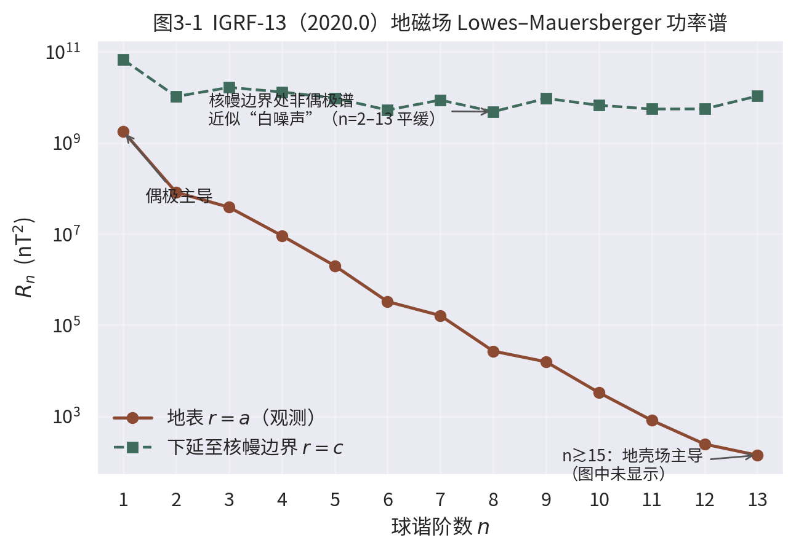
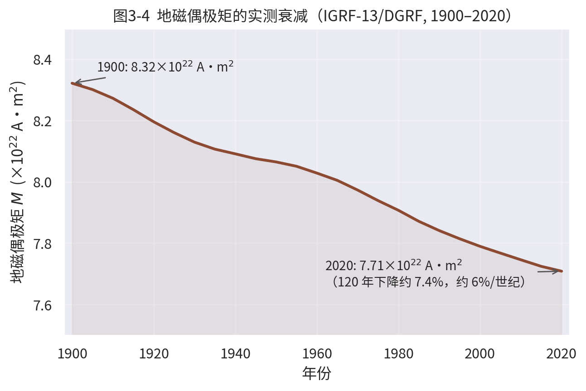
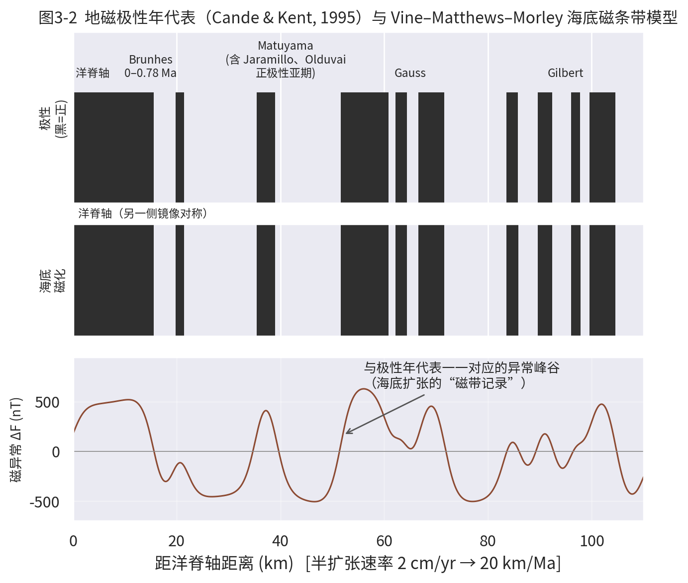
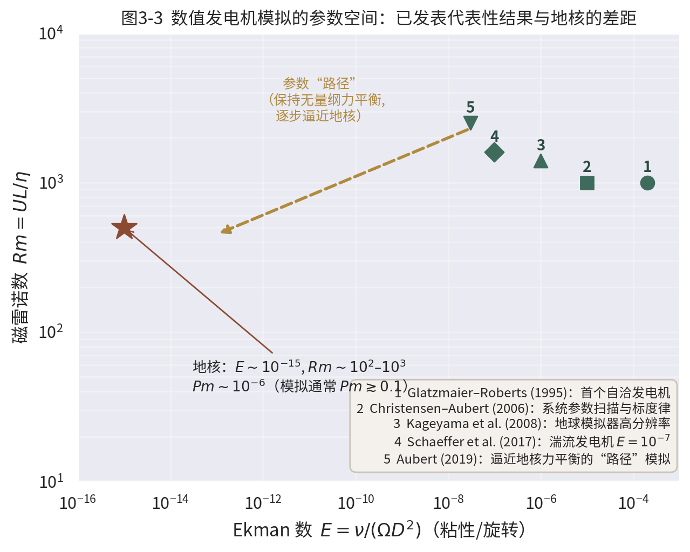

# 第3章　地磁学与地球发电机

## 引言：一层看不见的保护膜

指南针为人类服务了一千多年，但直到 1600 年吉尔伯特（William Gilbert）在《论磁石》中提出"地球本身是一块大磁体"，地磁学才真正成为一门科学。今天我们知道，地磁场远比一块永磁体复杂：它起源于地下 2900 km 深处液态外核中导电铁流体的湍流运动，是一个不断变化的**自激发电机（self-exciting dynamo）**的产物^1^。

地磁场的重要性体现在三个层面。其一，它是"护盾"：磁层把太阳风高能粒子偏转到两极之外，保护大气与生物圈。其二，它是"记录带"：岩石形成时把当时地磁场的方向与极性"冻结"下来，使古地磁学成为板块构造革命最关键的观测证据。其三，它是"探针"：地磁场是唯一能让地表观测者直接感知外核流体运动的物理场。本章将沿"观测描述 → 历史记录 → 物理机制 → 数值模拟 → 空间环境"的线索展开。

## 3.1　地磁场的球谐展开与 IGRF

### 3.1.1　高斯位势展开

在没有局域电流的区域内（地表附近近似成立），地磁场 $\mathbf{B}$ 是无旋的，可由磁标势 $V$ 表示为 $\mathbf{B}=-\nabla V$。1838 年高斯证明，内源场的标势可在球坐标 $(r,\theta,\phi)$ 下展开为

$$V(r,\theta,\phi)=a\sum_{n=1}^{\infty}\sum_{m=0}^{n}\left(\frac{a}{r}\right)^{n+1}P_n^m(\cos\theta)\left[g_n^m\cos m\phi+h_n^m\sin m\phi\right],$$

其中 $a$ 为地球参考半径，$P_n^m$ 为 Schmidt 半归一化缔合勒让德函数，$(g_n^m,h_n^m)$ 称为**高斯系数（Gauss coefficients）**。阶数 $n$ 对应空间尺度：$n$ 阶场源的特征波长约为 $2\pi a/n$。国际地磁参考场 IGRF 每五年更新一次，第 13 代（IGRF-13）主场系数截断至 $n=13$，并提供 1900 年以来的全部（D）GRF 系数^2^。

### 3.1.2　Lowes–Mauersberger 功率谱

衡量各阶贡献大小的标准量是 Lowes–Mauersberger 空间功率谱

$$R_n(r)=(n+1)\left(\frac{a}{r}\right)^{2n+4}\sum_{m=0}^{n}\left[(g_n^m)^2+(h_n^m)^2\right],$$

即半径 $r$ 球面上 $n$ 阶场的均方强度。图3-1 给出由 IGRF-13（2020.0 年代）实测系数计算的谱：地表处 $n=1$（偶极）项以 $R_1\approx1.8\times10^{9}\ \mathrm{nT^2}$ 占据绝对主导，约占地表场总能量的 90% 以上；非偶极部分从 $n=2$ 到 $n=13$ 近乎线性下降（对数坐标）。把谱向下解析延拓到核幔边界（$r=c=3480$ km，因子 $(a/c)^{2n+4}$）后，非偶极谱变得近乎平坦——这就是著名的"**核幔边界白噪声谱**"：在发电机的源头，各阶非偶极成分的强度大致相当，偶极的特殊性被大大削弱。$n\gtrsim 15$ 以后谱再次抬升，源于岩石圈磁化的地壳场，与核源主场合流后难以区分^1^、^3^。

高斯系数随时间的变化称为**长期变化（secular variation）**，时间尺度从数年到数百年，包括通量斑的漂移与增强、西向漂移以及偶极衰减。特别引人注目的是**地磁急变（geomagnetic jerks）**：长期变化趋势在约一年内突然转折的全球性事件（如 1969、1978、1991、2003、2007、2011 等年份），被解释为外核顶部扭转变振（torsional oscillation）与磁流体波传播的表现。急变证明外核并非"缓慢平静"的流体，而是存在十年尺度的快速动力学过程，也把地磁观测与地核角动量变化、日长变化（LOD）研究联系起来^4^、^3^。

{width=15cm}

### 3.1.3　偶极矩与其当代衰减

由偶极（$n=1$）系数可直接定义地磁偶极矩

$$M=\frac{4\pi a^3}{\mu_0}\sqrt{(g_1^0)^2+(g_1^1)^2+(h_1^1)^2}.$$

以 IGRF-13（2020.0）系数代入（$g_1^0=-29404.8$ nT，$g_1^1=-1450.9$ nT，$h_1^1=4652.5$ nT）得 $M\approx7.7\times10^{22}\ \mathrm{A\,m^2}$，即通常引用的"约 $8\times10^{22}\ \mathrm{A\,m^2}$"。把同一公式用于 1900 年以来的全部（D）GRF 系数，可得到一条完全由观测确定的衰减曲线（图3-4）：120 年间偶极矩下降约 7%，相当于每世纪约 6% 的衰减率。与偶极衰减同步的是**南大西洋磁异常区（South Atlantic Anomaly, SAA）**的扩大与西漂，该区域内场强显著低于同纬度正常值，是低轨卫星失效的高发区。古地磁与考古地磁资料表明，过去数千年偶极矩总体在 $6$–$12\times10^{22}\ \mathrm{A\,m^2}$ 间波动，当前衰减并不必然预示一次倒转，但其统计含义仍被广泛讨论^3^、^5^。

{width=15cm}

### 3.1.4　地磁要素与地心轴向偶极（GAD）近似

地面台站实际测量的是地磁场的七个**地磁要素**：北向分量 $X$、东向分量 $Y$、垂直分量 $Z$（向下为正）、水平强度 $H$、总强度 $F$、磁偏角 $D$ 与磁倾角 $I$，满足 $H^2=X^2+Y^2$，$F^2=H^2+Z^2$，$\tan D=Y/X$，$\tan I=Z/H$。在仅保留 $n=1$ 偶极项并把偶极轴与地理轴对齐的**地心轴向偶极（Geocentric Axial Dipole, GAD）**近似下，磁倾角与磁纬度 $\lambda$ 之间有一个极简而有用的关系

$$\tan I = 2\tan\lambda,$$

场强则从赤道的 $F_0$ 增至两极的 $2F_0$。该公式是古地磁学的"换算器"：测得岩石剩磁的倾角，即可反推岩石形成时的古纬度。2020 年代地球磁北极正以每年数十公里的速度从加拿大北极向西伯利亚方向快速移动，正是非偶极场长期变化（secular variation）的直观体现^2^、^5^。

## 3.2　地磁极性与倒转

### 3.2.1　倒转的发现与极性年代表

1906 年法国物理学家布吕纳（Brunhes）在法国中部熔岩与烘烤黏土中发现了与现代场方向相反的天然剩磁，首次提出地磁场可能发生过**极性倒转（polarity reversal）**。1929 年松山基范（Matuyama）系统研究了东亚新生代火山岩，提出早更新世地磁极性与现今相反。此后依靠钾氩（后为 $^{40}$Ar/$^{39}$Ar）测年与全球火山岩古地磁数据的积累，逐步建立了**地磁极性年代表（Geomagnetic Polarity Time Scale, GPTS）**^6^、^7^。

最近 500 万年的主要极性期（chron）为：**Brunhes 正极性期**（0–0.78 Ma，即我们生活的时代）、**Matuyama 反极性期**（0.78–2.58 Ma，内含 Jaramillo 与 Olduvai 正极性亚期）、**Gauss 正极性期**（2.58–3.58 Ma，内含 Kaena 与 Mammoth 反极性亚期）与 **Gilbert 反极性期**（3.58–5.23 Ma）。最近一次倒转——Brunhes/Matuyama 界线——距今约 **78 万年**。倒转过程本身极快：熔岩流与湖海沉积记录显示一次倒转在千年到万年间完成，相对于平均几十万年的极性期长度不过是"瞬间"。此外还有未完全倒转的短暂事件（极性漂移 excursion），如约 4.1 万年前的 Laschamp 事件^3^、^5^。

### 3.2.2　倒转的统计特征

对 GPTS 的统计分析表明：（i）倒转是随机过程，极性期长度近似服从指数（Poisson）分布，平均长度随地质时代变化；（ii）约 84–83 Ma 至 120 Ma 之间存在长达约 3800 万年的**白垩纪正极性超时（Cretaceous Normal Superchron）**，期间倒转完全停止；（iii）倒转频率与发电机数值模拟中的偶极矩涨落、核幔边界热结构之间存在可检验的关联。倒转期间场强下降至正常值的约 10–25%，但场并不"消失"——多极成分仍在维持一个弱而复杂的场^3^、^4^。

### 3.2.3　倒转是如何被记录下来的

倒转过程的细节来自两类天然记录。**熔岩流序列**：连续喷发的熔岩流像书页一样依次保存了过渡场方向，法国 Massif Central 与美国 Steens Mountain 等地的剖面显示倒转时虚地磁极（VGP）常沿偏好经度带迁移，暗示核幔边界热结构对过渡场的控制。**深海与湖泊沉积**：沉积剩磁（DRM）分辨率高且连续，意大利、北大西洋与渤海湾等钻孔给出了 Brunhes/Matuyama 倒转持续约 1–2 万年的估计，并揭示倒转前后往往伴随一次场强低谷与短暂的极性漂移。除完全倒转外，GPTS 中还点缀着多次未完成的**极性漂移事件**——Laschamp（约 41 ka）、Mono Lake（约 34 ka）、Blake（约 120 ka）等，它们是研究发电机"未遂倒转"动力学的天然实验^3^、^5^。

## 3.3　古地磁学与板块构造的证据

### 3.3.1　岩石磁记忆与视极移曲线

含铁磁矿物（磁铁矿、磁赤铁矿、赤铁矿等）的岩石在冷却通过居里温度（磁铁矿约 580 °C）时获得**热剩磁（TRM）**，其方向平行于当时当地的地磁场。只要岩石此后未被重加热或强烈改造，这块"化石罗盘"就保存了古场信息。对同一大陆不同时代岩石测定古磁极位置并连成曲线，得到**视极移曲线（Apparent Polar Wander, APW）**。20 世纪 50 年代，Runcorn 与 Irving 发现欧洲与北美两条 APW 曲线形状相似但系统错位——若让大西洋闭合、两大陆拼合，两条曲线便重合。这是大陆漂移的定量古地磁证据：不是磁极在乱跑，而是大陆在移动^5^、^8^。

### 3.3.2　Vine–Matthews–Morley 假说与海底磁条带

1963 年，剑桥研究生 Vine 与其导师 Matthews（Morley 独立提出相同想法）把"地磁倒转"与"海底扩张"两个看似无关的现象联系起来：新洋壳在洋脊处冷却时获得沿当时场方向的 TRM；若地磁场周期性倒转，海底就会像磁带一样把极性序列对称地录在洋脊两侧^9^。图3-2 给出这一模型的定量再现：上图为 Cande–Kent（1995）标定的最近 5.5 Ma 极性年代表，中图为按半扩张速率 2 cm/yr 生成的磁化地壳剖面（黑色为正极性），下图为由磁化块体正演计算的海面磁异常。峰谷相间、关于洋脊轴镜像对称的异常花样与北大西洋 Reykjanes 洋脊等实测剖面惊人一致^10^。Vine（1966）进一步证明各大洋的异常剖面可以按同一极性年表对比，并给出海底扩张速率；磁异常编号（C1–C34 等）至今仍是洋壳年龄的通用标尺^11^、^7^。

{width=14.5cm}

### 3.3.3　磁异常编号与板块运动学重建

磁异常按时代由老到新编号（新生代为 C1–C34，中生代为 M0–M38），与 GPTS 一一对应。任一洋盆两侧同名异常之间的间距直接给出**总扩张量**，间距随时间的微商给出**扩张速率随时间的变化**；结合断裂带方向，即可重建板块相对运动的欧拉极历史。大西洋两岸 C34 异常（83 Ma）的拼合是"大西洋张开"定量的第一步；印度洋—澳大利亚—南极洲之间的磁异常重建则刻画了冈瓦纳解体的全过程。至此，地磁学完成了从"证明大陆漂移"到"提供板块运动学数据库"的跨越^10^、^7^。

磁条带与 APW 一起，构成了 20 世纪地球科学最大革命的核心观测链条：古地磁把"倒转"变成"时钟"，把"漂移"变成"定量运动学"。可以说，没有地磁学就没有板块构造理论。

## 3.4　发电机理论：磁流体动力学基础

### 3.4.1　感应方程与磁雷诺数

液态外核是电导率 $\sigma\sim3$–$5\times10^5\ \mathrm{S/m}$ 的铁合金流体，其磁场演化服从磁流体动力学（MHD）的**感应方程**。由法拉第定律、安培定律（忽略位移电流）与欧姆定律 $\mathbf{J}=\sigma(\mathbf{E}+\mathbf{v}\times\mathbf{B})$ 消去电场，得

$$\frac{\partial\mathbf{B}}{\partial t}=\nabla\times(\mathbf{v}\times\mathbf{B})+\eta\nabla^2\mathbf{B},\qquad \eta=\frac{1}{\mu_0\sigma},$$

其中 $\mathbf{v}$ 为流体速度，$\eta$ 为磁扩散率（外核约 $1$–$2\ \mathrm{m^2/s}$）。右边第一项是流场对磁力线的**拉伸与扭曲**（产生新磁场），第二项是欧姆耗散导致的**磁扩散**。两者之比给出无量纲**磁雷诺数**

$$Rm=\frac{UL}{\eta},$$

$U$、$L$ 为特征速度与长度。取外核尺度 $L\sim2\times10^6$ m、典型流速 $U\sim0.5\ \mathrm{mm/s}$（由磁场西漂推断），得 $Rm\sim10^2$–$10^3\gg1$：感应效应压倒扩散效应，磁力线近似"冻结"在流体中并被流动不断加工。反之，若发电机停止运转，外核磁场的自由衰减时间 $L^2/(\pi^2\eta)$ 仅约 1–2 万年——远小于地球年龄，这就是"永磁体假说"和"化石场假说"被排除、必须存在持续发电过程的根本论据^1^、^4^。

### 3.4.2　Cowling 定理与 $\alpha$、$\omega$ 效应

并非任何流动都能维持磁场。Cowling（1933）证明：**稳态轴对称磁场不可能由发电机过程维持**（Cowling 反发电机定理）^12^。要绕开这一限制，必须引入破坏对称性的机制，经典平均场理论给出两种：

- **$\omega$ 效应**：较差旋转（剪切流）把极向（径向）磁场拉伸成环向（东西向）磁场，是制造强环向场的主要机制；
- **$\alpha$ 效应**：旋转背景下螺旋对流（helical convection）把环向场重新扭成极向场，完成循环。平均场感应方程写作 $\partial\bar{\mathbf{B}}/\partial t=\nabla\times(\alpha\bar{\mathbf{B}}+\bar{\mathbf{v}}\times\bar{\mathbf{B}})+\eta\nabla^2\bar{\mathbf{B}}$，其中 $\alpha=-(\tau/3)\langle\mathbf{v}'\cdot\nabla\times\mathbf{v}'\rangle$ 正比于平均螺旋度^13^。

地球发电机通常被归类为 $\alpha^2\omega$ 或 $\alpha\omega$ 型：内核边界附近上升流的螺旋运动提供 $\alpha$ 效应，内外核的较差旋转提供 $\omega$ 效应。Bullard（1949）最早提出外核对流驱动的自激发电机设想，Parker（1955）给出首个数学上自洽的波动发电机模型^14^、^13^。

### 3.4.3　冻结磁通与两类时间尺度

感应方程的结构由两个特征时间的竞争决定。**磁扩散时间** $\tau_\eta=L^2/\eta$ 刻画场的自然消亡：对外核（$L\sim2\times10^6$ m，$\eta\sim1.5\ \mathrm{m^2/s}$）约为 $10^{4}$–$10^{5}$ 年量级；**平流（感应）时间** $\tau_v=L/U$ 刻画流场加工磁场的快慢，仅约 $10^{3}$ 年量级。$Rm=\tau_\eta/\tau_v$ 正是两者之比。当 $Rm\gg1$ 时，Alfvén 冻结定理成立：磁力线与流体质点近似绑定，流体把磁场"携带"着运动——磁通量管被拉伸则场强增强（通量守恒），被折叠则空间结构复杂化。地球发电机正是在"冻结"与"扩散"的边界上运转：大尺度场靠冻结拉伸维持，小尺度上扩散持续抹平梯度并把磁能转化为焦耳热。这一图像也解释了为何外核流动速度可以通过磁场的西向漂移（westward drift，约 $0.2^\circ$/年）直接估计^1^、^4^。

## 3.5　外核对流与内核差异旋转

### 3.5.1　驱动能源与流动形态

外核对流有两类浮力来源：**热浮力**（内核冷却、核幔边界热流）与**成分浮力**（内核凝固时排出轻元素，使边界处流体变轻上浮）——后者被认为贡献更大。控制方程在磁感应方程之外还包括旋转框架下的 Navier–Stokes 方程与浮力输运方程，其无量纲骨架由 Ekman 数 $E=\nu/(\Omega D^2)$、Rayleigh 数、Prandtl 数与磁 Prandtl 数 $Pm=\nu/\eta$ 刻画。由于 $\Omega$ 极大而 $\nu$ 极小（$E\sim10^{-15}$），科里奥利力主导动量平衡，对流组织成沿旋转轴拉长的柱状涡（**Taylor 柱**），主要力平衡为压力—科氏力—洛伦兹力—浮力的 **MAC 平衡**（Magneto-Archimedean-Coriolis），粘性几乎可忽略^4^、^15^。

磁场强度本身也可以用无量纲数表达。**Elsasser 数** $\Lambda=\sigma B^2/(\rho\Omega)$ 量度洛伦兹力与科氏力之比；数值模拟与标度律均表明，饱和发电机平衡于 $\Lambda\sim1$ 附近，即 $B\sim\sqrt{\rho\Omega/\sigma}$。取外核密度 $\rho\sim10^4\ \mathrm{kg/m^3}$ 与上述参数，可得 $B$ 为毫特斯拉量级——与外核场强的独立估计（由地表观测向下延拓）一致，说明地磁场强度由旋转"设定"而非由对流能量直接决定，这是发电机理论最深刻的结论之一^4^、^16^。

### 3.5.2　内核差异旋转：发现、争议与现状

发电机理论预言，内核边界的电磁耦合与柱状对流会驱动固态内核相对地幔转动。Song & Richards（1996）通过分析 30 年间穿越内核的地震波走时差，首次报道内核**超速旋转（super-rotation）**，估计约 $1.1^\circ$/年^17^；Su 等（1996）用内核各向异性轴的系统性偏移给出约 $3^\circ$/年的更大估值^18^。此后近三十年的研究构成了一段"如实记录比结论更重要"的科学史：Zhang 等（2005）用南桑威奇群岛地震双重奏（doublet）波形比对确认了差异旋转，但速率修正为约 $0.3$–$0.5^\circ$/年^19^；Vidale 等与后续工作进一步压低至 $0.2^\circ$/年量级甚至更小；近年 Yang & Song（2023）基于双重奏的系统分析提出内核旋转在约 2009 年前后减慢、目前内核相对地幔近乎同步甚至轻微反转，内核可能处于约 70 年周期的**振荡旋转**之中^20^。不同研究的差异部分来自内核小尺度非均匀性、核幔边界耦合强度与数据覆盖的分辨极限。**公允的表述是：内核差异旋转的存在已被多类独立证据支持，但其瞬时速率量级为每年零点几度（至多约 $1^\circ$/年），且可能随时间显著变化，定量值仍有争议。** 这一观测约束反过来标定了内核边界电磁耦合强度与外核粘度上限，是发电机模型的重要边界条件^4^。

## 3.6　数值发电机模拟

### 3.6.1　从 Glatzmaier–Roberts 到"参数路径"

1995 年，Glatzmaier 与 Roberts 完成了首个三维、自洽、长期积分的发电机数值模拟：旋转球壳内 Boussinesq 流体耦合磁感应方程，自然产生了轴对称占优的类地偶极场，并在随后版本中自发出现了一次形态逼真的**极性倒转**^15^、^21^。这是发电机理论从机制假说走向可计算科学的里程碑。

但数值模拟面临一个根本性困难（图3-3）：地核的 Ekman 数约 $10^{-15}$、磁 Prandtl 数约 $10^{-6}$，而直接数值模拟即便在今天也只能达到 $E\sim10^{-7}$ 左右——相差 8 个数量级，湍流谱的大部分无法分辨。Christensen & Aubert（2006）通过大规模参数扫描建立了经验标度律，发现只要无量纲的力平衡与边界通量匹配，外推到地核参数的模拟可以正确预测地磁场强度与偶极占优性^16^。Schaeffer 等（2017）把 Ekman 数推进到 $10^{-7}$，获得了磁能主导动能十倍的类地湍流发电机^22^；Aubert 等提出沿固定无量纲力平衡逐步逼近地核的"**参数路径（path approach）**"，在保持 MAC 平衡的前提下系统降低 $E$ 与 $Pm$，再现了包括偶极矩、倒转统计与西漂速率在内的多种类地特征^23^。

{width=15cm}

### 3.6.2　模拟的成功与遗留问题

数值发电机的成功清单已相当可观：（i）自发产生偶极主导场；（ii）自发倒转且倒转频率随核幔边界热流增大而增大；（iii）再现西向漂移与高纬度通量斑；（iv）预测的内核耦合差异旋转与地震观测定性一致。遗留问题同样清晰：倒转触发机制的细节、模拟中 $Pm$ 偏高导致的扩散主导尺度、湍流 unresolved 尺度的参数化、以及地幔侧向热异常（如下地幔 LLSVP，见第4章）对倒转速率的调制，仍是活跃前沿^4^、^23^。

### 3.6.3　行星比较：发电机理论的"实验室"

同一套 MHD 方程也适用于其他天体，行星比较是检验发电机理论最强的外部约束之一。木星与土星拥有强偶极场（赤道场强分别约为地球的 10 倍与相当值），源于金属氢层的深部对流；水星的弱偶极场（约为地球的百分之一量级）由 MESSENGER 证实，暗示其外核仅部分对流或处于薄壳发电机状态；木卫三（Ganymede）是卫星中唯一拥有内禀磁场者；火星现今无全球发电机，但其南半球古老地壳的强剩磁表明约 40 亿年前火星发电机曾经运转；月球古地磁记录同样暗示早期存在过短暂的发电机阶段。这些差异共同支持发电机运转的必要条件：足够大的导电流体区、足够强的对流（超临界的热/成分浮力）以及足够的旋转（保证螺旋性）^4^、^3^。

## 3.7　磁层—太阳风相互作用与极光

地磁场向外延伸，与不断从太阳吹来的超音速等离子体（太阳风，典型速度 300–800 km/s、密度 5–10 cm$^{-3}$）相互作用。太阳风动压在约 **10 个地球半径**处与地磁场磁压平衡，形成**磁层顶（magnetopause）**；太阳风在磁层顶上游形成无碰撞弓激波。Chapman–Ferraro 理论最早描述了这种压缩平衡；Dungey（1961）提出的**重联（reconnection）**图像则解释了能量输入：行星际磁场与地磁场在磁层顶重联，磁力线被太阳风拖向夜侧形成磁尾，再在磁尾中重联回返，驱动整个磁层对流循环（Dungey cycle）^24^、^25^。

沿开放磁力线沉降的高能电子（keV 量级）在极区 100–300 km 高度激发氧（557.7 nm 绿线、630 nm 红线）与氮分子，形成**极光**；极光椭圆带的位置直接描绘出磁层开放—闭合磁力线的边界。磁层扰动的极端形式——磁暴与亚暴——通过 Dst 指数与地面台站网监测，是现代空间天气的核心对象。发电机一旦长期减弱（如倒转期间），磁层收缩、大气逃逸率上升，这也是研究地磁场演化的现实意义之一^25^。

### 3.7.2　空间天气与现代社会

1859 年卡林顿事件（Carrington Event）期间，电报线路起火、极光可见至加勒比海；1989 年 3 月的强地磁暴导致加拿大魁北克电网瘫痪 9 小时。强磁暴通过感生电流（GIC）威胁长距离电网与管道，通过电离层扰动影响 GNSS 定位与短波通信，并增加低轨卫星的轨道衰减与辐射损伤风险。因此地磁场观测台网（INTERMAGNET）、磁暴指数与卫星磁测计划（如 Ørsted、CHAMP、Swarm 星座）不仅是基础研究设施，也是空间天气预警的国家基础设施。IGRF 系列模型则是导航定向钻井、航空磁测与所有空间物理任务的共同参考基准^25^、^2^。

## 3.8　本章小结

地磁场是地球内部唯一可"实时"观测的动力学窗口。球谐展开把全球观测凝练为高斯系数：偶极矩约 $8\times10^{22}\ \mathrm{A\,m^2}$、每世纪衰减约 6%；非偶极谱在核幔边界近似白噪声。岩石与海底的磁记忆揭示了极性倒转（Brunhes/Matuyama 界线 78 万年前）并催生了板块构造革命。物理上，地磁场由外核对流发电机维持：感应方程中 $Rm\gg1$ 使磁力线被流动拉伸，$\alpha$/$\omega$ 效应完成场循环；内核以每年零点几度的量级差异旋转（速率仍有争议）；数值模拟正沿"参数路径"逼近真实地核。地磁场向外塑造磁层，与太阳风相互作用产生极光与空间天气。

## 进阶阅读指引

- **数学基础与位势理论**：Backus, Parker & Constable《Foundations of Geomagnetism》第 2–4 章，是球谐展开与下延问题的标准参考^1^。
- **古地磁学入门**：Tauxe 等《Essentials of Paleomagnetism》免费网络版，配有可复现的数据分析实例^5^。
- **发电机理论综述**：Roberts & King（2013）系统评述了 MHD 发电机从解析理论到数值模拟的全貌^4^。
- **地磁数据获取**：IGRF 系数与在线计算器由 NOAA/NCEI 与 BGS 发布；INTERMAGNET 提供全球台站分钟级数据^2^。

## 附表　本章与其他章节的交叉联系

| 本章概念 | 联系章节 | 联系要点 |
|---|---|---|
| 外核液态、内核固态 | 第1章（地震波速度结构） | P 波减速与 S 波消失划定外核；内核各向异性观测支撑差异旋转研究 |
| 核幔边界热流 | 第4章（地热与地幔对流） | CMB 热流是发电机与地幔对流共同的边界条件；LLSVP 可能调制倒转频率 |
| 磁条带与海底扩张 | 第4章（岩石圈热结构）、后续板块构造章节 | 洋壳年龄—热流—水深关系均以磁异常定年为基础 |
| 放射性生热与内核凝固 | 第4章（地球热演化） | 内核生长释放的成分浮力是发电机主要能源之一 |
| 重力位与球谐方法 | 第2章（重力学） | 重力位与磁标势共用球谐数学框架，阶数—尺度对应关系一致 |

## 思考题

1. 利用 $R_n$ 的定义与图3-1，估算偶极项占 IGRF-13 地表场总能量的比例，并解释为何向下延拓后非偶极谱变平。
2. 若外核磁扩散率 $\eta=1.5\ \mathrm{m^2/s}$，估算外核磁场的自由衰减时间，并说明这一估算为何是"发电机必须持续运转"的证据。
3. Vine–Matthews–Morley 模型中，半扩张速率增大一倍而极性年表不变时，磁条带宽与异常波长将如何变化？这一关系如何被用于测定古扩张速率？
4. 内核差异旋转为何难以精确测定？试从地震波路径、内核非均匀性与时间分辨率三方面讨论。

