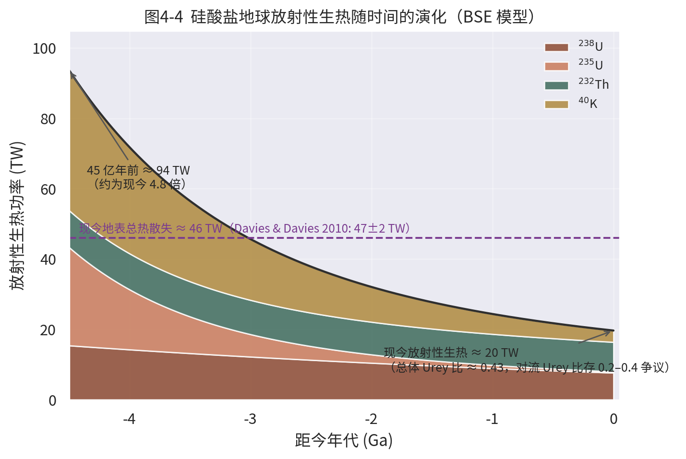
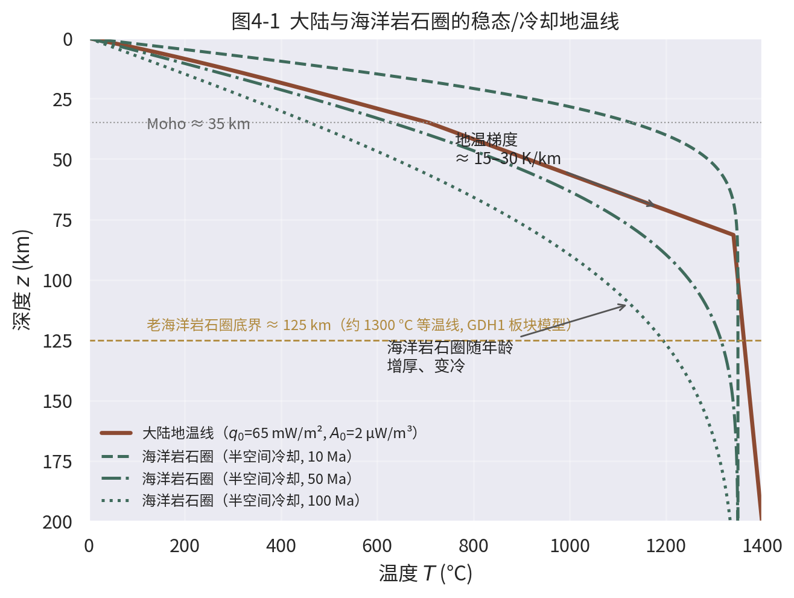
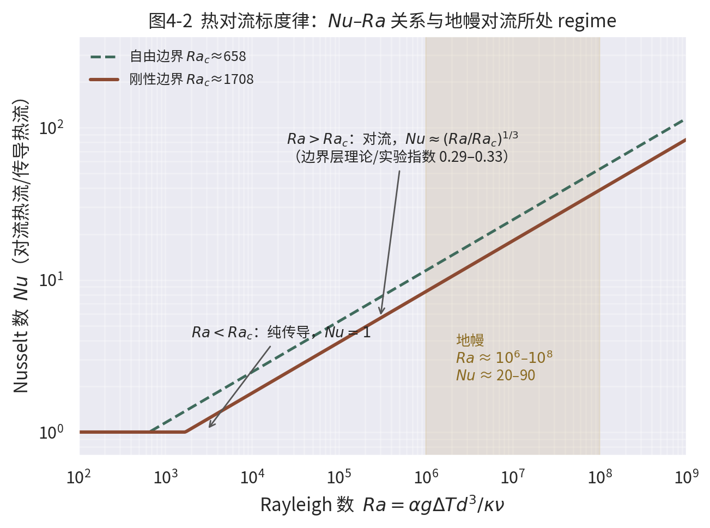
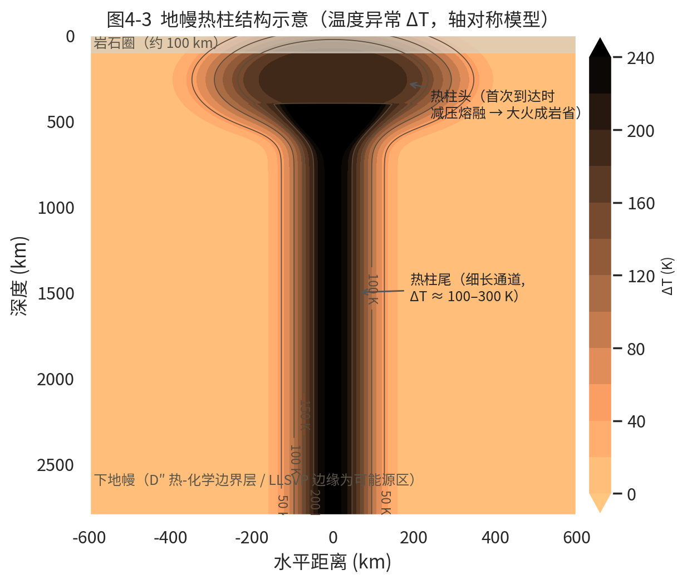

# 第4章　地热、热演化与岩石圈

## 引言：一颗仍在散热的行星

地球内部的温度高到足以使岩石部分熔融，驱动火山、造山与板块运动。这股能量从何而来、以多快的速度流失、又怎样塑造了地球 45 亿年的历史？这是地热学（geothermics）的核心问题。开尔文勋爵曾用地表热流反推地球年龄，得出仅 2 千万至 1 亿年的结论——错得离谱，却错得富有启发：他不知道放射性生热的存在，也不知道对流可以远比传导高效地搬运热量。这两个"不知道"，恰好是本章的两个主角[^jaupartm]、[^turcotte]。

本章沿"收支 → 来源 → 输运 → 对流 → 岩石圈 → 热柱 → 演化史"的逻辑展开，把热这个单一物理量与几乎全部分支——地震学、岩石学、地球化学、地球动力学——串联起来。

## 4.1　地球的热收支：46 TW 的散热功率

### 4.1.1　地表热流的测量与全球汇编

地表热流（heat flow）是地热学最基本的观测量：在钻孔中测量地温梯度 $dT/dz$，乘以岩芯热导率 $k$，按傅里叶定律 $q=-k\,dT/dz$ 得到。海洋热流则用探针刺入洋底沉积物测量。Pollack 等（1993）汇编的全球数据集给出约 44 TW 的总热散失；Davies & Davies（2010）在修正低覆盖区与洋底年轻地壳的低估后给出 **$47\pm2$ TW**；Jaupart 等系统评估为约 46 TW。通用取值为"**约 46 TW**"，平均到全球表面约为 $87\ \mathrm{mW/m^2}$——只相当于一盏小台灯的功率密度，却足以驱动整个板块构造引擎[^davies]、[^pollack]、[^jauparttreatise]。

这 46 TW 的分布极不均匀：**海洋岩石圈贡献约 70%**（尽管面积占 60%），因为年轻洋壳薄而热；大陆热流平均约 65 mW/m²，从太古宙克拉通的约 40 mW/m² 到活动构造区的 100 mW/m² 以上不等。海洋热流随洋壳年龄的平方根倒数下降（见 4.3.3），是海底扩张理论最早也最持久的定量检验[^parsons]、[^stein]。

### 4.1.2　热收支的收入端

收入端由几部分构成（现代估值）：

| 热源 | 功率 (TW) | 占比 |
|---|---|---|
| 放射性生热（地壳+地幔，U/Th/K） | ≈ 20–25 | ≈ 50% |
| 长期冷却（地球自形成以来的降温） | ≈ 15–20 | ≈ 40% |
| 地核散热进入地幔（含内核凝固潜热与成分浮力） | ≈ 5–15（估值跨度大） | ≈ 10–25% |
| 潮汐耗散、引力分异等 | < 1 | 可忽略 |

其中放射性生热约占总散热的一半，这是"Urey 比"问题的核心（见 4.7）。地壳虽小，却因富集 U/Th/K 而贡献了放射性生热的可观份额（约 6–8 TW，集中在富硅铝的大陆地壳）[^jauparttreatise]、[^korenaga]。

## 4.2　放射性生热：U、Th、K 的衰变引擎

### 4.2.1　四种关键同位素

地球内部的长寿命放射性生热核素只有四种：**$^{238}$U**（半衰期 4.47 Ga）、**$^{235}$U**（0.704 Ga）、**$^{232}$Th**（14.0 Ga）与 **$^{40}$K**（1.25 Ga）。单位质量生热率分别为约 $9.52\times10^{-5}$、$5.69\times10^{-4}$、$2.64\times10^{-5}$、$2.92\times10^{-5}\ \mathrm{W/kg}$（元素质量基准）[^vanschmus]。总生热率随时间按各自半衰期指数回溯：

$$H(t)=\sum_i C_i^0\,h_i\,2^{t/\tau_i},$$

其中 $C_i^0$ 为现今元素丰度，$h_i$ 为比生热率，$t$ 为距今时间。以硅酸盐地球（BSE）模型丰度（U 20.3 ppb、Th 79.5 ppb、K 240 ppm）计算[^mcdonough]，现今总生热约 **20 TW**，45 亿年前约 **94 TW**——为现今的 4.8 倍，其中短寿命的 $^{235}$U 与 $^{40}$K 在早期占据主导（图4-4）。这解释了为何太古宙地球更热、洋脊熔融更深、科马提岩（komatiite）得以形成[^herzberg]。

{width=15cm}

### 4.2.2　生热元素在哪里

U、Th、K 都是**强不相容元素**：地幔部分熔融时它们优先进入熔体，因而被萃取到地壳中。大陆地壳的生热率约 1–3 μW/m³（花岗岩类更高），地幔仅约 0.005–0.02 μW/m³。地壳生热贡献可达大陆地表热流的 30–50%，是大陆地温线形态（下节）的决定因素之一。地核中钾的含量长期以来存在争论（"地核含钾假说"可为发电机提供额外能源），但高压实验与地球化学证据总体不支持大量钾进入地核[^jauparttreatise]、[^jaupartm]。

### 4.2.3　地生中微子：直接"看见"放射性生热

放射性生热总量长期依赖地球化学模型的间接推断。**地生中微子（geoneutrino）**提供了独立的直接测量：U/Th 衰变链释放的反电子中微子几乎不与物质作用，可穿透整个地球被探测器捕获。KamLAND（日本）于 2005 年首次报道地生中微子观测[^kamland]，Borexino（意大利）随后给出更精密的计数；两套实验独立估算地幔放射性生热约在 10–30 TW 区间（大误差条反映极低的计数率），与 BSE 模型的约 20 TW 相容。随着 JUNO 等新一代探测器运行，地生中微子有望成为约束 Urey 比的第四种独立手段[^kamland]。

## 4.3　热传导与地温梯度

### 4.3.1　傅里叶定律与岩石热导率

在岩石圈这类刚性层内，热以**传导**方式输运，服从傅里叶定律 $\mathbf{q}=-k\nabla T$。岩石热导率 $k$ 并不高：沉积岩约 1.5–2.5 W/(m·K)，结晶地壳约 2.5–3.0，地幔橄榄岩约 3–4（随温度升高而略降）。典型**大陆地温梯度为 15–30 K/km**（克拉通低、活动区高），这就是矿井与深钻中"越深越热"的定量表达[^jaupartm]、[^turcotte]。

### 4.3.2　大陆地温线：含生热项的稳态解

设地壳生热率随深度指数衰减 $A(z)=A_0 e^{-z/D}$（$D\approx10$ km，经验"生热富集层"），地表热流 $q_0$ 恒定、稳态一维热方程 $k\,d^2T/dz^2=-A(z)$ 的解为

$$T(z)=\frac{q_m}{k}z+\frac{A_0 D^2}{k}\left(1-e^{-z/D}\right),\qquad q_m=q_0-A_0 D,$$

其中 $q_m$ 是来自地幔的"折合热流"。取 $q_0=65\ \mathrm{mW/m^2}$、$A_0=2\ \mathrm{\mu W/m^3}$、$D=10$ km、$k=2.5\ \mathrm{W/(m\,K)}$，Moho（35 km）处温度约 700 °C；更深处在软流圈对流主导后，地温线并入斜率仅约 0.3–0.5 K/km 的**地幔绝热线**（图4-1 实线）。这个简单模型解释了大陆热流省"热流高则生热高"的经验关系，也是估算深部温度—强度结构的基础[^jaupartm]、[^turcotte]。

{width=15cm}

### 4.3.3　海洋岩石圈：半空间冷却与板块模型

新洋壳在洋脊形成后不断远离热源并冷却。把岩石圈近似为初始温度 $T_m$、表面恒温的半无限空间，一维非稳态热方程给出误差函数解

$$T(z,t)=T_m\,\mathrm{erf}\!\left(\frac{z}{2\sqrt{\kappa t}}\right),$$

其中 $\kappa=k/(\rho c_p)\approx10^{-6}\ \mathrm{m^2/s}$ 为热扩散率。其直接推论是：热流 $q\propto1/\sqrt{t}$、水深相对洋脊的沉降 $\Delta w\propto\sqrt{t}$——两者都在约 70 Ma 以内的洋壳上与观测吻合得极好，是板块构造最优雅的定量验证[^parsons]。更老的洋壳偏离半空间模型（冷却变慢、水深趋于平台），由**板块模型**描述：GDH1 模型（Stein & Stein, 1992）设定岩石圈存在约 95–125 km 的机械底板、底板恒温约 1450 °C，成功拟合了全年龄段的全球热流与水深[^stein]。

## 4.4　地幔对流：Rayleigh 数的世界

### 4.4.1　Rayleigh 数与对流判据

岩石虽是固体，在亿年尺度上却表现为粘性流体（地幔粘度约 $10^{19}$–$10^{21}\ \mathrm{Pa\,s}$）。热流体层是否对流，由**Rayleigh 数**判定：

$$Ra=\frac{\alpha g\,\Delta T\,d^3}{\kappa\,\nu},$$

分子中 $\alpha$ 为热膨胀系数（约 $3\times10^{-5}\ \mathrm{K^{-1}}$）、$\Delta T$ 为层间温差、$d$ 为层厚；分母为热扩散率与运动粘度——分子代表浮力驱动，分母代表热与动量的耗散阻尼。均匀加热流体层的临界值约为 $Ra_c\approx10^3$（自由边界 658、刚性边界 1708）。代入地幔参数（$d\sim2900$ km 全地幔对流），得 $Ra\approx10^{6}$–$10^{8}$，**超临界 $10^{3}$–$10^{5}$ 倍**：地幔对流不是"是否发生"的问题，而是以何种形态发生的问题[^turcotte]、[^chandrasekhar]。

{width=15cm}

### 4.4.2　Nusselt 数标度律与对流形态

对流的输热效率由 **Nusselt 数** $Nu$（实际热流/纯传导热流）衡量。边界层理论与实验给出

$$Nu\approx\left(\frac{Ra}{Ra_c}\right)^{\beta},\qquad \beta\approx0.29\sim0.33,$$

即著名的"三分之一次方标度律"（图4-2）。地幔 $Ra$ 对应 $Nu\approx20$–$90$：对流把输热效率提高了两个数量级，这正是开尔文估算失败的物理根源。在该 regime 下，对流呈现**冷下流主导**的形态：冷的热边界层（岩石圈）失稳下沉成为板块俯冲，而上升流宽阔而被动——俯冲板块是地幔对流系统的主动驱动者，这一认识把板块构造与地幔对流统一为同一过程的不同侧面[^turcotte]、[^jauparttreatise]。

### 4.4.3　全地幔对流还是分层对流

过渡带（410–660 km）的矿物相变是否把地幔分成上下两个独立对流系统，曾是 20 世纪后半叶的核心争论。证据现已倾向**总体全地幔对流、局部短暂分层**：层析成像显示多数俯冲板片穿透 660 km 进入下地幔（部分在中地幔"滞留"徘徊）；火山岩地球化学表明源区存在长期未混合的储库（见 4.8）；地球动力学模拟给出俯冲穿透—过渡带滞留交替的"间歇分层"模式。这一"分层中的连通"图像是现代地幔动力学的标准起点[^turcotte]、[^jauparttreatise]。

## 4.5　岩石圈的热结构与强度

### 4.5.1　岩石圈底界的多种定义

"岩石圈"依学科口径有不同底界：**热岩石圈**以约 1300 °C 等温线（约为地幔绝热线的 90%）为界；**弹性岩石圈**以能够支撑长期应力差（数百 MPa）的厚度定义；**地震学岩石圈**以高速盖层（lid）的底界定义。三者数值相近但不相同，老海洋岩石圈厚约 100–125 km，大陆从活动区的 60–80 km 到克拉通根部的 200–250 km 不等[^jauparttreatise]、[^stein]。

### 4.5.2　强度包络：脆性与塑性的衔接

岩石圈的力学强度随深度呈"三明治"结构：浅部服从 Byerlee 摩擦律 $\tau=\mu\sigma_n$（脆性破裂，强度随围压线性增长，$\mu\approx0.6$–$0.85$）[^byerlee]；深部受温度控制的**位错蠕变**主导，强度随温度指数下降（Dorn 律/幂律流变，$\dot\varepsilon=A\sigma^n\exp(-Q/RT)$）。两者交点给出强度峰值，整条曲线称为**强度包络（strength envelope）**。大陆岩石圈常在含水下地壳出现弱化层而形成"多层三明治"（jelly sandwich）还是整体强韧（crème brûlée）之争，本质上是对岩石圈水含量与下地壳矿物学的争论[^burov]。热结构通过流变律直接控制造山带宽度、盆地沉降样式与地震深度分布——岩石圈是"热写就的力学机器"。

### 4.5.3　热沉降与沉积盆地

热结构还控制着岩石圈在拉伸后的长期命运。McKenzie（1978）的均匀拉伸模型指出：岩石圈被瞬时拉伸 $\beta$ 倍时，软流圈被动上涌加热，随后按与半空间冷却相同的时间常数（约 60 Ma 的 $e$-折时间）冷却收缩，产生**热沉降（thermal subsidence）**——沉降量随 $\sqrt{t}$ 增长、可容纳数公里沉积物[^mckenziebasin]。这一机制解释了大陆边缘被动盆地（如北海、大西洋两岸）广泛观测到的"先断后陷"两阶段沉降史，是盆地分析与油气勘探的理论基石，也是岩石圈热演化在大地构造记录中最直接的"签名"。

## 4.6　热柱与热点

### 4.6.1　从 Wilson 到 Morgan：定标热源假说

Wilson（1963）注意到夏威夷—皇帝海山链的年龄自东南向西北单调递增，提出太平洋板块在一个**固定热源**上漂移[^wilson]。Morgan（1971）将其机制化：源自深部地幔（他主张核幔边界附近 D″ 层）的**热柱（mantle plume）**提供定点熔融，板块移动则留下年龄递进的火山轨迹[^morgan]。热柱经典的"头—尾"结构（图4-3）：首次上涌的大体积**热柱头**抵达岩石圈底界时引发巨量减压熔融，对应**大火成岩省（LIP）**（如德干、西伯利亚暗色岩）；随后细长的**热柱尾**维持长期低强度热点火山（如现今夏威夷）。实验与数值模拟给出的热柱温度异常 $\Delta T$ 约 100–300 K[^sleep]、[^mckenzie]。

{width=13cm}

### 4.6.2　夏威夷与冰岛：两个端元实例

**夏威夷**是最经典的海内热点：海山链 6000 km、43° 的皇帝拐弯记录了约 47 Ma 前太平洋板块运动方向的突变；热点浮力通量估计约 8–9×10³ kg/s，居全球之首；熔岩成分显示深部来源的古老循环洋壳信号[^sleep]。**冰岛**则是"洋脊上的热点"：地幔柱与北大西洋洋脊叠加，造成异常厚的洋壳（>20–30 km）与抬升出海面的洋脊段；冰岛热点是否深源、其 $\Delta T$ 与化学成分如何解释，至今是热柱假说的重要试验场。Courtillot 等（2003）按多重判据（海山链、LIP 关联、浮力通量、氦同位素）把全球约 49 个热点分为三类，认为只有约 7–10 个（夏威夷、冰岛、留尼汪、凯尔盖朗、特里斯坦、阿费尔、复活节、路易斯维尔、亚速尔、加拉帕戈斯）可明确追溯至下地幔，其余可能源自过渡带或岩石圈内部过程——**热柱假说的"深部普适性"应当被谨慎对待**，这是与教科书简化叙述的必要区别[^courtillot]、[^mckenzie]。

### 4.6.3　McKenzie–Bickle 框架：熔融量的温度—厚度耦合

McKenzie & Bickle（1988）把热点熔岩产量参数化：熔融程度由**势温度（potential temperature, $T_p$）**与岩石圈厚度共同决定，正常洋脊 $T_p\approx1280$ °C，热点下可升高 100–200 K。该框架至今是从火山岩反演地幔温度的标准工具，也是约束太古宙地幔温度（科马提岩指示 $T_p$ 高出 200–300 K）的桥梁[^mckenzie]、[^herzberg]。

## 4.7　地球的热演化史与 Urey 比

### 4.7.1　长期冷却与"热灾难"论证

地球现今以 46 TW 散热，其中放射性生热仅供给约一半，缺口由**长期冷却（secular cooling）**弥补：地幔正在以约 50–100 K/Gyr 的速率降温。反演过去，若生热与散热参数不变，20 亿年前地球将热到全球熔融——"**热灾难（thermal catastrophe）**"论证表明对流效率（即 $Nu$–$Ra$ 关系中的粘度）必然随温度反馈调节：温度高 → 粘度低 → 对流强 → 散热快，形成强大的负反馈恒温器[^christensen]、[^korenaga]。

### 4.7.2　Urey 比之争

**Urey 比** $Ur=$ 放射性生热/总热散失，是热演化的核心参数。以 BSE 成分计，现今**总体 Urey 比约 0.4–0.5**；但扣除大陆地壳生热与地核贡献后，对流地幔的**对流 Urey 比**估值在 0.2–0.4 之间摆动，学界存在持续争论：低值（约 0.2）意味着更强烈的早期冷却与更晚的地幔分层，高值（约 0.4 以上）则接近稳态[^korenaga]、[^jauparttreatise]。约束来自三方面的交叉验证：BSE 元素丰度（球粒陨石类比）、科马提岩记录的古地幔势温度（太古宙高出约 200–300 K）[^herzberg]、以及氩同位素约束的脱气历史（$^{40}$Ar 显示约一半地幔已脱气）[^jauparttreatise]。Christensen（1985）的参数化对流模型证明，生热元素分布（地幔 vs 地壳）与粘度—温度反馈的强弱共同决定了演化路径，不存在唯一解[^christensen]。

Urey 比的取值还通过大陆地壳生长史与热演化耦合：若对流 Urey 比低，则太古宙更热的地幔应产生更厚的洋壳与更强的大陆生长脉冲，这与大陆年龄谱的分布共同构成对热演化模型的联合约束[^korenaga]、[^herzberg]。

### 4.7.3　早期分异与隐藏储库

$^{142}$Nd 证据表明硅酸盐地球在形成后 3 千万年内就发生了全球性分异[^boyet]，可能留下富集不相容元素的**隐藏储库**（hidden reservoir）；若其存在，BSE 模型的生热预算与 Urey 比都需修正。这类深部储库与下节的热-化学地幔结构直接相关。

## 4.8　热-化学地幔：LLSVP 与 D″ 层

地震层析成像揭示下地幔底部存在两个大陆尺度的**大型低剪切波速省（Large Low Shear Velocity Provinces, LLSVP）**，分别位于非洲与太平洋之下，高约数百至一千公里。LLSVP 剪切波速偏低 2–3% 且边缘陡峭，证据（波速联合反演、密度—波速解耦、边缘小尺度散射）越来越支持它们是**化学成分不同的热-化学堆体**而非单纯热异常：可能富集了早期分异的残留物或俯冲循环的洋壳堆积[^garnero]。LLSVP 之上还叠加着厚 200–300 km 的 D″ 不连续层与毫米—公里尺度的**超低速区（ULVZ）**（可能部分熔融或富铁）。

LLSVP 的意义远超地震学：（i）其边缘被认为是主要热柱的优选源区（热柱沿堆体边缘上升的"边缘源"假说），把热点系统与深部化学结构联系起来；（ii）其存在改变了核幔边界热流的空间分布，从而可能调制地磁发电机的倒转频率（见第3章）；（iii）作为长期未混合的地球化学储库，它们是洋岛玄武岩高 $^{3}$He/$^{4}$He 信号与 $^{142}$Nd 异常解释的重要候选。热-化学双层地幔——上部充分搅拌的对流地幔、下部古老而致密的堆体——正在成为取代"均匀对流地幔"的新标准图像[^garnero]、[^courtillot]。

## 4.9　本章小结

地球以约 46 TW 的功率散热，其中约一半由 U/Th/K 放射性衰变供给，其余来自行星长期冷却与地核散热。热在刚性岩石圈内靠传导输运（大陆地温梯度 15–30 K/km，海洋岩石圈按 $\sqrt{t}$ 冷却增厚），在软流圈以下靠 $Ra\approx10^{6}$–$10^{8}$ 的强烈对流输运（$Nu\approx20$–$90$）。岩石圈的热结构经流变律转化为力学强度，控制构造样式。热柱—热点系统（夏威夷、冰岛）与大火成岩省揭示了深部热源；长期冷却速率、Urey 比与科马提岩记录共同约束了 45 亿年的热演化；LLSVP 代表的热-化学双层结构把热演化、地球化学储库、热柱源区乃至地磁发电机连成一体。热，是理解整个固体地球系统的统一变量。

## 进阶阅读指引

- **地热学权威教材**：Jaupart & Mareschal《Heat Generation and Transport in the Earth》系统覆盖热流、生热与全部输运理论[^jaupartm]。
- **地球动力学标准教材**：Turcotte & Schubert《Geodynamics》第 4、6、7 章对应本章热传导、对流与热柱内容[^turcotte]。
- **地幔热状态综述**：Jaupart, Labrosse & Mareschal 在《Treatise on Geophysics》第 7 卷的长篇评述是研究级入口[^jauparttreatise]。
- **全球热流数据**：IHFC 全球热流数据库与 Davies & Davies（2010）的网格化全球热流图[^davies]。

## 附表　本章与其他章节的交叉联系

| 本章概念 | 联系章节 | 联系要点 |
|---|---|---|
| 核幔边界热流 | 第3章（地磁发电机） | CMB 热流是发电机能源之一；LLSVP 调制倒转频率 |
| 磁异常定年的洋壳年龄 | 第3章（Vine–Matthews–Morley） | 洋壳年龄—热流—水深关系共用同一年龄框架 |
| 岩石圈厚度与速度结构 | 第1章（地震学） | 高速 lid 与低速带的界限对应热岩石圈/软流圈边界 |
| 布格重力与均衡 | 第2章（重力学） | 热柱顶托与 swell 地形产生可测重力异常 |
| 地幔对流形态 | 后续章节（板块构造与地幔动力学） | 俯冲驱动的冷下流是地幔对流的主动分量 |

## 思考题

1. 用半空间冷却模型推导热流 $q\propto1/\sqrt t$，并估算 20 Ma 与 80 Ma 洋壳的热流比值，与 Parsons & Sclater（1977）的观测趋势对比。
2. 设大陆地表热流 65 mW/m²、生热率 2 μW/m³ 均匀分布于上部 10 km，求折合地幔热流与 Moho（35 km）温度（$k=2.5$ W/(m·K)）。
3. 若地幔粘度下降一个数量级，$Ra$ 与 $Nu$ 将如何变化？这一反馈如何构成地球热演化的"恒温器"？
4. 夏威夷热点浮力通量约 $8.7\times10^3$ kg/s。结合 $\Delta\rho\approx\rho\alpha\Delta T$，估算维持该通量所需的热柱半径与上升速度量级，并讨论不确定性来源。

[^jaupartm]: Jaupart, C., & Mareschal, J.-C. Heat Generation and Transport in the Earth. Cambridge University Press. 2011. https://openlibrary.org/isbn/9780521884883
[^jauparttreatise]: Jaupart, C., Labrosse, S., & Mareschal, J.-C. Temperatures, heat and energy in the mantle of the Earth. In Treatise on Geophysics, Vol. 7: Mantle Dynamics. Elsevier. 2007/2015. https://doi.org/10.1016/B978-044452748-6.00114-8
[^turcotte]: Turcotte, D. L., & Schubert, G. Geodynamics (2nd ed.). Cambridge University Press. 2002. https://openlibrary.org/isbn/0521666244
[^davies]: Davies, J. H., & Davies, D. R. Earth's surface heat flux. Solid Earth 1, 5–24. 2010. https://doi.org/10.5194/se-1-5-2010
[^pollack]: Pollack, H. N., Hurter, S. J., & Johnson, J. R. Heat flow from the Earth's interior: analysis of the global data set. Reviews of Geophysics 31, 267–280. 1993. https://doi.org/10.1029/93RG01249
[^parsons]: Parsons, B., & Sclater, J. G. An analysis of the variation of ocean floor bathymetry and heat flow with age. Journal of Geophysical Research 82(5), 803–827. 1977. https://doi.org/10.1029/JB082i005p00803
[^stein]: Stein, C. A., & Stein, S. A model for the global variation in oceanic depth and heat flow with lithospheric age. Nature 359, 123–129. 1992. https://doi.org/10.1038/359123a0
[^mcdonough]: McDonough, W. F., & Sun, S.-s. The composition of the Earth. Chemical Geology 120, 223–253. 1995. https://doi.org/10.1016/0009-2541(94)00140-4
[^vanschmus]: Van Schmus, W. R. Natural radioactivity of the crust and mantle. In Global Earth Physics: A Handbook of Physical Constants (T. J. Ahrens, ed.), AGU Reference Shelf 1, 283–291. 1995. https://doi.org/10.1029/RF001p0283
[^herzberg]: Herzberg, C., Condie, K., & Korenaga, J. Thermal history of the Earth and its petrological expression. Earth and Planetary Science Letters 292, 79–88. 2010. https://doi.org/10.1016/j.epsl.2010.02.022
[^kamland]: Araki, T., et al. (KamLAND Collaboration). Experimental investigation of geologically produced antineutrinos with KamLAND. Nature 436, 499–503. 2005. https://doi.org/10.1038/nature03980
[^chandrasekhar]: Chandrasekhar, S. Hydrodynamic and Hydromagnetic Stability. Oxford University Press (Dover reprint). 1961. https://openlibrary.org/isbn/048664071X
[^byerlee]: Byerlee, J. D. Friction of rocks. Pure and Applied Geophysics 116, 615–626. 1978. https://doi.org/10.1007/BF00876528
[^burov]: Burov, E. B. Rheology and strength of the lithosphere. Marine and Petroleum Geology 28, 1402–1443. 2011. https://doi.org/10.1016/j.marpetgeo.2011.05.008
[^mckenziebasin]: McKenzie, D. Some remarks on the development of sedimentary basins. Earth and Planetary Science Letters 40, 25–32. 1978. https://doi.org/10.1016/0012-821X(78)90071-7
[^wilson]: Wilson, J. T. A possible origin of the Hawaiian Islands. Canadian Journal of Physics 41, 863–870. 1963. https://doi.org/10.1139/p63-094
[^morgan]: Morgan, W. J. Convection plumes in the lower mantle. Nature 230, 42–43. 1971. https://doi.org/10.1038/230042a0
[^sleep]: Sleep, N. H. Hotspots and mantle plumes: some phenomenology. Journal of Geophysical Research 95(B5), 6715–6736. 1990. https://doi.org/10.1029/JB095iB05p06715
[^mckenzie]: McKenzie, D., & Bickle, M. J. The volume and composition of melt generated by extension of the lithosphere. Journal of Petrology 29, 625–679. 1988. https://doi.org/10.1093/petrology/29.3.625
[^courtillot]: Courtillot, V., Davaille, A., Besse, J., & Stock, J. Three distinct types of hotspots in the Earth's mantle. Earth and Planetary Science Letters 205, 295–308. 2003. https://doi.org/10.1016/S0012-821X(02)01148-8
[^korenaga]: Korenaga, J. Urey ratio and the structure and evolution of Earth's mantle. Reviews of Geophysics 46, RG2007. 2008. https://doi.org/10.1029/2007RG000241
[^christensen]: Christensen, U. R. Thermal evolution models for the Earth. Journal of Geophysical Research 90(B4), 2995–3007. 1985. https://doi.org/10.1029/JB090iB04p02995
[^boyet]: Boyet, M., & Carlson, R. W. $^{142}$Nd evidence for early (>4.53 Ga) global differentiation of the silicate Earth. Science 309, 576–581. 2005. https://doi.org/10.1126/science.1113634
[^garnero]: Garnero, E. J., & McNamara, A. K. Structure and dynamics of Earth's lower mantle. Science 320, 626–628. 2008. https://doi.org/10.1126/science.1148028
