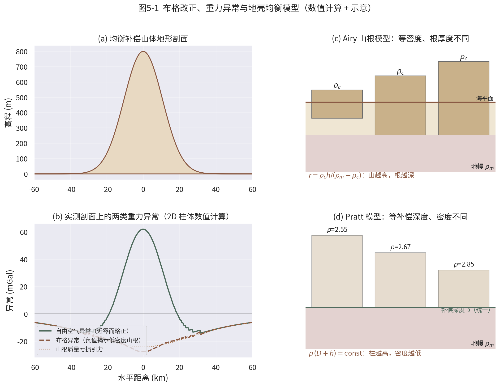
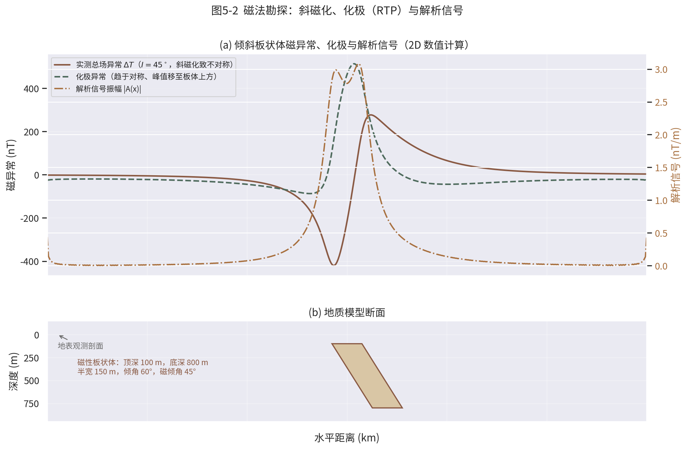
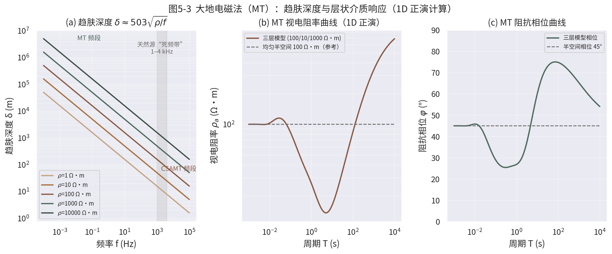
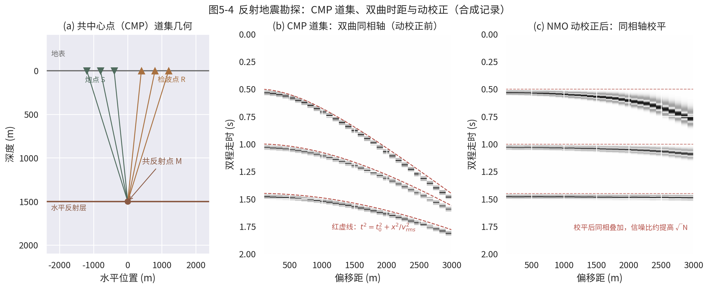

# 第5章 勘探地球物理方法

**TOE-SYLVA 教科书系列 · 地球物理学**

> **本章导读**：第1章的重力场、第2章的地震波，回答的是"地球深部是什么样"；本章回答一个更贴近工程与资源需求的问题——如何在地表用物理手段"看见"地下几百米到几千米的结构？我们按物理场分四路进军：重力法从布格板改正一路讲到 Airy 与 Pratt 的均衡图像，并用数值计算展示为什么补偿山体的布格异常必为负；磁法讲清斜磁化之惑、化极之术与解析信号之妙；电法与电磁法以趋肤深度 $\delta\approx503\sqrt{\rho/f}$ 一线贯穿直流电法、AMT/CSAMT 与大地电磁；地震法则走完从折射时距、CMP 叠加、NMO 动校正到 Kirchhoff 与 RTM 偏移的完整成像链。随后用一节说明四者共享的数学骨架——反演理论（Tikhonov 正则化、Backus–Gilbert 权衡、贝叶斯推断），最后以油气、矿产、工程、地热四个真实案例收束。本章所有插图均为真实数值计算或正演模拟。

前面几章讨论的地震学、重力学、地磁学与地热学，回答的是"地球深部是什么样"的问题；本章换一个角度，回答一个更贴近工程与资源需求的问题：如何在地表或近地表，用物理手段"看见"地下几百米到几千米的结构？这就是勘探地球物理（exploration geophysics）的任务。它的方法论与深部地球物理一脉相承——同样是观测物理场、同样是解反问题——但尺度更小、精度要求更高、与经济活动结合更紧：油气藏、金属矿、地下水、地热田、隧道与坝基，都是它的经典战场。本章按物理场分类，依次介绍重力、磁法、电法与电磁法、地震四大方法族，然后用一节篇幅说明它们共享的数学骨架——反演理论，最后给出四个真实应用案例。学习中请始终抓住一条主线：每一种方法都是"观测—改正—正演—反演—解释"这条链上的一环，链条的强度取决于最弱的一环。本章的参考框架主要依据 Telford 等的经典教材[^telford]。

## 5.1 重力勘探：称量地下的密度

重力勘探的思想朴素得惊人：地下密度不均匀，地表重力场就不均匀。一个密度高于围岩的矿体，会让头顶的重力值微微偏大；一个低密度盐丘，则让重力值偏小。困难在于"微微"二字——有意义的异常通常只有零点几到几毫伽（mGal，$1\ \mathrm{mGal}=10^{-5}\ \mathrm{m/s^2}$），而一系列与地下无关的因素造成的改正量往往比这大得多。

**观测值的改正。** 同一测点上，海拔每升高 1 m，离地心远了 1 m，重力减小约 0.3086 mGal，这部分要加回来，称为自由空气改正。设测点海拔为 $h$（以 m 计），则：

$$\Delta g_{FA} = 0.3086\,h\ \ (\mathrm{mGal})$$

测点与大地水准面之间还隔着一层岩石，这层"中间层"的引力要扣除，即布格板改正。把测点下方的岩层近似为无限大平板，厚度 $h$、密度 $\rho$，其引力为：

$$\Delta g_{B} = 2\pi G\rho h = 0.04192\,\rho\, h\ \ (\mathrm{mGal})$$

式中密度 $\rho$ 以 g/cm³ 计、厚度 $h$ 以 m 计。

实测值经自由空气改正得到自由空气异常，再减去布格板改正（并加上地形改正，扣除周围山丘和山谷的引力影响）就得到布格异常——它才是主要反映地下密度结构的量[^telford]。

**布格异常告诉我们什么？** 图5-1 给出了一个数值实验：一座高约 800 m 的山，若其质量被地壳深处的低密度"山根"完全补偿，那么实测自由空气异常接近于零（甚至略正），而布格异常在山区显著为负——负值正是低密度山根的"指纹"。这解释了为什么大山区布格异常总是大片负值：不是地下缺质量，而是地壳在"漂浮"。

{width=92%}

**地壳均衡的两种经典图像。** 上述漂浮思想有两种最早的具体化。Airy（1855）设想地壳密度均匀，但像冰山一样浮在密度更大的地幔上，山越高、插入地幔的"根"越深[^airy1855]。设地壳密度 $\rho_c$、地幔密度 $\rho_m$，地形高 $h$ 对应的山根厚度为：

$$r = \frac{\rho_c}{\rho_m-\rho_c}\,h$$

Pratt（1855）则设想所有柱体延伸到统一的补偿深度 $D$，但柱体密度不同：地形越高的柱体密度越低，满足[^pratt1855]

$$\rho\,(D+h)=\mathrm{const}$$

两个模型是对均衡补偿机制的理想化：真实大陆造山带往往接近 Airy 图像，而大洋与某些构造区更接近 Pratt 图像。均衡校正是把地形引起的这部分可预测重力效应系统性扣除，使剩余异常更干净地反映深部密度异常体。现代研究表明，真实均衡是弹性岩石圈的区域补偿，介于两者之间（详见第3章位场部分）。

**从异常到模型。** 拿到布格异常只是第一步，解释才是目的。常用手段有三类：其一，密度界面反演——若深浅密度差已知（如沉积盆地基底与盖层之间），可在频率域迭代调整界面深度使正演异常拟合观测，即 Parker 型方法，盆地基底深度图多由此而来；其二，欧拉反褶积——利用位场异常的齐次性，由异常及其梯度直接估计场源位置与构造指数，是断裂与岩体边界快速成图的利器；其三，垂向与水平梯度——重力梯度对浅部密度边界异常敏感，近代重力梯度仪（航空与卫星 GOCE）使梯度测量从稀罕变为常规[^telford]、[^blakely]。无论哪条路，最后都要面对位场解释的根本困难：由外部场唯一确定"等效源层"是可能的，由外部场唯一确定三维密度分布则是不可能的——多解性是位场方法与生俱来的胎记，只能靠钻井、地震与其他先验约束来驯服。

## 5.2 磁法勘探：倾听岩石的磁性

磁法是历史最久、成本最低的勘探方法之一。含磁铁矿的岩石会被地磁场磁化，在局部产生附加磁场；用磁力仪（光泵、质子旋进或磁通门式）测量总磁场强度，扣除国际参考地磁场（IGRF）和日变后，剩下的就是磁异常 $\Delta T$[^telford]。

**斜磁化的麻烦与化极。** 只有在磁极区（垂直磁化），磁异常才简单地对位于磁性体正上方。在中低纬度，磁化方向倾斜，异常变得歪斜：正峰值偏离磁性体，一侧还拖着负尾巴（图5-2）。这给解释带来不便。解决办法是化极（reduction to the pole, RTP）：在频率域对观测异常施加一个滤波算子，把倾斜磁化等效地"旋转"成垂直磁化。对走向无穷远的二度体（剖面沿 $x$、磁倾角 $I$），化极滤波器为[^blakely]：

$$H(k)=\left(\frac{|k|}{|k|\sin I-\mathrm{i}\,k\cos I}\right)^{2}$$

其中 $k$ 为空间波数。化极后异常趋于对称、峰值移到磁性体正上方，地质体的平面位置一目了然。

**解析信号：对磁化方向不敏感的边界探测器。** Nabighian（1972）提出解析信号振幅[^nabighian]

$$|A(x)|=\sqrt{\left(\frac{\partial T}{\partial x}\right)^{2}+\left(\frac{\partial T}{\partial z}\right)^{2}}$$

其妙处在于：对二度磁性体，$|A|$ 的峰值位置基本不依赖磁化方向，始终落在磁性体顶边上方，峰宽则与埋深相关。因此解析信号成为圈定断裂、岩体边界的标准工具。图5-2 用数值计算展示了倾斜板状体的实测异常、化极异常与解析信号三者的关系。

{width=92%}

磁法还可估计磁性层底界深度——居里等温面（约 580 ℃，磁铁矿失去铁磁性），从而间接约束地温场，这是磁法与地热研究的交叉点（见第3章）。

两点补充值得提醒。第一，实测磁化强度是感应磁化与剩余磁化的矢量和：许多火成岩携带与现今地磁场方向迥异甚至反向的剩磁，直接套用"沿地磁场磁化"的假设会把体位置解释错，剩磁方向恰恰也是古地磁研究（第3章）的观测对象。第二，观测平台决定分辨率与效率：卫星磁测给全球 lithospheric 场背景，航磁以百米级线距覆盖区域调查，地面磁测与井中磁测则服务矿体精细圈定——同一物理量在不同平台上的分工，与重力测量完全类似。

## 5.3 电法与电磁法：给大地做"电阻率扫描"

**直流电阻率法。** 通过供电电极向地下注入电流 $I$，测量另两个电极间的电位差 $\Delta V$，得到视电阻率

$$\rho_a = K\,\frac{\Delta V}{I}$$

其中 $K$ 为由电极几何决定的装置系数。说"视"（apparent）电阻率，是因为它是地下所有介质影响的加权平均，而非某一层的真电阻率。沿剖面移动装置（电剖面）可追踪横向变化；在同一测点逐步加大极距（电测深）则可探测垂向分层。激发极化法（IP）进一步利用含金属硫化物岩石在断电后电压缓慢衰减的"电容效应"，是找浸染型矿床的利器[^telford]。

**大地电磁法（MT）：用天然电磁场做探针。** 直流法探测深度受极距限制，一般只有几百米。要探到几公里乃至上百公里，需要天然场源。Cagniard（1953）奠定了大地电磁法的理论基础[^cagniard]：天然变化的电磁场以平面波形式垂直入射大地，在地表测得正交的电场 $E_x$ 与磁场 $H_y$，定义阻抗

$$Z(\omega)=\frac{E_x(\omega)}{H_y(\omega)},\qquad \rho_a=\frac{|Z|^2}{\omega\mu_0},\qquad \varphi=\arg Z$$

电磁场在导体中指数衰减，趋肤深度决定探测深度：

$$\delta \approx 503\sqrt{\frac{\rho}{f}}\ \ (\mathrm{m})$$

电阻率越高、频率越低，穿透越深。图5-3(a) 表明：在 100 Ω·m 的介质中，周期 100 s 的信号可穿透约 50 km。因此 MT 是研究壳幔电性结构的主力方法。图5-3(b)(c) 给出三层模型（100/10/1000 Ω·m）的 1D 正演响应：中间低阻层在视电阻率曲线上形成明显的凹陷，相位则先于幅值变化，灵敏地指示电性分界。

{width=96%}

**二维与非对角阻抗。** 真实地下是二维、三维的。此时电场与磁场不再简单正交，需用阻抗张量把二者联系起来[^vozoff]：$E_x = Z_{xx}H_x + Z_{xy}H_y$，$E_y = Z_{yx}H_x + Z_{yy}H_y$，即电场矢量等于阻抗张量 $\mathbf{Z}$（四个复元素 $Z_{xx}, Z_{xy}, Z_{yx}, Z_{yy}$）作用于磁场矢量。

二维介质中把坐标轴旋转到构造走向后，张量分解为两组独立的模式——TE 模式（电场平行走向）与 TM 模式（磁场平行走向），此时 $Z_{xx}$ 与 $Z_{yy}$ 趋于零；三维性则使对角元素不可忽略。阻抗张量的旋转不变量、相位张量与维性分析，是判断构造维性、选择 2D/3D 反演策略的日常工具。

**CSAMT 与 AMT。** MT 在 1–4 kHz 附近天然场信号微弱（"死频带"），且高频段探测浅。可控源音频大地电磁法（CSAMT）改用人工发射的大功率音频电流场源（典型 0.1 Hz–10 kHz），信噪比高、效率高，广泛用于矿产与工程勘察；代价是近场区与场源效应需要校正[^zonge]。音频大地电磁法（AMT）则仍用天然源，覆盖约 1 Hz–10 kHz，探测深度从几十米到一两公里，恰好在 MT 与直流电法之间搭桥。

**瞬变电磁法（TEM）。** 若在时间域而非频率域工作：向回线送入阶跃电流，断电后观测地下涡流激发的二次磁场衰减。晚期信号对应深部、早期对应浅部，记录衰减曲线即完成一次"时间—深度"扫描。TEM 对低阻体（含水层、块状硫化物）极其敏感，仪器轻便，已成为煤矿水害探查与金属矿普查的主力手段之一；其与频率域方法的关系，恰如地震时间域记录与谱分析的关系——同一物理内容的两种观测窗口[^telford]。

## 5.4 地震勘探：分辨率之王

地震方法用人工激发的弹性波照亮地下，分辨率比位场方法高一到两个数量级，是油气勘探的绝对主力[^sheriff]。

**折射先行。** 折射法利用沿高速层顶面滑行的首波。设上覆层速度 $v_1$、下伏高速层 $v_2$、界面埋深 $h$、临界角 $\theta_c$（$\sin\theta_c=v_1/v_2$），折射波时距曲线为

$$t=\frac{x}{v_2}+\frac{2h\cos\theta_c}{v_1}$$

斜率给出 $v_2$，截距给出 $h$。折射法设备简单，至今仍是工程勘察中确定基岩埋深与速度的标准手段；其局限是无法处理速度倒转层与薄层。

**反射与共中心点叠加。** 反射法记录自激振点出发、经界面反射回来的波。水平界面下、速度均匀时，反射时距曲线是双曲线（图5-4）：

$$t^2=t_0^2+\frac{x^2}{v_{rms}^2}$$

其中 $t_0$ 为自激自收时间，$x$ 为偏移距，$v_{rms}$ 为均方根速度。野外按共中心点（CMP）布设：同一地下反射点被许多不同偏移距的炮检对重复采样。处理时先用速度分析求出 $v_{rms}(t_0)$，再按上式把每道的反射时间校回到 $t_0$——这就是正常时差校正（NMO，动校正）；校平后把各道相加，随机噪声约按 $\sqrt{N}$ 被压制，反射信号显著增强[^yilmaz]。多层介质中，由两层界面的 $v_{rms}$ 与 $t_0$ 还可用 Dix 公式换算层速度：

$$v_{n}^{2}=\frac{v_{rms,n}^{2}t_{0,n}-v_{rms,n-1}^{2}t_{0,n-1}}{t_{0,n}-t_{0,n-1}}$$

{width=98%}

**偏移成像：把反射"送回家"。** 叠加剖面把每个反射画在接收点正下方，但倾斜界面的真实位置并不在那里——反射点发生了横向偏移。偏移（migration）的任务是把绕射能量收敛回真实反射点。Kirchhoff 偏移沿绕射双曲线求和，物理直观、灵活高效；波动方程偏移则直接外推波场，处理强变速更可靠；逆时偏移（RTM）用双程波动方程在时间上逆推波场，是当前成像精度的天花板，盐下、逆掩断层带等复杂构造赖其清晰成像[^biondi]。RTM 的思想可追溯到 Baysal 等（1983）的开创性工作[^baysal]，直到大规模并行计算成熟后才成为工业标准。

**观测系统与分辨率。** 地震勘探的能力边界由观测系统与频带共同决定。从二维测线到三维面积观测（海上多缆拖曳、陆上可控震源面元采集），再到四维时移地震监测油藏开采与 CO₂ 封存，观测系统的每一次升级都直接转化为储层描述能力的跃升。分辨率方面，垂向分辨率的经典极限约为优势波长的四分之一——30 Hz 主频、2000 m/s 速度对应约 17 m，这就是为什么地震能看清几十米的砂体而重力只能刻画几百米的块体。近年的两个延伸值得注意：垂直地震剖面（VSP）与井中光纤（DAS）把检波器放到地下，微地震监测则把勘探的"听诊器"架到水力压裂与地热开发现场，勘探地震学与天然地震学的仪器边界正在消融（参见第2章）。

## 5.5 反演理论：所有方法共享的数学骨架

上述四种方法，物理机制各异，数学上却是同一类问题：给定观测数据 $\mathbf{d}$，求地下模型参数 $\mathbf{m}$。正演写作

$$\mathbf{d}=G(\mathbf{m})$$

$G$ 为正演算子——重力是牛顿引力积分，MT 是麦克斯韦方程组，反射地震是波动方程。反演即由 $\mathbf{d}$ 求 $\mathbf{m}$。困难在于反问题几乎总是病态的：数据有限且含噪，能拟合数据的模型有无穷多个（欠定），解对数据误差又极度敏感[^aster]。

**Tikhonov 正则化。** 最常用的稳定化手段是在拟合数据之外，同时要求模型"不过分复杂"——极小化目标函数[^tikhonov]：

$$\min_{\mathbf{m}}\ \|\mathbf{d}-G\mathbf{m}\|^{2}+\lambda^{2}\|L\mathbf{m}\|^{2}$$

第一项拟合数据，第二项惩罚模型的粗糙度（$L$ 可取单位矩阵即最小模型，或梯度/拉普拉斯算子即最平滑模型），$\lambda$ 权衡两者。线性情形下解有显式形式：

$$\mathbf{m}_{est}=\left(G^{T}G+\lambda^{2}L^{T}L\right)^{-1}G^{T}\mathbf{d}$$

**Backus–Gilbert：分辨率与方差的交换。** Backus 与 Gilbert（1968）的贡献是把"解到底是什么"这个问题问到底[^backusgilbert]：有限数据永远给不出唯一点值模型 $\hat m(r)$，只能给出真模型经平均核 $A(r,r_0)$ 平滑后的局部平均。平均核越集中（分辨率高），估计的方差越大；压低方差就必须牺牲分辨率。这条分辨率—方差权衡曲线是评价任何线性反演的标尺，也提醒我们：反演图上的一个"异常体"，其真实位置与幅度都带有平均核决定的模糊性。

**贝叶斯视角。** 贝叶斯反演把模型与数据都看作随机变量，答案是后验概率分布而非单一模型[^tarantola]：

$$p(\mathbf{m}|\mathbf{d})\propto p(\mathbf{d}|\mathbf{m})\,p(\mathbf{m})$$

似然 $p(\mathbf{d}|\mathbf{m})$ 编码观测误差，先验 $p(\mathbf{m})$ 编码地质认识；高斯假设下后验亦为高斯，其最大点（MAP 估计）恰好等价于加权最小二乘加正则化，后验协方差 $\tilde{C}=(G^{T}C_d^{-1}G+C_m^{-1})^{-1}$ 则给出定量的不确定性。Menke 的教材以离散逆理论统一了上述各种表述[^menke]。

**非线性与全局方法。** 真实的 $G$ 大多非线性：MT 中阻抗是电阻率的非线性泛函，地震中走时与波形对速度的依赖更是强烈非线性。工程上最常用迭代线性化——在当前模型处求雅可比矩阵，反复解线性化子问题（高斯—牛顿或 Levenberg–Marquardt 步），其每一步恰好就是一个带正则化的小型 Tikhonov 问题；当初始模型远离真解、目标函数多峰时，则求助于蒙特卡洛采样、模拟退火、遗传算法等全局方法，或用伴随状态法计算梯度支撑全波形反演（FWI）。方法名录虽长，灵魂问题始终只有两个：解是否存在与唯一（可辨识性），以及解的不确定性如何定量——这正是反演理论留给每一种具体方法的共同考卷[^aster]、[^tarantola]。至此，重力、磁法、电磁、地震在数学上汇合为同一门学问。

## 5.6 应用实例四则

**油气：墨西哥湾盐下成像。** 墨西哥湾广泛发育的盐丘刺穿上覆地层，盐体速度（约 4.5 km/s）远高于围岩，盐下反射在常规偏移剖面上几乎无法成像。1993 年 Mahogany 油田成为美国首个盐下商业发现后，盐下成像成为攻关焦点。叠前深度偏移特别是 RTM 的引入，使盐丘边界与盐下构造逐步清晰，直接支撑了深水盐下油藏的大规模开发[^biondi]。

**矿产：加拿大 Voisey's Bay 镍矿。** 1993 年，Diamond Fields 公司在加拿大拉布拉多的航电—航磁测量中发现强电磁导体与高磁异常，钻探证实为世界级 Ni–Cu–Co 硫化物矿床（Ovoid 矿体）。该矿床的发现被视为电磁法与磁法联合勘查的里程碑：含磁黄铁矿的块状硫化物既是良导体又是强磁体，两种异常同生共指[^naldrett1996]。

**工程：岩溶区隧道超前预报。** 我国西南岩溶发育区的铁路隧道，掌子面前方的溶洞、暗河与断层破碎带是突水突泥的重大隐患。综合超前预报体系——地震反射（TSP）先行探构造、探地雷达近距精细刻画、瞬变电磁锁定含水低阻体——已成为高风险岩溶隧道的标准配置，充分体现了多方法联合反演的思想在工程尺度的落地[^reynolds]。

**地热：新西兰陶波火山带。** 新西兰陶波火山带（TVZ）是全球地热开发最集中的地区之一。Bibby 等（1995）通过大面积 MT 测量发现，火山带内浅部普遍发育小于 10 Ω·m 的低阻层——黏土化的热液蚀变帽，其下电阻率回升指示高温岩层；低阻带的横向边界与已知热田高度吻合，为热储圈定与井位部署提供了决定性约束[^bibby1995]。

## 5.7 本章小结

四大勘探方法族各有所长：重力与磁法成本低、覆盖快，长于圈定密度与磁性异常的平面范围；电法与电磁法对含水流体与金属矿敏感，探测深度跨度最大；地震方法分辨率最高，是构造与储层成像的主力。物理机制虽异，它们在地表观测的都是地下物性分布的模糊投影，因而共享同一套反演数学——正演算子、病态性、正则化与不确定性量化。多物理场联合反演与地质先验的深度融合，是当代勘探地球物理的主旋律。

**表5-1 四大方法族概览对比**

| 方法族 | 观测物理量 | 敏感物性 | 典型探测深度 | 相对分辨率 | 典型目标 |
|---|---|---|---|---|---|
| 重力勘探 | 重力加速度 | 密度 | 百米级至全地壳 | 低 | 盆地基底、均衡状态、岩体 |
| 磁法勘探 | 磁场强度 | 磁化率/剩磁 | 百米级至居里面 | 低—中 | 磁性矿体、断裂、居里面 |
| 电法与电磁法 | 电位差/电磁场 | 电阻率、极化率 | 十米级至上地幔 | 中 | 含水体、硫化物矿、热储 |
| 地震勘探 | 弹性波走时与波形 | 速度、阻抗 | 十米级至全地壳 | 高 | 构造、储层、岩溶、断层 |

**本章要点回顾**

- 布格异常剥离了地形与中间层质量，是地下密度结构与均衡状态的主要信息载体；Airy 与 Pratt 模型给出均衡补偿的两种端元图像。
- 化极把斜磁化异常旋转为垂直磁化，解析信号则以磁化方向不敏感的方式圈定磁性体边界。
- 剩磁方向可能偏离现今地磁场，解释磁异常前必须确认磁化方向假设是否成立。
- 趋肤深度 $\delta\approx503\sqrt{\rho/f}$ 统一说明频率、电阻率与探测深度的关系；阻抗张量把 MT 推广到二维三维构造。
- CMP 叠加与 NMO 校正利用 $t^2=t_0^2+x^2/v_{rms}^2$ 双曲关系压制噪声；偏移（Kirchhoff/RTM）把反射能量归位到真实反射点。
- Tikhonov 正则化、Backus–Gilbert 权衡与贝叶斯推断构成反演理论的三大支柱，为所有勘探方法所共享。
- 四个实例的共同启示：方法选择由目标体与围岩的物性对比度、埋深与观测条件共同决定，而非单一方法的"先进程度"。

**表5-2 本章与系列其他章节的交叉联系**

| 本章内容 | 联系章节 | 联系说明 |
|---|---|---|
| 布格异常与地壳均衡 | 第1章（地球的形状、重力场与大地测量） | 均衡补偿是解释大陆布格异常负值背景的物理基础 |
| 磁异常与居里面 | 系列地磁与地热主题章节 | 居里等温面深度约束岩石圈热状态 |
| 地震反射与速度结构 | 第2章（地震学与地球内部结构成像） | CMP 叠加与体波走时成像共享射线理论与波动理论 |
| MT 壳幔电性结构 | 第2章（深部成像反演） | 电性结构与地震速度、热流互为深部性质的独立约束 |
| 反演统一框架 | 第1、2章（观测—反演方法论） | 正演—反演思想贯穿固体地球物理全部观测手段 |
| 深部结构与资源能源 | 第6章（行星地球物理与地球系统） | 碳循环、地热等议题把勘探尺度与行星尺度连接起来 |
| 时移监测（油藏、CO₂封存） | 第6章（地球系统科学） | 四维地震把勘探技术接入地球系统管理与碳减排 |
| 联合反演与多物理约束 | 本章各节及第2章 | 多解性的根本出路在于独立物理场的相互印证 |

## 延伸阅读

- **方法总论**：Telford 等（1990）[^telford] 是勘探地球物理的标准教材，与本章 5.1–5.4 各节一一对应；Reynolds（2011）[^reynolds] 侧重工程与环境应用。
- **位场理论**：Blakely（1995）[^blakely] 系统给出重力与磁法的位场数学，是化极、解析信号与上下延拓的严谨出处。
- **地震处理**：Sheriff & Geldart（1995）[^sheriff] 讲原理，Yilmaz（2001）[^yilmaz] 讲处理流程，Biondi（2006）[^biondi] 讲三维成像。
- **反演理论**：入门读 Aster 等（2018）[^aster]，精炼读 Menke（2018）[^menke]，贝叶斯深入读 Tarantola（2005）[^tarantola]。
- **源头论文**：Cagniard（1953）[^cagniard] 与 Backus & Gilbert（1968）[^backusgilbert] 各开创一个领域，值得精读原文。

[^telford]: Telford, W.M., Geldart, L.P., Sheriff, R.E., 1990. Applied Geophysics (2nd ed.). Cambridge University Press.
[^airy1855]: Airy, G.B., 1855. On the computation of the effect of the attraction of mountain-masses, as disturbing the apparent astronomical latitude of stations in geodetic surveys. Philosophical Transactions of the Royal Society 145, 101–104. https://doi.org/10.1098/rstl.1855.0003
[^pratt1855]: Pratt, J.H., 1855. On the attraction of the Himalaya Mountains, and of the elevated regions beyond them, upon the plumb-line in India. Philosophical Transactions of the Royal Society 145, 53–100.
[^blakely]: Blakely, R.J., 1995. Potential Theory in Gravity and Magnetic Applications. Cambridge University Press.
[^nabighian]: Nabighian, M.N., 1972. The analytic signal of two-dimensional magnetic bodies with polygonal cross-section: Its properties and use for automated anomaly interpretation. Geophysics 37(3), 507–517. https://doi.org/10.1190/1.1440276
[^cagniard]: Cagniard, L., 1953. Basic theory of the magneto-telluric method of geophysical prospecting. Geophysics 18(3), 605–635. https://doi.org/10.1190/1.1437915
[^vozoff]: Vozoff, K., 1991. The magnetotelluric method. In: Nabighian, M.N. (Ed.), Electromagnetic Methods in Applied Geophysics, Vol. 2. Society of Exploration Geophysicists, 641–711.
[^zonge]: Zonge, K.L., Hughes, L.J., 1991. Controlled source audio-frequency magnetotellurics. In: Nabighian, M.N. (Ed.), Electromagnetic Methods in Applied Geophysics, Vol. 2. Society of Exploration Geophysicists, 713–809.
[^sheriff]: Sheriff, R.E., Geldart, L.P., 1995. Exploration Seismology (2nd ed.). Cambridge University Press.
[^yilmaz]: Yilmaz, Ö., 2001. Seismic Data Analysis: Processing, Inversion, and Interpretation of Seismic Data. Society of Exploration Geophysicists.
[^biondi]: Biondi, B., 2006. 3D Seismic Imaging. Society of Exploration Geophysicists.
[^baysal]: Baysal, E., Kosloff, D.D., Sherwood, J.W.C., 1983. Reverse time migration. Geophysics 48(11), 1514–1524. https://doi.org/10.1190/1.1441434
[^aster]: Aster, R.C., Borchers, B., Thurber, C.H., 2018. Parameter Estimation and Inverse Problems (3rd ed.). Elsevier.
[^tikhonov]: Tikhonov, A.N., Arsenin, V.Y., 1977. Solutions of Ill-Posed Problems. Winston & Sons / Wiley.
[^backusgilbert]: Backus, G.E., Gilbert, F., 1968. The resolving power of gross Earth data. Geophysical Journal of the Royal Astronomical Society 16, 169–205. https://doi.org/10.1111/j.1365-246X.1968.tb00216.x
[^tarantola]: Tarantola, A., 2005. Inverse Problem Theory and Methods for Model Parameter Estimation. SIAM.
[^menke]: Menke, W., 2018. Geophysical Data Analysis: Discrete Inverse Theory (4th ed.). Academic Press.
[^naldrett1996]: Naldrett, A.J., Keats, H., Sparkes, K., Moore, R., 1996. Geology of the Voisey's Bay Ni–Cu–Co deposit, Labrador, Canada. Exploration and Mining Geology 5(3), 169–179.
[^reynolds]: Reynolds, J.M., 2011. An Introduction to Applied and Environmental Geophysics (2nd ed.). Wiley-Blackwell.
[^bibby1995]: Bibby, H.M., Caldwell, T.G., Davey, F.J., Webb, T.H., 1995. Geophysical evidence on the structure of the Taupo Volcanic Zone and its hydrothermal circulation. Journal of Volcanology and Geothermal Research 68(1–3), 29–58.
