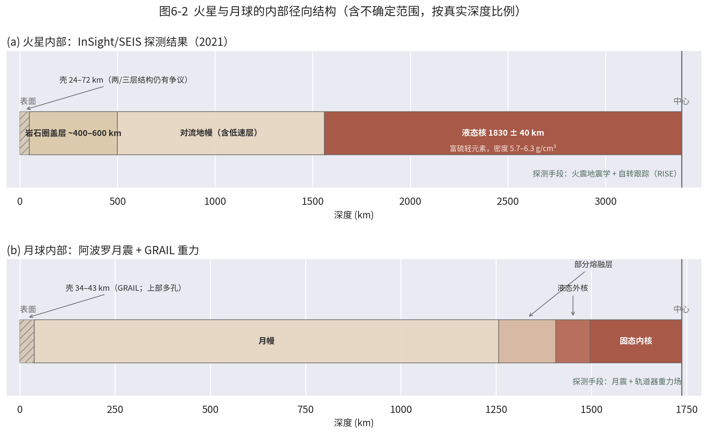
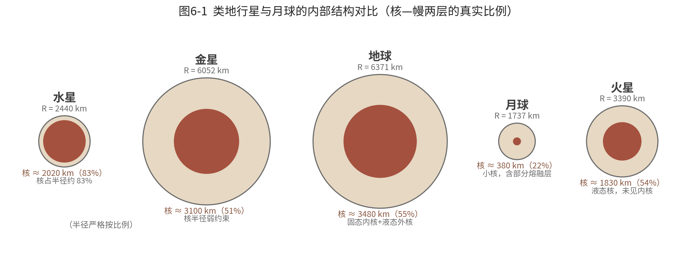
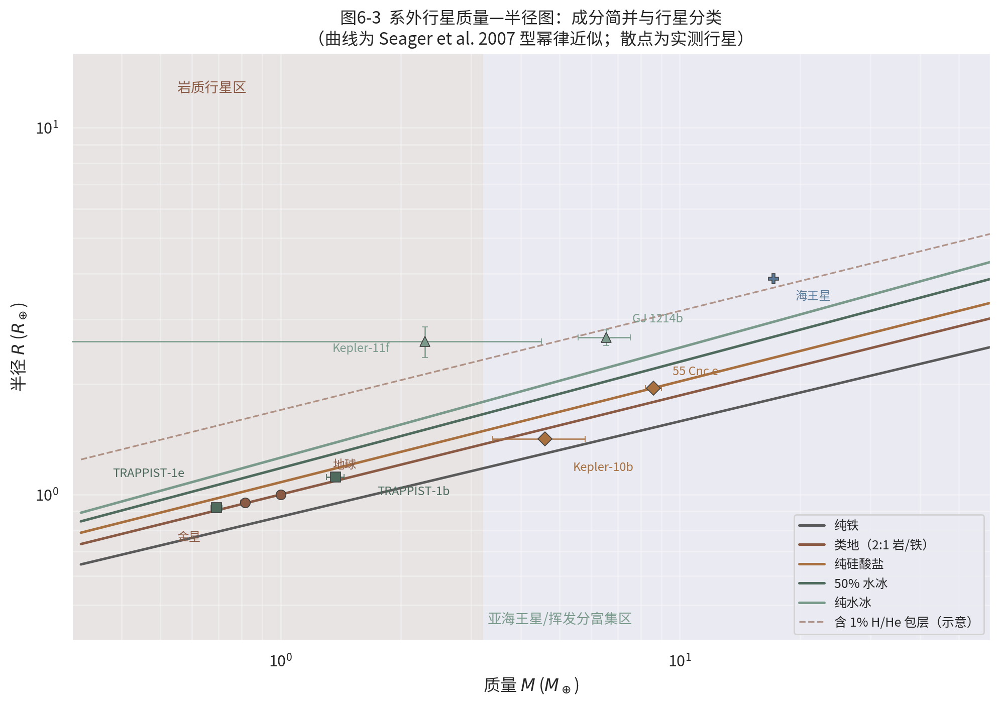
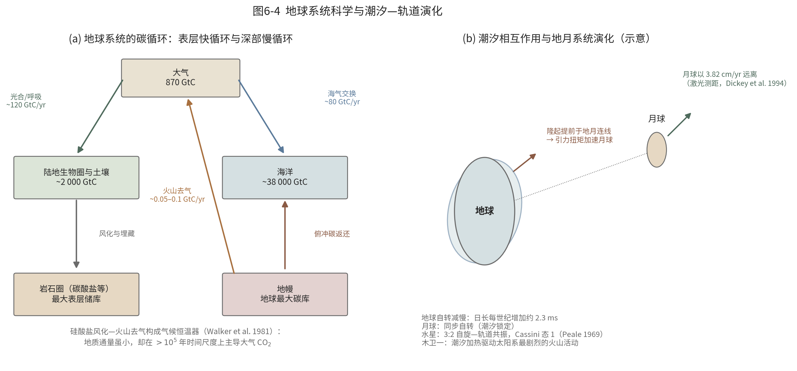

# 第6章 行星地球物理与地球系统

**TOE-SYLVA 教科书系列 · 地球物理学**

> **本章导读**：前五章以地球为舞台，本章把同一套地球物理方法推广到整个太阳系乃至系外行星。我们将看到：地震仪如何在火星上首次"听诊"另一颗行星，给出仍有争议的 24–72 km 火壳与约 1830 km 的液态火星核；双卫星编队飞行如何以微米级测距画出月球 34–43 km 的破碎月壳；水星为何几乎是一颗"裸露的核"而金星至今拒绝被直接探测；潮汐如何在亿万年尺度上锁定自转、推远月球、加热木卫一；当系外行星只有质量与半径两个观测量时，行星科学家们如何用 $R\propto M^{0.27}$ 的幂律撬开成分简并。最后两节把镜头拉回地球：深部与表层如何通过碳、水循环耦合成一个系统，以及比较行星学如何为全部行星体提供统一的物理框架。本章数据均来自真实任务与文献。

前五章以地球为舞台：第1章的重力场、第2章的地震波探测了地球内部，第5章把同一套方法浓缩到勘探尺度。本章把镜头拉远——把地球物理的观测手段与反演思想推广到其他行星体，再拉回到一个更宏大的框架：地球本身也是一个多圈层耦合演化的系统。行星地球物理要回答的问题与固体地球物理完全一致——内部如何分层？热如何散失？场如何产生？——但观测条件苛刻得多：我们不能随意在火星上打钻，能给金星放一台地震仪都还是梦想。于是比较行星学成为一门"以有限观测量约束行星"的艺术，其方法论正是第5章反演理论的极致演练。

这门学科的历史几乎与空间时代同龄：1959 年苏联 Luna 3 号拍回月球背面照片，1960 年代 Kaula 建立了卫星轨道反演行星重力场的理论，1969–1972 年阿波罗宇航员在月面布下月震仪与热流探针，1970 年代水手 10 号飞掠水星，1990 年代 Magellan 用雷达测绘金星、伽利略号环绕木星，2010 年代 GRAIL 与 MESSENGER 分别精测月球与水星，2018 年 InSight 把地震台站送上火星，而系外行星的爆发式发现则把"行星内部"问题推向了银河系尺度[^hubbard1984]。本章依次讨论探测方法学、火星与月球的最新成果、金星与水星、潮汐与轨道演化、系外行星内部，最后以地球系统科学与统一框架收束。

## 6.1 行星内部探测方法学：手段与天体的匹配

探测行星内部的手段与探测地球的手段同源，但每种手段都有明确的天体适用条件。

**地震学。** 需要足够强的天然震源和至少一台长期工作的台站。阿波罗计划在月面布设过四台月震仪（1969–1977）；2018 年 InSight 把 SEIS 宽频地震仪送上火星[^banerdt2020]。金星表面 460 ℃、92 倍大气压的环境使长寿命台站至今不可行，气球吊挂的次声探测是替代方案之一。冰卫星（木卫二、土卫二）的地震学仍停留在概念研究阶段。

**重力场。** 只需无线电跟踪轨道器即可反演，是适用面最广的手段。重力位习惯用球谐展开表示，以扁率项为主的形式为

$$V=\frac{GM}{r}\left[1-J_{2}\left(\frac{R}{r}\right)^{2}P_{2}(\sin\varphi)+\cdots\right]$$

其中 $J_2$ 与转动惯量因子 $C/(MR^2)$ 共同约束内部质量分布：地球 $C/(MR^2)=0.3307$，火星 $0.3644$（RISE 测量）[^banerdt2020]，水星约 $0.346$[^margot2012]，月球约 $0.393$——数值越接近均匀球的 0.4，说明质量向中心集中越弱。GRAIL（月球）、MESSENGER（水星）、Magellan（金星）与 MRO 等（火星）都是这条路线的代表[^zuber2013]、[^smith2012]。

**磁场。** 星载与表面磁强计测量内禀场（发电机是否仍在运转？），而电磁感应则提供了探测导电层（如冰下液态海洋）的远程手段：木卫二在木星磁层变化场中产生的感应磁场，是其冰壳之下存在全球性咸水海洋的关键证据之一[^khurana1998]。

**热流与形变。** 表面热流可直接约束内部热状态（阿波罗 15、17 号在月面钻取了热流探针）；对多数天体只能用热红外观测替代。潮汐形变与天平动（libration）测量则提供另一类强约束：潮汐洛夫数 $k_2$ 与耗散因子 $Q$ 反映内部的黏弹结构与熔融状态，自转速率的微小变化则能把固态外壳与液态外核的耦合"称"出来——正是这类测量证明水星拥有液态外核[^margot2012]。

**从观测量到内部模型。** 单一观测量从来不能唯一确定内部结构：行星内部模型是质量、半径、转动惯量、$J_2$、$k_2$、磁场、热流与表面成分（光谱）联合反演的产物，其方法论与第5章的联合反演完全同构，只是先验换成了高温高压矿物物理与宇宙化学（如 CI 球粒陨石的元素丰度）。Hubbard 的《Planetary Interiors》系统建立了这套联合约束框架[^hubbard1984]。

**行星的热量从哪来？** 类地行星的热源主要有三：形成时的吸积与分异余热、长寿命放射性元素（铀、钍、钾）的生热、以及潮汐耗散（在冰卫星上可成为主导）。散热通道则决定构造面貌：地球以板块构造高效散热，火星以停滞盖层缓慢散热，月球则早已把余热基本散尽。热源与散热通道的拉锯，写就了每个天体各不相同的地质履历。

**表6-1 探测手段与天体适用性概览**

| 手段 | 物理约束 | 已成功应用 | 主要限制 |
|---|---|---|---|
| 地震台站 | 分层结构、震源活动 | 月球、火星 | 需着陆部署；金星表面环境恶劣 |
| 轨道重力 | 质量分布、壳厚、均衡 | 月、火、金、水星、冰卫星 | 分辨率随高度衰减 |
| 磁测/电磁感应 | 发电机、导电层、冰下海洋 | 木卫二、木卫三、水星、火星（剩磁） | 需飞越或轨道多次采样 |
| 热流/热红外 | 热状态、热源分布 | 月球（原位）、多天体（遥感） | 原位测量极少 |
| 形变/潮汐/自转 | 黏弹结构、核的物态 | 水星、月球、土卫二 | 需长期测距或激光测高 |
| 表面成分光谱 | 幔壳物质、挥发分 | 全部可观测天体 | 只见"皮"不见"里"，需模型外推 |

## 6.2 火星：InSight 开启的火震学时代

2018 年 11 月，InSight 着陆于火星埃律西昂平原，首次把地球物理台站完整地带到另一颗行星：SEIS 地震仪、HP³ 热流探头与 RISE 自转跟踪实验[^banerdt2020]。四年间 SEIS 记录了一千多次火震，使火星成为地球之外第三个拥有天然地震学内部结构图像的天体（另两个是地球与月球）。

**火震是什么样子的？** 与地球地震相比，火震能量普遍很小（多数相当于 3–4 级以下），分为高频（HF）与低频（LF）两大家族：高频事件震源较浅、波形干脆；低频事件可能更深，波形受到火星壳强烈散射而拖长。火星没有板块构造，火震的驱动力主要是行星冷却收缩产生的热应力，另有若干事件被证实为新鲜陨石撞击——撞击坑随后被轨道器拍到，实现了"震源—图像"的双重确认。SEIS 还记录到 2021 年一次约 4.2 级的较大火震（S0976a），其面波首次为火星壳的横向不均匀性提供了直接约束。

**火星壳：仍有争议的厚度。** 利用着陆点下方的接收函数与波形模拟，Knapmeyer-Endrun 等（2021）发现火壳在着陆区存在两个或三个层界面：若按两层解释，壳厚约 $20\pm5$ km；三层解释则约 $39\pm8$ km。结合全球重力—地形约束外推，火星壳厚度估计在 **24–72 km** 之间——这一范围的不确定性至今仍是活跃的研究前沿，阅读文献时应如实对待两派模型[^knapmeyer2021]。

**火星幔与核。** Khan 等（2021）由火震体波给出：火星岩石圈盖层厚约 400–600 km，其下存在低速层，地幔成分与地球相似但富含铁[^khan2021]。Stähler 等（2021）则用核幔边界反射波（ScS 等震相）首次直接测出火星核半径约 $1830\pm40$ km——比多数人预期更大[^stahler2021]。由此推得的核平均密度仅 5.7–6.3 g/cm³，意味着液态火星核含有可观份额的硫、氧、碳、氢等轻元素；数据中**没有**发现固态内核的证据。图6-2(a) 汇总了这幅分层图像。

{width=96%}

**RISE 的独立佐证。** 火震学之外，RISE 实验通过多普勒跟踪火星自转轴的进动，独立给出转动惯量因子 $C/(MR^2)=0.3644$ 与核幔边界的潮汐响应，其结果与地震学的大核、低密度结论相互印证[^banerdt2020]。这是"独立手段交叉验证"原则（第5章）在行星尺度上的教科书式示范。

**HP³ 的遗憾与教训。** 并非所有实验都如愿：HP³ 热流探头设计的"鼹鼠"自钻机构原计划下潜 3–5 m 测量地温梯度，却因埃律西昂平原土壤摩擦特性与预期不符，最终只进入数十厘米深度。它仍测得了表层土壤的热导率，但火星体热流的直接测定目标未能实现。这一挫折本身即是行星探测的常态教材：外星实验必须对最坏的月壤/火壤力学性质做准备，而热流这一关键物理量的火星缺位，也提醒我们图6-2(a) 中"热状态"一栏的置信度远低于"分层界面"。

**大核的热演化含义。** 一个半径占行星 54% 的液态核对火星的热史意味着两件事：其一，核的快速冷却与巨大热容曾使早期地幔强烈对流，可能与古发电机的高效运转相伴；其二，缺乏内核结晶这一"化学浮力引擎"后，维持发电机的能量来源枯竭，火星发电机随之熄火——火震学给出的核结构，与火星壳剩磁记录的磁场史在时间线上咬合得相当漂亮[^stevenson2001]。

**InSight 的遗产。** 任务虽于 2022 年底因沙尘覆盖太阳能板而谢幕，SEIS 的全部波形目录已公开存档，火震目录仍在被全球同行持续再分析——新震相的辨认、噪声源（风、温度应力）的扣除、低频事件的定位都在推进。下一代火星地震台网若能把单点剖面升级为多台三维成像，火星内部的故事还远未讲完。

## 6.3 月球：从阿波罗月震到 GRAIL 重力

月球是地球之外内部结构资料最完备的天体。1969–1972 年间，阿波罗 12、14、15、16 号在月面布设了四台月震仪，一直工作到 1977 年，记录了上万次事件：深月震（震源深度可达约 1000 km，沿特定"巢"周期性复发，受潮汐应力调制）、浅月震、陨石撞击与人工撞击（遗弃的登月舱与土星火箭三级被有意撞向月面，提供了已知能量与位置的"标定震源"）。对月震记录的最新反演给出：月核由固态内核（半径约 240 km）与液态外核（约 330 km）构成，核幔边界之上还存在一个部分熔融层[^weber2011]（图6-2(b)）。

阿波罗 15 与 17 号还在月面钻孔安装了热流探针，测得月面热流约 15–21 mW/m²[^langseth1976]——与月球放射性元素丰度模型大体自洽，但两处台站都位于风暴洋边缘的 KREEP 富集区，这一数值能否代表全月平均，至今仍有讨论。

上月幔的波速结构则透露出月球更深处的故事：月震波速在约 500 km 深度以下显著变化，被解释为上地幔与下地幔（或"上月幔/下月幔"）的成分差异，可能与岩浆洋后期翻转——致密的晚期结晶富钛堆积层下沉——有关。这类"用今天的不均匀性反推 45 亿年前的分异史"的论证方式，是行星内部研究的典型推理链。

**GRAIL 革命。** 2012 年，双星编队飞行的 GRAIL 任务以前所未有的精度测定了月球重力场：两颗卫星一前一后绕月飞行，星间 Ka 波段测距精度达微米级，月间距离变化直接敏感于下方质量分布。Wieczorek 等（2013）据此给出月球壳平均厚度仅 **34–43 km**，并发现上月壳整体孔隙率高达约 12%——月壳是被 40 亿年撞击历史反复"打碎"的碎裂层[^wieczorek2013]。Zuber 等（2013）则展示了分辨率达到公里级的布格异常图：撞击盆地、岩墙群与深部质量瘤一览无余[^zuber2013]。月壳厚度与孔隙率的精确测定，直接约束了岩浆洋结晶与后期撞击改造的理论模型，其反演思路与第1章的重力场方法、第5章的位场解释一脉相承。

**月球的不对称性。** GRAIL 与地形数据还共同确认了一个老谜团的定量面貌：月球背面高地壳厚明显大于正面风暴洋一侧，而正面富含 KREEP（钾、稀土、磷）的风暴洋区壳更薄、放射性更富集。这种两面不对称塑造了月球的热与岩浆历史——正面月海泛滥而背面几乎没有，也为"地月系统形成的大碰撞假说"提供了必须同时解释的结构证据。

## 6.4 金星与水星：两个极端

**水星：一颗"裸露的核"。** 水星半径 2440 km，核却占约 83%（核半径约 2020 km）[^hauck2013]，硅酸盐幔壳总共只有约 400 km 厚——在图6-1 的对比中它几乎是一颗金属球。MESSENGER 的重力测量（Smith et al. 2012）与自转天平动测量（Margot et al. 2012）共同证明：水星固态外壳与内部自转解耦，即存在液态外核[^smith2012]、[^margot2012]。水星还拥有微弱的全球性偶极磁场（强度约为地球的 1%），说明其发电机至今仍在运转。关于水星巨大核的成因，巨撞击剥幔说与太阳星云高温分馏说仍在竞争；而表面高挥发分（硫、钾）含量的发现，又给"水星形成于靠近太阳的还原环境"这一推断增添了新的限制。欧日联合的 BepiColombo 探测器已于 2018 年启程、预计 2020 年代中期进入环水星轨道，其双探测器配置（行星轨道器 + 磁层轨道器）将把水星内部与磁场研究带入 MESSENGER 之后的下一个量级。

{width=94%}

**金星：最熟悉的陌生人。** 金星与地球大小、密度几乎相同（图6-1），内部结构却最缺直接约束：没有地震数据，重力场分辨率受轨道限制。现有认识主要依靠三类间接证据——Magellan 重力场给出的潮汐洛夫数 $k_2\approx0.30$，其数值暗示金星核至少部分为液态[^dumoulin2017]；金星缺乏全球性磁场，说明现今发电机不运转，可能与核慢速冷却、缺乏内核结晶有关[^stevenson1983]；而麦哲伦雷达图像的再分析发现了火山活动期间地表形态的直接变化，支持金星至今仍是地质"活"的行星[^herrick2023]。

**金星表面的年轻与单一。** 雷达测绘还揭示：金星表面撞击坑稀少且空间分布接近随机，表面平均年龄估计仅数亿年——仿佛整个行星在地质"近期"被整体翻新过。金星没有板块构造，其散热可能以幕式（episodic）岩石圈翻转方式进行：岩石圈长期停滞增厚，周期性地整体坍塌更新。这为理解地球早期或遥远类地行星的构造体制提供了对照样本——为什么大小相近的两颗行星，一颗走上了板块构造之路，另一颗却没有？水的润滑作用、岩石圈强度与地幔温度的微小差异，都可能改写答案。NASA 的 VERITAS 与 DAVINCI、欧空局的 EnVision 等新一代金星任务已获立项，将在 2030 年代把金星的重力场分辨率、大气剖面与火山活动监测推进到 Magellan 之后的新高度。

## 6.5 潮汐与轨道演化：最慢的地球物理过程

潮汐是引力的时间变化部分。天体 $A$ 对伴星 $B$ 产生的潮汐隆起幅度量级为

$$h\sim\frac{M_A}{M_B}\left(\frac{R_B}{a}\right)^{3}R_{B}$$

其中 $a$ 为轨道半径。隆起的黏弹性滞后产生扭矩，驱动自转与轨道的长期演化。潮汐耗散把自转角动量转移到轨道，其时间尺度对距离极为敏感：自转同步的特征时间随 $a^6$ 增长——这就是为什么月球早已被地球锁定，水星被太阳锁定在共振态，而地球被月球完全锁定还需等待远超太阳寿命的时间。

两个经典终点状态是：**潮汐锁定**——自转周期等于公转周期（月球对地球永远只露一面；多数近距卫星亦然）；**自旋—轨道共振**——水星被太阳捕获在 3:2 共振（自转 3 圈恰公转 2 圈）。Peale（1969）证明，在轨道上受潮汐支配的天体还会收敛到若干自旋轴取向的稳定态，即 Cassini 态；水星正位于 Cassini 态 1，其微小的自转轴倾角（约 2 角分）与天平动幅度为约束水星内部提供了独立杠杆[^peale1969]、[^margot2012]。混沌也是可能的结局：土卫七 Hyperion 的自转就处于混沌区[^wisdom1984]。Murray 与 Dermott 的专著系统建立了这一整套天体力学框架[^murraydermott]。

**地月系统的现在与过去。** 激光测月（阿波罗反射器，50 余年连续观测）给出月球现今以 **3.82 cm/yr** 远离地球[^dickey1994]；角动量守恒要求地球自转相应减慢，日长每世纪增加约 2.3 ms。向过去积分这一扭矩，Touma 与 Wisdom（1994）重建了月球轨道与地球自转轴倾角的演化历史[^touma1994]。古生物钟（潮汐层理与珊瑚生长纹）记录的地质时代日长，与这类天体力学反演大体吻合：数亿年前的一天只有约 22 小时。再往前追溯到大碰撞形成月球之时，地月距离可能只有今天的十几分之一，一天仅数小时——地球自转与月球轨道的整部历史，都写在今天这两台"慢变量"仪表的读数里。

**潮汐作为热源。** 潮汐还是强大的热机：木卫一因轨道偏心率被木星与邻近卫星反复"揉搓"，潮汐耗散使其表面热流高达约 2 W/m²——为全球平均的 20 余倍，驱动着太阳系最剧烈的火山活动；同样的机制在木卫二、土卫二的冰壳之下维持着液态海洋，土卫二南极的羽状喷发正是潮汐加热的直接展示。没有潮汐，这些冰卫星都将是死寂的冰冻岩石——潮汐因此把"轨道力学"与"宜居性"意外地连在了一起（图6-4(b)）。

## 6.6 系外行星内部：只有质量和半径时怎么办

迄今已确认的系外行星数以千计，但对绝大多数，我们能测的只有质量（视向速度）与半径（凌星）——即平均密度。这给内部结构带来根本的**成分简并**：同一条平均密度，可以由"岩+铁核"实现，也可以由"岩+大量水冰"或"岩+少量氢氦包层"实现。破解简并靠理论质量—半径关系：Seager 等（2007）用状态方程算出，固态行星的半径近似按幂律增长[^seager2007]

$$R\propto M^{0.27}$$

幂指数与归一化常数随成分而变：纯铁行星比类地行星小约 13%，而一半质量为水冰的行星则大约 18%（图6-3）[^zeng2013]。

{width=92%}

实测把理论变成了分类学。Weiss 与 Marcy（2014）统计发现半径约 1.6 倍地球半径以内的行星多为岩质[^weissmarcy2014]；加州—开普勒巡天进一步揭示小行星半径分布在约 1.5–2.0 地球半径处存在"半径谷"——一侧是岩质超级地球，另一侧是裹着薄氢氦包层的亚海王星，光蒸发剥离包层的理论预言与之吻合[^fulton2017]。几个标杆行星标定了整张图：Kepler-10b 是开普勒首颗确认的岩质系外行星[^batalha2011]；GJ 1214b 密度过低，必须含大量水或厚包层[^charbonneau2009]；TRAPPIST-1 的七颗近共振行星则给出迄今最精确的岩质行星密度序列，其成分介于纯岩与含水模型之间[^gillon2017]、[^agol2021]。海王星（17.1 地球质量、3.9 地球半径）则提醒我们：越过某个质量阈值，氢氦包层成为主导——这正是图6-3 中"亚海王星区"的含义。包层的有无还深受主星辐照控制：近距离行星受到的 X 射线与极紫外辐照会驱动大气逃逸，把原本裹着包层的行星"剥"成裸岩核——半径谷正是这一过程的化石记录[^fulton2017]。内部结构与大气逃逸在系外行星研究中因此密不可分。

**观测方法全景。** 凌星法通过行星遮挡恒星光测出半径，视向速度法通过恒星光谱的多普勒摆动测出质量；二者兼备才给出真实质量与平均密度。近共振多行星系统中，凌星时刻变化（TTV）还能不依赖视向速度直接称出行星质量——TRAPPIST-1 的精密质量正是这样获得的[^agol2021]。展望未来，JWST 与下一代 30 米级望远镜的大气光谱将为成分简并提供第三根杠杆：内部结构 + 大气成分 + 主星丰度的联合约束，是系外行星地球物理的下一章。

## 6.7 地球系统科学：深部与表层的耦合

把镜头拉回地球。地球科学 20 世纪最重要的观念转变之一，是认识到固体深部、水圈、大气圈与生物圈是一个耦合系统。碳循环是最好的例子（图6-4(a)）：表层储库之间以每年百 GtC 量级的通量快速交换；而硅酸盐风化消耗 CO₂、火山去气补充 CO₂ 的地质通量虽小 3 个数量级，却在十万年以上尺度上单向决定大气 CO₂ 的存量——这就是 Walker 等（1981）提出的气候恒温器负反馈[^walker1981]，Berner 的 GEOCARB 模型据此重建了显生宙大气 CO₂ 的长期演化：早古生代的高 CO₂、晚古生代冰期的低 CO₂、中生代的温室气候，都可以在构造—风化—去气的框架中得到统一解释[^berner2004]。碳如何回到深部？俯冲带把碳酸盐与有机碳带入地幔，部分在岛弧火山脱气返回地表，部分继续下潜进入深地幔碳库[^sleep2001]、[^dasgupta2010]。水也走类似的深循环：转换带矿物（瓦兹利石、林伍德石）可储存与地表海洋相当的水，Pearson 等（2014）在金刚石包裹体中发现的含水林伍德石是直接证据[^pearson2014]。

{width=98%}

耦合的另一个方向是深部事件对表层的冲击。大火成岩省（LIP）在地质瞬时内释放巨量 CO₂ 与 SO₂，其喷发年龄与多次生物大灭绝界限高度吻合，成为"深部过程改写生物圈"最有力的候选机制[^courtillot2003]。反向耦合同样存在：冰期—间冰期的冰盖消长通过均衡回弹驱动岩石圈垂向运动（第1章），侵蚀卸载改变造山带的压力—温度路径，构造抬升又反过来改变风化通量与气候。地球以约 46±3 TW 的速率向太空散热[^davies2010]，这台热机的每一根"排气管"——洋脊、热点、弧火山——都同时是深部与表层交换物质与能量的接口。理解地球，必须同时阅读这两本账：一本写在岩石里，一本写在大气与海洋里。

一个发人深省的对照为这段讨论收尾：今天人类活动排放的 CO₂ 约每年 10 GtC 量级，比全球火山去气通量高出约两个数量级。地质通量设定的是气候的"慢节拍器"，而人类正在以地质瞬时改变大气成分——这恰恰反衬出，理解这套深时耦合机制对评估当下变化有多么紧迫。

## 6.8 比较行星学的统一框架

遍历太阳系与系外行星之后，可以提炼出行星地球物理的统一框架。物理上，所有行星体服从同一组守恒律——质量、动量、能量与成分——差异只在初值与边界条件。热演化给出最简标度：散热面积正比于 $R^2$，储热体积正比于 $R^3$，故天体越小冷却越快——月球、水星早早地质沉寂，地球与金星仍保持活力，这不是偶然而是几何。用无量纲语言说，行星热机由瑞利数（对流驱动力与扩散阻力之比）、斯特鲁哈尔数（自转对对流与发电机的影响）等少数参数家族控制：把这些数点在一张图上，地球、火星、水星与巨行星各就各位，它们的结构差异大多可以在参数空间中找到位置。

方法上，行星探测与第5章勘探地球物理共享同一个反演骨架：观测永远有限，解永远病态，正则化与先验（这里是高温高压矿物物理与宇宙化学约束）永远不可或缺。比较行星学的独特价值恰在于此：火星展示没有板块构造的停滞盖层（stagnant lid）终局，金星展示"地球如果失掉海洋与磁场"的平行世界，水星展示极端分异的金属核样本，系外行星则把样本数从一扩展到几千——地球物理学由此从一门单行星的经验科学，变成一门真正的行星科学。

宜居性也在这幅框架图中找到了位置：行星要保持长期液态水，需要足够大的质量以维持内部热机与磁场、足够稳定的气候反馈以缓冲光度变化、还需要恰到好处的挥发分预算——地球的"恰好"，在比较行星学的参数空间里看得最清楚。这正是我们把地球称为"金发姑娘行星"的物理含义，也是系外宜居带研究与固体地球物理交汇的前沿。

## 6.9 本章小结

行星内部探测是"手段与天体匹配"的艺术：地震学在月球与火星取得成功，重力场适用最广，电磁感应能遥探冰下海洋，潮汐与自转测量则约束核的物态。InSight 给出火星壳 24–72 km（两/三层之争如实存在）、核 $1830\pm40$ km 液态富轻元素的图像；GRAIL 给出月壳平均 34–43 km 且高度破碎。潮汐以最长的时间常数雕塑着自转与轨道，也把宜居海洋藏进冰壳之下。系外行星用质量—半径关系把地球物理推广到银河系尺度。而地球系统科学提醒我们：深部与表层互为因果，理解地球必须整体理解。

**本章要点回顾**

- 转动惯量因子 $C/(MR^2)$ 与 $J_2$ 是约束行星内部质量分布的第一批观测量；单一手段从不充分，联合约束才是常态。
- 火星壳厚度 24–72 km 的不确定性是教科书必须如实标注的开放问题；火星核 $1830\pm40$ km、液态、富轻元素、未见内核。
- 月壳的薄（34–43 km）与碎（孔隙率约 12%）由 GRAIL 双星微米级测距确立。
- 潮汐锁定、自旋—轨道共振与 Cassini 态是潮汐演化的三种典型终态；潮汐加热是冰卫星海洋与木卫一火山的能量之源。
- 成分简并是系外行星内部研究的核心困难；$R\propto M^{0.27}$ 幂律与"半径谷"给出第一批经验规律。
- 碳与水在深部—表层之间的循环，把固体地球物理与气候、生命连成一体；LIP 与灭绝的关联展示了深部对表层的剧烈冲击。
- 比较行星学的统一框架：同一组守恒律 + 少数无量纲参数 + 同一个反演骨架，样本越多，地球看得越清。
- 行星探测的每个数字都带着任务名与误差棒：阅读与引用时，先读其来源与不确定度。

**表6-2 本章与系列其他章节的交叉联系**

| 本章内容 | 联系章节 | 联系说明 |
|---|---|---|
| 行星重力场与转动惯量 | 第1章（地球的形状、重力场与大地测量） | 同一球谐理论在地球与其他天体上的应用 |
| 火震、月震内部成像 | 第2章（地震学与地球内部结构成像） | 走时反演、接收函数方法直接移植到外星台站 |
| 行星发电机 | 系列地磁学主题章节 | 地磁发电机理论在火星、水星条件下的检验 |
| 潮汐形变与洛夫数 | 第1章（重力场与固体潮主题） | 地球固体潮理论推广到其他行星体 |
| 探测手段—病态反演 | 第5章（勘探地球物理方法） | 行星探测是反演理论在极端数据条件下的演练 |
| 碳循环、地热与气候 | 第5章（地热勘探）与系列地热主题章节 | 深时气候的固体地球调控机制 |
| 宜居性与大气逃逸 | 本章 6.6、6.8 与第5章（反演框架） | 内部热机—磁场—气候反馈的联合条件 |
| 行星热演化与构造体制 | 系列地球动力学主题章节 | 停滞盖层与板块构造散热方式的对比 |

## 延伸阅读

- **行星内部总论**：Hubbard（1984）[^hubbard1984] 是行星内部结构的经典专著；Stevenson 等（1983）[^stevenson1983] 是类地行星热演化与发电机研究的奠基论文。
- **火星与月球探测**：Banerdt 等（2020）[^banerdt2020] 综述 InSight 首批成果；Wieczorek 等（2013）[^wieczorek2013] 与 Zuber 等（2013）[^zuber2013] 是 GRAIL 的双璧。
- **潮汐与轨道**：Murray & Dermott（1999）[^murraydermott] 是天体力学标准教材；Peale（1969）[^peale1969] 与 Touma & Wisdom（1994）[^touma1994] 是两篇常读常新的经典。
- **系外行星内部**：Seager 等（2007）[^seager2007] 与 Zeng & Sasselov（2013）[^zeng2013] 提供质量—半径关系的理论网格；Agol 等（2021）[^agol2021] 是 TRAPPIST-1 系统的精密测量范本。
- **地球系统**：Walker 等（1981）[^walker1981]、Berner（2004）[^berner2004] 与 Dasgupta & Hirschmann（2010）[^dasgupta2010] 串起了气候恒温器与深部碳循环的主线。

[^banerdt2020]: Banerdt, W.B., et al., 2020. Initial results from the InSight mission on Mars. Nature Geoscience 13, 183–189. https://doi.org/10.1038/s41561-020-0544-y
[^knapmeyer2021]: Knapmeyer-Endrun, B., et al., 2021. Thickness and structure of the Martian crust from InSight seismic data. Science 373, 438–443. https://doi.org/10.1126/science.abf8966
[^khan2021]: Khan, A., et al., 2021. Upper mantle structure of Mars from InSight seismic data. Science 373, 434–438. https://doi.org/10.1126/science.abf2966
[^stahler2021]: Stähler, S.C., et al., 2021. Seismic detection of the Martian core. Science 373, 443–448. https://doi.org/10.1126/science.abi7730
[^stevenson2001]: Stevenson, D.J., 2001. Mars' core and magnetism. Nature 412, 214–219. https://doi.org/10.1038/35084155
[^stevenson1983]: Stevenson, D.J., Spohn, T., Schubert, G., 1983. Magnetism and thermal evolution of the terrestrial planets. Icarus 54, 466–489. https://doi.org/10.1016/0019-1035(83)90241-5
[^hubbard1984]: Hubbard, W.B., 1984. Planetary Interiors. Van Nostrand Reinhold.
[^weber2011]: Weber, R.C., Lin, P.-Y., Garnero, E.J., Williams, Q., Lognonné, P., 2011. Seismic detection of the lunar core. Science 331, 309–312. https://doi.org/10.1126/science.1199375
[^langseth1976]: Langseth, M.G., Keihm, S.J., Peters, K., 1976. Revised lunar heat-flow values. Proceedings of the 7th Lunar Science Conference, 3143–3171.
[^wieczorek2013]: Wieczorek, M.A., et al., 2013. The crust of the Moon as seen by GRAIL. Science 339, 671–675. https://doi.org/10.1126/science.1231530
[^zuber2013]: Zuber, M.T., et al., 2013. Gravity field of the Moon from the Gravity Recovery and Interior Laboratory (GRAIL) mission. Science 339, 668–671. https://doi.org/10.1126/science.1231507
[^margot2012]: Margot, J.-L., Peale, S.J., Solomon, S.C., et al., 2012. Mercury's moment of inertia from spin and gravity data. Journal of Geophysical Research 117, E00L09. https://doi.org/10.1029/2012JE004161
[^hauck2013]: Hauck, S.A., et al., 2013. The curious case of Mercury's internal structure. Journal of Geophysical Research: Planets 118, 1204–1220. https://doi.org/10.1002/jgre.20091
[^smith2012]: Smith, D.E., et al., 2012. Gravity field and internal structure of Mercury from MESSENGER. Science 336, 214–217. https://doi.org/10.1126/science.1218809
[^dumoulin2017]: Dumoulin, C., Tobie, G., Verhoeven, O., Rosenblatt, P., Rambaux, N., 2017. Tidal constraints on the interior of Venus. Journal of Geophysical Research: Planets 122, 1338–1352. https://doi.org/10.1002/2016JE005249
[^herrick2023]: Herrick, R.R., Hensley, S., 2023. Surface changes observed on a Venusian volcano during the 1991 Magellan mission. Science 379, 1205–1208. https://doi.org/10.1126/science.abm7735
[^khurana1998]: Khurana, K.K., et al., 1998. Induced magnetic fields as evidence for subsurface oceans in Europa and Callisto. Nature 395, 777–780. https://doi.org/10.1038/27394
[^peale1969]: Peale, S.J., 1969. Generalized Cassini's laws. Astronomical Journal 74, 483–489. https://doi.org/10.1086/110825
[^wisdom1984]: Wisdom, J., Peale, S.J., Mignard, F., 1984. The chaotic rotation of Hyperion. Icarus 58, 137–152. https://doi.org/10.1016/0019-1035(84)90032-0
[^murraydermott]: Murray, C.D., Dermott, S.F., 1999. Solar System Dynamics. Cambridge University Press.
[^dickey1994]: Dickey, J.O., et al., 1994. Lunar laser ranging: A continuing legacy of the Apollo program. Science 265, 482–490. https://doi.org/10.1126/science.265.5171.482
[^touma1994]: Touma, J., Wisdom, J., 1994. Evolution of the Earth-Moon system. Astronomical Journal 108, 1943–1961. https://doi.org/10.1086/117209
[^seager2007]: Seager, S., Kuchner, M., Hier-Majumder, C.A., Militzer, B., 2007. Mass–radius relationships for solid exoplanets. Astrophysical Journal 669, 1279–1297. https://doi.org/10.1086/521346
[^zeng2013]: Zeng, L., Sasselov, D., 2013. A detailed model grid for solid planets from 0.1 through 100 Earth masses. Publications of the Astronomical Society of the Pacific 125, 227–239. https://doi.org/10.1086/669163
[^weissmarcy2014]: Weiss, L.M., Marcy, G.W., 2014. The mass–radius relation for 65 exoplanets smaller than 4 Earth radii. Astrophysical Journal Letters 783, L6. https://doi.org/10.1088/2041-8205/783/1/L6
[^fulton2017]: Fulton, B.J., et al., 2017. The California-Kepler Survey. III. A gap in the radius distribution of small planets. Astronomical Journal 154, 109. https://doi.org/10.3847/1538-3881/aa80eb
[^batalha2011]: Batalha, N.M., et al., 2011. Kepler's first rocky planet: Kepler-10b. Astrophysical Journal 729, 27. https://doi.org/10.1088/0004-637X/729/1/27
[^charbonneau2009]: Charbonneau, D., et al., 2009. A super-Earth transiting a nearby low-mass star. Nature 462, 891–894. https://doi.org/10.1038/nature08679
[^gillon2017]: Gillon, M., et al., 2017. Seven temperate terrestrial planets around the nearby ultracool dwarf star TRAPPIST-1. Nature 542, 456–460. https://doi.org/10.1038/nature21360
[^agol2021]: Agol, E., Dorn, C., et al., 2021. Refining the transit-timing and photometric analysis of TRAPPIST-1: Masses, radii, densities, dynamics, and ephemerides. Planetary Science Journal 2, 1. https://doi.org/10.3847/PSJ/abd022
[^walker1981]: Walker, J.C.G., Hays, P.B., Kasting, J.F., 1981. A negative feedback mechanism for the long-term stabilization of Earth's surface temperature. Journal of Geophysical Research 86, 9776–9782. https://doi.org/10.1029/JC086iC10p09776
[^berner2004]: Berner, R.A., 2004. The Phanerozoic Carbon Cycle: CO₂ and O₂. Oxford University Press.
[^sleep2001]: Sleep, N.H., Zahnle, K., 2001. Carbon dioxide cycling and implications for climate on ancient Earth. Journal of Geophysical Research 106, 1373–1399. https://doi.org/10.1029/2000JE001247
[^dasgupta2010]: Dasgupta, R., Hirschmann, M.M., 2010. The deep carbon cycle and melting in Earth's interior. Earth and Planetary Science Letters 298, 1–13. https://doi.org/10.1016/j.epsl.2010.06.039
[^pearson2014]: Pearson, D.G., et al., 2014. Hydrous mantle transition zone indicated by ringwoodite included within diamond. Nature 507, 221–224. https://doi.org/10.1038/nature13080
[^courtillot2003]: Courtillot, V., Renne, P.R., 2003. On the ages of flood basalt events. Comptes Rendus Geoscience 335, 113–140. https://doi.org/10.1016/S1631-0713(03)00006-0
[^davies2010]: Davies, J.H., Davies, D.R., 2010. Earth's surface heat flux. Solid Earth 1, 5–24. https://doi.org/10.5194/se-1-5-2010
