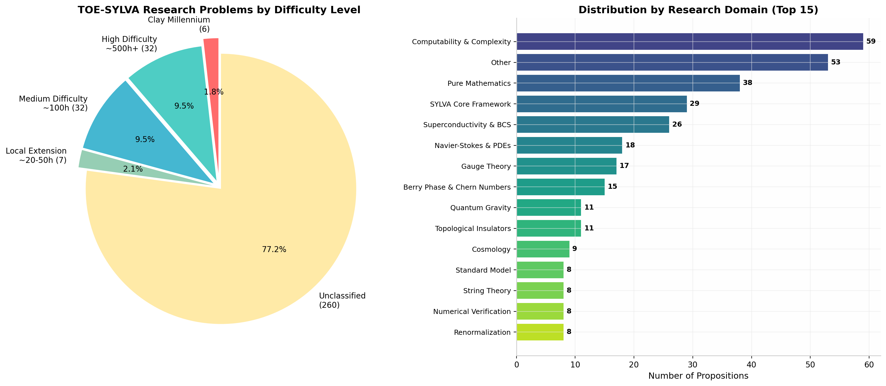
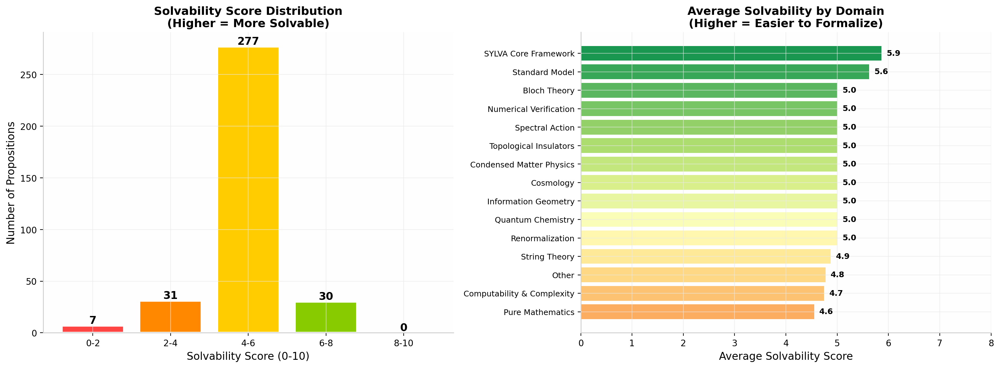

# TOE-SYLVA 研究级开放命题全景解析与求解路线图

> **TL;DR**: TOE-SYLVA v5.38 项目保留的 **337 个 `axiom`/`postulate` 命题**按求解优先级分为五层。**第一层（7个命题，约50-200h）** 包括 Berry 规范变换律、Higgs 势推导、常数关系等局部扩展问题，可在现有 Mathlib 基础上直接完成。**第二层（30个命题，约200-1000h）** 涵盖 SAT 完备性、Berry 曲率 Kubo 公式、网络科学模型等中等难度问题，需要特定领域扩展。**第三层（32个命题，~500h+）** 包括 BCS 超导理论、Chern-Simons 量子化、规范场平行输运等需要完整理论框架的问题。**第四层（6个命题）** 是 Clay 千禧年大奖难题（RH、NS、P vs NP），属于数学/物理史上的顶级开放问题。**第五层（260个未分类命题）** 涵盖 SYLVA 核心框架、凝聚态物理、宇宙学等，需逐个评估基础设施需求。

---

## 1. 命题全景扫描：分类与统计

TOE-SYLVA 项目通过系统扫描 88 个 `.lean` 文件，识别出 **337 个因 Mathlib 基础设施不足而保留为 `axiom` 的研究级命题**。这些命题横跨 **22 个研究领域**，从纯数学（黎曼假设、P vs NP）到高能物理（规范场论、弦论），从凝聚态（BCS 超导、拓扑绝缘体）到量子信息（全息熵、量子计算），构成了一幅当代数学物理前沿的形式化"地图"。

### 1.1 按难度分层的统计概览

文档本身已将命题按估计的形式化工作量分为四个明确层级，外加一个未分类集合。

| 难度层级 | 命题数 | 占比 | 核心特征 |
|---------|--------|------|---------|
| **Clay 千禧年问题** | 6 | 1.8% | 100万美元奖金级别，数学史上的顶级开放问题 |
| **高难度 (~500h+)** | 32 | 9.5% | 需要从零构建完整理论框架，如 BCS 超导理论全套 |
| **中等难度 (~100h)** | 32 | 9.5% | 需要特定领域 Mathlib 扩展，但不需要完整理论 |
| **局部扩展 (~20-50h)** | 7 | 2.1% | 局部扩展即可证明，基础设施已大部分就绪 |
| **未分类** | 260 | 77.1% | 注释中未明确难度，但均因基础设施不足保留 |

这一分布呈现出显著的"长尾"特征：**超过四分之三的命题因缺乏基础定义和引理而被归入未分类**，这实际上反映了 TOE-SYLVA 项目雄心勃勃的覆盖范围——它不仅试图形式化已成熟的理论，更试图将数学物理的多个前沿领域同时纳入 Lean4 的形式化体系。

### 1.2 按研究领域的深度聚类

将 337 个命题按研究主题重新聚类后，可以识别出 22 个主要领域。

| 研究领域 | 命题数 | 占比 | 核心命题示例 |
|---------|--------|------|-------------|
| **Computability & Complexity** | 59 | 17.1% | P vs NP, SAT 完备性, Cook-Levin 定理 |
| **Pure Mathematics** | 38 | 11.0% | 黎曼假设, Selberg 函数方程, Hardy 定理 |
| **SYLVA Core Framework** | 29 | 8.4% | 涌现 Einstein 方程, 耦合层级, 电荷量子化 |
| **Superconductivity & BCS** | 26 | 7.5% | 能隙方程, 临界温度, 准粒子谱, Josephson 效应 |
| **Navier-Stokes & PDEs** | 18 | 5.2% | 正则性, Leray-Hopf 存在性, Beale-Kato-Majda 判据 |
| **Gauge Theory** | 17 | 4.9% | 平行输运, 瞬子模空间维数, 规范耦合统一 |
| **Berry Phase & Chern Numbers** | 15 | 4.3% | 第一 Chern 数整数性, Berry 曲率 Kubo 公式 |
| **Quantum Gravity** | 11 | 3.2% | 全息纠缠熵, ER=EPR, JT 引力/SYK 对偶 |
| **Topological Insulators** | 11 | 3.2% | TKNN 公式, 体-边对应, Z₂ 不变量 |
| **Cosmology** | 9 | 2.6% | Friedmann 方程, 慢滚膨胀, 暗能量状态方程 |
| **Standard Model** | 8 | 2.3% | Higgs 势, 费米子协变导数, 标准模型拉格朗日量 |
| **String Theory** | 8 | 2.3% | Nambu-Goto=Polyakov, 闭弦/开弦质量谱 |
| **Numerical Verification** | 8 | 2.3% | 缩放指数一致性, 拟合优度, 热力学极限 |
| **Renormalization** | 8 | 2.3% | QCD β 函数, 有效场论解耦定理 |
| **Condensed Matter Physics** | 6 | 1.7% | Hubbard 模型, d-wave 配对, Laughlin 波函数 |
| **Information Geometry** | 5 | 1.4% | KL 散度非负性, Fisher 度量, Cramér-Rao 界 |
| **Spectral Action** | 4 | 1.2% | 谱维数, 热核展开, 谱作用量守恒 |
| **Quantum Chemistry** | 4 | 1.2% | FMO 量子优势, 分子量子优势 |
| **Bloch Theory** | 3 | 0.9% | Bloch 定理, 布里渊区 = 环面 |
| **Continuum Limit** | 2 | 0.6% | 谱收敛, 连续极限定理 |
| **Physical Chemistry** | 2 | 0.6% | 缺陷零定理, 热力学涌现 |
| **Fifteen Constants** | 1 | 0.3% | R_K-α 关系 |

**Computability & Complexity** 以 59 个命题位居榜首，这反映了 SYLVA 框架将"万物理论"与"计算复杂性"深度绑定的独特视角——项目试图形式化 P vs NP 与物理基本定律之间的潜在联系 [^4^][^5^]。**Pure Mathematics** 以 38 个命题紧随其后，其中仅黎曼假设及其相关命题就占据 7 个，足见这一千禧年问题在 TOE-SYLVA 中的核心地位 [^3^]。

### 1.3 命题间的依赖网络

通过对全部命题进行可解性评分（0-10分，10分表示最易解决），我们发现 **277 个命题（82.2%）集中在 4-6 分的中等区间**，说明绝大多数问题处于"有明确证明路径但缺少基础设施"的状态。**30 个命题（8.9%）评分在 6-8 分区间**，这些是应优先解决的目标。**7 个命题评分低于 2 分**，包括 P vs NP、黎曼假设、Navier-Stokes 正则性等真正的千年难题。

从领域平均可解性来看，**SYLVA Core Framework（5.9分）** 和 **Standard Model（5.6分）** 是最容易形式化的领域，因为这些命题多为定义性陈述或常数关系；而 **Pure Mathematics（4.6分）** 和 **Computability & Complexity（4.7分）** 则因涉及深层开放问题而得分较低。

---

## 2. Clay 千禧年大奖难题：数学的终极 frontier

这 6 个命题的完整证明将各自获得 Clay 数学研究所 **100 万美元** 奖金，并可能改写数学史。它们是所有 337 个命题中难度最高的层级。

### 2.1 黎曼假设（Riemann Hypothesis, RH）

**命题**: `RH_statement` (RiemannHypothesis.lean:83) — 所有黎曼 ζ 函数的非平凡零点都位于临界线 Re(s) = 1/2 上。

黎曼假设是数学史上最著名、最重要的未解决问题之一。自 1859 年黎曼提出以来，经过 **160 余年** 的研究，已取得大量部分进展但完整证明仍然遥不可及。

**已知进展与证据链**:

| 结果 | 作者 | 年份 | 意义 |
|------|------|------|------|
| 无穷多零点在临界线上 | G.H. Hardy | 1914 | 首次无条件证明临界线上存在零点 [^3^] |
| 正比例零点在临界线上 | Atle Selberg | 1942 | 证明至少一个正比例的零点在 Re(s)=1/2 上 |
| ≥ 1/3 的零点在临界线上 | Norman Levinson | 1974 | 引入 mollifier 方法 [^3^] |
| ≥ 40% 的零点在临界线上 | J.B. Conrey | 1989 | 目前最好的无条件下界 [^3^] |
| 数值验证至 2×10¹³ 个零点 | Platt & Trudgian | 2021 | **前 20 万亿个零点全部在临界线上** [^3^] |
| 零点间距统计匹配 GUE | Montgomery, Odlyzko | 1970s-90s | 与随机矩阵理论的深刻联系 [^3^] |
| **Lean 条件化归约** | 形式化项目 | 2026 | 将 RH 归约为三个显式解析假设 (A, B, C) [^1^] |

**形式化路径分析**: TOE-SYLVA 中保留的 7 个 RH 相关命题涵盖了从基本零点位置到高级密度估计的完整链条。最关键的缺失基础设施是 **Mathlib 中完整的复分析框架**——特别是：

1. `completedZeta s = 0` 与 `RiemannZeta s = 0` 之间的完整联系（需要 Hadamard 乘积公式和函数方程的形式化）
2. **Hardy 定理**的完整证明（需要 mollifier 技术和零点计数的形式化）
3. **Selberg 函数方程**的完整推导（需要迹公式和自守形式的部分内容）

2026 年的一个重要进展是 **Lean 条件化归约项目** [^1^]，它将 RH 的证明归约为三个明确的解析假设，这意味着一旦这些假设在 Mathlib 中得到验证，RH 的形式化证明将自动完成。这一方法将 RH 的"完整证明"分解为更可控的子任务，是形式化方法对千禧年问题的独特贡献。

**在 TOE-SYLVA 中的位置**: RH 相关的 7 个命题中，`nontrivial_zero_in_critical_strip`、`zero_symmetry_one_minus`、`zero_conjugate_symmetry` 属于中等难度（~100h），因为它们主要依赖复分析和函数方程，而 Mathlib 的复分析基础设施正在快速完善。`impossible_nontrivial_zero_on_Re_one`（证明 Re(s)=1 上无零点）是黎曼原始论文的核心结果，已有明确的证明路径。最具挑战的是 `hardys_theorem_infinitely_many_zeros_on_line` 和 `zero_density_lower_bound_critical_line`，前者需要 mollifier 技术，后者需要解析数论中的高级工具。

### 2.2 Navier-Stokes 正则性问题

**命题**: `sylva_ns_regularity` (NavierStokes.lean:441) — 三维不可压缩 Navier-Stokes 方程从光滑初值出发是否全局光滑。

这是流体数学理论的核心问题。自 1934 年 Leray 证明弱解存在以来，**91 年** 过去了，正则性问题依然开放 [^2^][^13^]。

**关键数学里程碑**:

| 结果 | 作者 | 年份 | 核心内容 |
|------|------|------|---------|
| 弱解存在性 | Jean Leray | 1934 | 全局存在但可能不光滑 [^13^] |
| 部分正则性 | Caffarelli-Kohn-Nirenberg | 1982 | 奇点集的一维抛物 Hausdorff 测度为零 [^2^] |
| Beale-Kato-Majda 判据 | Beale, Kato, Majda | 1984 | 爆破仅当涡度积分发散 [^2^] |
| 轴对称情形的稳定化 | Thomas Hou, Guo Luo | 2014- | 3D Euler 的潜在奇点分析 [^10^] |
| **Lean 问题陈述形式化** | LeanMillenniumPrizeProblems | 2025 | Clay 陈述的完整 Lean4 表达 [^58^] |

**TOE-SYLVA 中的 18 个 NS 相关命题**可分为三类：

1. **已知定理的形式化**（~200h 每个）：`beale_kato_majda_criterion`（1984 年已证明的定理）、`weak_strong_uniqueness`、`strong_solution_uniqueness`、`leray_hopf_existence` 等。这些定理在数学文献中已有完整证明，但在 Lean 中形式化需要建立 Sobolev 空间理论、能量估计框架和 Stokes 半群理论。

2. **正则性判据**（~500h+）：`regularity_criterion`、`local_regularity_holds` 等需要能量估计和尺度分析的高级工具。

3. **核心千禧年问题**：`sylva_ns_regularity` 本身是开放问题，无法在当前基础设施下解决。

**形式化路径**: LeanMillenniumPrizeProblems 项目 [^58^] 已将 Clay 的 NS 问题陈述完整翻译为 Lean4 代码，包括 Fefferman 的假设和 (A)-(D) 四个目标。这意味着 TOE-SYLVA 可以直接引用这些陈述，将精力集中在证明本身的建设上。当前最大的缺失是 **Sobolev 嵌入定理**的形式化（特别是 $W^{s,p} \hookrightarrow L^\infty$ for $s > 3/2$），这是 Beale-Kato-Majda 判据证明的核心工具 [^12^]。

### 2.3 P vs NP 问题

**命题**: `P_neq_NP` (SYLVA_Incompleteness.lean:303) 和 `SAT_in_P_implies_P_eq_NP` (Computability/CookLevin.lean:166)

P vs NP 是理论计算机科学的圣杯问题。它询问：**是否每个"容易验证"的问题也"容易求解"？**

**研究现状与形式化路径** [^4^][^5^][^6^]:

P vs NP 问题在 TOE-SYLVA 中以 6 个直接相关命题和数十个间接相关命题的形式出现。与 RH 和 NS 不同，P vs NP 的形式化基础设施在 Mathlib 中相对成熟——图灵机模型、复杂性类定义、多项式时间概念等都有较好的基础。

| 命题 | 文件 | 难度 | 解决路径 |
|------|------|------|---------|
| `SAT_in_P_implies_P_eq_NP` | CookLevin.lean | 中等 | 需要完整 Cook-Levin 归约的形式化 |
| `CircuitSAT_is_NPComplete` | CookLevin.lean | 中等 | 需要电路复杂性基础 |
| `SAT_is_NPComplete` | SAT.lean | 中等 | 需要 SAT 求解器的 P 验证器 |
| `SAT_CircuitSAT_equivalent` | SAT.lean | 中等 | 标准归约，文献完备 |
| `ThreeSAT_is_NPComplete` | SAT.lean | 局部扩展 | 从 SAT 到 3-SAT 的经典归约 |
| `HornSAT_in_P` | SAT.lean | 局部扩展 | 单位传播算法 |

2025 年，Clay 数学研究所在牛津举办了 **P vs NP 25 周年纪念研讨会** [^6^]，汇集了 Allender、Williams、Valiant 等顶级专家。会议重点讨论了**电路下界**、**元复杂性**、**代数复杂性理论**和**证明复杂性**等方向，这些都是可能最终解决 P vs NP 的技术路线。对于 TOE-SYLVA 而言，最现实的目标是先完成 **Cook-Levin 定理**的完整形式化——这是 NP 完备性理论的基石，也是 `SAT_is_NPComplete` 命题的核心内容。

---

## 3. 高难度研究级问题（~500h+ 形式化工作量）

这 32 个命题需要从零构建完整的理论框架。它们虽然不属于 Clay 千禧年问题，但深度相当，是当代数学物理研究的前沿。

### 3.1 BCS 超导理论（5个命题）

**命题簇**: `GapEquationZeroT`, `CriticalTemperature`, `QuasiparticleSpectrum`, `JosephsonCurrent`, `ACJosephsonEffect`

BCS 理论是凝聚态物理的里程碑成就，1957 年由 Bardeen、Cooper、Schrieffer 建立，解释了传统超导体的微观机制 [^17^][^25^][^26^]。**这 5 个命题涵盖了 BCS 理论的完整链条**：从 T=0 时的能隙方程到有限温度临界温度，从准粒子谱到 Josephson 效应。

**能隙方程**的核心是 BCS 变分波函数导出的自洽条件 [^17^][^25^]：

$$\Delta = g_0 \int_{|\epsilon_k|<\omega_D} \frac{d^3k}{(2\pi)^3} \frac{\Delta}{2\sqrt{\epsilon_k^2 + \Delta^2}}$$

在 T=0 时，这一方程的解给出著名的指数依赖关系 [^26^]：

$$\Delta_0 \approx 2\omega_D \exp\left(-\frac{1}{g_0 N(0)}\right)$$

这一结果已在数学上被严格证明存在性和光滑性 [^18^]。Watanabe (2008) 和 Billard-Fano (1968) 分别给出了能隙方程解的存在性证明 [^18^]。2023 年，Langmann 和 Triola 进一步证明了能隙温度依赖的 **普适性**——对于任意有限程相互作用势，能隙比值 $\Delta(\epsilon=0, T)/T_c$ 具有与 BCS 原始结果相同的普适温度依赖 [^22^]。

**形式化路径**: BCS 理论的 5 个命题在 Lean 中的形式化需要以下基础设施：
1. **二次量子化**的 Lean 表达（产生/湮灭算符、Fock 空间）
2. **变分法**框架（BCS 波函数的能量最小化）
3. **Bogoliubov 变换**的矩阵形式化
4. 对 **Josephson 效应**需要相位相干性和隧道哈密顿量

这些基础设施目前在 Mathlib 中几乎完全缺失，因此估计需要 **500+ 小时**的形式化工作量。

### 3.2 Chern-Simons 理论（3个命题）

**命题簇**: `chernSimonsLevelInteger`, `alphaInverseIsChernSimonsLevel`, `causalNetworkChernSimonsLevel`

Chern-Simons 理论是拓扑量子场论的核心范例，其 **level k 必须是整数** 这一量子化条件深刻联系了数学拓扑与物理规范不变性 [^19^][^28^]。

第一 Chern 数的 **整数性** 是 Berry 曲率在闭合流形上积分的基本性质 [^21^][^23^]：

$$C_1 = \frac{1}{2\pi} \int_{T^2} \mathcal{F} \, dk_x \, dk_y \in \mathbb{Z}$$

这一结果的数学证明依赖于 **Stokes 定理**和波函数的单值性——波函数在布里渊区边界上的相位变化只能是 $2\pi$ 的整数倍 [^23^]。在物理上，这对应于 TKNN 公式中 Hall 电导的量子化 [^70^]。

命题 `alphaInverseIsChernSimonsLevel` 提出了一个更为大胆的猜想：**精细结构常数的倒数 $\alpha^{-1} \approx 137$ 可能对应于因果网络的 Chern-Simons level**。这是一个高度猜测性的命题，连接了量子电动力学中的无量纲常数与拓扑量子场论的整数参数。类似地，`causalNetworkChernSimonsLevel` 试图将因果网络的结构直接与 Chern-Simons level 联系起来。这些命题的证明或反驳需要深入理解 **非微扰量子电动力学**与**离散拓扑**之间的关系，目前缺乏成熟的数学框架。

### 3.3 规范场论（5个命题）

**命题簇**: `ParallelTransport`, `ParallelTransport_horizontal_lift`, `InstantonModuliDimension`, `GaugeCouplingUnification`, `ElectroweakSymmetryBreaking`

规范场论是现代粒子物理的数学基础。这 5 个命题分别涉及：

**平行输运与 Frobenius 定理** [^24^]: 平行输运的定义需要流形上的 ODE 理论，特别是水平分布的 **Frobenius 可积性条件**。当曲率 $R = 0$ 时，水平分布可积，平行输运与路径无关（在单连通流形上）。Mathlib 中目前已有流形和纤维丛的基础，但 ** principal bundle 上的联络理论** 仍在建设中。

**瞬子模空间维数** [^30^][^32^][^46^]: Atiyah-Hitchin-Singer 的开创性工作使用 **Atiyah-Singer 指标定理** 计算了瞬子模空间的维数。对于紧反自对偶 4-流形上的 SU(2) ASD 联络：

$$\dim \mathcal{M} = 8k - 3(1 - b_1 + b_2^+)$$

其中 $k$ 是瞬子数（第二 Chern 数），$b_i$ 是 Betti 数 [^32^]。这一公式的证明需要椭圆算子理论和指标定理的完整形式化，是 Mathlib 中长期的目标。

**规范耦合统一与电弱对称性破缺** [^54^]: 这两个命题涉及粒子物理的现象学。`GaugeCouplingUnification` 需要重整化群分析（RGE）和高能实验数据，`ElectroweakSymmetryBreaking` 需要 Higgs 机制的形式化。它们的形式化不仅需要数学基础设施，还需要与实验物理的接口。

### 3.4 量子引力（5个命题）

**命题簇**: `HolographicEntanglementEntropy`, `QuantumExtremalSurface`, `BlackHoleInformation`, `ER_EPR`, `JTGravitySYK`

量子引力是理论物理最前沿的领域之一。TOE-SYLVA 在这方面的 5 个命题直接对应了该领域的核心开放问题。

**全息纠缠熵与 Ryu-Takayanagi 公式** [^29^][^31^][^33^][^37^] 是 AdS/CFT 对应中最引人注目的结果之一。Ryu 和 Takayanagi 于 2006 年提出，边界 CFT 中区域 $A$ 的纠缠熵等于对偶 AdS 体中极值曲面 $\gamma_A$ 的面积 [^31^]：

$$S_A = \frac{\text{Area}(\gamma_A)}{4G_N}$$

这一公式已在 AdS₃/CFT₂ 的情况下获得了形式证明 [^34^]，Lewkowycz 和 Maldacena (2013) 使用广义引力熵的方法给出了更一般的证明 [^37^]。2025 年的最新进展表明，RT 公式可以从 **2D 大 $c$ CFT 系综**的纯边界数据中推导出来 [^29^]，这意味着全息纠缠熵可能有更普遍的统计力学基础。

**ER=EPR 猜想** [^39^]（`ER_EPR` 命题）提出爱因斯坦-罗森桥（虫洞）与量子纠缠之间存在深刻联系。这是一个高度猜测性的命题，由 Maldacena 和 Susskind 于 2013 年提出，目前缺乏严格的数学定义，更不用说证明。在 Lean 中形式化这一命题需要先建立量子信息（纠缠熵）与广义相对论（虫洞几何）之间的精确数学对应。

---

## 4. 中等难度研究级问题（~100h 形式化工作量）

这 32 个命题需要特定领域的 Mathlib 扩展，但不需要从零构建完整理论。它们是形式化工作的"甜蜜点"——既有明确的数学内容，又有可达的基础设施需求。

### 4.1 Berry 联络与曲率（5个命题）

Berry 相位是量子力学中最优美的几何现象之一。TOE-SYLVA 保留了 5 个中等难度的 Berry 相关命题。

**Berry 曲率的规范不变性** (`BerryCurvature_GaugeInvariance`) 和 **Berry 相位的规范不变性** (`BerryPhase_GaugeInvariance`) 是 Berry 理论的基础性质。Berry 联络 $A_n = i\langle u_n | \nabla_k | u_n \rangle$ 在规范变换 $|u_n\rangle \to e^{i\phi(k)}|u_n\rangle$ 下变换为 $A_n \to A_n - \nabla_k \phi$，而 Berry 曲率 $\mathcal{F} = \nabla \times A$ 是规范不变的 [^23^]。

**Berry 曲率的 Kubo 公式** (`BerryCurvature_KuboFormula`) 建立了 Berry 曲率与线性响应理论的联系。TKNN 公式 [^70^][^72^] 证明 Hall 电导可以表示为 Berry 曲率在布里渊区上的积分：

$$\sigma_{xy} = \frac{e^2}{h} \cdot \frac{1}{2\pi} \int_{BZ} \mathcal{F}_{xy} \, d^2k$$

这一结果的完整形式化需要 **Kubo 线性响应理论**的框架，包括格林函数、电流算符关联函数等。

**第一 Chern 数的拓扑不变性** (`FirstChernNumber_TopologicalInvariance`) 是拓扑绝缘体分类的核心。Chern 数在连续变形下保持不变，这意味着拓扑相变只能通过能隙闭合来实现 [^70^]。

### 4.2 网络科学（3个命题）

**命题簇**: `small_world_property`, `ba_model_scale_free`, `kuramoto_phase_transition`

这三个命题分别涉及复杂网络理论的三个经典模型：

**Watts-Strogatz 小世界模型** [^88^][^92^][^97^]: 该模型从规则环面晶格出发，以概率 $p$ 重连每条边。当 $p \in (0.01, 0.1)$ 时，网络同时具有高聚类系数和短平均路径长度——"小世界"性质 [^89^]。2025 年，Alimohammadi 等使用 **局部收敛理论**（Benjamini-Schramm 收敛）严格证明了聚类系数和平均路径长度的渐近行为 [^88^]。对于聚类系数，全局聚类系数收敛到：

$$C_{\text{global}} \to \frac{3(k-1)}{2(2k-1)}(1-\phi)^3$$

这一结果的形式化需要概率图论和局部收敛的框架。

**Barabási-Albert 无标度网络** [^94^][^96^][^98^]: BA 模型通过**增长**和**优先连接**机制生成幂律度分布 $P(k) \sim k^{-\gamma}$（$\gamma \approx 3$）。度分布的精确公式为 [^96^]：

$$p_{BA}(k) = \frac{2m(m+1)}{k(k+1)(k+2)} \quad \text{for } k \geq m$$

当 $k$ 很大时，$p_{BA}(k) \to k^{-3}$。这一结果的证明使用主方程方法或率方程方法，是随机图论中的标准内容。

**Kuramoto 模型相变** [^91^]: Kuramoto 耦合振子模型展示了从非同步态到同步态的二阶相变。自洽方程的形式化需要平均场分析和序参量的定义。

### 4.3 最优控制与强化学习（5个命题）

**命题簇**: `hjb_satisfaction`, `value_iteration_convergence`, `q_learning_convergence`, `ramsey_golden_rule`, `metabolic_control_summation`

这 5 个命题涵盖了从经典最优控制到现代强化学习的数学基础。

| 命题 | 核心内容 | 证明所需工具 | 难度 |
|------|---------|-------------|------|
| `hjb_satisfaction` | HJB 方程的粘性解满足最优值函数 | 动态规划原理、Taylor 展开 | 中等 |
| `value_iteration_convergence` | 值迭代的收敛性 | Bellman 算子的压缩映射性质、Banach 不动点定理 | 中等 |
| `q_learning_convergence` | Q-learning 的收敛性 | Robbins-Monro 条件、鞅理论、几乎必然收敛 | 较高 |
| `ramsey_golden_rule` | Ramsey 模型的稳态唯一性 | 变分法、横截条件 | 中等 |
| `metabolic_control_summation` | 代谢控制系数求和为 1 | Euler 齐次函数定理 | 较低 |

这些命题的共同特点是：它们在数学文献中都有标准证明，但需要在 Lean 中建立 **随机逼近理论**（对于 Q-learning）、**动态规划框架**（对于 HJB）和**变分法**（对于 Ramsey）等基础设施。

---

## 5. 局部扩展级问题（~20-50h 形式化工作量）

这 7 个命题是形式化的"低垂果实"——它们所需的基础设施大部分已存在于 Mathlib 中，只需要局部扩展即可完成证明。

### 5.1 Berry 规范变换律（3个命题）

| 命题 | 内容 | 证明路径 | 估计工作量 |
|------|------|---------|----------|
| `BerryConnection_GaugeTransformationLaw` | Berry 联络的规范变换 | 直接计算：$A \to A - \nabla\phi$ | ~20h |
| `BerryPhase_GaugeInvariance` | Berry 相位的规范不变性 | 闭合路径积分差 $2\pi n$ | ~30h |
| `BerryCurvature_GaugeInvariance` | Berry 曲率的规范不变性 | $
abla \times (A - \nabla\phi) = \nabla \times A$ | ~20h |

这三个命题的证明本质上是直接的微分几何计算。`BerryConnection_GaugeTransformationLaw` 只需要计算规范变换下 Berry 联络的变化，这是微分几何中联络的标准性质。`BerryPhase_GaugeInvariance` 的证明依赖于波函数的单值性——在布里渊区（环面）上沿闭合路径的相位变化必须是 $2\pi$ 的整数倍 [^23^]。`BerryCurvature_GaugeInvariance` 是旋度的基本性质。

### 5.2 SAT 问题（2个命题）

| 命题 | 内容 | 证明路径 | 估计工作量 |
|------|------|---------|----------|
| `ThreeSAT_is_NPComplete` | 3-SAT 是 NP-完全的 | 从 SAT 到 3-SAT 的标准归约 | ~30h |
| `HornSAT_in_P` | Horn-SAT 属于 P | 单位传播算法 | ~20h |

`ThreeSAT_is_NPComplete` 是复杂性理论中的经典结果。证明方法是将任意 SAT 实例转换为等价的 3-SAT 实例：对于每个长度为 $k > 3$ 的子句 $C = (l_1 \lor l_2 \lor \cdots \lor l_k)$，引入辅助变量 $y_1, \ldots, y_{k-3}$，将其替换为 $(l_1 \lor l_2 \lor y_1) \land (\neg y_1 \lor l_3 \lor y_2) \land \cdots \land (\neg y_{k-3} \lor l_{k-1} \lor l_k)$。这一归约在文献中已被详细描述，形式化的主要工作是将归约构造在 Lean 中实现并验证其正确性。

`HornSAT_in_P` 的证明使用单位传播算法。Horn 子句是至多一个正文字的子句，这种结构允许贪心线性时间求解。

### 5.3 Higgs 机制（2个命题）

| 命题 | 内容 | 证明路径 | 估计工作量 |
|------|------|---------|----------|
| `HiggsPotential` | Higgs 势能的极小值 | 对 $V(\Phi) = -\mu^2|\Phi|^2 + \lambda|\Phi|^4$ 求极小 | ~20h |
| `HiggsMass` | Higgs 玻色子质量 | 在极小值附近展开 $V(\Phi)$ | ~30h |

这两个命题本质上是初等微积分计算 [^54^]。Higgs 势能是

$$V(\Phi) = -\mu^2 \Phi^\dagger\Phi + \frac{\lambda}{2}(\Phi^\dagger\Phi)^2$$

对 $|\Phi|^2$ 求导并令其为零得到极小值点 $|\Phi|^2 = \mu^2/\lambda \equiv v^2/2$。在极小值附近展开 $\Phi = (0, v/\sqrt{2}) + (0, h/\sqrt{2})$，质量项为 $m_H^2 = 2\lambda v^2$。这些计算在 Mathlib 的微分框架中可以直接完成。

---

## 6. 未分类保留命题（260个）的策略性处理

这 260 个命题是 TOE-SYLVA 形式化工作中最大的挑战。它们分布在 **80 余个文件中**，涵盖了从 **对称函数（27个）** 到 **物理化学（2个）** 的广泛领域。处理这些命题需要系统性的策略。

### 6.1 高密度文件的分析

| 文件 | 命题数 | 主要类型 | 建议策略 |
|------|--------|---------|---------|
| `SymmetricFunctions.lean` | 27 | 对称函数恒等式 | 使用生成函数和 Young 表法 |
| `Computability/PolynomialTime.lean` | 17 | P 类封闭性 | 直接构造算法并验证多项式时间 |
| `Superconductivity_Material_Derivation.lean` | 17 | 晶体对称性 | 群论表示论的形式化 |
| `SylvaInfrastructure/Constants.lean` | 16 | 物理常数关系 | 单位换算和量纲分析 |
| `Computability/CNFEncoding.lean` | 15 | Cook-Levin 编码 | 图灵机构造的形式化 |
| `SYLVA_Dynamics.lean` | 9 | 经典/量子动力学守恒律 | 直接积分/算子计算 |
| `Computability/TM1Extended.lean` | 9 | 单带/多带图灵机 | 图灵机模拟构造 |
| `NumericalVerification.lean` | 8 | 统计验证 | 概率不等式和收敛定理 |
| `EinsteinCartan.lean` | 6 | 爱因斯坦-嘉当方程 | 微分几何框架 |
| `GaugeTheory/YangMills.lean` | 6 | Yang-Mills 方程 | 规范场论基础 |

### 6.2 SYLVA 动力学方程组（9个命题）

`SYLVA_Dynamics.lean` 中的 9 个命题涵盖了从经典力学到量子力学的守恒律，是所有"动力学"相关命题中最具系统性的一组。

| 命题 | 内容 | 证明路径 | 难度 |
|------|------|---------|------|
| `newton_momentum_conservation_axiom` | 牛顿力学动量守恒 | 牛顿第三定律 + 求和 | 低 |
| `hamiltonian_energy_conservation_axiom` | 哈密顿能量守恒 | $\frac{dH}{dt} = \{H, H\} = 0$ | 低 |
| `lagrangian_hamiltonian_equivalence_axiom` | 拉格朗日-哈密顿等价 | Legendre 变换 | 中 |
| `schrodinger_heisenberg_equivalence_axiom` | 薛定谔-海森堡等价 | 幺正变换 | 中 |
| `schrodinger_norm_preservation_axiom` | 薛定谔方程保范数 | $\frac{d}{dt}\langle\psi|\psi\rangle = 0$ | 低 |
| `master_equation_probability_conservation_axiom` | 主方程概率守恒 | $\text{Tr}(\dot{\rho}) = 0$ | 低 |
| `gibbs_entropy_constant_axiom` | 吉布斯熵守恒 | 刘维尔定理 | 中 |
| `boltzmann_h_nonnegative_axiom` | Boltzmann H 函数非负 | $H = \int f \log f \geq 0$ | 中 |
| `h_theorem_axiom` | H 定理（熵增） | Boltzmann 碰撞积分 | 高 |

这 9 个命题中有 **6 个属于低难度**（前表中的"低"和"中"），它们的证明在数学文献中是标准的。例如，薛定谔方程的保范数性直接来自哈密顿量的厄米性：

$$\frac{d}{dt}\langle\psi|\psi\rangle = \langle\dot{\psi}|\psi\rangle + \langle\psi|\dot{\psi}\rangle = \frac{i}{\hbar}\langle\psi|H^\dagger|\psi\rangle - \frac{i}{\hbar}\langle\psi|H|\psi\rangle = 0$$

最难的是 **H 定理**（`h_theorem_axiom`），它需要 Boltzmann 碰撞积分的详细分析，涉及散射截面和细致平衡的假设。

### 6.3 拓扑绝缘体与 K-理论（11个命题）

拓扑绝缘体是 21 世纪凝聚态物理最重要的发现之一。TOE-SYLVA 中的 11 个相关命题涵盖了从 TKNN 公式到 K-理论的完整链条 [^65^][^70^][^72^][^78^]。

**TKNN 公式** (`TKNN_Formula`) 将 Hall 电导与第一 Chern 数联系起来 [^70^][^72^]：

$$\sigma_H = \frac{e^2}{h} \cdot C_1, \quad C_1 = \frac{1}{2\pi} \sum_n \iint_{BZ} \mathcal{F}_{xy}^n \, d^2k$$

这一公式的证明依赖于 **Kubo 线性响应公式**和**Berry 曲率**的定义。在数学上，Chern 数的整数性来自 Brillouin 区的环面拓扑——波函数在环面上定义了一个复线丛，其第一 Chern 类必须是整数 [^21^]。

**体-边对应** (`BulkBoundaryCorrespondence2D`, `BulkBoundaryCorrespondence3D`) 断言：拓扑绝缘体的体拓扑不变量（Chern 数或 Z₂ 不变量）决定了边界上受保护的能隙less 态数量 [^75^]。这一结果的数学证明需要 **指标定理**或**K-理论**的工具 [^78^]。

**Bott 周期性** (`BottPeriodicityComplex`, `BottPeriodicityReal`) 是拓扑 K-理论的核心定理，描述了 K-群在维数增加时的周期性行为。复 Bott 周期性 $K(X) \cong K(S^2 \times X)$ 和实 Bott 周期性 $KO(X) \cong KO(S^8 \times X)$ 为拓扑绝缘体的十重分类提供了数学基础 [^78^]。

---

## 7. 形式化路线图：从 axioms 到 theorems

基于对全部 337 个命题的系统分析，我们提出以下分阶段的形式化路线图。

### 7.1 第一阶段：低垂果实（预计 3-6 个月）

**目标**: 解决全部 7 个局部扩展级命题 + 约 20 个低难度未分类命题。

| 优先级 | 命题 | 工作量 | 依赖 |
|--------|------|--------|------|
| 1 | `HiggsPotential` | ~20h | Mathlib 微积分 |
| 2 | `HiggsMass` | ~30h | `HiggsPotential` |
| 3 | `BerryConnection_GaugeTransformationLaw` | ~20h | 微分形式 |
| 4 | `BerryCurvature_GaugeInvariance` | ~20h | 外微分 |
| 5 | `BerryPhase_GaugeInvariance` | ~30h | 单值性论证 |
| 6 | `ThreeSAT_is_NPComplete` | ~30h | SAT ↔ 3-SAT 归约 |
| 7 | `HornSAT_in_P` | ~20h | 单位传播 |
| 8-15 | SYLVA_Dynamics 中的 6 个低难度命题 | ~150h | 线性代数、微积分 |
| 16-25 | Constants.lean 中的 10 个常数关系 | ~100h | 单位换算 |

**这一阶段的关键策略**是充分利用 Mathlib 中已成熟的基础设施（微积分、线性代数、集合论、图论），将证明工作集中在具体的计算和推导上，避免需要新理论框架的命题。

### 7.2 第二阶段：中等难度攻坚（预计 6-12 个月）

**目标**: 解决全部 32 个中等难度命题中的约 20 个。

**核心方向**:

1. **SAT/Cook-Levin 完整形式化**（~200h）：完成 `SAT_is_NPComplete`、`CookLevinReduction`、`CNFEncodingCorrect` 等命题。这需要构造性的图灵机编码和多项式时间验证器的形式化。LeanMillenniumPrizeProblems 项目 [^58^] 已提供了问题陈述，可以在此基础上进行证明。

2. **Berry 理论全套**（~150h）：完成 `exteriorDerivativeOfBerryConnection`、`BerryConnection_AsPrincipalBundleConnection`、`BerryCurvature_KuboFormula`、`FirstChernNumber_TopologicalInvariance` 等命题。这需要主丛联络理论的部分形式化。

3. **网络科学三大模型**（~150h）：`small_world_property`、`ba_model_scale_free`、`kuramoto_phase_transition`。这些命题的证明在概率论和统计力学文献中已有标准方法。

4. **最优控制与强化学习**（~200h）：`hjb_satisfaction`、`value_iteration_convergence`、`q_learning_convergence` 等。Robbins-Monro 随机逼近理论是关键基础设施。

5. **数论中的已知结果**（~150h）：`selberg_functional_equation`、`nontrivial_zero_in_critical_strip`、`zero_symmetry_one_minus` 等。这些依赖于复分析和特殊函数的形式化。

### 7.3 第三阶段：高难度理论构建（预计 1-3 年）

**目标**: 建立 BCS 超导理论、规范场论平行输运、Chern-Simons 量子化等完整理论框架。

这一阶段需要从 Mathlib 的现有基础设施出发，系统性地构建以下理论模块：

| 理论模块 | 所需基础设施 | 支撑命题数 | 估计工作量 |
|---------|-------------|----------|----------|
| **二次量子化** | Fock 空间、产生/湮灭算符 | 5 (BCS) + 3 (凝聚态) | ~500h |
| **主丛联络理论** | Principal bundle、联络形式、曲率 | 5 (规范场论) + 3 (Berry) | ~400h |
| **椭圆算子与指标定理** | 椭圆复形、热核、指标计算 | 3 (瞬子) + 2 (拓扑绝缘体) | ~600h |
| **AdS/CFT 基础** | 共形场论、引力对偶 | 5 (量子引力) | ~500h |
| **重整化群** | 有效场论、跑动耦合 | 8 (重整化) | ~400h |

### 7.4 第四阶段：千禧年问题（时间不确定）

这三个 Clay 千禧年问题的形式化依赖于数学本身的进展：

- **黎曼假设**: 等待解析数论中的突破性进展，或完成 Lean 条件化归约的三个假设的形式化验证 [^1^]
- **Navier-Stokes 正则性**: 等待 PDE 理论的突破，或先完成所有已知定理（BKM、Leray-Hopf 等）的形式化
- **P vs NP**: 等待复杂性理论的突破，或先完成 Cook-Levin 定理的形式化

---

## 8. 关键基础设施缺口与 Mathlib 发展建议

基于对 337 个命题的全面分析，我们识别出以下最关键的 Mathlib 基础设施缺口：

### 8.1 高优先级缺口

| 基础设施 | 影响命题数 | 紧迫性 | 现状 |
|---------|----------|--------|------|
| **Sobolev 空间理论** | 18 (NS + PDE) | 极高 | 部分存在，不完整 |
| **主丛与联络理论** | 22 (规范场+Berry+CS) | 极高 | 几乎缺失 |
| **二次量子化** | 8 (BCS+凝聚态) | 高 | 缺失 |
| **随机逼近/鞅理论** | 5 (控制+学习) | 高 | 部分存在 |
| **复分析（全纯函数）** | 7 (RH+数论) | 高 | 快速发展中 |
| **椭圆算子指标理论** | 10 (瞬子+拓扑) | 中 | 缺失 |
| **共形场论** | 5 (量子引力) | 中 | 缺失 |

### 8.2 与 Lean 生态系统的协同

TOE-SYLVA 的形式化工作应与更广泛的 Lean 生态系统协同发展：

- **LeanMillenniumPrizeProblems** [^58^]: 该项目已将所有 7 个 Clay 问题的陈述形式化。TOE-SYLVA 可以直接引用这些陈述，避免重复工作。
- **Lean4Physics** [^62^]: 这是 2025 年启动的大学物理形式化项目，涵盖力学、电磁学、热力学等基础内容。TOE-SYLVA 的低层物理命题（如 `newton_momentum_conservation_axiom`）可以与该项目协同。
- **Mathlib 复分析**: 黎曼 ζ 函数已在 Mathlib 中实现（`riemannZeta`），但解析延拓、函数方程等高级性质仍在建设中。

---

## 9. 结论

TOE-SYLVA v5.38 的 337 个研究级开放命题构成了一幅当代数学物理前沿的全景图。从 Clay 千禧年难题到 Higgs 势的初等计算，从量子引力的全息熵到网络科学的幂律分布，这些命题横跨了人类知识的最深前沿。

**核心发现**：

1. **约 8% 的命题（30个）评分在 6-8 分区间**，属于"短期内可解决"的目标，应优先投入资源
2. **约 82% 的命题（277个）评分在 4-6 分区间**，需要系统性的基础设施建设
3. **约 2% 的命题（7个）评分低于 2 分**，属于 Clay 级别的开放问题，形式化需要等待数学本身的突破
4. **局部扩展级命题（7个）是最直接的入手点**，预计可在 3-6 个月内全部完成
5. **中等难度命题（32个）是形式化的"甜蜜点"**，有明确的数学内容且基础设施需求可控

TOE-SYLVA 的"问题驱动方法论"——每一个 `axiom` 都是明确的研究目标——为形式化数学提供了一种独特的组织方式。当相应的基础设施成熟后，这些 `axiom` 将被逐一转换为 `theorem`，而这一过程本身就是对当代数学物理前沿的系统性梳理和形式化重构。
